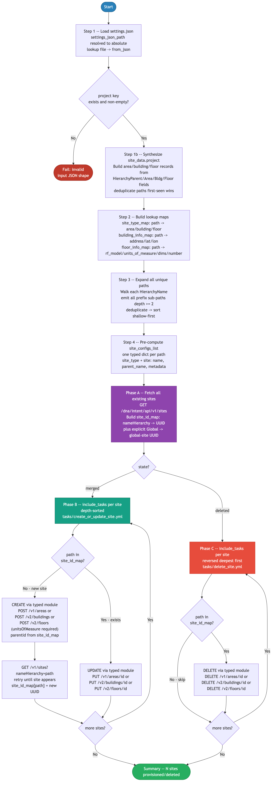

# 1.0 - Cisco Catalyst Center Site Hierarchy Automation

> Playbook: site_hierarchy.yml  
> Task files: tasks/create_or_update_site.yml, tasks/delete_site.yml  
> Collection modules: cisco.catalystcenter.sites_info, areas, buildings, floors

## Overview

This playbook builds or deletes Catalyst Center site hierarchy objects (areas, buildings, floors) from the project settings JSON.

Important behavior:

1. It reads settings.json from settings_json_path (inventory default points to ../Settings/settings.json, i.e. CICD Pipeline/Settings/settings.json).
2. It synthesizes hierarchy paths from these fields in each project entry:
   - HierarchyParent
   - HierarchyArea
   - HierarchyBldg
   - HierarchyFloor
   - HierarchyBldgAddress
3. It computes a depth-sorted path list so parent nodes are always processed before children.
4. It fetches existing Catalyst Center site UUIDs and builds site_id_map.
5. It runs create/update (state=merged) or delete (state=deleted) task components with include_tasks.

## API Endpoints and Modules Summary

This section summarizes all API actions exercised by this 1.0 workflow, mapped to the Ansible Galaxy modules used.

### Modules Summary

| Collection | Module | Purpose in this playbook | Module Docs |
|---|---|---|---|
| cisco.catalystcenter | sites_info | Read existing site inventory and query newly created site UUID by hierarchy path | cisco.catalystcenter 2.1.3: [sites_info](https://galaxy.ansible.com/ui/repo/published/cisco/catalystcenter/content/module/sites_info/) |
| cisco.catalystcenter | areas | Create, update, and delete area sites | cisco.catalystcenter 2.1.3: [areas](https://galaxy.ansible.com/ui/repo/published/cisco/catalystcenter/content/module/areas/) |
| cisco.catalystcenter | buildings | Create, update, and delete building sites | cisco.catalystcenter 2.1.3: [buildings](https://galaxy.ansible.com/ui/repo/published/cisco/catalystcenter/content/module/buildings/) |
| cisco.catalystcenter | floors | Create, update, and delete floor sites | cisco.catalystcenter 2.1.3: [floors](https://galaxy.ansible.com/ui/repo/published/cisco/catalystcenter/content/module/floors/) |
| ansible.utils | (action plugin dependency) | Required by cisco.catalystcenter action plugin argument validation | ansible.utils >= 2.11.0: [collection](https://galaxy.ansible.com/ui/repo/published/ansible/utils/) |

### Endpoint Summary by Phase

| Phase | Module | HTTP | Endpoint | Why it is used | API Docs |
|---|---|---|---|---|---|
| Phase A (discover existing) | sites_info | GET | /dna/intent/api/v1/sites | Builds initial site_id_map (nameHierarchy -> UUID) before any create/update/delete | CatC 2.3.7.9: [API Reference](https://developer.cisco.com/docs/catalyst-center/2-3-7-9/cisco-catalyst-center-2-3-7-9-api-overview) |
| Phase B (post-create UUID resolve) | sites_info | GET | /dna/intent/api/v1/sites?nameHierarchy=<path> | Resolves UUID for newly created site so child sites can use parentId | CatC 2.3.7.9: [API Reference](https://developer.cisco.com/docs/catalyst-center/2-3-7-9/cisco-catalyst-center-2-3-7-9-api-overview) |
| Phase B (create area) | areas | POST | /dna/intent/api/v1/areas | Creates new area when path does not exist | CatC 2.3.7.9: [API Reference](https://developer.cisco.com/docs/catalyst-center/2-3-7-9/cisco-catalyst-center-2-3-7-9-api-overview) |
| Phase B (update area) | areas | PUT | /dna/intent/api/v1/areas/{id} | Updates existing area when UUID exists | CatC 2.3.7.9: [API Reference](https://developer.cisco.com/docs/catalyst-center/2-3-7-9/cisco-catalyst-center-2-3-7-9-api-overview) |
| Phase B (create building) | buildings | POST | /dna/intent/api/v2/buildings | Creates new building with address/country/lat/lon payload | CatC 2.3.7.9: [API Reference](https://developer.cisco.com/docs/catalyst-center/2-3-7-9/cisco-catalyst-center-2-3-7-9-api-overview) |
| Phase B (update building) | buildings | PUT | /dna/intent/api/v2/buildings/{id} | Updates existing building metadata | CatC 2.3.7.9: [API Reference](https://developer.cisco.com/docs/catalyst-center/2-3-7-9/cisco-catalyst-center-2-3-7-9-api-overview) |
| Phase B (create floor) | floors | POST | /dna/intent/api/v2/floors | Creates new floor (unitsOfMeasure and floorNumber required by payload policy) | CatC 2.3.7.9: [API Reference](https://developer.cisco.com/docs/catalyst-center/2-3-7-9/cisco-catalyst-center-2-3-7-9-api-overview) |
| Phase B (update floor) | floors | PUT | /dna/intent/api/v2/floors/{id} | Updates existing floor settings | CatC 2.3.7.9: [API Reference](https://developer.cisco.com/docs/catalyst-center/2-3-7-9/cisco-catalyst-center-2-3-7-9-api-overview) |
| Phase C (delete area) | areas | DELETE | /dna/intent/api/v1/areas/{id} | Deletes area site when state=deleted | CatC 2.3.7.9: [API Reference](https://developer.cisco.com/docs/catalyst-center/2-3-7-9/cisco-catalyst-center-2-3-7-9-api-overview) |
| Phase C (delete building) | buildings | DELETE | /dna/intent/api/v2/buildings/{id} | Deletes building site when state=deleted | CatC 2.3.7.9: [API Reference](https://developer.cisco.com/docs/catalyst-center/2-3-7-9/cisco-catalyst-center-2-3-7-9-api-overview) |
| Phase C (delete floor) | floors | DELETE | /dna/intent/api/v2/floors/{id} | Deletes floor site when state=deleted | CatC 2.3.7.9: [API Reference](https://developer.cisco.com/docs/catalyst-center/2-3-7-9/cisco-catalyst-center-2-3-7-9-api-overview) |

### Notes

- Operations are executed through cisco.catalystcenter modules, not raw URI tasks.
- UUID-based idempotent behavior depends on site_id_map; updates and deletes require id values.
- Deletion uses reversed path order so child endpoints run before parent endpoints.

## Directory Structure

```text
1.0-Cisco-Catalyst-Center-Site-Hierarchy/
|-- ansible.cfg
|-- inventory.yml
|-- requirements.txt
|-- requirements.yml
|-- site_hierarchy.yml
|-- tasks/
|   |-- create_or_update_site.yml
|   `-- delete_site.yml
|-- vault.yml.example
|-- vault.yml            # local encrypted file (not committed)
|-- .vault_pass          # local vault password file (not committed)
`-- DIAGRAMS/
    |-- logical-flow.mmd
    `-- logical-flow.png
```

## Prerequisites

| Requirement | Version |
|---|---|
| Python | 3.9+ |
| Ansible | 2.15+ |
| catalystcentersdk | >=2.3.7.9,<3.0.0 |
| cisco.catalystcenter | 2.1.3 |
| ansible.utils | >=2.11.0 |

Install dependencies:

```bash
pip install -r requirements.txt
ansible-galaxy collection install -r requirements.yml
```

## Configuration

### Inventory

File: inventory.yml

Key variables:

- catc_host, catc_port, catc_version, catc_verify, catc_debug
- settings_json_path
- default_building_address, default_building_country, default_building_latitude, default_building_longitude
- default_floor_rf_model, default_floor_units_of_measure, default_floor_width, default_floor_length, default_floor_height, default_floor_number

### Credentials (Vault)

```bash
cp vault.yml.example vault.yml
ansible-vault encrypt vault.yml --vault-password-file .vault_pass
```

vault.yml keys:

```yaml
catc_username: "admin"
catc_password: "your_catc_password_here"
```

## Input Data (settings.json)

The playbook consumes settings_data.project[] and synthesizes site_data.project[] entries. It does not require SiteType in the source JSON.

Expected source fields per project entry:

- HierarchyParent (optional, defaults to Global)
- HierarchyArea
- HierarchyBldg
- HierarchyFloor
- HierarchyBldgAddress (optional)

Synthesis behavior:

1. If HierarchyArea exists, emits an area path.
2. If HierarchyArea + HierarchyBldg exist, emits a building path.
3. If HierarchyArea + HierarchyBldg + HierarchyFloor exist, emits a floor path.
4. Duplicate paths are deduplicated first-seen wins.

## Task Components

### Logical Flow Diagram

The execution flow below matches the current task orchestration in site_hierarchy.yml and tasks/*.yml.



Source file: DIAGRAMS/logical-flow.mmd

### Main Playbook Flow (site_hierarchy.yml)

1. Resolve and load settings JSON.
2. Validate project key is present and non-empty.
3. Synthesize normalized site_data.project records.
4. Build lookup maps:
   - site_type_map
   - building_info_map
   - floor_info_map
5. Generate all_site_paths including intermediate nodes (depth >= 2).
6. Build site_configs_list payloads.
7. Phase A: Query existing sites with cisco.catalystcenter.sites_info and build site_id_map.
8. Phase B (state=merged): include_tasks tasks/create_or_update_site.yml in shallow-to-deep order.
9. Phase C (state=deleted): include_tasks tasks/delete_site.yml in deep-to-shallow order.

### Create/Update Task File (tasks/create_or_update_site.yml)

Per-site responsibilities:

1. Extract _type, _name, _parent from site_config.
2. Derive _path, _parent_id, _exists, _site_id from site_id_map.
3. Dispatch module by type:
   - area -> cisco.catalystcenter.areas
   - building -> cisco.catalystcenter.buildings
   - floor -> cisco.catalystcenter.floors
4. Create path if missing (state: present without id).
5. Update path if existing (state: present with id).
6. After create, query UUID with sites_info nameHierarchy.
7. Update site_id_map immediately so child iterations can use parent IDs.

### Delete Task File (tasks/delete_site.yml)

Per-site responsibilities:

1. Extract _type, _name, _parent.
2. Derive _path and _site_id.
3. If site exists, delete with matching module and id.

Deletion order is controlled by the caller (main playbook) using reverse list traversal, so children are deleted before parents.

## Running

### Create/Update (default)

```bash
ansible-playbook site_hierarchy.yml --vault-password-file .vault_pass
```

### Delete

```bash
ansible-playbook site_hierarchy.yml --vault-password-file .vault_pass -e state=deleted
```

### Override settings path

```bash
ansible-playbook site_hierarchy.yml \
  --vault-password-file .vault_pass \
  -e settings_json_path=/absolute/path/to/settings.json
```

### Debug mode

```bash
ansible-playbook site_hierarchy.yml --vault-password-file .vault_pass -e catc_debug=true
```

## Notes and Limits

- cisco.catalystcenter modules used here do not support Ansible check mode.
- Top-level root Global is not created by this playbook (depth 1 is skipped).
- For floors, units_of_measure defaults from inventory and maps to unitsOfMeasure in module calls.
- If state type is missing for an intermediate path, site_hierarchy.yml applies fallback name-pattern inference:
  - FLOOR / FL* -> floor
  - BUILDING / BLDG* -> building
  - otherwise -> area

## Troubleshooting

| Symptom | Likely Cause | Resolution |
|---|---|---|
| Authentication failed | Invalid credentials | Re-encrypt vault.yml with correct catc_username/catc_password |
| Parent site not found / parentId missing | Parent path has no UUID in site_id_map yet | Verify hierarchy names and order in source data |
| country should not be None | Building metadata missing | Set defaults in inventory or include building fields |
| Floor API validation errors | Missing floor metadata | Verify defaults and floor fields, especially units_of_measure and floor_number |
| Collection/SDK import errors | Missing dependencies | Re-run pip and ansible-galaxy installs |
