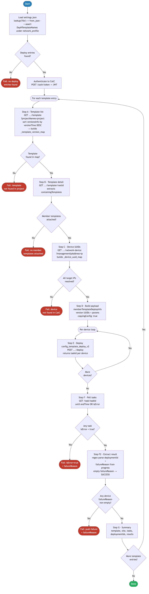

> **Deprecated:** Playbooks moved to [`../ansible/playbooks/`](../ansible/playbooks/). See [`../ansible/README.md`](../ansible/README.md).

# 9.0 — Cisco Catalyst Center: Composite Template Deployment

> **Playbook:** `deploy_composite_template.yml`  
> **Included tasks:** `tasks/deploy_entry.yml`  
> **Modules:** `ansible.builtin.uri` (all REST calls: auth, template query, device lookup, **deploy**, task polling)  
> **API Endpoints:**  
> &nbsp;&nbsp;`POST /dna/system/api/v1/auth/token` — obtain short-lived JWT  
> &nbsp;&nbsp;`POST /dna/intent/api/v2/template-programmer/template/deploy` — deploy composite template (direct REST via `ansible.builtin.uri` — see [Why not the Ansible module?](#why-not-the-ansible-module))  
> &nbsp;&nbsp;`GET  /dna/intent/api/v1/template-programmer/template?projectNames={name}` — list all templates in project (resolve latest version UUID)  
> &nbsp;&nbsp;`GET  /dna/intent/api/v1/template-programmer/template/{templateId}` — fetch composite template detail (extract member templates)  
> &nbsp;&nbsp;`GET  /dna/intent/api/v1/network-device?managementIpAddress={ip}` — resolve device UUID and hostname per target IP  
> &nbsp;&nbsp;`GET  /dna/intent/api/v1/task/{taskId}` — poll async deploy task per device until `endTime` set or `isError=true`; `progress` field contains `failureReason` (authoritative push result)  
> **Minimum Catalyst Center version:** 2.3.7.6  
> **Minimum Ansible version:** 2.15  
> **Authors:** Igor Manassypov — Systems Engineer (imanassy@cisco.com)  
> **Copyright © 2024–2026 Cisco Systems, Inc. All rights reserved.**

---

## Table of Contents

1. [Overview](#overview)
   - [What it does](#what-it-does)
   - [What makes composite deployment different](#what-makes-composite-deployment-different)
   - [Logical Flow](#logical-flow)
2. [Prerequisites](#prerequisites)
3. [Directory Structure](#directory-structure)
4. [Installation](#installation)
5. [Configuration](#configuration)
   - [Inventory](#inventory)
   - [Vault (Credentials)](#vault-credentials)
6. [Input Data Structure — `settings.json`](#input-data-structure--settingsjson)
   - [Top-Level Schema](#top-level-schema)
   - [The `DayNTemplateNames` Block](#the-dayntemplatesnames-block)
   - [Full Example](#full-example)
7. [How It Works](#how-it-works)
   - [Architecture Overview](#architecture-overview)
   - [Main Playbook Walkthrough](#main-playbook-walkthrough)
     - [Step 1: Load and Validate Input Data](#step-1-load-and-validate-input-data)
     - [Step 2: Build Deploy Entries](#step-2-build-deploy-entries)
     - [Step 3: Authenticate to Catalyst Center](#step-3-authenticate-to-catalyst-center)
     - [Step 4: Process Each Deployment](#step-4-process-each-deployment)
   - [Per-Template Task Walkthrough — `tasks/deploy_entry.yml`](#per-template-task-walkthrough--tasksdeployentryyml)
     - [Step A: Fetch All Project Templates with Version IDs](#step-a-fetch-all-project-templates-with-version-ids)
     - [Step B: Template Detail Fetch (containingTemplates)](#step-b-template-detail-fetch-containingtemplates)
     - [Step C: Device UUID Resolution](#step-c-device-uuid-resolution)
     - [Step D: Build `memberTemplateDeploymentInfo`](#step-d-build-membertemplatedeploymentinfo)
     - [Step E: Deploy via REST API (`ansible.builtin.uri`)](#step-e-deploy-via-rest-api-ansiblebuiltinuri)
     - [Step F: Poll Async Task Status](#step-f-poll-async-task-status)
     - [Step F2: Extract Deployment Result from Task Progress](#step-f2-extract-deployment-result-from-task-progress)
     - [Step G: Summary and Error Propagation](#step-g-summary-and-error-propagation)
8. [Data Transformation Reference](#data-transformation-reference)
9. [Composite Deploy Payload Reference](#composite-deploy-payload-reference)
10. [How CatC Template Version IDs Work](#how-catc-template-version-ids-work)
11. [Per-Member Template Parameters](#per-member-template-parameters)
12. [Running the Playbook](#running-the-playbook)
13. [Debug Mode](#debug-mode)
14. [Expected Output](#expected-output)
15. [Playbook Ordering Dependency](#playbook-ordering-dependency)
16. [Troubleshooting](#troubleshooting)

---

## Overview

This playbook deploys **composite Day-N templates** to managed devices in Cisco Catalyst Center. A composite template is a single deployable unit that bundles multiple child (member) templates, allowing a full device configuration stack — VRF definitions, loopbacks, overlay, NVE, multicast, and more — to be pushed atomically in one operation.

The playbook is data-driven: it reads the same `settings.json` file used across the entire automation suite, extracts every `DayNTemplateNames` entry marked `DeployTemplate: true`, resolves all required UUIDs from Catalyst Center via REST, and deploys using the v2 template deploy API.

### What it does

| Action | Mechanism |
|--------|-----------|
| Loads and validates input JSON | `lookup('file', path) | from_json` + Jinja2 filters |
| Extracts deploy entries from `DayNTemplateNames` | `set_fact` with Jinja2 loop |
| Authenticates once for REST calls | `ansible.builtin.uri` — `POST /v1/auth/token` |
| Resolves template version UUIDs and member lists | `GET /v1/template-programmer/template?projectNames=<p>` + `GET /v1/template-programmer/template/<id>` |
| Resolves device UUIDs from management IPs | `GET /v1/network-device?managementIpAddress=<ip>` |
| Builds composite deploy payload | `set_fact` — constructs `memberTemplateDeploymentInfo` |
| Deploys composite template | `ansible.builtin.uri` — direct `POST /v2/template-programmer/template/deploy` with `copyingConfig: true` |
| Polls async task to completion | `ansible.builtin.uri` with `until` + `retries` |
| Extracts deployment push result from task progress | `set_fact` — regex-parses `failureReason` from task `progress` field (empty = SUCCESS) |

> [!IMPORTANT]
> **Why this step is necessary after 8.0 (Provision Devices):**
> The SDA `provisionDevices` API (Step 8.0) pushes site-level network settings (NTP, DNS, SNMP, AAA, etc.) and creates the internal CatC provisioning record — but it does **not** apply any CLI templates. Day-N Jinja2/CLI templates (VRFs, loopbacks, overlay, NVE, multicast, etc.) are only pushed to the device through the template deployment API. This playbook is the step that actually applies that full CLI configuration stack to each managed device.

### What makes composite deployment different

Unlike a regular (non-composite) template deployment — where a single template and a flat set of parameters are pushed — a composite deployment requires that each **member template** inside the composite carry its own `targetInfo` and parameter set. This is reflected in the `memberTemplateDeploymentInfo` structure of the v2 API payload.

Catalyst Center resolves the composite template's member list at deploy time, so the caller must:
1. Know the composite template's committed `templateId` and its origin `mainTemplateId`.
2. Know each member template's committed `templateId` and origin `mainTemplateId`.
3. Provide per-member `targetInfo` entries with device UUIDs (not IPs).

This playbook automates all three lookups so the operator only needs to specify human-readable names and IP addresses in `settings.json`.

## API Endpoints and Modules Summary

### Modules Summary

| Collection | Module | Purpose in this playbook | Module Docs |
|---|---|---|---|
| ansible.builtin | uri | Handles all CatC REST interactions: auth, template lookups, deploy submit, and task polling | ansible-core: [uri](https://docs.ansible.com/ansible/latest/collections/ansible/builtin/uri_module.html) |

### Endpoint Summary by Phase

| Phase | HTTP | Endpoint | Why it is used | API Docs |
|---|---|---|---|---|
| Auth | POST | /dna/system/api/v1/auth/token | Obtain JWT used by all deployment REST calls | CatC 2.3.7.9: [Authentication](https://developer.cisco.com/docs/catalyst-center/2-3-7-9/authentication) |
| Project template list | GET | /dna/intent/api/v1/template-programmer/template?projectNames={name} | Resolve latest template version UUIDs in project scope | CatC 2.3.7.9: [API Reference](https://developer.cisco.com/docs/catalyst-center/2-3-7-9/cisco-catalyst-center-2-3-7-9-api-overview) |
| Template detail | GET | /dna/intent/api/v1/template-programmer/template/{templateId} | Extract containingTemplates and member metadata | CatC 2.3.7.9: [API Reference](https://developer.cisco.com/docs/catalyst-center/2-3-7-9/cisco-catalyst-center-2-3-7-9-api-overview) |
| Device UUID lookup | GET | /dna/intent/api/v1/network-device?managementIpAddress={ip} | Resolve deployment targets by management IP | CatC 2.3.7.9: [API Reference](https://developer.cisco.com/docs/catalyst-center/2-3-7-9/cisco-catalyst-center-2-3-7-9-api-overview) |
| Composite deploy | POST | /dna/intent/api/v2/template-programmer/template/deploy | Submit composite deployment request with memberTemplateDeploymentInfo | CatC 2.3.7.9: [API Reference](https://developer.cisco.com/docs/catalyst-center/2-3-7-9/cisco-catalyst-center-2-3-7-9-api-overview) |
| Async task polling | GET | /dna/intent/api/v1/task/{taskId} | Monitor completion and parse progress/failureReason | CatC 2.3.7.9: [API Reference](https://developer.cisco.com/docs/catalyst-center/2-3-7-9/cisco-catalyst-center-2-3-7-9-api-overview) |

### Notes

- Composite deployment uses direct REST instead of the Ansible module path for deterministic payload control.
- Deployment success/failure is derived from async task progress, not only initial POST response.


### Logical Flow

The diagram below shows every decision point and state transition from startup to completion:



> Source: [`DIAGRAMS/logical-flow.mmd`](DIAGRAMS/logical-flow.mmd) — re-render with `mmdc -i DIAGRAMS/logical-flow.mmd -o DIAGRAMS/logical-flow.png --scale 3`

---

## Prerequisites

| Requirement | Version / Notes |
|-------------|----------------|
| Ansible | >= 2.15 |
| Python | >= 3.9 |
| `dnacentersdk` | >= 2.11.0 |
| `cisco.dnac` collection | 6.46.0 |
| Cisco Catalyst Center | >= 2.3.7.6 |
| Composite template | Must already exist in CatC with member templates attached (run 6.0 first) |
| Target devices | Must be discovered and managed in CatC (run 4.0 and 5.0 first) |

---

## Directory Structure

```
10.0-Cisco-Catalyst-Center-Provision-Composite/
├── ansible.cfg                         # Ansible defaults (inventory path)
├── inventory.yml                       # CatC connection + deploy variables
├── deploy_composite_template.yml       # Main playbook
├── tasks/
│   └── deploy_entry.yml                # Per-template included task file
├── DIAGRAMS/
│   ├── logical-flow.mmd                # Mermaid source — re-render with mmdc
│   └── logical-flow.png                # Rendered flowchart (referenced by README)
├── vault.yml                           # Ansible Vault encrypted credentials (git-ignored)
├── vault.yml.example                   # Plain-text credential template
├── .vault_pass                         # Vault password file (git-ignored, chmod 600)
├── requirements.txt                    # Python pip dependencies
├── requirements.yml                    # Ansible Galaxy collection dependencies
└── README.md                           # This document
```

Input data comes from the shared `settings.json` in the project tree:

```
Projects/
└── BGP_EVPN/
    └── Settings/
        └── settings.json        # Site hierarchy + device list + template deploy data
```

---

## Installation

### 1. Install Python dependencies

```bash
pip install -r requirements.txt
```

### 2. Install Ansible collections

```bash
ansible-galaxy collection install -r requirements.yml
```

### 3. Set up the vault password file

```bash
echo 'your_vault_password' > .vault_pass
chmod 600 .vault_pass
```

---

## Configuration

### Inventory

**File:** `inventory.yml`

```yaml
all:
  hosts:
    catalyst_center:
      ansible_host: localhost
      ansible_connection: local
      ansible_python_interpreter: "{{ ansible_playbook_python }}"

      # Catalyst Center connection
      dnac_host: 198.18.129.100
      dnac_port: 443
      dnac_version: 2.3.7.9
      dnac_verify: false
      dnac_debug: false
      dnac_log: true
      dnac_log_level: INFO

      # Input file
      settings_json_path: "../Settings/settings.json"

      # Deploy behaviour
      force_push_template: false

      # Per-member template parameter overrides (keyed by template name)
      member_template_params: {}

      # Async task polling
      task_poll_retries: 36
      task_poll_delay: 5
```

| Variable | Purpose | Default |
|----------|---------|---------|
| `settings_json_path` | Relative or absolute path to the `settings.json` input file | `../Settings/settings.json` |
| `force_push_template` | When `true`, push to devices even if they appear in-sync with the template | `false` |
| `member_template_params` | Dict of per-member template parameter overrides keyed by template name | `{}` |
| `task_poll_retries` | Maximum number of task status polls after submitting a deploy request | `36` |
| `task_poll_delay` | Seconds to wait between each status poll | `5` |

> **Tip:** With the defaults, the playbook will poll for up to `36 × 5 = 180 seconds` (3 minutes) before timing out a deployment task.

### Vault (Credentials)

```bash
cp vault.yml.example vault.yml
ansible-vault encrypt vault.yml --vault-password-file .vault_pass
```

`vault.yml.example` contains:

```yaml
dnac_username: "admin"
dnac_password: "your_catc_password_here"
```

---

## Input Data Structure — `settings.json`

### Top-Level Schema

```json
{
  "project": [
    {
      "HierarchyParent": "Global/PODS",
      "HierarchyArea":   "POD 0",
      "HierarchyBldg":   "Building P0",
      "HierarchyFloor":  "Floor 1",
      "device_list":     "<ip1,ip2,...> or null",
      "network_profile": {
        "profile_name":     "<profile name>",
        "DayNTemplateNames": [ ... ]
      }
    }
  ]
}
```

This playbook processes only entries where `network_profile.DayNTemplateNames` contains at least one element with `DeployTemplate: true` and a non-null `TemplateName`. All other keys are safely ignored.

### The `DayNTemplateNames` Block

Located at `entry.network_profile.DayNTemplateNames`, each element describes one composite template deployment target:

```json
"DayNTemplateNames": [
  {
    "TemplateName":   "<template name in CatC>",
    "TemplateTag":    "<tag — informational only>",
    "Project":        "<CatC project name that owns the template>",
    "TemplateTarget": ["<ip1>", "<ip2>", "..."],
    "DeployTemplate": true
  }
]
```

| Field | Type | Required | Description |
|-------|------|----------|-------------|
| `TemplateName` | string | **Yes** | Exact name of the composite template in Catalyst Center Template Editor. Must be non-null when `DeployTemplate: true`. |
| `Project` | string | **Yes** | Exact name of the CatC project that contains the template. Used to look up the template UUID via the project API. |
| `TemplateTarget` | list of strings | **Yes** | Management IP addresses of the target devices. Each IP is resolved to a device UUID for use in `targetInfo`. |
| `DeployTemplate` | boolean | **Yes** | Set `true` to include this entry in the deployment run. Set `false` or `null` to skip. |
| `TemplateTag` | string | No | Informational label. Recorded in the deploy summary output but not sent to CatC. |

> **Note:** Only entries where both `DeployTemplate` is `true` **and** `TemplateName` is non-null are processed. Entries with `DeployTemplate: false`, `DeployTemplate: null`, or a null `TemplateName` are silently skipped.

### Full Example

```json
{
  "project": [
    {
      "HierarchyParent": "Global/PODS",
      "HierarchyArea":   "POD 0",
      "HierarchyBldg":   "Building P0",
      "HierarchyFloor":  "Floor 1",
      "HierarchyBldgAddress": "300 E Tasman Dr, San Jose, CA",
      "device_list": "198.19.1.1,198.19.1.2,198.19.1.3,198.19.1.4,198.19.1.5,198.19.1.6",
      "network_profile": {
        "profile_name": "BGP-EVPN-Switching",
        "DayNTemplateNames": [
          {
            "TemplateName":   "BGP-EVPN-BUILD.j2",
            "TemplateTag":    "DEMO",
            "Project":        "Building P0",
            "TemplateTarget": ["198.19.1.1","198.19.1.2","198.19.1.3","198.19.1.4","198.19.1.5","198.19.1.6"],
            "DeployTemplate": true
          }
        ]
      }
    }
  ]
}
```

In this example, one deployment is submitted: composite template `BGP-EVPN-BUILD.j2` from project `Building P0` is deployed to all six devices on Floor 1. The site path `Global/PODS/POD 0/Building P0/Floor 1` is reconstructed from the split hierarchy fields.

---

## How It Works

### Architecture Overview

```
┌─────────────────────────────────────────────────────────────────────────────┐
│  deploy_composite_template.yml (Main Playbook)                              │
│                                                                             │
│  ┌──────────────────────────────────────────────────────────────────────┐   │
│  │ Step 1 — Load Input                                                  │   │
│  │   lookup('file') → from_json → assert                               │   │
│  │   settings.json → settings_data                                      │   │
│  └──────────────────────────────────────────────────────────────────────┘   │
│                                  │                                          │
│  ┌──────────────────────────────────────────────────────────────────────┐   │
│  │ Step 2 — Build Deploy Entries                                        │   │
│  │   Iterate settings_data.project                                      │   │
│  │   Reconstruct site path from HierarchyParent/Area/Bldg/Floor        │   │
│  │   Filter: network_profile.DayNTemplateNames[].DeployTemplate==true  │   │
│  │           network_profile.DayNTemplateNames[].TemplateName not null  │   │
│  │   Output: _deploy_entries[]                                          │   │
│  │     { site, template_name, project_name,                            │   │
│  │       template_target[], template_tag }                              │   │
│  └──────────────────────────────────────────────────────────────────────┘   │
│                                  │                                          │
│  ┌──────────────────────────────────────────────────────────────────────┐   │
│  │ Step 3 — Authenticate                                                │   │
│  │   POST /dna/system/api/v1/auth/token → _catc_token (JWT)            │   │
│  └──────────────────────────────────────────────────────────────────────┘   │
│                                  │                                          │
│  ┌──────────────────────────────────────────────────────────────────────┐   │
│  │ Step 4 — Loop: include_tasks tasks/deploy_entry.yml                 │   │
│  │   One iteration per _deploy_entries[] item                           │   │
│  └──────────────────────────────────────────────────────────────────────┘   │
└─────────────────────────────────────────────────────────────────────────────┘
                                   │
                    ┌──────────────┘
                    ▼
┌─────────────────────────────────────────────────────────────────────────────┐
│  tasks/deploy_entry.yml (included once per composite template entry)        │
│                                                                             │
│  Step A ─ GET /v1/template-programmer/template?projectNames=<project>      │
│           └─ Build _template_version_map: name → { rootId, versionId }    │
│                                                                             │
│  Step B ─ GET /v1/template-programmer/template/<rootId>                    │
│           └─ Extract containingTemplates[] (IDs from Step A map)           │
│                                                                             │
│  Step C ─ GET /v1/network-device?managementIpAddress=<ip>  (per target IP) │
│           └─ Build _device_uuid_map: { ip → { uuid, hostname } }           │
│                                                                             │
│  Step D ─ Build memberTemplateDeploymentInfo[]                             │
│           └─ One entry per member template × all device UUIDs             │
│                                                                             │
│  Step E ─ ansible.builtin.uri (loop per device)                           │
│           └─ POST /v2/template-programmer/template/deploy                  │
│              with copyingConfig: true (required to push config to devices) │
│              → _deploy_task_ids[] (one taskId per device)                  │
│                                                                             │
│  Step F ─ Poll GET /v1/task/<taskId>  (loop per device taskId)             │
│           └─ until endTime is defined OR isError == true                   │
│                                                                             │
│  Step F2─ set_fact: regex-extract deploymentId + failureReason from        │
│           task progress field                                               │
│           └─ empty failureReason → SUCCESS; non-empty → FAILURE            │
│                                                                             │
│  Step G ─ Summary debug + fail on isError / non-empty failureReason        │
└─────────────────────────────────────────────────────────────────────────────┘
```

---

### Main Playbook Walkthrough

#### Step 1: Load and Validate Input Data

The path is resolved to absolute, then a single `set_fact` reads and parses the file:

```yaml
- name: Load settings input JSON
  set_fact:
    settings_data: "{{ lookup('file', _resolved_json_path) | from_json }}"
```

`lookup('file', ...)` reads the file from the controller filesystem and returns raw text; `from_json` parses it into a native Ansible dict. An `assert` task validates that `settings_data.project` is non-empty before any network calls are made.

#### Step 2: Build Deploy Entries

Iterates every site entry and every `network_profile.DayNTemplateNames` element. Only entries satisfying both conditions are collected:

- `tpl.DeployTemplate` is truthy
- `tpl.TemplateName` is not `none`

```yaml
_deploy_entries:
  - site:            "Global/PODS/POD 0/Building P0/Floor 1"  # reconstructed from split hierarchy fields
    template_name:   "BGP-EVPN-BUILD.j2"
    project_name:    "Building P0"
    template_target: ["198.19.1.1", "198.19.1.2", "198.19.1.3",
                      "198.19.1.4", "198.19.1.5", "198.19.1.6"]
    template_tag:    "DEMO"
```

An `assert` task validates that at least one entry was collected; the playbook fails fast with an informative message if `settings.json` contains no qualifying entries.

#### Step 3: Authenticate to Catalyst Center

A single `POST /dna/system/api/v1/auth/token` call exchanges the vault credentials for a short-lived JWT. The token is stored as `_catc_token` and passed as the `X-Auth-Token` header in all subsequent REST calls made inside `deploy_entry.yml`.

```yaml
- name: Authenticate to Catalyst Center
  ansible.builtin.uri:
    url: "https://{{ dnac_host }}:{{ dnac_port }}/dna/system/api/v1/auth/token"
    method: POST
    user: "{{ dnac_username }}"
    password: "{{ dnac_password }}"
    force_basic_auth: true
    validate_certs: "{{ dnac_verify }}"
  register: _auth_result
  no_log: true
```

> `no_log: true` is set on the authentication task and the token-storage task to prevent credentials from appearing in Ansible output or log files.

#### Step 4: Process Each Deployment

```yaml
- name: Process composite template deployment for each entry
  include_tasks: tasks/deploy_entry.yml
  loop: "{{ _deploy_entries }}"
  loop_control:
    loop_var: deploy_entry
    label: "{{ deploy_entry.template_name }} → {{ deploy_entry.site }}"
```

`include_tasks` is used (not `import_tasks`) so that each iteration runs in the loop scope and has full access to the `deploy_entry` loop variable. The custom `loop_var` name prevents collision with Ansible's default `item` in nested loops.

---

### Per-Template Task Walkthrough — `tasks/deploy_entry.yml`

Each iteration of the main loop executes all steps in this file for one composite template deploy entry.

#### Step A: Fetch All Project Templates with Version IDs

**Purpose:** Retrieve the complete flat template list for the project using the template-programmer template endpoint, which — unlike the project endpoint — includes `versionsInfo` per template. The entry with the highest `versionTime` in `versionsInfo` is the **latest committed version UUID**, which is required by the CatC v2 deploy API.

> **⚠️ CatC returns `versionsInfo` in random order — not chronological.** The playbook sorts the array by `versionTime` (Unix milliseconds) descending and selects the highest value as the latest version. Using `versionsInfo[0]` directly would select an arbitrary — often stale — snapshot.

> **Why not the project endpoint?** `GET /template-programmer/project?name=` returns a `templates[]` array with only root `templateId` values and no `versionsInfo`. The v2 deploy API requires version-level UUIDs (`templateId` = version UUID, `mainTemplateId` = root UUID). Using root UUIDs as `templateId` causes the deploy to be accepted silently but may push stale configurations.

```
GET /dna/intent/api/v1/template-programmer/template?projectNames=<project_name>
```

**Response shape (simplified):**

```json
[
  {
    "name":         "BGP-EVPN-BUILD.j2",
    "templateId":   "2cbdc2f3-3a44-44bc-a8df-b3d76a410c60",
    "versionsInfo": [
      { "id": "a1b2c3d4-...",                          "versionTime": 1774400000000 },
      { "id": "5d4f4fa7-b6fa-4d2a-b4ff-f00d08419665", "versionTime": 1774409236083 }
    ]
  },
  {
    "name":         "FABRIC-VRF.j2",
    "templateId":   "faa53970-0521-44c1-ab49-9a2d92609c61",
    "versionsInfo": [
      { "id": "38d90128-e9dc-4c10-aee0-fb00c0c3e60b", "versionTime": 1774409172589 }
    ]
  }
]
```

`versionsInfo` is returned in **random order** by CatC. The playbook sorts it by `versionTime` descending and selects the entry with the highest timestamp as the latest committed version. The result is stored in a lookup map:

```yaml
_template_version_map:
  "BGP-EVPN-BUILD.j2":
    rootId:    "2cbdc2f3-3a44-44bc-a8df-b3d76a410c60"   # tpl.templateId
    versionId: "5d4f4fa7-b6fa-4d2a-b4ff-f00d08419665"   # max(versionsInfo, key=versionTime).id
  "FABRIC-VRF.j2":
    rootId:    "faa53970-0521-44c1-ab49-9a2d92609c61"
    versionId: "38d90128-e9dc-4c10-aee0-fb00c0c3e60b"
  ...
```

If a template has no `versionsInfo` (i.e., has never been committed to CatC), `versionId` falls back gracefully to the root `templateId`. An `assert` task fails immediately with a list of available template names if the requested composite template is not found in the map.

**CatC template ID concepts — for beginners:**

| ID type | Source field | Description |
|---------|-------------|-------------|
| Root UUID | `templateId` | Permanent identifier assigned when the template is first created. Never changes across commits. |
| Version UUID | `max(versionsInfo, key=versionTime).id` | UUID of the latest committed snapshot. `versionsInfo` is returned in random order — sort by `versionTime` descending and take the first element. Changes each time you commit a new version. **This is what the v2 deploy API requires as `templateId`.** |
| Main template ID | Root UUID | The `mainTemplateId` field in the deploy payload. CatC uses it for internal version tracking. |

#### Step B: Template Detail Fetch (containingTemplates)

**Purpose:** Retrieve the full composite template object to extract its `containingTemplates` array — the list of every member template attached to the composite. The composite's version and root UUIDs were already resolved in Step A and are sourced from `_template_version_map`; this call only provides the member template list.

```
GET /dna/intent/api/v1/template-programmer/template/<rootId>
```

**Key fields in the detail response:**

```json
{
  "id":        "2cbdc2f3-3a44-44bc-a8df-b3d76a410c60",
  "name":      "BGP-EVPN-BUILD.j2",
  "composite": true,
  "containingTemplates": [
    { "id": "c78c41ee-...", "templateId": "faa53970-...", "name": "FABRIC-VRF.j2" },
    { "id": "e5f25f18-...", "templateId": "3acc1310-...", "name": "FABRIC-LOOPBACKS.j2" },
    { "id": "...",          "templateId": "...",          "name": "FABRIC-NVE.j2" }
  ]
}
```

> **Note:** `containingTemplates` entries carry only root UUIDs (`templateId`). The version UUID for each member is resolved in Step D using the `_template_version_map` built in Step A.

**Variable extraction:**

| Variable | Source | Description |
|----------|--------|-------------|
| `_composite_template_id` | `_template_version_map[name].versionId` (Step A) | Latest committed composite version UUID — used as `templateId` in the deploy payload |
| `_composite_main_id` | `_template_version_map[name].rootId` (Step A) | Composite root UUID — used as `mainTemplateId` in the deploy payload |
| `_member_templates` | `containingTemplates` (this step) | List of member template objects; `name` field used to look up version IDs in Step D |

> **Important:** An `assert` validates that `containingTemplates` is non-empty. If the composite template in CatC has no members attached, the deploy payload would be malformed — the assert fails fast with a clear message before any deploy attempt is made.

#### Step C: Device UUID Resolution

**Purpose:** Resolve each management IP address in `deploy_entry.template_target` to its CatC device UUID and hostname. The deploy API requires UUIDs — not IPs — in the `targetInfo` entries.

```
GET /dna/intent/api/v1/network-device?managementIpAddress=<ip>
```

The task loops over every IP in `template_target` in parallel (via Ansible loop), then assembles the results into a lookup map:

```yaml
_device_uuid_map:
  "198.19.1.1": { uuid: "28c35a52-db7d-409c-81e2-ecb3849dc310", hostname: "Leaf01" }
  "198.19.1.2": { uuid: "9f4e2a18-1b3c-47d5-8e6f-cd2345678901", hostname: "Leaf02" }
  ...
```

An `assert` validates that every IP in `template_target` resolved successfully. The playbook fails with the unresolved IP address in the error message if any device is not found.

#### Step D: Build `memberTemplateDeploymentInfo`

**Purpose:** Construct the `memberTemplateDeploymentInfo` array — the core of the v2 composite deploy payload. Each element describes one member template and its target devices, along with the parameters to inject. Member template version UUIDs are sourced from the `_template_version_map` built in Step A.

**Structure produced:**

```yaml
_member_deployment_info:
  - templateId:        "<member_version_uuid>"         # from _template_version_map[name].versionId
    mainTemplateId:    "<member_root_uuid>"             # from _template_version_map[name].rootId
    forcePushTemplate: false
    isComposite:       false
    copyingConfig:     true                             # required by CatC v2 deploy API
    targetInfo:
      - id:             "28c35a52-db7d-409c-81e2-ecb3849dc310"   # device UUID
        hostName:       "Leaf01"
        type:           "MANAGED_DEVICE_UUID"
        params:         {}                              # from member_template_params
        resourceParams:
          - { type: "MANAGED_DEVICE_UUID",     value: "28c35a52-db7d-409c-81e2-ecb3849dc310" }
          - { type: "MANAGED_DEVICE_IP",       value: null }
          - { type: "MANAGED_DEVICE_HOSTNAME", value: "Leaf01" }

  - templateId:        "<member2_version_uuid>"
    mainTemplateId:    "<member2_root_uuid>"
    forcePushTemplate: false
    isComposite:       false
    copyingConfig:     true
    targetInfo:
      - id:             "9f4e2a18-1b3c-47d5-8e6f-cd2345678901"
        hostName:       "Leaf02"
        type:           "MANAGED_DEVICE_UUID"
        params:         {}
        resourceParams:
          - { type: "MANAGED_DEVICE_UUID",     value: "9f4e2a18-1b3c-47d5-8e6f-cd2345678901" }
          - { type: "MANAGED_DEVICE_IP",       value: null }
          - { type: "MANAGED_DEVICE_HOSTNAME", value: "Leaf02" }
```

> **`copyingConfig: true`** must appear at **both** the top level of the deploy payload **and** inside each `memberTemplateDeploymentInfo` entry. This is why the playbook uses `ansible.builtin.uri` instead of the `cisco.dnac.configuration_template_deploy_v2` module — the module cannot send `copyingConfig` at the top level (it silently drops unknown fields). Without this flag, CatC accepts the deploy but **does not push configuration to devices** — it only records the intent.

> **`resourceParams` structure** must match the three-entry format observed in working CatC UX payloads: `MANAGED_DEVICE_UUID` (with value), `MANAGED_DEVICE_IP` (value `null`), `MANAGED_DEVICE_HOSTNAME` (with value). An empty `resourceParams: []` is rejected by the API with a `NCTP10028` error.

**Param injection from `member_template_params`:**

Each member template's `params` dict is sourced from the `member_template_params` inventory variable (a dict keyed by template name). If no entry exists for a given member template name, an empty dict `{}` is used:

```yaml
# inventory.yml example — pass vrf_name only to FABRIC-VRF.j2
member_template_params:
  "FABRIC-VRF.j2":
    vrf_name: "PROD"
```

> All other member templates in the same composite will receive `params: {}` unless explicitly listed in `member_template_params`.

**Member version UUID resolution:**

Because `containingTemplates` from Step B holds only root UUIDs, the member's version UUID must come from `_template_version_map[member.name].versionId`. If a member template name is not found in the map (unlikely — all templates in the project should be in it), the root UUID is used as a safe fallback.

#### Step E: Deploy via REST API (`ansible.builtin.uri`)

**Purpose:** Submit the fully-assembled composite deploy payload to Catalyst Center via a direct `POST /dna/intent/api/v2/template-programmer/template/deploy` REST call. The playbook sends **one API call per target device**, mirroring the behavior of the CatC UI. Each call carries a single-device `targetInfo` entry.

> **Why `ansible.builtin.uri` instead of the Ansible module?**<a name="why-not-the-ansible-module"></a>
>
> The `cisco.dnac.configuration_template_deploy_v2` module **cannot send `copyingConfig: true`** in the POST body. The module's action plugin maps only six fields (`templateId`, `mainTemplateId`, `isComposite`, `forcePushTemplate`, `targetInfo`, `memberTemplateDeploymentInfo`); `copyingConfig` is silently dropped and never reaches the API. Without `copyingConfig: true`, Catalyst Center accepts the deploy task and records the intent, but **does not actually push configuration to devices**. The direct REST call ensures the full payload — including `copyingConfig` — is sent exactly as required.

> **Why one call per device?** Analysis of a working payload captured from the CatC UX reveals that the UI sends one `POST /v2/.../deploy` request per device, with `targetInfo` containing exactly one entry. Sending all devices in a single call is accepted by the API but results in `NCTP10028` errors when top-level `targetInfo` is misused. The per-device loop is the correct pattern.

> **What does `copyingConfig: true` do?** This field tells Catalyst Center to actually push the rendered configuration to the device via its provisioning workflow (NETCONF/SSH). Without it (or with `copyingConfig: false`), CatC treats the deploy as a **preview / intent-only** operation — the template is rendered and the deployment is recorded, but no configuration is sent to the device. The field must be present at **both** the top level of the payload **and** inside each entry in `memberTemplateDeploymentInfo`.

```yaml
- name: Deploy composite template to <hostname> (<ip>)
  vars:
    _single_target:
      - id:       "{{ item.value.uuid }}"
        hostName: "{{ item.value.hostname }}"
        type:     "MANAGED_DEVICE_UUID"
        params:   {}
        resourceParams:
          - { type: "MANAGED_DEVICE_UUID",     value: "{{ item.value.uuid }}" }
          - { type: "MANAGED_DEVICE_IP",       value: null }
          - { type: "MANAGED_DEVICE_HOSTNAME", value: "{{ item.value.hostname }}" }
  ansible.builtin.uri:
    url: "https://{{ dnac_host }}:{{ dnac_port }}/dna/intent/api/v2/template-programmer/template/deploy"
    method: POST
    headers:
      X-Auth-Token: "{{ _catc_token }}"
      Content-Type: "application/json"
    validate_certs: "{{ dnac_verify }}"
    body_format: json
    body:
      templateId:                   "{{ _composite_template_id }}"   # version UUID
      mainTemplateId:               "{{ _composite_main_id }}"       # root UUID
      isComposite:                  true
      forcePushTemplate:            true
      copyingConfig:                true                              # CRITICAL — triggers actual config push
      targetInfo:                   "{{ _single_target }}"           # one device per call
      memberTemplateDeploymentInfo: "{{ _single_member_info }}"      # filtered to this device
    status_code: [200, 202]
  loop: "{{ _device_uuid_map | dict2items }}"
  loop_control:
    label: "{{ item.key }}"
  register: _deploy_results
  ignore_errors: true
```

**Key payload fields:**

| Field | Value | Purpose |
|-------|-------|---------|
| `templateId` | Latest composite version UUID from `_template_version_map` | Identifies the committed template snapshot to deploy. Must be the version UUID, not the root UUID. |
| `mainTemplateId` | Composite root UUID from `_template_version_map` | CatC internal parent reference. Always the root UUID. |
| `isComposite` | `true` | Signals to CatC that this is a composite deployment |
| `forcePushTemplate` | From `force_push_template` inventory var | When `true`, bypasses CatC's in-sync check and always pushes config to device |
| `copyingConfig` | `true` | **Critical.** Tells CatC to actually push rendered config to the device. Without this, the deploy is intent-only (no config pushed). Must also appear in each `memberTemplateDeploymentInfo` entry. |
| `targetInfo` | List with exactly one device entry per API call | Non-empty top-level `targetInfo` is required by CatC v2 composite deploy (empty list causes NCTP10028) |
| `memberTemplateDeploymentInfo` | Built in Step D, sliced per device | Per-member deployment spec; each member carries `targetInfo`, params, `copyingConfig: true` |

The URI call uses `ignore_errors: true` because transient HTTP errors are checked precisely in Steps F and G rather than relying on Ansible's default failure handling.

#### Step F: Poll Async Task Status (per device)

**Purpose:** The v2 deploy API is asynchronous — it returns immediately with a `taskId`. Because Step E submits one deploy call per device, Step F collects one `taskId` per device and polls each independently until its task reaches a terminal state (completed or errored).

```
GET /dna/intent/api/v1/task/<taskId>
```

```yaml
- name: Poll async task status
  ansible.builtin.uri:
    url: "https://{{ dnac_host }}:{{ dnac_port }}/dna/intent/api/v1/task/{{ item.taskId }}"
    method: GET
    headers:
      X-Auth-Token: "{{ _catc_token }}"
  register: _task_poll_results
  loop: "{{ _deploy_task_ids }}"
  loop_control:
    label: "{{ item.ip }} → {{ item.taskId }}"
  until: >-
    (_task_poll_results.json.response | default({})).endTime is defined
    or (_task_poll_results.json.response | default({})).isError | default(false) | bool
  retries: "{{ task_poll_retries | int }}"
  delay:   "{{ task_poll_delay   | int }}"
```

`_deploy_task_ids` is a list of `{ip, taskId}` dicts built from the per-device deploy results:

```yaml
_deploy_task_ids:
  - { ip: "198.19.1.1", taskId: "a1b2c3d4-e5f6-7890-abcd-ef1234567890" }
  - { ip: "198.19.1.2", taskId: "b2c3d4e5-f6a7-8901-bcde-f12345678901" }
  ...
```

The `until` condition monitors two terminal signals:
- **`endTime` is defined** — task completed (successfully or with an error recorded in `failureReason`)
- **`isError == true`** — task reported a failure (may appear before `endTime` is set)

Once a task reaches `endTime`, its `progress` field contains the authoritative push result, which Step F2 extracts.

#### Step F2: Extract Deployment Result from Task Progress

**Purpose:** Parse the authoritative config-push result for each device directly from the task `progress` field returned by Step F. No additional API call is required.

The CatC task `progress` string always ends with:

```
...Template Deployemnt Id: <id> | failureReason: <reason>
```

> Note CatC's own typo: "Deployemnt" (not "Deployment"). The regex accounts for this: `Template Deploy[a-z]+ Id:`.

An **empty `failureReason`** means the configuration was pushed successfully. A **non-empty value** is the exact error string from CatC, propagated to the Ansible fail task in Step G.

```yaml
- name: Extract Template Deployment IDs and failure reasons from task progress
  set_fact:
    _deployment_status_ids: >-
      
      
        
        
        
        
        
        
      
      {{ ns.result }}
```

This produces `_deployment_status_ids` — a list of `{ip, deploymentId, failureReason}` dicts:

```yaml
_deployment_status_ids:
  - { ip: "198.19.1.1", deploymentId: "47db17c2-52cd-4d68-bdfe-8cdfe96c2", failureReason: "" }
  - { ip: "198.19.1.2", deploymentId: "073a48d8-b5f2-419e-95e0-01162a2dd", failureReason: "" }
  ...
```

> **Why not poll `GET /dna/intent/api/v1/template-programmer/template/deploy/status/{deploymentId}`?**  
> On this CatC version (2.3.7.x), the deployment ID embedded in the task `progress` field has only **9 hex characters** in the final UUID segment (RFC 4122 requires 12). The status endpoint returns `404 NOT_FOUND` for all such truncated IDs. The `failureReason` field in the same `progress` string is the exact equivalent of the status endpoint's `status` field — empty means `SUCCESS` — and requires no second API call or retry loop.

#### Step G: Summary and Error Propagation

A debug task prints a structured summary for every deployment:

```
Template          : BGP-EVPN-BUILD.j2
Project           : Building P0
Site              : Global/PODS/POD 0/Building P0/Floor 1
Target devices    : 198.19.1.1, 198.19.1.2, 198.19.1.3, 198.19.1.4, 198.19.1.5, 198.19.1.6
Tasks submitted   : ['019d225d-d9d4-7457-bf9a-56aef32e6f96', ...]
Deployment IDs    : ['47db17c2-52cd-4d68-bdfe-8cdfe96c2', ...]
Any API error     : False
Deployment results: ['SUCCESS', 'SUCCESS', 'SUCCESS', 'SUCCESS', 'SUCCESS', 'SUCCESS']
```

Three failure conditions are checked by looping over per-device results:
1. **Module-level error** — `item.failed` is true for any device's deploy call (e.g., HTTP error, authentication failure)
2. **Task-level error** — `item.json.response.isError` is true for any polled task (e.g., device unreachable, Jinja2 render error in CatC)
3. **Deployment push failure** — `item.failureReason` is non-empty for any device in `_deployment_status_ids` (e.g., device unreachable during config push, commit failure)

Any condition raises an Ansible `fail` task with the device IP, deployment ID, and failure reason included in the error message.

---

## Composite Deploy Payload Reference

The structure submitted to `POST /dna/intent/api/v2/template-programmer/template/deploy`.

> **One API call per device.** The CatC v2 composite deploy API expects a single device in `targetInfo` per request. The playbook loops over `_device_uuid_map` and submits one call per managed device, with `targetInfo` containing exactly that device's entry and `memberTemplateDeploymentInfo` filtered to that device's entries only.

```json
{
  "templateId":        "<composite_version_uuid>",
  "mainTemplateId":    "<composite_root_uuid>",
  "isComposite":       true,
  "forcePushTemplate": false,
  "copyingConfig":     true,
  "targetInfo": [
    {
      "id":       "<device_uuid>",
      "hostName": "<device_hostname>",
      "type":     "MANAGED_DEVICE_UUID",
      "params":   {},
      "resourceParams": [
        { "type": "MANAGED_DEVICE_UUID",     "value": "<device_uuid>" },
        { "type": "MANAGED_DEVICE_IP",       "value": "<device_mgmt_ip>" },
        { "type": "MANAGED_DEVICE_HOSTNAME", "value": "<device_hostname>" }
      ]
    }
  ],
  "memberTemplateDeploymentInfo": [
    {
      "templateId":        "<member1_version_uuid>",
      "mainTemplateId":    "<member1_root_uuid>",
      "forcePushTemplate": false,
      "isComposite":       false,
      "copyingConfig":     true,
      "targetInfo": [
        {
          "id":       "<device_uuid>",
          "hostName": "<device_hostname>",
          "type":     "MANAGED_DEVICE_UUID",
          "params":   { "<param_name>": "<param_value>" },
          "resourceParams": [
            { "type": "MANAGED_DEVICE_UUID",     "value": "<device_uuid>" },
            { "type": "MANAGED_DEVICE_IP",       "value": "<device_mgmt_ip>" },
            { "type": "MANAGED_DEVICE_HOSTNAME", "value": "<device_hostname>" }
          ]
        }
      ]
    },
    {
      "templateId":        "<member2_version_uuid>",
      "mainTemplateId":    "<member2_root_uuid>",
      "forcePushTemplate": false,
      "isComposite":       false,
      "copyingConfig":     true,
      "targetInfo": [
        {
          "id":       "<device_uuid>",
          "hostName": "<device_hostname>",
          "type":     "MANAGED_DEVICE_UUID",
          "params":   {},
          "resourceParams": [
            { "type": "MANAGED_DEVICE_UUID",     "value": "<device_uuid>" },
            { "type": "MANAGED_DEVICE_IP",       "value": "<device_mgmt_ip>" },
            { "type": "MANAGED_DEVICE_HOSTNAME", "value": "<device_hostname>" }
          ]
        }
      ]
    }
  ]
}
```

**Field summary:**

| Field | Type | Value | Notes |
|-------|------|-------|-------|
| `templateId` | string | Composite version UUID | From `max(versionsInfo, key=versionTime).id` via `_template_version_map`. NOT the root UUID. |
| `mainTemplateId` | string | Composite root UUID | Permanent template ID. From `templateId` field in the template list response. |
| `isComposite` | bool | `true` | Required for composite deploys |
| `copyingConfig` | bool | `true` | **Critical — top level.** Tells CatC to push rendered config to the device. Without this, deploy is intent-only. |
| `targetInfo[].id` | string | Device UUID | From `GET /network-device?managementIpAddress=`. NOT the management IP. |
| `targetInfo[].type` | string | `"MANAGED_DEVICE_UUID"` | Must be exactly this string |
| `targetInfo[].resourceParams` | array | 3-entry list | `MANAGED_DEVICE_UUID` (UUID value), `MANAGED_DEVICE_IP` (management IP), `MANAGED_DEVICE_HOSTNAME` (hostname) |
| `memberTemplateDeploymentInfo[].templateId` | string | Member version UUID | From `_template_version_map[member.name].versionId` |
| `memberTemplateDeploymentInfo[].mainTemplateId` | string | Member root UUID | From `_template_version_map[member.name].rootId` |
| `memberTemplateDeploymentInfo[].copyingConfig` | bool | `true` | Required per-member field. Combined with the top-level `copyingConfig`, ensures CatC pushes config to devices. |

---

## How CatC Template Version IDs Work

This section explains a key concept that confused even experienced users: the difference between a template's **root UUID** and its **version UUID**, and why the v2 deploy API requires both.

### Root UUID vs Version UUID

Every template in Catalyst Center is assigned a permanent **root UUID** when it is first created. This ID is visible in the Template Editor URL and in the project/template list API response as `templateId`. It never changes, even as the template is edited and committed multiple times.

Every time you commit a new version of the template in CatC, a new **version UUID** is created and attached to that snapshot. The template list endpoint (`/template-programmer/template?projectNames=`) exposes these as the `versionsInfo` array.

> **⚠️ `versionsInfo` is returned in random order by CatC — not newest-first.** This was confirmed by live API inspection: for a template with 8 versions, the newest (max `versionTime`) was at array index [2], not [0]. The playbook sorts by `versionTime` descending and takes the first result.

```
BGP-EVPN-BUILD.j2
│
├── rootId (permanent):     2cbdc2f3-3a44-44bc-a8df-b3d76a410c60   ← mainTemplateId
│
└── versionsInfo (random order — must sort by versionTime):
    ├── versionTime 1774400000000:  a1b2c3d4-e5f6-7890-abcd-ef1234567890
    └── versionTime 1774409236083:  5d4f4fa7-b6fa-4d2a-b4ff-f00d08419665   ← templateId (latest)
                                                                               max(versionTime)
```

### Why Both Are Required

The v2 composite deploy API requires:

| Payload field | UUID type | Source |
|---------------|-----------|--------|
| `templateId` | **Version UUID** (latest committed) | `max(versionsInfo, key=versionTime).id` from `GET /template-programmer/template?projectNames=` |
| `mainTemplateId` | **Root UUID** (permanent) | `templateId` field from same response |

Sending the root UUID as `templateId` is accepted without error but may result in CatC deploying an older or unexpected version of the template configuration.

### The Two-Endpoint Strategy

This playbook uses two endpoints to gather all required information:

1. **List endpoint** (`?projectNames=`) — provides `versionsInfo` → version UUID for each template. Called once per deployment entry.
2. **Detail endpoint** (`/<rootId>`) — provides `containingTemplates` → list of member names. Called once per composite template.

Member template version UUIDs are also resolved from the list endpoint response (all templates in the project are returned in one call), so no additional per-member API calls are needed.

---

## Per-Member Template Parameters

Template Jinja2 variables for each member template are supplied through the `member_template_params` inventory variable.

**Format:** A dict keyed by the exact template name as it appears in Catalyst Center, with each value being a flat dict of parameter name → value pairs.

**Inventory example:**

```yaml
member_template_params:
  "FABRIC-VRF.j2":
    vrf_name: "PROD"
    rd_value:  "65001:100"
  "FABRIC-LOOPBACKS.j2":
    loopback_ip: "192.168.100.1"
```

**Runtime override** (useful for CI pipelines or per-run overrides):

```bash
ansible-playbook deploy_composite_template.yml \
  --vault-password-file .vault_pass \
  -e '{"member_template_params": {"FABRIC-VRF.j2": {"vrf_name": "STAGING"}}}'
```

Member templates not listed in `member_template_params` receive `params: {}`. If none of your member templates require explicit parameter injection (for example they all resolve variables from `__device.*` system bindings), leave `member_template_params: {}` in inventory.

---

## Data Transformation Reference

```
settings.json
└── project[]
    └── [n].DayNTemplateNames[]    ← filter: DeployTemplate == true AND TemplateName not null
              │
              ▼ Step 2 — set_fact namespace loop
    _deploy_entries[] = [{ site, template_name, project_name, template_target[], template_tag }]
              │
              ▼ Step 3 — POST /dna/system/api/v1/auth/token
    _catc_token  (JWT, no_log: true)
              │
              ▼ Step 4 — include_tasks: deploy_entry.yml (per entry, loop_var: deploy_entry)
    ┌─ Step A: GET /dna/intent/api/v1/template-programmer/template?projectNames=<project>
    │  _template_version_map = { template_name: { versionId, rootId } }
    │
    ├─ Step B: GET /dna/intent/api/v1/template-programmer/template/<rootId>
    │  _composite_template_id ← latest committed version UUID  (deploy target)
    │  _composite_main_id     ← permanent root UUID            (mainTemplateId)
    │  _member_templates[]    ← containingTemplates[] extracted from response
    │
    ├─ Step C: GET /dna/intent/api/v1/network-device?managementIpAddress=<ip>  (per IP)
    │  _device_uuid_map = { ip: { uuid, hostname } }
    │
    ├─ Step D: set_fact — build memberTemplateDeploymentInfo per member × per device
    │  _member_deployment_info[] = [{ templateId, mainTemplateId, targetInfo[], copyingConfig: true }]
    │
    └─ Step E: cisco.dnac.configuration_template_deploy_v2  (ONE call per device)
       → POST /dna/intent/api/v2/template-programmer/template/deploy
       → GET  /dna/intent/api/v1/task/{taskId}  (poll until endTime set or isError=true)
```

**Before — `DayNTemplateNames[]` (one `settings.json` project entry):**

```json
[
  {
    "TemplateName": "BGP-EVPN-BUILD.j2",
    "Project":      "Building P0",
    "TemplateTarget": ["198.19.1.1","198.19.1.2","198.19.1.3","198.19.1.4","198.19.1.5","198.19.1.6"],
    "TemplateTag":  "DEMO",
    "DeployTemplate": true
  },
  { "TemplateName": null, "Project": null, "TemplateTarget": [], "DeployTemplate": null }
]
```

**After — `_deploy_entries[0]`** (null/false entries filtered out):

```json
{
  "site":            "Global/PODS/POD 0/Building P0/Floor 1",
  "template_name":   "BGP-EVPN-BUILD.j2",
  "project_name":    "Building P0",
  "template_target": ["198.19.1.1","198.19.1.2","198.19.1.3","198.19.1.4","198.19.1.5","198.19.1.6"],
  "template_tag":    "DEMO"
}
```

---

**Before — template API response from `GET /template-programmer/template?projectNames=Building P0` (truncated):**

```json
[{
  "name":         "BGP-EVPN-BUILD.j2",
  "templateId":   "2cbdc2f3-ab12-4567-89cd-ef0123456789",
  "versionsInfo": [
    { "id": "5d4f4fa7-1234-5678-abcd-ef0123456789", "version": "2" },
    { "id": "a1b2c3d4-5678-90ab-cdef-012345678901", "version": "1" }
  ]
}]
```

> `templateId` is the **permanent root UUID** used as `mainTemplateId`. `versionsInfo[0].id` is the **latest committed version UUID** used as `templateId` (the deploy target). These two UUIDs are different and both are required in the deploy payload — providing the wrong one silently deploys the wrong version.

**After — `_template_version_map`:**

```json
{
  "BGP-EVPN-BUILD.j2": {
    "versionId": "5d4f4fa7-1234-5678-abcd-ef0123456789",
    "rootId":    "2cbdc2f3-ab12-4567-89cd-ef0123456789"
  }
}
```

---

**Before — device API response from `GET /network-device?managementIpAddress=198.19.1.1`:**

```json
{ "response": [{ "id": "28c35a52-3d4e-5f6a-7b8c-9d0e1f2a3b4c", "hostname": "Leaf01", "managementIpAddress": "198.19.1.1" }] }
```

**After — `_device_uuid_map`:**

```json
{
  "198.19.1.1": { "uuid": "28c35a52-3d4e-5f6a-7b8c-9d0e1f2a3b4c", "hostname": "Leaf01" },
  "198.19.1.2": { "uuid": "39d46b63-4e5f-6a7b-8c9d-0e1f2a3b4c5d", "hostname": "Leaf02" }
}
```

The deploy call is issued **once per device** (not once per template): a single `configuration_template_deploy_v2` call per IP carries the full `memberTemplateDeploymentInfo` list for all member templates, keeping the push atomic per device while allowing the task poller to track each device's outcome independently.

---

## Running the Playbook

**Basic run (all defaults from inventory):**

```bash
ansible-playbook deploy_composite_template.yml --vault-password-file .vault_pass
```

**Override the input file:**

```bash
ansible-playbook deploy_composite_template.yml \
  --vault-password-file .vault_pass \
  -e settings_json_path=/absolute/path/to/custom_settings.json
```

**Force-push templates regardless of sync state:**

```bash
ansible-playbook deploy_composite_template.yml \
  --vault-password-file .vault_pass \
  -e force_push_template=true
```

**Override member template parameters at runtime:**

```bash
ansible-playbook deploy_composite_template.yml \
  --vault-password-file .vault_pass \
  -e '{"member_template_params": {"FABRIC-VRF.j2": {"vrf_name": "PROD"}}}'
```

**Increase poll timeout for slow deployments:**

```bash
ansible-playbook deploy_composite_template.yml \
  --vault-password-file .vault_pass \
  -e task_poll_retries=60 \
  -e task_poll_delay=10
```

---

## Debug Mode

Set the `DEBUG` environment variable to `true` to enable verbose intermediate output:

```bash
DEBUG=true ansible-playbook deploy_composite_template.yml --vault-password-file .vault_pass
```

Debug tasks emit:

| Variable | Content |
|----------|---------|
| `_deploy_entries` | Full list of extracted deploy entries from `settings.json` |
| `_template_version_map` | Complete name → `{rootId, versionId}` map for all templates in the project |
| `_composite_raw_id` | Composite root UUID (used to call the detail endpoint in Step B) |
| `_composite_template_id` | Composite version UUID (sent as `templateId` in the deploy payload) |
| `_composite_main_id` | Composite root UUID (sent as `mainTemplateId` in the deploy payload) |
| `_member_templates` | `containingTemplates` list from the detail endpoint (Step B) |
| `_device_uuid_map` | IP → `{uuid, hostname}` mapping for all target devices |
| `_target_info` | Top-level `targetInfo` list (all devices — before per-device split) |
| `_member_deployment_info` | Final `memberTemplateDeploymentInfo` payload before split and submission |
| `_deploy_results` | Raw `ansible.builtin.uri` module responses (one per device) |
| `_deploy_task_ids` | List of `{ip, taskId}` dicts collected after per-device deploy calls |
| `_deployment_status_ids` | List of `{ip, deploymentId, failureReason}` dicts extracted from task progress (Step F2) |

---

## Expected Output

A successful run for one composite template across six devices looks like:

```
PLAY [Deploy Composite Templates to Managed Devices from settings.json] *********

TASK [Resolve settings_json_path to absolute] **********************************
ok: [catalyst_center]

TASK [Load settings input JSON] ************************************************
ok: [catalyst_center]

TASK [Validate that project key exists in input data] **************************
ok: [catalyst_center] => Input data loaded — 1 entries found.

TASK [Build DayN composite template deploy entries] ****************************
ok: [catalyst_center]

TASK [Validate deploy entries exist] *******************************************
ok: [catalyst_center] => 1 composite deployment(s) to process.

TASK [Authenticate to Catalyst Center] *****************************************
ok: [catalyst_center]

TASK [Process composite template deployment for each entry] ********************
included: tasks/deploy_entry.yml for catalyst_center

TASK [[BGP-EVPN-BUILD.j2] Fetch all project templates with versionsInfo] ******
ok: [catalyst_center]

TASK [[BGP-EVPN-BUILD.j2] Build template name → version/root ID map] **********
ok: [catalyst_center]

TASK [[BGP-EVPN-BUILD.j2] Assert composite template found] ********************
ok: [catalyst_center]

TASK [[BGP-EVPN-BUILD.j2] Extract composite template root and version IDs] ****
ok: [catalyst_center]

TASK [[BGP-EVPN-BUILD.j2] Fetch composite template detail] ********************
ok: [catalyst_center]

TASK [[BGP-EVPN-BUILD.j2] Resolve device UUIDs for target IPs] ****************
ok: [catalyst_center] => (item=198.19.1.1) ...
ok: [catalyst_center] => (item=198.19.1.2) ...
...

TASK [[BGP-EVPN-BUILD.j2] Build memberTemplateDeploymentInfo] *****************
ok: [catalyst_center]

TASK [[BGP-EVPN-BUILD.j2] Deploy composite template to Spine-01 (198.19.1.1)] *
changed: [catalyst_center]

TASK [[BGP-EVPN-BUILD.j2] Deploy composite template to Spine-02 (198.19.1.2)] *
changed: [catalyst_center]

...

TASK [[BGP-EVPN-BUILD.j2] Poll async task status] *****************************
ok: [catalyst_center] => (item=198.19.1.1 → 019d225d-d9d4-...)
ok: [catalyst_center] => (item=198.19.1.2 → 019d225d-dc4e-...)
...

TASK [[BGP-EVPN-BUILD.j2] Extract Template Deployment IDs and failure reasons from task progress] ***
ok: [catalyst_center]

TASK [[BGP-EVPN-BUILD.j2] Deployment summary] *********************************
ok: [catalyst_center] =>
  msg:
    - "Template          : BGP-EVPN-BUILD.j2"
    - "Project           : Building P0"
    - "Site              : Global/PODS/POD 0/Building P0/Floor 1"
    - "Target devices    : 198.19.1.1, 198.19.1.2, 198.19.1.3, 198.19.1.4, 198.19.1.5, 198.19.1.6"
    - "Tasks submitted   : ['019d225d-d9d4-...', '019d225d-dc4e-...', ...]"
    - "Deployment IDs    : ['47db17c2-52cd-...', '073a48d8-b5f2-...', ...]"
    - "Any API error     : False"
    - "Deployment results: ['SUCCESS', 'SUCCESS', 'SUCCESS', 'SUCCESS', 'SUCCESS', 'SUCCESS']"

TASK [[BGP-EVPN-BUILD.j2] Fail if any deploy API call returned an error] ******
skipping: [catalyst_center] => (item=198.19.1.1)
...

TASK [[BGP-EVPN-BUILD.j2] Fail if any async task reported an error] ***********
skipping: [catalyst_center] => (item=198.19.1.1)
...

TASK [[BGP-EVPN-BUILD.j2] Fail if any Template Deployment push reported failure] ***
skipping: [catalyst_center] => (item=198.19.1.1)
...

PLAY RECAP *********************************************************************
catalyst_center  : ok=25  changed=6  unreachable=0  failed=0
```

> The `changed=6` count reflects one deploy call per device (six devices). Each deploy call that successfully submits to CatC is counted as `changed`. The `ok=25` count covers all non-debug tasks from loading input through the three Step G fail checks.

---

## Playbook Ordering Dependency

This playbook sits at the end of the automation chain. All upstream steps must complete successfully before composite templates can be deployed:

```
1.0 Site Hierarchy
        │
        ▼
2.0 Network Settings
        │
        ▼
3.0 Device Credentials
        │
        ▼
4.0 Device Discovery
        │
        ▼
5.0 Assign Devices to Site
        │
        ▼
6.0 Template GitOps Sync ──→ Templates must exist in CatC as composite
        │                     with member templates attached
        ▼
7.0 Network Profile
        │
        ▼
8.0 Provision Devices  ← site-level settings pushed; SDA provisioning record created
        │
        ▼
9.0 Composite Template Deployment (this playbook)
```

| Dependency | Reason |
|------------|--------|
| 4.0 Discovery | Devices must be in CatC inventory before UUIDs can be resolved |
| 5.0 Assign to Site | Devices must be at a known site for template scoping |
| 6.0 Template Sync | The composite template and all its member templates must exist in CatC before the project lookup in Step A can succeed |
| 8.0 Provision Devices | Devices must be provisioned to their site before CatC can push Day-N templates onto them |

---

## Troubleshooting

| Symptom | Likely Cause | Resolution |
|---------|-------------|------------|
| `Template '<name>' not found in project '<project>'` | Template name or project name mismatch | Verify the exact names in CatC → Template Editor. Names are case-sensitive. |
| `Composite template has no containingTemplates` | Member templates not attached to composite in CatC | In Template Editor, open the composite and add member templates, then commit. |
| `Device with management IP '<ip>' was not found` | Device not in CatC inventory or wrong IP | Confirm the device is discovered and managed in CatC. Check the IP matches the management IP displayed in Device Inventory. |
| `Deployment results show FAILURE` / `Fail if any Template Deployment push reported failure` | Config push rejected by the device after CatC accepted the deploy task | The `failureReason` field in the task progress string was non-empty. Check the exact reason in the Ansible error message and CatC Audit Log under `Provision → Audit Logs`. Common causes: device unreachable during CLi push, commit failure, Jinja2 render error in CatC. |
| `isError: True` / `NCTP10028` in task status | `targetInfo` is empty or not populated at the composite level | Ensure top-level `targetInfo` has at least one device entry. An empty `[]` at the composite level causes this error regardless of member-level `targetInfo`. |
| `isError: True` with template push error on device | Template apply error on device | Check CatC → Provision → Templates history for the specific device error. Common causes: unreachable device, Jinja2 render error, missing parameter. |
| Task status poll times out | CatC is slow to process the deploy | Increase `task_poll_retries` and/or `task_poll_delay` to extend the polling window. |
| `assert` fails: no deploy entries found | No `DayNTemplateNames` entries with `DeployTemplate: true` in `settings.json` | Verify at least one entry in `settings.json` has `DeployTemplate: true` and a non-null `TemplateName` and `Project` under `network_profile.DayNTemplateNames`. |
| `401 Unauthorized` from REST calls | Vault credentials incorrect or expired | Verify `dnac_username` / `dnac_password` in `vault.yml`. Re-encrypt if recently changed. |
| `SSL: CERTIFICATE_VERIFY_FAILED` | TLS verification enabled against self-signed cert | Set `dnac_verify: false` in inventory for lab environments, or add the CatC CA cert to the system trust store for production. |
| Deploy succeeds but stale config is pushed to device | A non-latest `versionsInfo` entry (or the root UUID) was used as `templateId` | The playbook sorts `versionsInfo` by `versionTime` descending to select the latest version. This symptom can also appear if the template list endpoint was accidentally reverted to the project endpoint (which returns no `versionsInfo`). Ensure `deploy_entry.yml` uses `sort(attribute='versionTime', reverse=true) \| first` on `versionsInfo`. |
| Deploy succeeds but no config pushed to device | `copyingConfig: true` missing from payload | `copyingConfig` must be present at **both** the top level and inside each `memberTemplateDeploymentInfo` entry. The `cisco.dnac.configuration_template_deploy_v2` module silently drops this field — this is why the playbook uses `ansible.builtin.uri` for the deploy step instead. |
| CatC Audit Log: "Error while deploying provisioning workflow" | Device unreachable during deploy | CatC wraps template pushes in a provisioning workflow. This audit log error means CatC could not reach the device to push config. Verify the device shows as Reachable in CatC Inventory (`Provision → Inventory`) and retry. |
| `NCDP10000: Configuration failed on device … due to unreachability` | Target device not reachable from CatC at deploy time | The device was in CatC inventory but could not be reached via NETCONF/SSH. Check that the device is fully booted, management interface is up, and CatC has a route to the management IP. |
| `resourceParams` error / NCTP payload validation failure | `resourceParams: []` (empty list) in `targetInfo` or member `targetInfo` | Populate `resourceParams` with the three required entries: `MANAGED_DEVICE_UUID` (with UUID value), `MANAGED_DEVICE_IP` (value `null`), `MANAGED_DEVICE_HOSTNAME` (with hostname value). |
