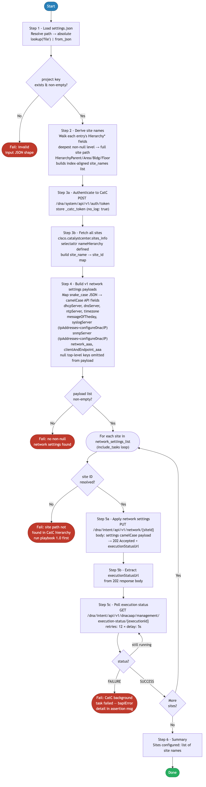

# 2.0 — Cisco Catalyst Center: Network Settings Automation

> **Playbook:** `network_settings.yml`  
> **Included tasks:** `tasks/apply_network_settings.yml`  
> **Modules:** `cisco.catalystcenter.sites_info` (site ID resolution), `ansible.builtin.uri` (auth token + network settings + execution polling)  
> **API Endpoints:**  
> &nbsp;&nbsp;`POST /dna/system/api/v1/auth/token` — obtain short-lived JWT  
> &nbsp;&nbsp;`PUT  /dna/intent/api/v1/network/{siteId}` — apply composite network settings per site (202 Accepted, async)  
> &nbsp;&nbsp;`GET  /dna/intent/api/v1/dnacaap/management/execution-status/{executionId}` — poll background task until `SUCCESS`/`FAILURE`  
> **Minimum Catalyst Center version:** 2.3.7.6  
> **Minimum Ansible version:** 2.15  
> **Authors:** Igor Manassypov — Systems Engineer (imanassy@cisco.com)  
> **Copyright © 2024–2026 Cisco Systems, Inc. All rights reserved.**

---

## Table of Contents

1. [Overview](#overview)
   - [Logical Flow](#logical-flow)
2. [Prerequisites](#prerequisites)
3. [Directory Structure](#directory-structure)
4. [Installation](#installation)
5. [Configuration](#configuration)
   - [Inventory](#inventory)
   - [Vault (Credentials)](#vault-credentials)
6. [Input Data Structure — `settings.json`](#input-data-structure--settingsjson)
   - [Top-Level Schema](#top-level-schema)
   - [The `network_settings` Block](#the-network_settings-block)
   - [Full Example](#full-example)
7. [Design Decision — Why Not `network_settings_workflow_manager`?](#design-decision--why-not-network_settings_workflow_manager)
8. [Playbook Walkthrough — Step by Step](#playbook-walkthrough--step-by-step)
   - [Step 1: Load and Validate Input Data](#step-1-load-and-validate-input-data)
   - [Step 2: Derive Site Names](#step-2-derive-site-names)
   - [Step 3: Authenticate and Resolve Site IDs](#step-3-authenticate-and-resolve-site-ids)
   - [Step 4: Build v1 Network Settings Payload](#step-4-build-v1-network-settings-payload)
   - [Step 5: Apply Network Settings via include_tasks](#step-5-apply-network-settings-via-include_tasks)
   - [Step 6: Summary](#step-6-summary)
9. [Data Transformation Reference](#data-transformation-reference)
10. [Running the Playbook](#running-the-playbook)
11. [Debug Mode](#debug-mode)
12. [Expected Output](#expected-output)
13. [Troubleshooting](#troubleshooting)

---

## Overview

This playbook applies **network infrastructure settings** (DNS, DHCP, NTP, SNMP, Syslog, AAA, banner) to individual sites in Cisco Catalyst Center.

Device credentials (CLI, SNMPv2c, NETCONF) are managed by [3.0 — Cisco Catalyst Center: Credentials](../3.0-Cisco-Catalyst-Center-Credentials/README.md) — run that playbook after this one.

This operation is fully idempotent. If settings already match the desired state in CatC, the PUT will return `status: SUCCESS` with no changes applied.

### What it does

| Action | Mechanism |
|--------|-----------|
| Resolves all site paths → UUID map | `cisco.catalystcenter.sites_info` (Phase A — same pattern as playbook 1.0) |
| Applies DNS, DHCP, NTP, SNMP, Syslog, Banner, AAA per site | `ansible.builtin.uri` → `PUT /dna/intent/api/v1/network/{siteId}` (NCND01243 bypass) |

## API Endpoints and Modules Summary

### Modules Summary

| Collection | Module | Purpose in this playbook | Module Docs |
|---|---|---|---|
| cisco.catalystcenter | sites_info | Build site UUID map from hierarchy paths | cisco.catalystcenter 2.1.3: [sites_info](https://galaxy.ansible.com/ui/repo/published/cisco/catalystcenter/content/module/sites_info/) |
| ansible.builtin | uri | Authenticate, push network settings, and poll async execution status | ansible-core: [uri](https://docs.ansible.com/ansible/latest/collections/ansible/builtin/uri_module.html) |

### Endpoint Summary by Phase

| Phase | HTTP | Endpoint | Why it is used | API Docs |
|---|---|---|---|---|
| Auth | POST | /dna/system/api/v1/auth/token | Obtain JWT used by direct REST calls | CatC 2.3.7.9: [Authentication](https://developer.cisco.com/docs/catalyst-center/2-3-7-9/authentication) |
| Site resolution | GET | /dna/intent/api/v1/sites | Source data for site path to UUID mapping | CatC 2.3.7.9: [API Reference](https://developer.cisco.com/docs/catalyst-center/2-3-7-9/cisco-catalyst-center-2-3-7-9-api-overview) |
| Apply settings | PUT | /dna/intent/api/v1/network/{siteId} | Submit per-site composite network settings payload | CatC 2.3.7.9: [API Reference](https://developer.cisco.com/docs/catalyst-center/2-3-7-9/cisco-catalyst-center-2-3-7-9-api-overview) |
| Async status polling | GET | /dna/intent/api/v1/dnacaap/management/execution-status/{executionId} | Wait for SUCCESS or FAILURE after async PUT | CatC 2.3.7.9: [API Reference](https://developer.cisco.com/docs/catalyst-center/2-3-7-9/cisco-catalyst-center-2-3-7-9-api-overview) |

### Notes

- This workflow mixes one CatC collection module for site resolution with direct REST calls for network settings push.
- Network settings apply is asynchronous; polling execution status is required for reliable result reporting.


### Logical Flow

The diagram below shows every decision point and state transition from startup to completion:



> Source: [`DIAGRAMS/logical-flow.mmd`](DIAGRAMS/logical-flow.mmd) — re-render with `mmdc -i DIAGRAMS/logical-flow.mmd -o DIAGRAMS/logical-flow.png --scale 3`

### Playbook ordering dependency

This playbook must run **after** [1.0 — Site Hierarchy](../1.0-Cisco-Catalyst-Center-Site-Hierarchy/README.md). The site paths referenced in `settings.json` must already exist in CatC before network settings can be applied to them.

Device credentials are configured in [3.0 — Cisco Catalyst Center: Credentials](../3.0-Cisco-Catalyst-Center-Credentials/README.md), which should run after this playbook.

---

## Design Decision — Why Not `network_settings_workflow_manager`?

The `cisco.catalystcenter.network_settings_workflow_manager` Ansible module (and its legacy `cisco.dnac` counterpart) is the standard High Level Task (HLT) module for pushing network settings. It was intentionally **not** used for the network-settings step in this playbook due to a hard server-side constraint in Catalyst Center.

### Root Cause — CatC Error NCND01243

Catalyst Center enforces the following validation across all API paths including the module's internal endpoint:

> **NCND01243:** "If the network and endpoint AAA servers are using the same ISE PAN IP with RADIUS protocol, the sharedSecret for the sets cannot be different (aaa.network.server and aaa.endpoint.server)"

CatC maintains legacy `aaa.network.server.*` placeholder entries at the Global site level that cannot be cleared — they are permanent schema artefacts returned by `GET /dna/intent/api/v1/network` as empty strings. When **only** `client_and_endpoint_aaa` is submitted (with a `sharedSecret`) and `network_aaa` is absent, CatC compares the incoming endpoint `sharedSecret` against the empty placeholder in `aaa.network.server.1` and causes validation to fail.

### Why the module cannot work around it

The module source (`update_aaa_settings_for_site`) correctly sends only `aaaClient` when `network_aaa` is `None`:

```python
elif client_and_endpoint_aaa is not None:
    param = {"id": site_id, "aaaClient": client_and_endpoint_aaa}
```

This call resolves internally to `PUT /dna/intent/api/v1/sites/{id}/aaaSettings`, which triggers the same cross-check against the legacy v1 entries. The error is **not** a module bug — it is a CatC server-side invariant applied to that specific endpoint. The same behaviour applies to both `cisco.dnac` and `cisco.catalystcenter` versions of the workflow manager.

### Why `PUT /dna/intent/api/v1/network/{siteId}` solves it

The `PUT /dna/intent/api/v1/network/{siteId}` endpoint accepts a composite settings payload that covers DNS, NTP, SNMP, Syslog, AAA and all other network settings in a single call. Crucially, its server-side validation path does **not** perform the same cross-check between `clientAndEndpoint_aaa` and the legacy `aaa.network.server.*` placeholder entries. Sending only `clientAndEndpoint_aaa` (with `network_aaa` absent from the payload) succeeds without error.

### Summary

| Approach | AAA behaviour | NCND01243? |
|----------|---------------|------------|
| `cisco.catalystcenter.network_settings_workflow_manager` (or legacy `cisco.dnac`) with only `client_and_endpoint_aaa` | Sends `aaaClient` via `PUT /v1/sites/{id}/aaaSettings`; CatC cross-checks against empty legacy `aaaNetwork` placeholder | **Yes — fails** |
| `PUT /dna/intent/api/v1/network/{siteId}` with only `clientAndEndpoint_aaa` | Composite settings endpoint; validation path does not trigger the cross-check | **No — succeeds ✅** |

> **Verified (2026-03-23):** Playbook ran successfully with `network_aaa: null` in `settings.json` using `PUT /dna/intent/api/v1/network/{siteId}`. Result: `ok=27 changed=0 failed=0`. Only `client_and_endpoint_aaa` was present in the payload; no NCND01243 error was raised. Execution status polled via `executionStatusUrl` until `status: SUCCESS` confirmed.
>
> **Operational note:** `network_aaa` can be set to `null` in `settings.json` when using `PUT /dna/intent/api/v1/network/{siteId}`. Only `client_and_endpoint_aaa` needs to be populated.

---

## Prerequisites

| Requirement | Version / Notes |
|-------------|----------------|
| Ansible | >= 2.15 |
| Python | >= 3.9 |
| `catalystcentersdk` | >= 2.3.7.9 |
| `cisco.catalystcenter` collection | 2.1.3 |
| `ansible.utils` collection | >= 2.11.0 (required by action plugins) |
| Cisco Catalyst Center | >= 2.3.7.6 |
| Site hierarchy | Must exist (run 1.0 first) |

---

## Directory Structure

```
2.0-Cisco-Catalyst-Center-Settings/
├── ansible.cfg                 # Ansible defaults (inventory path)
├── inventory.yml               # CatC connection (catc_*) + input file path
├── network_settings.yml        # Main playbook
├── tasks/
│   └── apply_network_settings.yml  # Per-site validate + PUT (NCND01243 bypass)
├── vault.yml                   # Ansible Vault encrypted credentials (git-ignored)
├── vault.yml.example           # Plain-text credential template
├── .vault_pass                 # Vault password file (git-ignored, chmod 600)
├── requirements.txt            # Python pip dependencies
├── requirements.yml            # Ansible Galaxy collection dependencies
└── DIAGRAMS/
    ├── logical-flow.mmd        # Mermaid source — re-render with mmdc
    └── logical-flow.png        # Rendered flowchart (referenced by README)
```

The playbook reads from the shared `settings.json` in the project tree:

```
Projects/
└── BGP_EVPN/
    └── Settings/
        └── settings.json       # Network settings + credentials input data
```

---

## Installation

```bash
pip install -r requirements.txt
ansible-galaxy collection install -r requirements.yml
echo 'your_vault_password' > .vault_pass && chmod 600 .vault_pass
```

---

## Configuration

### Inventory

**File:** `inventory.yml`

```yaml
all:
  hosts:
    catalyst_center:
      ansible_host: localhost
      ansible_connection: local
      ansible_python_interpreter: "{{ ansible_playbook_python }}"

      catc_host:    198.18.129.100
      catc_port:    443
      catc_version: "2.3.7.9"
      catc_verify:  false
      catc_debug:   false

      settings_json_path: "../Settings/settings.json"
```

| Variable | Purpose |
|----------|---------|
| `catc_host` | CatC hostname or IP |
| `catc_port` | API port (default 443) |
| `catc_version` | SDK version string — must be ≤ appliance version |
| `catc_verify` | SSL certificate verification (`false` for self-signed certs) |
| `catc_debug` | Enable verbose `catalystcentersdk` tracing |
| `settings_json_path` | Path to the `settings.json` input file (relative or absolute) |

> **Note:** `cisco.catalystcenter` does not support `dnac_log` / `dnac_log_level`. Set `catc_debug: true` for SDK-level tracing.

### Vault (Credentials)

```bash
cp vault.yml.example vault.yml
ansible-vault encrypt vault.yml --vault-password-file .vault_pass
```

`vault.yml.example`:

```yaml
catc_username: "admin"
catc_password: "your_catc_password_here"
```

---

## Input Data Structure — `settings.json`

### Top-Level Schema

```json
{
  "project": [
    {
      "HierarchyArea":   "<area name>",
      "HierarchyBldg":   "<building name or null>",
      "HierarchyFloor":  "<floor name or null>",
      "HierarchyParent": "<parent path>",
      "network_settings":  { ... },
      "device_credentials": { ... },
      "assign_credentials": { ... }
    }
  ]
}
```

The playbook derives the target **site path** from the four `Hierarchy*` fields and applies the three `*_settings`/`*_credentials` blocks to that site.

### Hierarchy Field → Site Path Resolution

The deepest non-null `Hierarchy*` field determines the target site path:

| Condition | Resulting site path |
|-----------|---------------------|
| `HierarchyFloor` is set | `HierarchyParent/HierarchyArea/HierarchyBldg/HierarchyFloor` |
| `HierarchyBldg` is set | `HierarchyParent/HierarchyArea/HierarchyBldg` |
| `HierarchyArea` is set | `HierarchyParent/HierarchyArea` |
| None set | `HierarchyParent` |

**Example:**

```json
{
  "HierarchyParent": "Global/PODS",
  "HierarchyArea":   "POD 0",
  "HierarchyBldg":   "Building P0",
  "HierarchyFloor":  null
}
```

Resolves to: `Global/PODS/POD 0/Building P0`

### The `network_settings` Block

All fields use **snake_case names** matching `settings.json`.

```json
"network_settings": {
  "dhcp_server":   ["198.18.133.1"],
  "dns_server": {
    "domain_name":          "dcloud.cisco.com",
    "primary_ip_address":   "198.18.133.1",
    "secondary_ip_address": null
  },
  "ntp_server": ["198.18.133.1"],
  "timezone": "America/Toronto",
  "message_of_the_day": {
    "banner_message":       "DNAC Template Lab P0!",
    "retain_existing_banner": false
  },
  "snmp_server": {
    "configure_dnac_ip": true
  },
  "syslog_server": {
    "configure_dnac_ip": true
  },
  "network_aaa": {
    "server_type":              "ISE",
    "primary_server_address":   "198.18.133.27",
    "pan_address":              "198.18.133.27",
    "protocol":                 "RADIUS",
    "secondary_server_address": null
  },
  "client_and_endpoint_aaa": {
    "server_type":              "ISE",
    "primary_server_address":   "198.18.133.27",
    "pan_address":              "198.18.133.27",
    "protocol":                 "RADIUS",
    "shared_secret":            "C1sco12345",
    "secondary_server_address": null
  }
}
```

| Sub-key | Purpose |
|---------|---------|
| `dhcp_server` | List of DHCP server IPs applied at the site |
| `dns_server` | Domain name + primary/secondary DNS |
| `ntp_server` | List of NTP server IPs |
| `timezone` | IANA timezone string for the site |
| `message_of_the_day` | Login banner + retain-existing flag |
| `snmp_server` | SNMP trap/inform configuration (auto-configure CatC IP) |
| `syslog_server` | Syslog destination (auto-configure CatC IP) |
| `network_aaa` | AAA for network device authentication |
| `client_and_endpoint_aaa` | AAA for endpoint/802.1X |

> Fields are mapped to camelCase before submission to `PUT /dna/intent/api/v1/network/{siteId}` (see [Step 4](#step-4-build-v1-network-settings-payload) for the full mapping). Any top-level key whose value is `null` is omitted from the payload so CatC leaves that setting untouched.

> **Note:** The `device_credentials` and `assign_credentials` keys that appear in `settings.json` are consumed by [3.0 — Credentials](../3.0-Cisco-Catalyst-Center-Credentials/README.md) — they are **not** read by this playbook.

### Full Example

```json
{
  "project": [
    {
      "HierarchyArea":   "POD 0",
      "HierarchyBldg":   "Building P0",
      "HierarchyFloor":  null,
      "HierarchyParent": "Global/PODS",
      "network_settings": {
        "dhcp_server": ["198.18.133.1"],
        "dns_server": {
          "domain_name":        "dcloud.cisco.com",
          "primary_ip_address": "198.18.133.1"
        },
        "ntp_server":  ["198.18.133.1"],
        "timezone":    "America/Toronto",
        "message_of_the_day": {
          "banner_message":        "BGP EVPN Lab!",
          "retain_existing_banner": false
        },
        "snmp_server":   { "configure_dnac_ip": true },
        "syslog_server": { "configure_dnac_ip": true },
        "network_aaa": {
          "server_type":             "ISE",
          "primary_server_address":  "198.18.133.27",
          "pan_address":             "198.18.133.27",
          "protocol":                "RADIUS"
        },
        "client_and_endpoint_aaa": {
          "server_type":             "ISE",
          "primary_server_address":  "198.18.133.27",
          "pan_address":             "198.18.133.27",
          "protocol":                "RADIUS",
          "shared_secret":           "C1sco12345"
        }
      }
    }
  ]
}
```

> The `device_credentials` and `assign_credentials` keys that appear in the real `settings.json` are shown in the [3.0 — Credentials README](../3.0-Cisco-Catalyst-Center-Credentials/README.md).

---

## Playbook Walkthrough — Step by Step

### Step 1: Load and Validate Input Data

The path is resolved to absolute, then `lookup('file', _resolved_json_path) | from_json` reads and parses the JSON in one step. An `assert` task validates the shape before any processing begins.

### Step 2: Derive Site Names

**Purpose:** Build a `site_names` list that maps each `project` entry to its target CatC site path. This list is index-aligned with `settings_data.project` so `site_names[i]` is always the path for `project[i]`.

```jinja2

  
    
  
    
  
    
  
    
  
  

```

**Transformation example:**

```
Input entry:
  HierarchyParent: "Global/PODS"
  HierarchyArea:   "POD 0"
  HierarchyBldg:   "Building P0"
  HierarchyFloor:  null

Output site_names[0]: "Global/PODS/POD 0/Building P0"
```

### Step 3: Authenticate and Resolve Site IDs

**Step 3a — Auth token (for raw URI PUT only):**
`POST /dna/system/api/v1/auth/token` using the vault credentials (Basic Auth). The token is stored in `_catc_token` with `no_log: true`. It is used exclusively by the raw URI in `tasks/apply_network_settings.yml`. All `cisco.catalystcenter` module calls authenticate via the `module_defaults` block instead.

**Step 3b — Site ID map via `cisco.catalystcenter.sites_info` (Phase A):**
`cisco.catalystcenter.sites_info` is called without a name filter to return all sites — identical to the Phase A pattern used by playbook 1.0. The response key is `catalystcenter_response.response[]` (note: `catalystcenter_response`, not `catalyst_response`) and the hierarchy attribute is `nameHierarchy` (not `siteNameHierarchy`). Sites without a `nameHierarchy` key (i.e. the Global root) are filtered out before building the map. A Jinja2 `dict()` + `zip()` expression builds the map:

```jinja2


{{ dict(
     named | map(attribute='nameHierarchy')
     | zip(named | map(attribute='id'))
   ) }}
```

This replaces the legacy `GET /dna/intent/api/v1/site?limit=500` raw URI call with a properly paginating collection module call.

**Before — raw `_all_sites_info.catalystcenter_response.response[]`:**

```json
[
  {
    "id": "a4208f2a-1b3c-4d5e-9f6a-7b8c9d0e1f2a",
    "name": "Global",
    "siteHierarchy": "a4208f2a-1b3c-4d5e-9f6a-7b8c9d0e1f2a"
  },
  {
    "id": "13b224f0-2c3d-4e5f-8a9b-0c1d2e3f4a5b",
    "name": "PODS",
    "nameHierarchy": "Global/PODS",
    "siteHierarchy": "a4208f2a-.../13b224f0-..."
  },
  {
    "id": "2acb84d4-3d4e-5f6a-7b8c-9d0e1f2a3b4c",
    "name": "Building P0",
    "nameHierarchy": "Global/PODS/POD 0/Building P0",
    "siteHierarchy": "a4208f2a-.../13b224f0-.../2acb84d4-..."
  }
]
```

> Note: The Global root entry has **no `nameHierarchy` key** — this is what the `selectattr('nameHierarchy', 'defined')` filter removes before building the map.

**After — resulting site ID map:**

```json
{
  "Global/PODS": "13b224f0-2c3d-4e5f-8a9b-0c1d2e3f4a5b",
  "Global/PODS/POD 0/Building P0": "2acb84d4-3d4e-5f6a-7b8c-9d0e1f2a3b4c"
}
```

This map is then used to resolve each `network_settings[].site` path to its UUID when constructing the API payload in the next step.

### Step 4: Build v1 Network Settings Payload

**Purpose:** Walk each `network_settings` block and produce a **camelCase** payload matching the `PUT /dna/intent/api/v1/network/{siteId}` schema. Each field is only added to the payload when it is non-null in the JSON, so absent/null keys are never transmitted. `network_aaa` can be set to `null` and will be excluded, allowing `clientAndEndpoint_aaa` to be configured standalone (see [Design Decision](#design-decision--why-not-network_settings_workflow_manager)).

**Field mapping (settings.json → v1 API):**

| `settings.json` key | v1 API camelCase key |
|---------------------|---------------------|
| `dhcp_server` | `dhcpServer` |
| `dns_server.domain_name` | `dnsServer.domainName` |
| `dns_server.primary_ip_address` | `dnsServer.primaryIpAddress` |
| `dns_server.secondary_ip_address` | `dnsServer.secondaryIpAddress` |
| `ntp_server` | `ntpServer` |
| `timezone` | `timezone` |
| `message_of_the_day.banner_message` | `messageOfTheday.bannerMessage` |
| `message_of_the_day.retain_existing_banner` | `messageOfTheday.retainExistingBanner` |
| `snmp_server.configure_dnac_ip` | `snmpServer.configureDnacIP` |
| `syslog_server.configure_dnac_ip` | `syslogServer.configureDnacIP` |

> **CatC quirk — `retainExistingBanner`:** CatC's internal Rhino script calls `.toLowerCase()` on this value, so it must be serialized as the **string** `"true"` or `"false"`, not a JSON boolean. The playbook applies `| string | lower` to enforce this.
>
> **CatC quirk — `snmpServer.ipAddresses` / `syslogServer.ipAddresses`:** CatC's internal script always reads `.ipAddresses.length`, even when only `configureDnacIP` is set. If `ipAddresses` is absent from the payload, the script throws `TypeError: Cannot read property "length" from undefined`. The playbook always includes `"ipAddresses": []` in both `snmpServer` and `syslogServer` sub-payloads to prevent this.
| `network_aaa.server_type` | `network_aaa.servers` |
| `network_aaa.primary_server_address` | `network_aaa.ipAddress` |
| `network_aaa.pan_address` | `network_aaa.network` |
| `network_aaa.protocol` | `network_aaa.protocol` |
| `network_aaa.shared_secret` | `network_aaa.sharedSecret` |
| `client_and_endpoint_aaa.server_type` | `clientAndEndpoint_aaa.servers` |
| `client_and_endpoint_aaa.primary_server_address` | `clientAndEndpoint_aaa.ipAddress` |
| `client_and_endpoint_aaa.pan_address` | `clientAndEndpoint_aaa.network` |
| `client_and_endpoint_aaa.protocol` | `clientAndEndpoint_aaa.protocol` |
| `client_and_endpoint_aaa.shared_secret` | `clientAndEndpoint_aaa.sharedSecret` |

The site UUID resolved in Step 3 is embedded as `site_id` alongside the payload for use in the REST URL.

### Step 5: Apply Network Settings via include_tasks

`include_tasks: tasks/apply_network_settings.yml` is used with a loop over `network_settings_list` instead of a plain `loop:` on an inline task file. This mirrors the 1.0 pattern in `tasks/create_or_update_site.yml` — `set_fact` inside `include_tasks` takes effect between iterations, unlike `set_fact` inside a plain `loop:`.

Each call to `apply_network_settings.yml`:
1. Asserts the site UUID is non-empty (fast-fail if site path not found in Phase A)
2. Issues `PUT /dna/intent/api/v1/network/{siteId}` via `ansible.builtin.uri` with the `_catc_token` from Step 3a
3. Extracts `executionStatusUrl` from the 202 response body
4. Polls `GET {executionStatusUrl}` (up to 12 × 5 s = 60 s) until CatC reports `SUCCESS` or `FAILURE`
5. Asserts `status == SUCCESS` — fails the play with the full CatC `bapiError` detail if not

> **Why polling is required:** `PUT /dna/intent/api/v1/network/{siteId}` responds `202 Accepted` immediately and schedules a background Rhino scripted task. Without polling `executionStatusUrl`, a playbook run always appears successful even when CatC's background task fails — resulting in no visible change in the UI and no Ansible error. The polling step transforms this silent failure into an explicit, actionable error.

```yaml
- name: "Apply network settings  | {{ site_config.site_name }}"
  include_tasks: tasks/apply_network_settings.yml
  loop: "{{ network_settings_list }}"
  loop_control:
    loop_var: site_config
    label: "{{ site_config.site_name }}"
```

Using `ansible.builtin.uri` gives complete control over the request body — only keys that are non-null in `settings.json` appear in the payload. This is what allows `network_aaa: null`: the key is simply absent from the PUT body, and the composite endpoint does not cross-check it against the legacy `aaa.network.server.*` placeholders (see [Design Decision](#design-decision--why-not-network_settings_workflow_manager)).

### Step 6: Summary

```yaml
- name: Network settings applied
  debug:
    msg:
      - "Network settings applied successfully"
      - "Sites configured: {{ network_settings_list | map(attribute='site_name') | list | join(', ') }}"
```

---

## Data Transformation Reference

```
settings.json
└── project[]
    ├── HierarchyParent/Area/Bldg/Floor fields
    │         │
    │         ▼ Step 2 — deepest non-null path resolution
    │   site_names[i] = "Global/PODS/POD 0/Building P0/Floor 1"
    │
    └── network_settings (null/absent top-level keys omitted)
              │
              ▼ Step 3 — auth token + sites_info → site UUID map
              ▼ Step 4 — snake_case→camelCase mapping, site_id injected
        network_settings_list[i] = {site_name, site_id, settings: {camelCase...}}
              │
              ▼ Step 5 — per-site include_tasks loop
    ansible.builtin.uri → PUT /dna/intent/api/v1/network/{siteId}
    ansible.builtin.uri → GET executionStatusUrl  (poll until SUCCESS/FAILURE)
```

> `device_credentials` and `assign_credentials` keys in `settings.json` are read by
> [3.0 — Credentials](../3.0-Cisco-Catalyst-Center-Credentials/README.md), not this playbook.

---

## Running the Playbook

### Apply settings from the default path

```bash
ansible-playbook network_settings.yml --vault-password-file .vault_pass
```

### Override the input file at runtime

```bash
ansible-playbook network_settings.yml \
  --vault-password-file .vault_pass \
  -e settings_json_path=/absolute/path/to/settings.json
```

### Enable debug output

Set `catc_debug: true` in `inventory.yml`, or override at runtime:

```bash
ansible-playbook network_settings.yml --vault-password-file .vault_pass -e catc_debug=true
```

---

## Debug Mode

Set `catc_debug: true` in `inventory.yml` (or pass `-e catc_debug=true` at runtime) to enable debug tasks after each build step. This also enables verbose `catalystcentersdk` tracing in the collection modules.

| Debug Task | Shows |
|-----------|-------|
| `DEBUG \| Resolved JSON path` | The absolute path resolved from `settings_json_path` |
| `DEBUG \| settings_data (raw JSON)` | Full parsed JSON input |
| `DEBUG \| Site names derived from settings.json` | The `site_names` list |
| `DEBUG \| _all_sites_info (raw)` | Full `sites_info` module response |
| `DEBUG \| Site name-to-ID map` | The `_site_id_map` dict (siteNameHierarchy → UUID) |
| `DEBUG \| v1 network settings payload list` | The full `network_settings_list` with camelCase keys and `site_id` |
| `DEBUG \| site_config` (per-site) | Site name, UUID, and camelCase settings payload |
| `DEBUG \| Apply result` (per-site) | Raw `uri` response from the PUT call (includes `executionStatusUrl`) |
| `DEBUG \| Execution status URL` (per-site) | The `executionStatusUrl` extracted from the 202 response |
| `DEBUG \| Execution poll result` (per-site) | Full execution status object from CatC (`status`, `bapiError`, timing) |

---

## Expected Output

```
TASK [Validate that project key exists in input data] **************************
ok: [catalyst_center] => { "msg": "Input data loaded — 1 entries found." }

TASK [Validate network settings list is non-empty] *****************************
ok: [catalyst_center] => { "msg": "1 site(s) have settings to apply." }

TASK [Authenticate with Catalyst Center] ***************************************
ok: [catalyst_center]

TASK [Phase A — Fetch all sites from Catalyst Center] **************************
ok: [catalyst_center]

TASK [Validate site ID resolved  | Global/PODS/POD 0/Building P0/Floor 1] ******
ok: [catalyst_center] => { "msg": "Site ID resolved: 5b689937-..." }

TASK [Apply network settings  | Global/PODS/POD 0/Building P0/Floor 1] *********
ok: [catalyst_center]

TASK [Extract execution status URL  | Global/PODS/POD 0/Building P0/Floor 1] ***
ok: [catalyst_center]

TASK [Poll execution status  | Global/PODS/POD 0/Building P0/Floor 1] **********
FAILED - RETRYING: (12 retries left).
ok: [catalyst_center]

TASK [Assert execution succeeded  | Global/PODS/POD 0/Building P0/Floor 1] *****
ok: [catalyst_center] => { "msg": "Network settings successfully applied for 'Global/PODS/POD 0/Building P0/Floor 1'." }

TASK [Network settings applied] ************************************************
ok: [catalyst_center] => {
    "msg": [
        "Network settings applied successfully",
        "Sites configured: Global/PODS/POD 0/Building P0/Floor 1"
    ]
}

PLAY RECAP *********************************************************************
catalyst_center : ok=27  changed=0  unreachable=0  failed=0  skipped=0
```

`skipped=0` — debug tasks are now guarded by `catc_debug | default(false) | bool` (inventory variable), so there are no env-var-based conditionals to skip.

---

## Troubleshooting

| Symptom | Likely Cause | Resolution |
|---------|-------------|------------|
| Settings submitted but no change visible in CatC UI; playbook reports success | `PUT /dna/intent/api/v1/network/{siteId}` returned 202 but the background Rhino task failed silently — without polling `executionStatusUrl` there is no signal | Ensure the execution status polling + assert step is present in `tasks/apply_network_settings.yml`; run with `catc_debug=true` to see the `bapiError` detail |
| `Assert execution succeeded` fails with `bapiError: TypeError: inputData.value[i].retainExistingBanner.toLowerCase is not a function` | `retainExistingBanner` was sent as a JSON boolean instead of the string `"false"` | Ensure `\| string \| lower` is applied to `retain_existing_banner` in the payload builder |
| `Assert execution succeeded` fails with `bapiError: TypeError: Cannot read property "length" from undefined` | `snmpServer` or `syslogServer` was sent without an `ipAddresses` key; CatC's script calls `.ipAddresses.length` unconditionally | Ensure the payload builder initialises both with `{'ipAddresses': []}` before adding optional fields |
| `Site not found` | Site path does not exist in CatC | Run playbook 1.0 first to create the hierarchy |
| `null value for required field` | A settings sub-key has `null` where CatC expects a value | Remove the key entirely from the JSON (null filtering only removes top-level keys) |
| `AAA shared_secret missing` | `client_and_endpoint_aaa` block has no `shared_secret` | Add `shared_secret` to the `client_and_endpoint_aaa` block |
| `NCND01243: sharedSecret cannot be different` | Using `network_settings_workflow_manager` which routes through `PUT /v1/sites/{id}/aaaSettings` — that endpoint cross-checks `clientAndEndpoint_aaa.sharedSecret` against the legacy `aaa.network.server.*` placeholder at Global | Switch to `PUT /dna/intent/api/v1/network/{siteId}` (this playbook already does this) and set `network_aaa: null` in `settings.json` |
| `Timezone invalid` | Non-standard timezone string | Use an IANA string, e.g. `America/Toronto`, `UTC`, `America/Los_Angeles` |
| `catc_version mismatch` | SDK version exceeds appliance version | Set `catc_version: "2.3.7.9"` in `inventory.yml` |
| TLS errors | Self-signed certificate | Set `catc_verify: false` for lab environments |
