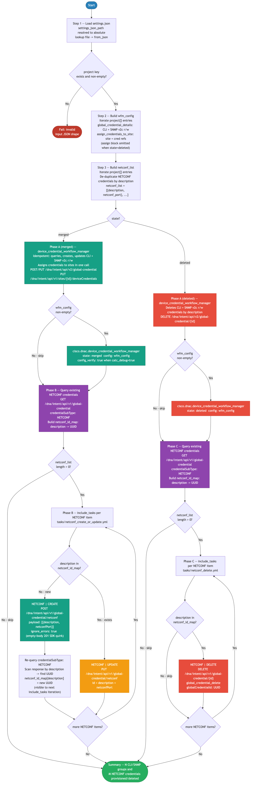

# 3.0 — Cisco Catalyst Center: Device Credentials Automation

> **Playbook:** `credentials.yml`  
> **Modules:** `cisco.dnac.device_credential_workflow_manager`, `cisco.dnac.global_credential_info`, `cisco.dnac.global_credential_delete`, `ansible.builtin.uri` (NETCONF create/update REST calls)  
> **Minimum Catalyst Center version:** 2.3.7.6  
> **Minimum Ansible version:** 2.15  
> **Authors:** Igor Manassypov — Systems Engineer (imanassy@cisco.com)  
> **Copyright © 2024–2026 Cisco Systems, Inc. All rights reserved.**

---

## Table of Contents

1. [Overview](#overview)
   - [Logical Flow](#logical-flow)
2. [Prerequisites](#prerequisites)
3. [Directory Structure](#directory-structure)
4. [Installation](#installation)
5. [Configuration](#configuration)
   - [Inventory](#inventory)
   - [Vault (Credentials)](#vault-credentials)
6. [Input Data Structure — `settings.json`](#input-data-structure--settingsjson)
   - [Top-Level Schema](#top-level-schema)
   - [Field Reference — `device_credentials`](#field-reference--device_credentials)
   - [Field Reference — `assign_credentials`](#field-reference--assign_credentials)
   - [Full Example](#full-example)
7. [Playbook Walkthrough — Step by Step](#playbook-walkthrough--step-by-step)
   - [Step 1: Load and Validate Input Data](#step-1-load-and-validate-input-data)
   - [Step 2: Build Workflow Manager Config](#step-2-build-workflow-manager-config)
   - [Step 3: Build NETCONF List](#step-3-build-netconf-list)
   - [Phase A: Manage CLI and SNMP Credentials](#phase-a-manage-cli-and-snmp-credentials)
   - [Phase B: Create / Update NETCONF Credentials](#phase-b-create--update-netconf-credentials)
   - [Phase C: Delete NETCONF Credentials](#phase-c-delete-netconf-credentials)
8. [Data Transformation Reference](#data-transformation-reference)
9. [Running the Playbook](#running-the-playbook)
10. [Debug Mode](#debug-mode)
11. [Expected Output](#expected-output)
12. [Playbook Ordering Dependency](#playbook-ordering-dependency)
13. [Troubleshooting](#troubleshooting)

---

## Overview

This playbook automates the creation, update, deletion, and site assignment of **device credentials** in Cisco Catalyst Center. Credentials are the authentication material (CLI username/password, SNMP community strings, NETCONF port) that CatC uses when connecting to managed network devices.

The playbook is data-driven and reads `settings.json` (the single source of truth). Each project entry may declare `device_credentials` (what credentials to create) and `assign_credentials` (which credentials to assign and to which sites). Credential definitions are de-duplicated across entries so multiple pods sharing the same credential set result in a single API call.

> **Why `device_credential_workflow_manager`?**  
> `cisco.dnac.device_credential_workflow_manager` (introduced in collection 6.7.0) is the recommended high-level module for managing CLI and SNMP v2c credentials. It handles idempotency internally — querying existing credentials, creating missing ones, updating changed ones, and assigning them to sites in a single call — eliminating the need for external UUID maps, create-vs-update splits, and separate site-resolution steps. NETCONF credential create/update is handled separately via direct REST (`ansible.builtin.uri`) plus `global_credential_info` and `global_credential_delete` in the same include_tasks pattern used in playbook 1.0.

### What it does

| Action | Mechanism |
|--------|----------|
| Loads and validates input JSON | `lookup('file', path) \| from_json` + `assert` |
| Builds workflow manager config | Jinja2 `namespace` loop → `wfm_config` list |
| Creates CLI credentials | `device_credential_workflow_manager` state=merged (idempotent) |
| Updates CLI credentials | `device_credential_workflow_manager` state=merged (idempotent) |
| Deletes CLI credentials | `device_credential_workflow_manager` state=deleted |
| Creates SNMP v2c read/write credentials | `device_credential_workflow_manager` state=merged (idempotent) |
| Updates SNMP v2c credentials | `device_credential_workflow_manager` state=merged (idempotent) |
| Deletes SNMP v2c credentials | `device_credential_workflow_manager` state=deleted |
| Assigns credentials to sites | `device_credential_workflow_manager` `assign_credentials_to_site` |
| Queries existing NETCONF credentials | `global_credential_info` (credentialSubType: NETCONF) |
| Creates NETCONF credentials | `ansible.builtin.uri` → `POST /dna/intent/api/v1/global-credential/netconf` |
| Updates NETCONF credentials | `ansible.builtin.uri` → `PUT /dna/intent/api/v1/global-credential/netconf` |
| Deletes NETCONF credentials | `global_credential_delete` (globalCredentialId) |

## API Endpoints and Modules Summary

### Modules Summary

| Collection | Module | Purpose in this playbook | Module Docs |
|---|---|---|---|
| cisco.dnac | device_credential_workflow_manager | Idempotent create/update/delete/assign for CLI and SNMP credentials | cisco.dnac 6.48.2: [device_credential_workflow_manager](https://galaxy.ansible.com/ui/repo/published/cisco/dnac/content/module/device_credential_workflow_manager/) |
| cisco.dnac | global_credential_info | Read existing NETCONF global credentials for UUID matching | cisco.dnac 6.48.2: [global_credential_info](https://galaxy.ansible.com/ui/repo/published/cisco/dnac/content/module/global_credential_info/) |
| ansible.builtin | uri | Execute NETCONF create/update REST operations and poll async task status | ansible-core: [uri](https://docs.ansible.com/ansible/latest/collections/ansible/builtin/uri_module.html) |
| cisco.dnac | global_credential_delete | Delete NETCONF credentials by globalCredentialId | cisco.dnac 6.48.2: [global_credential_delete](https://galaxy.ansible.com/ui/repo/published/cisco/dnac/content/module/global_credential_delete/) |

### Endpoint Summary by Phase

| Phase | HTTP | Endpoint | Why it is used | API Docs |
|---|---|---|---|---|
| Module auth | POST | /dna/system/api/v1/auth/token | Session token flow handled by cisco.dnac modules | CatC 2.3.7.9: [Authentication](https://developer.cisco.com/docs/catalyst-center/2-3-7-9/authentication) |
| CLI/SNMP workflow manager | module-managed | /dna/intent/api/v2/global-credential and related workflow endpoints | High-level idempotent credential operations and site assignment | CatC 2.3.7.9: [API Reference](https://developer.cisco.com/docs/catalyst-center/2-3-7-9/cisco-catalyst-center-2-3-7-9-api-overview) |
| NETCONF lookup | GET | /dna/intent/api/v1/global-credential?credentialSubType=NETCONF | Build name/port to UUID map for update/delete decisions | CatC 2.3.7.9: [API Reference](https://developer.cisco.com/docs/catalyst-center/2-3-7-9/cisco-catalyst-center-2-3-7-9-api-overview) |
| NETCONF create/update | POST, PUT | /dna/intent/api/v1/global-credential/netconf | Manage NETCONF credential lifecycle | CatC 2.3.7.9: [API Reference](https://developer.cisco.com/docs/catalyst-center/2-3-7-9/cisco-catalyst-center-2-3-7-9-api-overview) |
| NETCONF delete | DELETE | /dna/intent/api/v1/global-credential/{globalCredentialId} | Remove NETCONF credentials selected for deletion | CatC 2.3.7.9: [API Reference](https://developer.cisco.com/docs/catalyst-center/2-3-7-9/cisco-catalyst-center-2-3-7-9-api-overview) |

### Notes

- CLI and SNMP are intentionally handled by workflow manager for idempotency and assignment behavior.
- NETCONF is handled separately because workflow manager does not cover NETCONF credential lifecycle.


### Logical Flow

The diagram below shows every decision point and state transition from startup to completion:



> Source: [`DIAGRAMS/logical-flow.mmd`](DIAGRAMS/logical-flow.mmd) — re-render with `mmdc -i DIAGRAMS/logical-flow.mmd -o DIAGRAMS/logical-flow.png --scale 3`

---

## Prerequisites

| Requirement | Version / Notes |
|-------------|----------------|
| Ansible | >= 2.15 |
| Python | >= 3.9 |
| `catalystcentersdk` | >= 2.3.7.9 |
| `cisco.dnac` collection | >= 6.7.0 (installed: 6.48.2) |
| `dnacentersdk` | >= 2.11.0 (installed: 2.11.2) |
| `ansible.utils` collection | >= 2.11.0 (required by action plugins) |
| Cisco Catalyst Center | >= 2.3.7.6 |
| Site hierarchy | Must exist before assigning credentials to sites — run playbook **1.0** first |

> **Note:** `cisco.dnac` modules do not support `check_mode`. Review the `DEBUG | wfm_config` debug output before running to verify the payload structure.

> **Collection note:** `cisco.dnac >= 6.7.0` uses `dnac_*` parameter names (`dnac_host`, `dnac_port`, `dnac_username`, `dnac_password`, `dnac_verify`, `dnac_version`, `dnac_debug`) and the `dnac_response` response key. It requires `dnacentersdk >= 2.11.0` (installed: 2.11.2). `device_credential_workflow_manager` was introduced in collection version 6.7.0.
>
> **Deprecation notice:** `cisco.dnac` will be retired at v7.0.0 in favour of `cisco.catalystcenter`. No action is needed for the current lab; update `requirements.yml` and module FQCNs when migrating.

---

## Directory Structure

```
3.0-Cisco-Catalyst-Center-Credentials/
├── ansible.cfg                       # Ansible defaults (inventory path, deprecation_warnings suppressed)
├── inventory.yml                     # CatC connection (catc_*) + default input path
├── credentials.yml                   # Main playbook
├── tasks/
│   ├── netconf_create_or_update.yml     # Phase B: per-NETCONF-credential create/update (include_tasks)
│   └── netconf_delete.yml              # Phase C: per-NETCONF-credential delete (include_tasks)
├── vault.yml                         # Ansible Vault encrypted CatC credentials (git-ignored)
├── vault.yml.example                 # Plain-text credential template
├── .vault_pass                       # Vault password file (git-ignored, chmod 600)
├── requirements.txt                  # Python pip dependencies
├── requirements.yml                  # Ansible Galaxy collection dependencies
└── DIAGRAMS/
    ├── logical-flow.mmd              # Mermaid source — re-render with mmdc
    └── logical-flow.png              # Rendered flowchart (referenced by README)
```

The playbook uses `settings.json` from the project tree as its **single source of truth**:

```
Projects/
└── BGP_EVPN/               ← default project
    └── Settings/
        └── settings.json   # device_credentials + assign_credentials for every pod
└── TRADITIONAL/
    └── Settings/
        └── settings.json   # alternate project — pass via -e settings_json_path=...
```

---

## Installation

### 1. Install Python dependencies

```bash
pip install -r requirements.txt
```

This installs `dnacentersdk>=2.11.0` — the Python SDK used by the `cisco.dnac` collection. `device_credential_workflow_manager` requires `dnacentersdk >= 2.11.0`.

### 2. Install Ansible collections

```bash
ansible-galaxy collection install -r requirements.yml
```

### 3. Set up the vault password file

```bash
echo 'your_vault_password' > .vault_pass
chmod 600 .vault_pass
```

---

## Configuration

### Inventory

**File:** `inventory.yml`

```yaml
all:
  hosts:
    catalyst_center:
      ansible_host: localhost
      ansible_connection: local
      ansible_python_interpreter: "{{ ansible_playbook_python }}"

      # Catalyst Center connection
      catc_host:    198.18.129.100
      catc_port:    443
      catc_version: "2.3.7.9"
      catc_verify:  false
      catc_debug:   false

      # Input file path (relative or absolute) — single source of truth
      settings_json_path: "../Settings/settings.json"
```

| Variable | Purpose |
|----------|---------|
| `catc_host` | CatC hostname or IP |
| `catc_port` | API port (default 443) |
| `catc_version` | SDK version string — must be ≤ appliance version |
| `catc_verify` | SSL certificate verification (`false` for self-signed certs) |
| `catc_debug` | Enable verbose `catalystcentersdk` tracing and extra debug tasks |
| `settings_json_path` | Relative or absolute path to `settings.json` (single source of truth) |

### Vault (Credentials)

```bash
cp vault.yml.example vault.yml
ansible-vault encrypt vault.yml --vault-password-file .vault_pass
```

`vault.yml.example` contains:

```yaml
catc_username: "admin"
catc_password: "your_catc_password_here"
```

---

## Input Data Structure — `settings.json`

### Top-Level Schema

```json
{
  "project": [
    {
      "HierarchyArea":  "...",
      "HierarchyBldg":  "...",
      "HierarchyFloor": "...",
      "device_credentials": { ... },
      "assign_credentials": { ... }
    }
  ]
}
```

The `project` array contains one entry per site pod. Each entry may optionally carry `device_credentials` and/or `assign_credentials`. All other keys (`network_settings`, `network_profile`, template arrays) are ignored by this playbook.

Multiple entries may declare the same credential set (same `description`). The playbook de-duplicates by a `type:description` key — only the first occurrence is included in the create/update payload. Assignment entries (`assign_credentials`) are kept separately because each targets a distinct site.

### Field Reference — `device_credentials`

| Field | Type | Description |
|-------|------|-------------|
| `cli_credential` | array | List of CLI credential objects to create. May contain multiple entries. |
| `cli_credential[].description` | string | Human-readable label for the credential. Used to match existing credentials. |
| `cli_credential[].username` | string | SSH/Telnet username. Combined with `description` for idempotency matching. |
| `cli_credential[].password` | string | SSH/Telnet password. |
| `cli_credential[].enable_password` | string | Enable / privileged EXEC password. Defaults to `""` if omitted. |
| `snmp_v2c_read` | array | List of SNMP v2c read-only community string objects. |
| `snmp_v2c_read[].description` | string | Human-readable label. Used for idempotency matching. |
| `snmp_v2c_read[].read_community` | string | SNMP read community string. |
| `snmp_v2c_write` | array | List of SNMP v2c read-write community string objects. |
| `snmp_v2c_write[].description` | string | Human-readable label. Used for idempotency matching. |
| `snmp_v2c_write[].write_community` | string | SNMP write community string. |
| `netconf_credential` | array | List of NETCONF credential objects. Handled separately from other types. |
| `netconf_credential[].description` | string | Human-readable label. Used as the idempotency key for NETCONF. |
| `netconf_credential[].netconf_port` | string | NETCONF TCP port (typically `"830"`). |

### Field Reference — `assign_credentials`

| Field | Type | Description |
|-------|------|-------------|
| `site_name` | array of strings | List of full site hierarchy paths to assign credentials to. Paths must already exist in CatC (run playbook 1.0 first). |
| `cli_credential` | object | Identifies which CLI credential to assign — `{description, username}`. |
| `cli_credential.description` | string | Must match an existing CLI credential `description`. |
| `cli_credential.username` | string | Must match the `username` of the identified CLI credential. |
| `snmp_v2c_read` | object | Identifies which SNMP read credential to assign — `{description}`. |
| `snmp_v2c_read.description` | string | Must match an existing `snmp_v2c_read` credential `description`. |
| `snmp_v2c_write` | object | Identifies which SNMP write credential to assign — `{description}`. |
| `snmp_v2c_write.description` | string | Must match an existing `snmp_v2c_write` credential `description`. |

> **Note:** NETCONF credentials are created globally in CatC but are not directly assignable to individual sites through the `assign_credentials` block. NETCONF assignment happens automatically when CatC uses the credential during device discovery. Only CLI and SNMP types appear in `assign_credentials`.

### Full Example

```json
{
  "project": [
    {
      "HierarchyArea":  "POD 0",
      "HierarchyBldg":  "Building P0",
      "HierarchyFloor": "Floor 1",
      "HierarchyParent": "Global/PODS",
      "device_credentials": {
        "cli_credential": [
          {
            "description": "CLI-net-admin",
            "username": "net-admin",
            "password": "cisco",
            "enable_password": "cisco"
          }
        ],
        "snmp_v2c_read": [
          {
            "description": "RO",
            "read_community": "RO"
          }
        ],
        "snmp_v2c_write": [
          {
            "description": "RW",
            "write_community": "RO"
          }
        ],
        "netconf_credential": [
          {
            "description": "NETCONF-netadmin",
            "netconf_port": "830"
          }
        ]
      },
      "assign_credentials": {
        "site_name": ["Global/PODS/POD 0/Building P0"],
        "cli_credential": {
          "description": "CLI-net-admin",
          "username": "net-admin"
        },
        "snmp_v2c_read":  { "description": "RO" },
        "snmp_v2c_write": { "description": "RW" }
      }
    }
  ]
}
```

---

## Playbook Walkthrough — Step by Step

### Step 1: Load and Validate Input Data

The `settings_json_path` inventory variable is resolved to an absolute path (relative paths are expanded from `playbook_dir`). `lookup('file', _resolved_json_path) | from_json` reads and parses the JSON in one step. An `assert` task validates that the `project` key is present and non-empty before any processing begins.

### Step 2: Build Workflow Manager Config

**Purpose:** Translate `settings_data.project` into `wfm_config` — the `config` list consumed by `device_credential_workflow_manager`. One config entry is produced per project item.

Each entry may contain:

| Key | When present | Contents |
|-----|-------------|----------|
| `global_credential_details` | Always (if any credentials defined) | `cli_credential`, `snmp_v2c_read`, `snmp_v2c_write` arrays |
| `assign_credentials_to_site` | state=merged only, if `assign_credentials.site_name` non-empty | `site_name` list + credential identity refs |

Field names in `settings.json` are already snake_case and match the module parameter names directly — no camelCase translation required (unlike the old `global_credential_v2` stack).

For `state=deleted`, `assign_credentials_to_site` is omitted so the module receives only credential identifiers (description) and performs deletion without attempting site writes.

**Example — resulting `wfm_config` (BGP_EVPN with one pod):**

```yaml
wfm_config:
  - global_credential_details:
      cli_credential:
        - description: "CLI-net-admin"
          username: "net-admin"
          password: "cisco"
          enable_password: "cisco"
      snmp_v2c_read:
        - description: "RO"
          read_community: "RO"
      snmp_v2c_write:
        - description: "RW"
          write_community: "RO"
    assign_credentials_to_site:
      site_name:
        - "Global/PODS/POD 0/Building P0"
      cli_credential:
        description: "CLI-net-admin"
        username: "net-admin"
      snmp_v2c_read:
        description: "RO"
      snmp_v2c_write:
        description: "RW"
```

### Step 3: Build NETCONF List

**Purpose:** Extract all `netconf_credential` entries across `project[]` into a flat de-duplicated list.

`device_credential_workflow_manager` does not support the NETCONF credential type. A separate `netconf_list` is therefore built so Phases B and C can handle NETCONF through the dedicated `netconf_credential` and `global_credential_delete` modules.

De-duplication uses a `namespace(seen=[])` accumulator on `description` — first-seen wins.

**Example — `netconf_list`:**

```yaml
netconf_list:
  - description:   "NETCONF-netadmin"
    netconf_port:  "830"
```

### Phase A: Manage CLI and SNMP Credentials

**Purpose:** Create, update, or delete all CLI and SNMP v2c r/w credentials and assign them to sites. Handled entirely by a single `cisco.dnac.device_credential_workflow_manager` call.

The module is idempotent: it internally queries existing credentials, creates missing ones, updates changed ones, and assigns them to the specified sites. No external UUID mapping or create-vs-update splitting is needed.

`config_verify: true` is passed when `catc_debug=true`, causing the module to re-query CatC after applying changes and emit a diff.

**State = merged:**
- `wfm_config` contains both `global_credential_details` and `assign_credentials_to_site`
- API calls issued internally: `POST/PUT /dna/intent/api/v2/global-credential`, `PUT /dna/intent/api/v1/sites/{id}/deviceCredentials`

**State = deleted:**
- `wfm_config` contains only `global_credential_details` (assign block omitted by Step 2)
- API call issued internally: `DELETE /dna/intent/api/v2/global-credential/{id}` matched by description

> **Dependency:** Site assignment requires each `site_name` path to already exist in CatC. Run playbook **1.0** (site hierarchy) before running this playbook when site assignment is needed.

### Phase B: Create / Update NETCONF Credentials

**Purpose:** Create or update each NETCONF credential from `netconf_list`. Only executes when `state == merged`.

**Step-by-step:**

1. **Query existing NETCONF credentials** — `cisco.dnac.global_credential_info` with `credentialSubType: NETCONF`. Response key is `dnac_response`.
2. **Build `netconf_id_map`** — a dict of `{description: UUID}` from the response. Used for O(1) existence checks and UUID lookup.
3. **Loop via `include_tasks`** — `tasks/netconf_create_or_update.yml` is called once per entry in `netconf_list` using `include_tasks` instead of a plain `loop`.

> **Why `include_tasks` instead of `loop`?** `set_fact` inside `include_tasks` takes effect **immediately** (before the next iteration starts). Inside a plain `loop`, `set_fact` only takes effect after the **entire loop** completes. Using `include_tasks` means that after a new NETCONF credential is created and its UUID is added to `netconf_id_map`, the very next iteration has an up-to-date map. This mirrors the `include_tasks` rationale in playbook 1.0's `create_or_update_site.yml`.

**Per-item logic inside `tasks/netconf_create_or_update.yml`:**

```
description = "NETCONF-netadmin"

1. _nc_exists = description in netconf_id_map   → False (first run)
   _nc_id     = netconf_id_map.get(description) → ""

   if NOT exists:
     POST /dna/intent/api/v1/global-credential/netconf
       body: [{description: "NETCONF-netadmin", netconfPort: "830"}]   ← netconf_credential (payload list form)
     ignore_errors: true  ← CatC returns HTTP 201 with empty body; SDK raises deserialization
                             error even though the credential is created successfully
     Re-query credentialSubType: NETCONF
     Scan response by description → find UUID
     netconf_id_map["NETCONF-netadmin"] = new_uuid   ← visible to next iteration

   if EXISTS:
     PUT /dna/intent/api/v1/global-credential/netconf
       id + description + netconfPort                ← netconf_credential (scalar field form)
```

**Note on `netconf_credential` CREATE vs UPDATE forms:**

| Operation | Module form | Required params |
|-----------|-------------|----------------|
| CREATE | `state: present`, `payload: [list]` | `payload[].description`, `payload[].netconfPort` |
| UPDATE | `state: present`, scalar fields | `id`, `description`, `netconfPort` |

Supplying `id:` at the top level switches the module from POST to PUT. The `ignore_errors: true` on CREATE absorbs the empty-body 201 deserialization bug — the re-query step confirms actual creation by description.

### Phase C: Delete NETCONF Credentials

**Purpose:** Delete each NETCONF credential listed in `netconf_list`. Only executes when `state == deleted`.

Phase A's `device_credential_workflow_manager state=deleted` handles CLI and SNMP v2c deletion, but not NETCONF. Phase C covers that gap using `cisco.dnac.global_credential_delete`.

1. Re-query NETCONF credentials and rebuild `netconf_id_map` (identical to Phase B step 1–2).
2. Loop via `include_tasks: tasks/netconf_delete.yml` — per entry in `netconf_list`.
3. Inside `tasks/netconf_delete.yml`: if the description is found in `netconf_id_map`, issue `DELETE /dna/intent/api/v1/global-credential/{globalCredentialId}`. If not found, skip silently.

> **Warning:** Deleting credentials still assigned to managed devices or sites will interrupt device management in Catalyst Center. Confirm all devices are decommissioned or credential assignments are removed before running with `state=deleted`.

---

## Data Transformation Reference

```
settings.json
└── project[]
    └── [n].device_credentials + assign_credentials
              │
              ▼ Step 2 — set_fact (namespace loop)
    wfm_config = [
      {
        global_credential_details: {
          cli_credential:   [{description, username, password, enable_password}],
          snmp_v2c_read:    [{description, read_community}],
          snmp_v2c_write:   [{description, write_community}]
        },
        assign_credentials_to_site: {            ← omitted when state=deleted
          cli_credential:  {description, username},
          snmp_v2c_read:   {description},
          snmp_v2c_write:  {description},
          site_name:       ["Global/..."]
        }
      }
    ]
              │
              ▼ Step 3 — set_fact (separate namespace de-dup loop)
    netconf_list = [
      {description: "NETCONF-netadmin", netconf_port: "830"}
    ]
              │
              ▼ Phase A — device_credential_workflow_manager (state=merged or deleted)
    state=merged:
      POST /dna/intent/api/v2/global-credential          ← create new credentials
      PUT  /dna/intent/api/v2/global-credential          ← update existing credentials
      PUT  /dna/intent/api/v1/sites/{id}/deviceCredentials  ← assignment

    state=deleted:
      DELETE /dna/intent/api/v2/global-credential/{id}   ← matched by description
              │
              ▼ Phase B (merged) / Phase C (deleted) — NETCONF

    Phase B (merged):
      GET  /dna/intent/api/v1/global-credential?credentialSubType=NETCONF
      → netconf_id_map = { "NETCONF-netadmin": "uuid-...", ... }
      per entry via include_tasks:
        NOT exists → POST /dna/intent/api/v1/global-credential/netconf  (payload list)
                      ignore_errors: true  (empty-body 201 SDK quirk)
                  → re-GET to resolve UUID
                  → netconf_id_map[description] = new UUID   ← visible to next iter
        EXISTS     → PUT  /dna/intent/api/v1/global-credential/netconf  (id + fields)

    Phase C (deleted):
      GET  /dna/intent/api/v1/global-credential?credentialSubType=NETCONF
      → netconf_id_map = { ... }
      per entry via include_tasks:
        EXISTS     → DELETE /dna/intent/api/v1/global-credential/{globalCredentialId}
        NOT exists → skip silently
```

**Before — `settings.json` entry (`device_credentials` + `assign_credentials`):**

```json
{
  "device_credentials": {
    "cli_credential":     [{ "description": "CLI-net-admin", "username": "net-admin", "password": "cisco", "enable_password": "cisco" }],
    "snmp_v2c_read":      [{ "description": "RO", "read_community": "RO" }],
    "snmp_v2c_write":     [{ "description": "RW", "write_community": "RO" }],
    "netconf_credential": [{ "description": "NETCONF-netadmin", "netconf_port": "830" }]
  },
  "assign_credentials": {
    "site_name":      ["Global/PODS/POD 0/Building P0"],
    "cli_credential": { "description": "CLI-net-admin", "username": "net-admin" },
    "snmp_v2c_read":  { "description": "RO" },
    "snmp_v2c_write": { "description": "RW" }
  }
}
```

> `netconf_credential` is extracted separately — `device_credential_workflow_manager` does **not** support NETCONF. It is processed in a dedicated Phase B/C loop using raw URI calls instead.

**After — `wfm_config[0]`** (submitted to `device_credential_workflow_manager`):

```json
{
  "global_credential_details": {
    "cli_credential":  [{ "description": "CLI-net-admin", "username": "net-admin", "password": "cisco", "enable_password": "cisco" }],
    "snmp_v2c_read":   [{ "description": "RO", "read_community": "RO" }],
    "snmp_v2c_write":  [{ "description": "RW", "write_community": "RO" }]
  },
  "assign_credentials_to_site": {
    "site_name":      ["Global/PODS/POD 0/Building P0"],
    "cli_credential": { "description": "CLI-net-admin", "username": "net-admin" },
    "snmp_v2c_read":  { "description": "RO" },
    "snmp_v2c_write": { "description": "RW" }
  }
}
```

**After — `netconf_list`** (handled separately in Phase B/C):

```json
[{ "description": "NETCONF-netadmin", "netconf_port": "830" }]
```

Duplicate credential blocks across multiple `project[]` entries are de-duplicated by their `type:description` composite key before submission — only the first occurrence of `"cli:CLI-net-admin"`, `"snmp_v2c_read:RO"`, etc. is kept.

---

## Running the Playbook

### Create / update credentials (default)

```bash
ansible-playbook credentials.yml --vault-password-file .vault_pass
```

### Use the TRADITIONAL project settings

```bash
ansible-playbook credentials.yml \
  --vault-password-file .vault_pass \
  -e settings_json_path=../Settings/traditional-settings.json
```

### Override the input path at runtime

```bash
ansible-playbook credentials.yml \
  --vault-password-file .vault_pass \
  -e settings_json_path=/absolute/path/to/settings.json
```

### Delete all credentials listed in settings.json

```bash
ansible-playbook credentials.yml \
  --vault-password-file .vault_pass \
  -e state=deleted
```

> **Warning:** Deletion will fail or silently leave orphan assignments if credentials are still in use by discovered devices. Decommission devices (playbook 4.0 with `state=deleted`) before deleting credentials.

### Enable verbose debug output

```bash
ansible-playbook credentials.yml \
  --vault-password-file .vault_pass \
  -e catc_debug=true
```

> **Note:** `cisco.dnac` modules do **not** support `--check` mode. Review the `DEBUG | wfm_config` and `DEBUG | netconf_list` task output to verify payloads before committing.

---

## Debug Mode

```bash
ansible-playbook credentials.yml --vault-password-file .vault_pass -e catc_debug=true
```

Setting `catc_debug=true` enables two things simultaneously:

1. **Verbose SDK HTTP tracing** — every `dnacentersdk` API request (URL, method, headers) and response is printed to stderr alongside the normal Ansible output.
2. **Ansible debug tasks** — extra `debug:` tasks gated on `catc_debug | default(false) | bool` fire throughout the play and per-credential task files.

> **Note:** The `-e catc_debug=true` CLI flag passes a string; `| bool` coercion in every `when:` condition handles the type conversion correctly.

### Debug Task Reference

| File | Debug Task | Variable(s) Printed |
|------|-----------|---------------------|
| `credentials.yml` | `DEBUG \| Resolved settings JSON path` | `_resolved_json_path` — absolute path used to load the JSON |
| `credentials.yml` | `DEBUG \| settings_data (raw JSON)` | `settings_data` — full parsed JSON document |
| `credentials.yml` | `DEBUG \| wfm_config` | `wfm_config` — full config list passed to `device_credential_workflow_manager` |
| `credentials.yml` | `DEBUG \| netconf_list` | `netconf_list` — de-duplicated NETCONF credential entries |
| `credentials.yml` | `DEBUG \| Phase A — workflow manager result` | `_wfm_result` — full `device_credential_workflow_manager` response (CLI + SNMP + assignments) |
| `credentials.yml` | `DEBUG \| Phase B — raw NETCONF credential info` | `_netconf_info` — raw `global_credential_info` response (Phase B) |
| `tasks/netconf_create_or_update.yml` | `DEBUG \| Step 1 — exists/id` | `description`, `_nc_exists`, `_nc_id` for current iteration |
| `tasks/netconf_create_or_update.yml` | `DEBUG \| CREATE result` | `_nc_create` — POST response (only on CREATE; may show error due to empty-body 201 quirk) |
| `tasks/netconf_create_or_update.yml` | `DEBUG \| Resolve result` | `_nc_resolve` — UUID resolution re-query response (only on CREATE) |
| `tasks/netconf_create_or_update.yml` | `DEBUG \| UPDATE result` | `_nc_update` — PUT response (only on UPDATE) |
| `tasks/netconf_delete.yml` | `DEBUG \| Step 1 — exists/id` | `description`, `_nc_exists`, `_nc_id` for current iteration |
| `tasks/netconf_delete.yml` | `DEBUG \| DELETE result` | `_nc_delete` — DELETE response (only when credential exists) |

---

## Expected Output

```
TASK [Validate that project key exists in input data] **************************
ok: [catalyst_center] => { "msg": "Input data loaded — 1 entries found." }

TASK [Phase A — Manage CLI+SNMP credentials (state=merged)] *******************
changed: [catalyst_center]

TASK [Phase B — netconf_id_map (0 existing)] **********************************
ok: [catalyst_center] => { "msg": {} }

TASK [Phase B — Create/update NETCONF credentials (1 total)] ******************
included: tasks/netconf_create_or_update.yml for catalyst_center

TASK [NETCONF | CREATE  | NETCONF-netadmin] ***********************************
fatal: [catalyst_center]: FAILED! => {
    "msg": "Module result deserialization failed..."
}
...ignoring

TASK [NETCONF | Resolve new UUID  | NETCONF-netadmin] ************************
ok: [catalyst_center]

TASK [Device credentials provisioning complete] *******************************
ok: [catalyst_center] => {
    "msg": "Successfully provisioned 1 CLI/SNMP credential group(s) and 1 NETCONF credential(s)."
}

PLAY RECAP *********************************************************************
catalyst_center : ok=26  changed=1  unreachable=0  failed=0  skipped=6
```

On subsequent runs, `device_credential_workflow_manager` detects existing credentials and returns `changed=false`. The NETCONF path finds the UUID in `netconf_id_map` and issues a PUT (UPDATE) instead of a POST.

---

## Playbook Ordering Dependency

This playbook (3.0) depends on the site hierarchy being in place before credential assignment can succeed. The recommended execution order is:

```
1.0 — Site Hierarchy
        │
        ▼
2.0 — Network Settings
        │
        ▼
3.0 — Device Credentials  ◄── this playbook
        │
        ▼
4.0 — Device Discovery
        │
        ▼
5.0 — Assign to Site
```

> **1.0 must run first.** The `assign_credentials_to_site` step in Phase B will fail with an HTTP 400 / site-not-found error if the site hierarchy paths listed in `site_name` do not exist in CatC. Run playbook 1.0 to create the hierarchy, or remove `assign_credentials` from `settings.json` if you want to define credentials only (without assignment).
>
> When running with `state=deleted`: reverse the order above. Decommission devices (4.0 / 5.0 deleted), then delete credentials (3.0 deleted), then delete settings (2.0 deleted), then delete hierarchy (1.0 deleted).

---

## Troubleshooting

| Symptom | Likely Cause | Resolution |
|---------|-------------|------------|
| `Authentication failed` | Wrong credentials in `vault.yml` | Re-edit `vault.yml` and verify `catc_username`/`catc_password` |
| `HTTP 400` on credential assignment | Site path in `site_name` does not exist in CatC | Run playbook 1.0 first to create the site hierarchy |
| `dnac_host is required` | Wrong parameter names | Verify `module_defaults` uses `dnac_host`/`dnac_port`/`dnac_username`/`dnac_password` NOT `host`/`api_port` |
| `dnac_response` not found | Using old response key | `cisco.dnac` returns `dnac_response` not `catalyst_response` |
| `device_credential_workflow_manager` not found | `cisco.dnac` collection older than 6.7.0 | Run `ansible-galaxy collection install -r requirements.yml` to upgrade to >= 6.7.0 |
| NETCONF CREATE shows `fatal: Module result deserialization failed` | CatC returns HTTP 201 with empty body; SDK cannot parse it | Already handled — `ignore_errors: true` is applied. The credential is created; the subsequent re-query resolves the UUID. No action needed. |
| `globalCredentialId is required` | Wrong delete param name | `global_credential_delete` uses `globalCredentialId`, not `id` |
| NETCONF UUID not resolved after CREATE | CatC slow to commit new credential | Increase `retries`/`delay` in the UUID resolution task in `tasks/netconf_create_or_update.yml` |
| `dnacentersdk not installed` | Missing Python SDK | Run `pip install -r requirements.txt` |
| `Collection not found` | `cisco.dnac` not installed | Run `ansible-galaxy collection install -r requirements.yml` |
| `ansible.utils` import error | Missing `ansible.utils` collection | Run `ansible-galaxy collection install ansible.utils` |
| TLS/SSL errors | Self-signed certificate | Set `catc_verify: false` in `inventory.yml` for lab |
| Version mismatch warning | `catc_version` > appliance version | Set `catc_version: "2.3.7.9"` (or lower to match appliance) |
| `project key missing` / assert failure | `settings.json` missing the `project` top-level key | Verify the JSON schema matches the expected structure |
| Credential assigned to wrong site | `site_name` path mismatch | Check exact path in settings.json matches the CatC hierarchy (case-sensitive) |
| `DeprecationWarning: cisco.dnac will be retired` | `cisco.dnac` >= 7.0.0 installed | Migrate to `cisco.catalystcenter` collection; update `module_defaults` and all FQCN prefixes |
