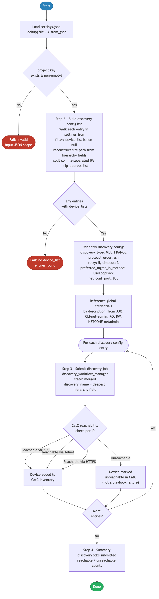

> **Deprecated:** Playbooks moved to [`../ansible/playbooks/`](../ansible/playbooks/). See [`../ansible/README.md`](../ansible/README.md).

# 4.0 — Cisco Catalyst Center: Device Discovery Automation

> **Playbook:** `device_discovery.yml`  
> **Module:** `cisco.dnac.discovery_workflow_manager`  
> **Minimum Catalyst Center version:** 2.3.7.6  
> **Minimum Ansible version:** 2.15  
> **Authors:** Igor Manassypov — Systems Engineer (imanassy@cisco.com)  
> **Copyright © 2024–2026 Cisco Systems, Inc. All rights reserved.**

---

## Table of Contents

1. [Overview](#overview)
   - [Logical Flow](#logical-flow)
2. [Prerequisites](#prerequisites)
3. [Directory Structure](#directory-structure)
4. [Installation](#installation)
5. [Configuration](#configuration)
   - [Inventory](#inventory)
   - [Vault (Credentials)](#vault-credentials)
6. [Input Data Structure — `settings.json`](#input-data-structure--settingsjson)
   - [Top-Level Schema](#top-level-schema)
   - [The `device_list` Field](#the-device_list-field)
   - [Site Path Reconstruction](#site-path-reconstruction)
   - [Full Example](#full-example)
7. [Playbook Walkthrough — Step by Step](#playbook-walkthrough--step-by-step)
   - [Step 1: Load and Validate Input Data](#step-1-load-and-validate-input-data)
   - [Step 2: Build Discovery Config List](#step-2-build-discovery-config-list)
   - [Step 3: Run Device Discovery](#step-3-run-device-discovery)
   - [Step 4: Summary](#step-4-summary)
8. [Discovery Module Parameters Reference](#discovery-module-parameters-reference)
9. [Data Transformation Reference](#data-transformation-reference)
10. [Running the Playbook](#running-the-playbook)
11. [Debug Mode](#debug-mode)
12. [Expected Output](#expected-output)
13. [Troubleshooting](#troubleshooting)

---

## Overview

This playbook automates **device discovery** in Cisco Catalyst Center. It reads the shared `settings.json` file, extracts every project entry that has a `device_list` (a comma-separated list of management IP addresses), and submits one **MULTI RANGE** discovery job per entry to Catalyst Center.

Catalyst Center's discovery engine then attempts to reach each IP using SSH, validates credentials against the configured global credential set (created by playbook 3.0), and adds the reachable devices to the device inventory.

### What it does

| Action | Mechanism |
|--------|-----------|
| Loads and validates input JSON | `lookup('file', path) \| from_json` + Jinja2 filters |
| Reconstructs site path from split hierarchy fields | Jinja2 conditional — deepest non-null level wins |
| Splits comma-separated IP strings into lists | Jinja2 `split(',')` + `map('trim')` |
| Builds one discovery job config per site entry | `set_fact` with `namespace` |
| Submits all discovery jobs | `cisco.dnac.discovery_workflow_manager` — `state: merged` |

## API Endpoints and Modules Summary

### Modules Summary

| Collection | Module | Purpose in this playbook | Module Docs |
|---|---|---|---|
| cisco.dnac | discovery_workflow_manager | Submit and manage discovery jobs from grouped IP ranges | cisco.dnac 6.46.0: [discovery_workflow_manager](https://galaxy.ansible.com/ui/repo/published/cisco/dnac/content/module/discovery_workflow_manager/) |

### Endpoint Summary by Phase

| Phase | HTTP | Endpoint | Why it is used | API Docs |
|---|---|---|---|---|
| Discovery operations | module-managed | Discovery API set used internally by discovery_workflow_manager | Create and track discovery jobs without raw uri tasks | CatC 2.3.7.9: [API Reference](https://developer.cisco.com/docs/catalyst-center/2-3-7-9/cisco-catalyst-center-2-3-7-9-api-overview) |

### Notes

- This playbook does not call uri directly; all CatC API interaction is encapsulated in the cisco.dnac module.
- Device onboarding results depend on credentials already configured in step 3.0.


### Logical Flow

The diagram below shows every decision point and state transition from startup to completion:



> Source: [`DIAGRAMS/logical-flow.mmd`](DIAGRAMS/logical-flow.mmd) — re-render with `mmdc -i DIAGRAMS/logical-flow.mmd -o DIAGRAMS/logical-flow.png --scale 3`

### Playbook ordering dependency

This playbook should run **after** [3.0 — Device Credentials](../3.0-Cisco-Catalyst-Center-Credentials/README.md). Global credentials must exist in CatC before discovery can reference them by description. Discovery does not assign devices to sites — that is handled by [5.0 — Assign To Site](../5.0-Cisco-Catalyst-Center-Assign-To-Site/README.md).

```
1.0 Site Hierarchy  →  2.0 Settings  →  3.0 Credentials  →  4.0 Discovery (this)
                                                                      ↓
                                                             5.0 Assign to Site
```

---

## Prerequisites

| Requirement | Version / Notes |
|-------------|----------------|
| Ansible | >= 2.15 |
| Python | >= 3.9 |
| `dnacentersdk` | >= 2.11.0 |
| `cisco.dnac` collection | 6.46.0 |
| Cisco Catalyst Center | >= 2.3.7.6 |
| Global credentials | Must exist in CatC (run 3.0 first) |

---

## Directory Structure

```
4.0-Cisco-Catalyst-Center-Device-Discovery/
├── ansible.cfg                 # Ansible defaults (inventory path)
├── inventory.yml               # CatC connection + input file path
├── device_discovery.yml        # Main playbook
├── vault.yml                   # Ansible Vault encrypted credentials (git-ignored)
├── vault.yml.example           # Plain-text credential template
├── .vault_pass                 # Vault password file (git-ignored, chmod 600)
├── requirements.txt            # Python pip dependencies
├── requirements.yml            # Ansible Galaxy collection dependencies
└── DIAGRAMS/
    ├── logical-flow.mmd        # Mermaid source — re-render with mmdc
    └── logical-flow.png        # Rendered flowchart (referenced by README)
```

Input data comes from the shared `settings.json`:

```
Projects/
└── BGP_EVPN/
    └── Settings/
        └── settings.json       # Single source of truth — site hierarchy + device list
```

---

## Installation

```bash
pip install -r requirements.txt
ansible-galaxy collection install -r requirements.yml
echo 'your_vault_password' > .vault_pass && chmod 600 .vault_pass
```

---

## Configuration

### Inventory

**File:** `inventory.yml`

```yaml
all:
  hosts:
    catalyst_center:
      ansible_host: localhost
      ansible_connection: local
      ansible_python_interpreter: "{{ ansible_playbook_python }}"

      dnac_host: 198.18.129.100
      dnac_port: 443
      dnac_version: 2.3.7.9
      dnac_verify: false
      dnac_debug: false
      dnac_log: true
      dnac_log_level: INFO

      settings_json_path: "../Settings/settings.json"
```

| Variable | Purpose |
|----------|---------|
| `settings_json_path` | Relative or absolute path to the `settings.json` input file |

### Vault (Credentials)

```bash
cp vault.yml.example vault.yml
ansible-vault encrypt vault.yml --vault-password-file .vault_pass
```

`vault.yml.example`:

```yaml
dnac_username: "admin"
dnac_password: "your_catc_password_here"
```

---

## Input Data Structure — `settings.json`

### Top-Level Schema

```json
{
  "project": [
    {
      "HierarchyParent": "Global/PODS",
      "HierarchyArea":   "POD 0",
      "HierarchyBldg":   "Building P0",
      "HierarchyFloor":  "Floor 1",
      "device_list":     "<ip1,ip2,...> or null",
      ...
    }
  ]
}
```

This playbook only processes entries where `device_list` is non-null. All other fields are ignored.

> **Note on the old `devices.json` format:** Previous versions of this playbook read a separate `devices.json` file containing `DeviceList` (PascalCase) and a flat `HierarchyName` string. `settings.json` consolidates all project data into one file and uses `device_list` (snake_case) and split hierarchy fields instead.

### The `device_list` Field

`device_list` is a **comma-separated string** of management IP addresses (not a JSON array). The playbook splits and trims the string into an `ip_address_list` for the discovery module.

```json
"device_list": "198.19.1.1,198.19.1.2,198.19.1.3,198.19.1.4,198.19.1.5,198.19.1.6"
```

**After splitting:**

```yaml
ip_address_list:
  - 198.19.1.1
  - 198.19.1.2
  - 198.19.1.3
  - 198.19.1.4
  - 198.19.1.5
  - 198.19.1.6
```

> Entries where `device_list` is `null` (e.g., area or building nodes that have no directly managed devices) are automatically skipped.

### Site Path Reconstruction

Because `settings.json` splits the hierarchy into separate fields instead of a flat `HierarchyName` string, the playbook reconstructs the site path using a Jinja2 conditional — the **deepest non-null level** determines the path:

```jinja2

  

  

  

  

```

**Example reconstruction:**

```
HierarchyParent: "Global/PODS"
HierarchyArea:   "POD 0"
HierarchyBldg:   "Building P0"
HierarchyFloor:  "Floor 1"
→ site_path = "Global/PODS/POD 0/Building P0/Floor 1"
```

This reconstructed path is used as the `discovery_name` passed to the module, so it appears in the CatC **Discovery** view and in the discovery job history.

### Full Example

```json
{
  "project": [
    {
      "HierarchyParent": "Global/PODS",
      "HierarchyArea":   "POD 0",
      "HierarchyBldg":   "Building P0",
      "HierarchyFloor":  "Floor 1",
      "HierarchyBldgAddress": "300 E Tasman Dr, San Jose, CA",
      "device_list": "198.19.1.1,198.19.1.2,198.19.1.3,198.19.1.4,198.19.1.5,198.19.1.6",
      "device_credentials": {
        "cli_credential":     { "description": "CLI-net-admin", "username": "net-admin" },
        "snmp_v2c_read":      { "description": "RO" },
        "snmp_v2c_write":     { "description": "RW" },
        "netconf_credential": { "description": "NETCONF-netadmin", "netconf_port": "830" }
      },
      "network_profile": {
        "profile_name": "BGP-EVPN-Switching",
        "DayNTemplateNames": [
          {
            "TemplateName":   "BGP-EVPN-BUILD.j2",
            "TemplateTag":    "DEMO",
            "Project":        "Building P0",
            "TemplateTarget": ["198.19.1.1","198.19.1.2","198.19.1.3","198.19.1.4","198.19.1.5","198.19.1.6"],
            "DeployTemplate": true
          }
        ]
      }
    }
  ]
}
```

This entry has a `device_list` — one discovery job will be submitted covering all six IPs under the reconstructed site path `Global/PODS/POD 0/Building P0/Floor 1`.

---

## Playbook Walkthrough — Step by Step

### Step 1: Load and Validate Input Data

The path is resolved to absolute, then `lookup('file', _resolved_json_path) | from_json` reads and parses the JSON in one step. An `assert` task validates the shape before any processing begins.

```yaml
- name: Resolve settings_json_path to absolute
  set_fact:
    _resolved_json_path: >-
      {{ settings_json_path if settings_json_path.startswith('/')
         else (playbook_dir + '/' + settings_json_path) }}

- name: Load settings input JSON
  set_fact:
    settings_data: "{{ lookup('file', _resolved_json_path) | from_json }}"

- name: Validate that project key exists in input data
  assert:
    that: settings_data.project is defined and settings_data.project | length > 0
    fail_msg: "Input JSON must contain a non-empty 'project' list."
    success_msg: "Input data loaded — {{ settings_data.project | length }} entries found."
```

### Step 2: Build Discovery Config List

**Purpose:** Iterate over `settings_data.project`, extract entries with a non-null `device_list`, reconstruct the site path from split hierarchy fields, split the IP string, and build the complete discovery module config dict for each.

```yaml
- name: Build discovery config list
  set_fact:
    discovery_list: >-
      
      
        
          
          
          
          
          
            
          
            
          
            
          
            
          
          
          {%- set disc = {
            'discovery_name': site_path,
            'discovery_type': 'MULTI RANGE',
            'ip_address_list': ips,
            'protocol_order': 'ssh',
            'retry': 5,
            'timeout': 3,
            'preferred_mgmt_ip_method': 'UseLoopBack',
            'discovery_specific_credentials': {'net_conf_port': '830'},
            'global_credentials': {
              'cli_credentials_list':          [{'description': 'CLI-net-admin', 'username': 'net-admin'}],
              'snmp_v2_read_credential_list':  [{'description': 'RO'}],
              'snmp_v2_write_credential_list': [{'description': 'RW'}],
              'net_conf_port_list':            [{'description': 'NETCONF-netadmin'}]
            }
          } -%}
          
        
      
      {{ ns.result }}
```

**Transformation trace:**

```
Input entry:
  HierarchyParent: "Global/PODS"
  HierarchyArea:   "POD 0"
  HierarchyBldg:   "Building P0"
  HierarchyFloor:  "Floor 1"
  device_list:     "198.19.1.1,198.19.1.2,198.19.1.3"

Processing:
  1. entry.device_list is truthy → enter block
  2. site_path = "Global/PODS/POD 0/Building P0/Floor 1"
  3. ips = ["198.19.1.1", "198.19.1.2", "198.19.1.3"]
  4. Build disc dict with site_path as discovery_name

Output discovery_list[0]:
  {
    "discovery_name":           "Global/PODS/POD 0/Building P0/Floor 1",
    "discovery_type":           "MULTI RANGE",
    "ip_address_list":          ["198.19.1.1", "198.19.1.2", "198.19.1.3"],
    "protocol_order":           "ssh",
    "retry":                    5,
    "timeout":                  3,
    "preferred_mgmt_ip_method": "UseLoopBack",
    "discovery_specific_credentials": { "net_conf_port": "830" },
    "global_credentials": {
      "cli_credentials_list":          [{"description": "CLI-net-admin", "username": "net-admin"}],
      "snmp_v2_read_credential_list":  [{"description": "RO"}],
      "snmp_v2_write_credential_list": [{"description": "RW"}],
      "net_conf_port_list":            [{"description": "NETCONF-netadmin"}]
    }
  }
```

### Step 3: Run Device Discovery

**Purpose:** Loop over `discovery_list` and submit each job to CatC.

```yaml
- name: "Discover devices"
  cisco.dnac.discovery_workflow_manager:
    state: merged
    config:
      - "{{ item }}"
  loop: "{{ discovery_list }}"
  register: discovery_results
```

Each iteration submits one discovery job. CatC processes the job asynchronously — the module monitors the job status and waits for completion before returning.

#### Credential references, not secrets

The `global_credentials` block contains **description + username** pairs only, not passwords. CatC resolves these references to the actual secrets stored when the credentials were created by playbook 3.0. This prevents credentials being embedded in `settings.json`.

```json
"cli_credentials_list": [
  {
    "description": "CLI-net-admin",     ← matches description set in 3.0
    "username":    "net-admin"          ← disambiguates if multiple creds share a description
  }
]
```

> **NETCONF credential name:** The global credential created by playbook 3.0 has description `NETCONF-netadmin`. The discovery config references it by this exact description. The earlier `NETCONF-net-admin` (with extra hyphen) was the old name and no longer applies.

### Step 4: Summary

```yaml
- name: Device discovery complete
  debug:
    msg:
      - "Device discovery submitted successfully"
      - "Discovery tasks run: {{ discovery_list | length }}"
      - "Devices targeted: {{ discovery_list | map(attribute='ip_address_list') | flatten | join(', ') }}"
```

---

## Discovery Module Parameters Reference

| Parameter | Value | Description |
|-----------|-------|-------------|
| `discovery_type` | `MULTI RANGE` | Treats each IP in the list as an individual target (not a subnet). Use `RANGE` for contiguous subnets or `CDP`/`LLDP` for topology-based discovery. |
| `protocol_order` | `ssh` | Primary protocol for device communication. Can also be `telnet` or `ssh,telnet`. |
| `retry` | `5` | Number of connection retry attempts per device. |
| `timeout` | `3` | Seconds to wait for each connection attempt. |
| `discovery_specific_credentials.net_conf_port` | `830` | NETCONF port passed to the discovery job. Must be placed under `discovery_specific_credentials` — the module reads it from there only. A top-level `netconf_port` field is silently ignored. |
| `preferred_mgmt_ip_method` | `UseLoopBack` | Prefer loopback interfaces as the management IP. Use `None` to use the discovery IP as-is. |

---

## Data Transformation Reference

```
settings.json
└── project[]
    └── [n].device_list  (non-null entries only)
        "198.19.1.1,198.19.1.2, 198.19.1.3"
              │
              ▼ Step 2 — reconstruct site path + split(',') | map('trim') | list
        site_path       = "Global/PODS/POD 0/Building P0/Floor 1"
        ip_address_list = ["198.19.1.1", "198.19.1.2", "198.19.1.3"]
              │
              ▼ Build disc dict
        discovery_list[n] = {
          discovery_name: "Global/PODS/POD 0/Building P0/Floor 1",
          discovery_type: "MULTI RANGE",
          ip_address_list: [...],
          global_credentials: {
            cli_credentials_list: [{"description": "CLI-net-admin", ...}],
            net_conf_port_list:   [{"description": "NETCONF-netadmin"}],
            ...
          }
        }
              │
              ▼ Step 3 — loop + module call
        cisco.dnac.discovery_workflow_manager (state: merged)
        → POST /dna/intent/api/v1/discovery
        → GET  /dna/intent/api/v1/discovery/{id}  (poll for completion)
```

**Before — `devices.json` entry:**

```json
{
  "HierarchyName": "Global/PODS/POD 0/Building P0/Floor 1",
  "DeviceList":    "198.19.1.1,198.19.1.2,198.19.1.3,198.19.1.4,198.19.1.5, 198.19.1.6"
}
```

> `DeviceList` is a raw comma-separated string with optional whitespace around entries. The Jinja2 expression `entry.DeviceList.split(',') | map('trim') | list` strips whitespace from each token before building the list. Only entries where `DeviceList` is non-null produce a discovery item.

**After — `discovery_list[0]`** (submitted to `discovery_workflow_manager`):

```json
{
  "discovery_name":              "Global/PODS/POD 0/Building P0/Floor 1",
  "discovery_type":              "MULTI RANGE",
  "ip_address_list":             ["198.19.1.1", "198.19.1.2", "198.19.1.3", "198.19.1.4", "198.19.1.5", "198.19.1.6"],
  "protocol_order":              "ssh",
  "retry":                       5,
  "timeout":                     3,
  "preferred_mgmt_ip_method":    "UseLoopBack",
  "discovery_specific_credentials": { "net_conf_port": "830" },
  "global_credentials": {
    "cli_credentials_list":          [{ "description": "CLI-net-admin", "username": "net-admin" }],
    "snmp_v2_read_credential_list":  [{ "description": "RO" }],
    "snmp_v2_write_credential_list": [{ "description": "RW" }],
    "net_conf_port_list":            [{ "description": "NETCONF-netadmin" }]
  }
}
```

Each `discovery_list` item triggers one `POST /dna/intent/api/v1/discovery` call, after which the module polls `GET /dna/intent/api/v1/discovery/{id}` until the job reaches a terminal state and reports per-IP reachability.

---

## Running the Playbook

### Discover devices using the default input file

```bash
ansible-playbook device_discovery.yml --vault-password-file .vault_pass
```

### Override the input file at runtime

```bash
ansible-playbook device_discovery.yml \
  --vault-password-file .vault_pass \
  -e settings_json_path=/absolute/path/to/settings.json
```

### Use a different project's settings

```bash
ansible-playbook device_discovery.yml \
  --vault-password-file .vault_pass \
  -e settings_json_path=../Settings/traditional-settings.json
```

---

## Debug Mode

```bash
DEBUG=true ansible-playbook device_discovery.yml --vault-password-file .vault_pass
```

Prints:
- `discovery_list` — the fully built config list before any API calls
- `discovery_results` — raw module return including job IDs and reachability details

---

## Expected Output

```
TASK [Validate that project key exists in input data] **************************
ok: [catalyst_center] => { "msg": "Input data loaded — 1 entries found." }

TASK [Validate discovery list is non-empty] ************************************
ok: [catalyst_center] => { "msg": "1 discovery task(s) to run." }

TASK [Discover devices] ********************************************************
changed: [catalyst_center]

TASK [Device discovery complete] ***********************************************
ok: [catalyst_center] => {
    "msg": [
        "Device discovery submitted successfully",
        "Discovery tasks run: 1",
        "Devices targeted: 198.19.1.1, 198.19.1.2, 198.19.1.3, 198.19.1.4, 198.19.1.5, 198.19.1.6"
    ]
}

PLAY RECAP *********************************************************************
catalyst_center : ok=7   changed=1   unreachable=0   failed=0   skipped=1
```

After discovery completes, devices appear in **CatC → Provision → Inventory** with status `Reachable`. They are not yet assigned to a site — proceed with [5.0 — Assign To Site](../5.0-Cisco-Catalyst-Center-Assign-To-Site/README.md).

---

## Troubleshooting

| Symptom | Likely Cause | Resolution |
|---------|-------------|------------|
| `No entries with device_list found` | All entries have `null` device_list | Add IP addresses to the `device_list` field in `settings.json` |
| `Global credential not found` | CLI/SNMP/NETCONF credential description not in CatC | Run playbook 3.0 first to create global credentials |
| Discovery job stuck / times out | Devices unreachable from CatC | Verify IP reachability from the CatC appliance to the device IPs |
| Devices show `Unreachable` | Wrong credentials or SSH not enabled | Verify CLI credentials in playbook 3.0 match the device configuration |
| `NETCONF connection refused` | NETCONF not enabled on device | Configure `netconf-yang` on the device, or remove the NETCONF credential from the discovery config |
| `Global credential not found: NETCONF-netadmin` | Credential name mismatch | Credential created in 3.0 must have description `NETCONF-netadmin` (no hyphen before `netadmin`) |
| Duplicate discovery job name | Multiple entries resolve to same site path | Each project entry must produce a unique site path from its hierarchy fields |
| `dnac_version mismatch` | SDK version exceeds appliance version | Set `dnac_version: 2.3.7.9` in `inventory.yml` |
| TLS errors | Self-signed certificate | Set `dnac_verify: false` for lab environments |
