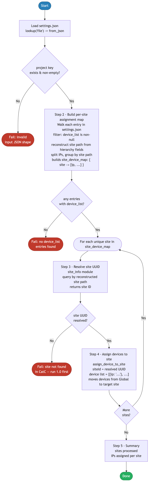

# 5.0 — Cisco Catalyst Center: Assign Devices to Site Automation

> **Playbook:** `assign_to_site.yml`  
> **Modules:** `cisco.dnac.site_info`, `cisco.dnac.assign_device_to_site`  
> **Minimum Catalyst Center version:** 2.3.7.6  
> **Minimum Ansible version:** 2.15  
> **Authors:** Igor Manassypov — Systems Engineer (imanassy@cisco.com)  
> **Copyright © 2024–2026 Cisco Systems, Inc. All rights reserved.**

---

## Table of Contents

1. [Overview](#overview)
   - [Logical Flow](#logical-flow)
2. [Prerequisites](#prerequisites)
3. [Directory Structure](#directory-structure)
4. [Installation](#installation)
5. [Configuration](#configuration)
   - [Inventory](#inventory)
   - [Vault (Credentials)](#vault-credentials)
6. [Input Data Structure — `settings.json`](#input-data-structure--settingsjson)
   - [Top-Level Schema](#top-level-schema)
   - [The `device_list` Field](#the-device_list-field)
   - [Site Path Reconstruction](#site-path-reconstruction)
   - [Full Example](#full-example)
7. [Playbook Walkthrough — Step by Step](#playbook-walkthrough--step-by-step)
   - [Step 1: Load and Validate Input Data](#step-1-load-and-validate-input-data)
   - [Step 2: Build Per-Site Assignment Map](#step-2-build-per-site-assignment-map)
   - [Step 3: Look Up Site UUIDs](#step-3-look-up-site-uuids)
   - [Step 4: Assign Devices to Their Site](#step-4-assign-devices-to-their-site)
   - [Step 5: Summary](#step-5-summary)
8. [Data Transformation Reference](#data-transformation-reference)
9. [Running the Playbook](#running-the-playbook)
10. [Debug Mode](#debug-mode)
11. [Expected Output](#expected-output)
12. [Troubleshooting](#troubleshooting)

---

## Overview

This playbook assigns already-discovered devices to their designated sites in Cisco Catalyst Center. After [4.0 — Device Discovery](../4.0-Cisco-Catalyst-Center-Device-Discovery/README.md) adds devices to the CatC inventory, they appear in the **Global** site by default. This playbook reads the same `settings.json` file, reconstructs each site path from split hierarchy fields, groups device IPs by target site, looks up the site UUID from CatC, and calls `assign_device_to_site` to move each device into its correct site position.

Site assignment is a prerequisite for template deployment, SWIM software management, and network profile application — all of which require devices to be anchored to a specific site.

### What it does

| Action | Module |
|--------|--------|
| Loads and validates input JSON | `lookup('file', path) \| from_json` + Jinja2 filters |
| Reconstructs site path from split hierarchy fields | Jinja2 conditional — deepest non-null level wins |
| Groups IPs by target site path | `set_fact` with dict accumulation |
| Resolves site name → UUID | `cisco.dnac.site_info` |
| Assigns IP list to site UUID | `cisco.dnac.assign_device_to_site` |

## API Endpoints and Modules Summary

### Modules Summary

| Collection | Module | Purpose in this playbook | Module Docs |
|---|---|---|---|
| cisco.dnac | site_info | Resolve target site UUID for each reconstructed hierarchy path | cisco.dnac 6.46.0: [site_info](https://galaxy.ansible.com/ui/repo/published/cisco/dnac/content/module/site_info/) |
| cisco.dnac | assign_device_to_site | Assign one or more discovered devices to the resolved site | cisco.dnac 6.46.0: [assign_device_to_site](https://galaxy.ansible.com/ui/repo/published/cisco/dnac/content/module/assign_device_to_site/) |

### Endpoint Summary by Phase

| Phase | HTTP | Endpoint | Why it is used | API Docs |
|---|---|---|---|---|
| Site lookup | module-managed | Site lookup endpoints used by site_info | Translate hierarchy path into site UUID | CatC 2.3.7.9: [API Reference](https://developer.cisco.com/docs/catalyst-center/2-3-7-9/cisco-catalyst-center-2-3-7-9-api-overview) |
| Device assignment | module-managed | Device-to-site assignment endpoints used by assign_device_to_site | Move discovered devices from Global to target site | CatC 2.3.7.9: [API Reference](https://developer.cisco.com/docs/catalyst-center/2-3-7-9/cisco-catalyst-center-2-3-7-9-api-overview) |

### Notes

- This workflow is module-driven; no direct uri tasks are used.
- Assignment requires both existing site hierarchy (1.0) and discovered devices (4.0).


### Logical Flow

The diagram below shows every decision point and state transition from startup to completion:



> Source: [`DIAGRAMS/logical-flow.mmd`](DIAGRAMS/logical-flow.mmd) — re-render with `mmdc -i DIAGRAMS/logical-flow.mmd -o DIAGRAMS/logical-flow.png --scale 3`

### Playbook ordering dependency

```
1.0 Site Hierarchy  →  2.0 Settings  →  3.0 Credentials  →  4.0 Discovery
                                                                      ↓
                                                          5.0 Assign to Site (this)
                                                                      ↓
                                           6.0 Templates  →  7.0 Network Profile
                                                                      ↓
                                                       9.0 Composite Deployment
```

Devices must exist in the CatC inventory (discovered by 4.0) before they can be assigned. Sites must exist (created by 1.0) before they can receive devices.

---

## Prerequisites

| Requirement | Version / Notes |
|-------------|----------------|
| Ansible | >= 2.15 |
| Python | >= 3.9 |
| `dnacentersdk` | >= 2.11.0 |
| `cisco.dnac` collection | 6.46.0 |
| Cisco Catalyst Center | >= 2.3.7.6 |
| Site hierarchy | Must exist (run 1.0 first) |
| Devices in inventory | Must be discovered (run 4.0 first) |

---

## Directory Structure

```
5.0-Cisco-Catalyst-Center-Assign-To-Site/
├── ansible.cfg                 # Ansible defaults (inventory path)
├── inventory.yml               # CatC connection + input file path
├── assign_to_site.yml          # Main playbook
├── vault.yml                   # Ansible Vault encrypted credentials (git-ignored)
├── vault.yml.example           # Plain-text credential template
├── .vault_pass                 # Vault password file (git-ignored, chmod 600)
├── requirements.txt            # Python pip dependencies
├── requirements.yml            # Ansible Galaxy collection dependencies
└── DIAGRAMS/
    ├── logical-flow.mmd        # Mermaid source — re-render with mmdc
    └── logical-flow.png        # Rendered flowchart (referenced by README)
```

Input data comes from the shared `settings.json`:

```
Projects/
└── BGP_EVPN/
    └── Settings/
        └── settings.json       # Single source of truth — site hierarchy + device list
```

---

## Installation

```bash
pip install -r requirements.txt
ansible-galaxy collection install -r requirements.yml
echo 'your_vault_password' > .vault_pass && chmod 600 .vault_pass
```

---

## Configuration

### Inventory

**File:** `inventory.yml`

```yaml
all:
  hosts:
    catalyst_center:
      ansible_host: localhost
      ansible_connection: local
      ansible_python_interpreter: "{{ ansible_playbook_python }}"

      dnac_host: 198.18.129.100
      dnac_port: 443
      dnac_version: 2.3.7.9
      dnac_verify: false
      dnac_debug: false
      dnac_log: true
      dnac_log_level: INFO

      settings_json_path: "../Settings/settings.json"
```

| Variable | Purpose |
|----------|---------|
| `settings_json_path` | Relative or absolute path to the `settings.json` input file |

### Vault (Credentials)

```bash
cp vault.yml.example vault.yml
ansible-vault encrypt vault.yml --vault-password-file .vault_pass
```

`vault.yml.example`:

```yaml
dnac_username: "admin"
dnac_password: "your_catc_password_here"
```

---

## Input Data Structure — `settings.json`

### Top-Level Schema

```json
{
  "project": [
    {
      "HierarchyParent": "Global/PODS",
      "HierarchyArea":   "POD 0",
      "HierarchyBldg":   "Building P0",
      "HierarchyFloor":  "Floor 1",
      "device_list":     "<ip1,ip2,...> or null",
      ...
    }
  ]
}
```

This playbook only processes entries where `device_list` is non-null. The reconstructed site path from that entry becomes the target site for all IPs in its `device_list`.

> **Note on the old `devices.json` format:** Previous versions of this playbook read `DeviceList` (PascalCase) and a flat `HierarchyName` string from a separate `devices.json` file. `settings.json` consolidates all project data and uses `device_list` (snake_case) and split hierarchy fields instead.

### The `device_list` Field

`device_list` is a **comma-separated string** of management IP addresses matching the addresses used during discovery. These must be the management IPs as CatC resolved them — if `preferred_mgmt_ip_method: UseLoopBack` was used in playbook 4.0, these must be the loopback addresses.

```json
"device_list": "198.19.1.1,198.19.1.2,198.19.1.3,198.19.1.4,198.19.1.5,198.19.1.6"
```

### Site Path Reconstruction

Because `settings.json` uses split hierarchy fields instead of a flat `HierarchyName` string, the playbook reconstructs the target site path using a Jinja2 conditional — the **deepest non-null level** determines the path:

```jinja2





  

  

  

  

```

**Example reconstruction:**

```
HierarchyParent: "Global/PODS"
HierarchyArea:   "POD 0"
HierarchyBldg:   "Building P0"
HierarchyFloor:  "Floor 1"
→ site_path = "Global/PODS/POD 0/Building P0/Floor 1"
```

### Full Example

```json
{
  "project": [
    {
      "HierarchyParent": "Global/PODS",
      "HierarchyArea":   "POD 0",
      "HierarchyBldg":   "Building P0",
      "HierarchyFloor":  "Floor 1",
      "device_list": "198.19.1.1,198.19.1.2,198.19.1.3,198.19.1.4,198.19.1.5,198.19.1.6"
    }
  ]
}
```

This entry will assign all six devices to `Global/PODS/POD 0/Building P0/Floor 1`.

---

## Playbook Walkthrough — Step by Step

### Step 1: Load and Validate Input Data

The path is resolved to absolute, then `lookup('file', _resolved_json_path) | from_json` reads and parses the JSON in one step. An `assert` task validates the shape before any processing begins.

```yaml
- name: Resolve settings_json_path to absolute
  set_fact:
    _resolved_json_path: >-
      {{ settings_json_path if settings_json_path.startswith('/')
         else (playbook_dir + '/' + settings_json_path) }}

- name: Load settings input JSON
  set_fact:
    settings_data: "{{ lookup('file', _resolved_json_path) | from_json }}"

- name: Validate that project key exists in input data
  assert:
    that: settings_data.project is defined and settings_data.project | length > 0
    fail_msg: "Input JSON must contain a non-empty 'project' list."
    success_msg: "Input data loaded — {{ settings_data.project | length }} entries found."
```

### Step 2: Build Per-Site Assignment Map

**Purpose:** Create a dictionary that maps each unique reconstructed site path to the accumulated list of IPs that belong to it. Using a dict (keyed by site path) naturally merges IPs when multiple entries share the same target site.

```yaml
- name: Build per-site assignment map
  set_fact:
    site_device_map: >-
      
      
        
          
          
          
          
          
            
          
            
          
            
          
            
          
          
          
            
          
            
          
        
      
      {{ ns.result }}
```

**Transformation trace:**

```
Input (1 entry with device_list):
  HierarchyParent/Area/Bldg/Floor → "Global/PODS/POD 0/Building P0/Floor 1"
  device_list: "198.19.1.1,198.19.1.2,198.19.1.3,198.19.1.4,198.19.1.5,198.19.1.6"

Output site_device_map:
  {
    "Global/PODS/POD 0/Building P0/Floor 1": [
      "198.19.1.1", "198.19.1.2", "198.19.1.3",
      "198.19.1.4", "198.19.1.5", "198.19.1.6"
    ]
  }
```

### Step 3: Look Up Site UUIDs

**Purpose:** For each unique site path in `site_device_map`, query CatC's site API to retrieve the internal UUID. The `assign_device_to_site` API requires the UUID, not the human-readable path.

```yaml
- name: Look up site UUID — "{{ item.key }}"
  cisco.dnac.site_info:
    name: "{{ item.key }}"
  loop: "{{ site_device_map | dict2items }}"
  register: site_info_results
```

`dict2items` converts the map into a list of `{key: "<site path>", value: [...ips...]}` objects, making it iterable. The `site_info` module is **read-only** — it simply returns the site details for the given name.

**Example `site_info_results.results[0].dnac_response`:**

```json
{
  "response": [
    {
      "id":                  "a1b2c3d4-e5f6-7890-abcd-ef1234567890",
      "name":                "Floor 1",
      "siteNameHierarchy":   "Global/PODS/POD 0/Building P0/Floor 1"
    }
  ]
}
```

The UUID (`id`) is extracted in Step 4 using: `item.dnac_response.response[0].id`

### Step 4: Assign Devices to Their Site

**Purpose:** Loop over the `site_info_results` (one result per site), build the device list from `site_device_map`, and call `assign_device_to_site`.

```yaml
- name: Assign devices to site
  cisco.dnac.assign_device_to_site:
    siteId: "{{ item.dnac_response.response[0].id }}"
    device: >-
      
      
        
      
      {{ ns.result }}
  loop: "{{ site_info_results.results }}"
  loop_control:
    label: "{{ item.item.key }}"
  register: assignment_results
```

#### Understanding the loop variable structure

| Expression | Resolves to |
|-----------|-------------|
| `item` | One result from `site_info_results.results` |
| `item.item` | The original loop item passed to `site_info` (a `{key, value}` dict from `dict2items`) |
| `item.item.key` | The site path (e.g. `"Global/PODS/POD 0/Building P0/Floor 1"`) |
| `item.dnac_response.response[0].id` | The site UUID returned by `site_info` |
| `site_device_map[item.item.key]` | The IP list for this site |

#### The `device` parameter format

The `assign_device_to_site` module expects the `device` parameter as a **list of `{ip: "<address>"}` objects**, not a flat list of strings:

```yaml
# Correct format
device:
  - ip: "198.19.1.1"
  - ip: "198.19.1.2"
  - ip: "198.19.1.3"

# Incorrect — will fail
device:
  - "198.19.1.1"
  - "198.19.1.2"
```

**Complete transformation example:**

```
site_device_map["Global/.../Floor 1"] = ["198.19.1.1", "198.19.1.2"]

site_info result for "Global/.../Floor 1":
  → id = "a1b2c3d4-e5f6-7890-abcd-ef1234567890"

assign_device_to_site call:
  siteId: "a1b2c3d4-e5f6-7890-abcd-ef1234567890"
  device:
    - ip: "198.19.1.1"
    - ip: "198.19.1.2"

API endpoint: POST /dna/intent/api/v1/assign-device-to-site/{siteId}/device
```

### Step 5: Summary

```yaml
- name: Site assignment complete
  debug:
    msg:
      - "Device-to-site assignment submitted successfully"
      - "Sites processed: {{ site_device_map.keys() | list | join(', ') }}"
      - "Total devices assigned: {{ site_device_map.values() | map('length') | sum }}"
```

`site_device_map.values() | map('length') | sum` extracts the length of each IP list and sums them — giving the total count of devices assigned across all sites.

---

## Data Transformation Reference

```
settings.json
└── project[]
    └── [n].HierarchyParent/Area/Bldg/Floor + device_list  (non-null device_list only)
              │
              ▼ Step 2 — reconstruct site path + dict accumulation
    site_device_map = {
      "Global/PODS/POD 0/Building P0/Floor 1": [
        "198.19.1.1", "198.19.1.2", "198.19.1.3",
        "198.19.1.4", "198.19.1.5", "198.19.1.6"
      ]
    }
              │
              ▼ Step 3 — site_info lookup (dict2items loop)
    site_info_results.results[0].dnac_response.response[0].id
      = "a1b2c3d4-e5f6-7890-abcd-ef1234567890"
              │
              ▼ Step 4 — IP list → [{ip: ...}] objects + assign
    cisco.dnac.assign_device_to_site:
      siteId: "a1b2c3d4-e5f6-7890-abcd-ef1234567890"
      device: [{ip: "198.19.1.1"}, {ip: "198.19.1.2"}, ...]

    → POST /dna/intent/api/v1/assign-device-to-site/{siteId}/device
```

**Before — `devices.json` `project[]` (excerpt):**

```json
[
  { "HierarchyName": "Global",                                       "DeviceList": null },
  { "HierarchyName": "Global/PODS",                                  "DeviceList": null },
  { "HierarchyName": "Global/PODS/POD 0/Building P0/Floor 1",
    "DeviceList": "198.19.1.1,198.19.1.2,198.19.1.3,198.19.1.4,198.19.1.5,198.19.1.6" }
]
```

> Entries with `DeviceList: null` are skipped. IPs in non-null entries are split, trimmed, and accumulated into a dict keyed by site path. If two entries share the same `HierarchyName`, their IP lists are merged automatically via the namespace accumulator.

**After — `site_device_map` (Step 2):**

```json
{
  "Global/PODS/POD 0/Building P0/Floor 1": [
    "198.19.1.1", "198.19.1.2", "198.19.1.3",
    "198.19.1.4", "198.19.1.5", "198.19.1.6"
  ]
}
```

**After — per-site assign payload (Step 4):**

```json
{
  "siteId": "5b689937-4e5f-6a7b-8c9d-0e1f2a3b4c5d",
  "device": [
    { "ip": "198.19.1.1" }, { "ip": "198.19.1.2" }, { "ip": "198.19.1.3" },
    { "ip": "198.19.1.4" }, { "ip": "198.19.1.5" }, { "ip": "198.19.1.6" }
  ]
}
```

The `siteId` is resolved from `site_info_results.results[n].dnac_response.response[0].id` — a `cisco.dnac.site_info` lookup keyed by the site path string from `site_device_map`. The IP list is converted from a plain string list to `[{ip: ...}]` objects inline in the module parameters.

---

## Running the Playbook

### Assign devices using the default input file

```bash
ansible-playbook assign_to_site.yml --vault-password-file .vault_pass
```

### Override the input file at runtime

```bash
ansible-playbook assign_to_site.yml \
  --vault-password-file .vault_pass \
  -e settings_json_path=/absolute/path/to/settings.json
```

### Use a different project's settings

```bash
ansible-playbook assign_to_site.yml \
  --vault-password-file .vault_pass \
  -e settings_json_path=../Settings/traditional-settings.json
```

---

## Debug Mode

```bash
DEBUG=true ansible-playbook assign_to_site.yml --vault-password-file .vault_pass
```

Prints:
- `site_device_map` — the fully-built site-to-IP-list dictionary
- `site_info_results` — the raw site UUID lookup responses
- `assignment_results` — the raw assignment API responses

---

## Expected Output

```
TASK [Validate that project key exists in input data] **************************
ok: [catalyst_center] => { "msg": "Input data loaded — 1 entries found." }

TASK [Validate assignment map is non-empty] ************************************
ok: [catalyst_center] => { "msg": "1 site(s) to assign devices to." }

TASK [Look up site UUID — "Global/PODS/POD 0/Building P0/Floor 1"] *************
ok: [catalyst_center]

TASK [Assign devices to site] **************************************************
changed: [catalyst_center] => (item=Global/PODS/POD 0/Building P0/Floor 1)

TASK [Site assignment complete] ************************************************
ok: [catalyst_center] => {
    "msg": [
        "Device-to-site assignment submitted successfully",
        "Sites processed: Global/PODS/POD 0/Building P0/Floor 1",
        "Total devices assigned: 6"
    ]
}

PLAY RECAP *********************************************************************
catalyst_center : ok=8   changed=1   unreachable=0   failed=0   skipped=1
```

After assignment, devices appear under the correct site in **CatC → Provision → Inventory**. They are now eligible for template deployment and network profile application.

---

## Troubleshooting

| Symptom | Likely Cause | Resolution |
|---------|-------------|------------|
| `No entries with device_list found` | All `device_list` values are null | Add IP addresses to the `device_list` field for floor-level entries in `settings.json` |
| `Site not found` | Reconstructed site path does not exist in CatC | Run playbook 1.0 first to create the site hierarchy. Verify `HierarchyParent/Area/Bldg/Floor` values match exactly. |
| `Device not found` | Device IP not in the CatC inventory | Run playbook 4.0 first to discover the devices |
| `Device already assigned` | Device already in the correct site | Idempotent — the module will not error, it confirms the existing assignment |
| `response[0].id` KeyError | `site_info` returned empty `response` | Verify the reconstructed site path matches exactly what was created in 1.0 (case-sensitive, spaces included) |
| `IP must match management IP` | CatC resolved to loopback but input has interface IP | Use the loopback IP (same address used as `preferred_mgmt_ip_method: UseLoopBack` in 4.0) |
| `dnac_version mismatch` | SDK version exceeds appliance version | Set `dnac_version: 2.3.7.9` in `inventory.yml` |
| TLS errors | Self-signed certificate | Set `dnac_verify: false` for lab environments |
| Assignment succeeds but device not in site | CatC propagation delay | Wait 30–60 seconds and refresh the CatC inventory view |
