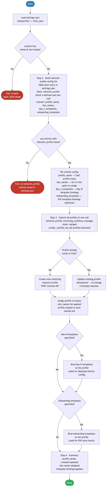

> **Deprecated:** Playbooks moved to [`../ansible/playbooks/`](../ansible/playbooks/). See [`../ansible/README.md`](../ansible/README.md).

# 7.0 — Cisco Catalyst Center: Network Switching Profile Automation

> **Playbook:** `network_profile.yml`  
> **Module:** `cisco.dnac.network_profile_switching_workflow_manager`  
> **Minimum Catalyst Center version:** 2.3.7.9  
> **Minimum Ansible version:** 2.15  
> **Authors:** Igor Manassypov — Systems Engineer (imanassy@cisco.com)  
> **Copyright © 2024–2026 Cisco Systems, Inc. All rights reserved.**

---

## Table of Contents

1. [Overview](#overview)
   - [Logical Flow](#logical-flow)
2. [Prerequisites](#prerequisites)
3. [Directory Structure](#directory-structure)
4. [Installation](#installation)
5. [Configuration](#configuration)
   - [Inventory](#inventory)
   - [Vault (Credentials)](#vault-credentials)
6. [Input Data Structure — `settings.json`](#input-data-structure--settingsjson)
   - [Top-Level Schema](#top-level-schema)
   - [The `network_profile` Block](#the-network_profile-block)
   - [Full Example](#full-example)
7. [Playbook Walkthrough — Step by Step](#playbook-walkthrough--step-by-step)
   - [Step 1: Load and Validate Input Data](#step-1-load-and-validate-input-data)
   - [Step 2: Build the Profile Config List](#step-2-build-the-profile-config-list)
   - [Step 3: Submit Profiles to Catalyst Center](#step-3-submit-profiles-to-catalyst-center)
   - [Step 4: Summary Output](#step-4-summary-output)
8. [Data Transformation Reference](#data-transformation-reference)
9. [Running the Playbook](#running-the-playbook)
10. [Debug Mode](#debug-mode)
11. [Expected Output](#expected-output)
12. [Troubleshooting](#troubleshooting)

---

## Overview

This playbook automates the creation, update, and site assignment of **Switching Network Profiles** in Cisco Catalyst Center (formerly DNA Center). A Switching Network Profile groups one or more sites together and binds them to Day-N configuration templates (and optionally onboarding/PnP templates), allowing Catalyst Center to push consistent configuration to all switches assigned to a site.

The playbook is data-driven: it reads a `settings.json` file (shared with other playbooks in this suite), extracts every entry that contains a `network_profile` block, constructs the required module payload, and calls `cisco.dnac.network_profile_switching_workflow_manager` once with all profiles batched together.

### What it does

| Action | Mechanism |
|--------|-----------|
| Loads and validates input JSON | `lookup('file', path) | from_json` + Jinja2 filters |
| Filters entries with a `network_profile` block | Jinja2 `for` loop with conditional |
| Builds the module `config` payload | `set_fact` with `namespace` and `combine` |
| Creates or updates the profile in Catalyst Center | `state: merged` |
| Assigns the profile to one or more sites | `site_names` list in the payload |
| Attaches Day-N and/or onboarding templates | `day_n_templates` / `onboarding_templates` keys |

## API Endpoints and Modules Summary

### Modules Summary

| Collection | Module | Purpose in this playbook | Module Docs |
|---|---|---|---|
| cisco.dnac | network_profile_switching_workflow_manager | Create/update switching network profiles and assign them to sites | cisco.dnac 6.46.0: [network_profile_switching_workflow_manager](https://galaxy.ansible.com/ui/repo/published/cisco/dnac/content/module/network_profile_switching_workflow_manager/) |

### Endpoint Summary by Phase

| Phase | HTTP | Endpoint | Why it is used | API Docs |
|---|---|---|---|---|
| Network profile workflow | module-managed | Network profile endpoints used internally by network_profile_switching_workflow_manager | Apply merged profile config and site bindings | CatC 2.3.7.9: [API Reference](https://developer.cisco.com/docs/catalyst-center/2-3-7-9/cisco-catalyst-center-2-3-7-9-api-overview) |

### Notes

- All CatC API interactions are performed by the workflow manager module (no direct uri tasks).
- Payload batching is built in playbook logic, then submitted as one merged config list.


### Logical Flow

The diagram below shows every decision point and state transition from startup to completion:



> Source: [`DIAGRAMS/logical-flow.mmd`](DIAGRAMS/logical-flow.mmd) — re-render with `mmdc -i DIAGRAMS/logical-flow.mmd -o DIAGRAMS/logical-flow.png --scale 3`

---

## Prerequisites

| Requirement | Version / Notes |
|-------------|----------------|
| Ansible | >= 2.15 |
| Python | >= 3.9 |
| `dnacentersdk` | >= 2.11.0 (Python package) |
| `cisco.dnac` collection | 6.46.0 (pinned in `requirements.yml`) |
| Cisco Catalyst Center | >= 2.3.7.9 (for `network_profile_switching_workflow_manager`) |
| Ansible Vault passphrase | Required to decrypt `vault.yml` |

> **Note:** The `network_profile_switching_workflow_manager` module was introduced in the `cisco.dnac` collection aligned with Catalyst Center 2.3.7.9. Earlier appliance versions do not expose the required API endpoints.

---

## Directory Structure

```
8.0-Cisco-Catalyst-Center-Network-Profile/
├── ansible.cfg                 # Ansible defaults (inventory path, host key checking)
├── inventory.yml               # Catalyst Center host + connection variables
├── network_profile.yml         # Main playbook (this file)
├── vault.yml                   # Ansible Vault encrypted credentials (git-ignored)
├── vault.yml.example           # Plain-text template for vault.yml
├── .vault_pass                 # Vault password file (git-ignored, chmod 600)
├── requirements.txt            # Python pip dependencies
├── requirements.yml            # Ansible Galaxy collection dependencies
├── DIAGRAMS/
│   ├── logical-flow.mmd        # Mermaid source — re-render with mmdc
│   └── logical-flow.png        # Rendered flowchart (referenced by README)
└── README.md                   # This document
```

The playbook references a shared `settings.json` file located in the project tree:

```
Projects/
└── BGP_EVPN/
    └── Settings/
        └── settings.json       # Default input data file
```

The path is configurable at runtime (see [Running the Playbook](#running-the-playbook)).

---

## Installation

### 1. Install Python dependencies

```bash
pip install -r requirements.txt
```

This installs:
- `dnacentersdk >= 2.11.0` — the underlying SDK used by the `cisco.dnac` collection
- `ansible >= 2.15`

### 2. Install Ansible collections

```bash
ansible-galaxy collection install -r requirements.yml
```

This installs:
- `cisco.dnac 6.46.0` — the Cisco-maintained Ansible collection for Catalyst Center

### 3. Set up the vault password file

```bash
echo 'your_vault_password' > .vault_pass
chmod 600 .vault_pass
```

The `ansible.cfg` file does **not** pre-configure the vault password file path; pass it explicitly at runtime (see below).

---

## Configuration

### Inventory

**File:** `inventory.yml`

```yaml
all:
  hosts:
    catalyst_center:
      ansible_host: localhost
      ansible_connection: local
      ansible_python_interpreter: "{{ ansible_playbook_python }}"

      # Catalyst Center connection
      dnac_host: 198.18.129.100
      dnac_port: 443
      dnac_version: 2.3.7.9
      dnac_verify: false       # Set true in production with valid TLS cert
      dnac_debug: false
      dnac_log: true
      dnac_log_level: INFO

      # Path to the settings.json input file
      settings_json_path: "../Settings/settings.json"
```

Key variables:

| Variable | Purpose | Example |
|----------|---------|---------|
| `dnac_host` | IP or FQDN of the Catalyst Center appliance | `198.18.129.100` |
| `dnac_port` | HTTPS port | `443` |
| `dnac_version` | SDK API version — must not exceed the lowest version the appliance supports | `2.3.7.9` |
| `dnac_verify` | TLS certificate verification (`true` in production) | `false` |
| `dnac_log` | Enable SDK-level logging to `dnac.log` | `true` |
| `dnac_log_level` | Log verbosity (`DEBUG`, `INFO`, `WARNING`, `ERROR`) | `INFO` |
| `settings_json_path` | Relative or absolute path to the input JSON file | see above |

> **Tip:** `settings_json_path` can be a relative path. The playbook resolves it to absolute using `playbook_dir` so it works regardless of where `ansible-playbook` is invoked from.

### Vault (Credentials)

**Template:** `vault.yml.example`

```yaml
dnac_username: "admin"
dnac_password: "your_catc_password_here"
```

**Setup:**

```bash
cp vault.yml.example vault.yml
ansible-vault encrypt vault.yml --vault-password-file .vault_pass
```

The playbook loads `vault.yml` via `vars_files` and passes both variables to the module through the `module_defaults` block, so they do not need to be repeated per task.

---

## Input Data Structure — `settings.json`

### Top-Level Schema

The `settings.json` file is a shared configuration data store used across the entire automation suite. Its root key is `project`, which is a list of site-scoped configuration objects:

```json
{
  "project": [
    { /* site entry 1 */ },
    { /* site entry 2 */ },
    ...
  ]
}
```

Each entry in `project` represents one logical site scope and may contain multiple optional configuration blocks (`network_settings`, `device_credentials`, `assign_credentials`, `network_profile`, etc.). **This playbook only processes the `network_profile` block**; all other keys are safely ignored.

### The `network_profile` Block

```json
"network_profile": {
  "profile_name":         "<string>",    // REQUIRED — unique name in CatC
  "site_names":           ["<string>"],  // REQUIRED — one or more full site paths
  "day_n_templates":      ["<string>"],  // OPTIONAL — Day-N template names in CatC
  "onboarding_templates": ["<string>"]   // OPTIONAL — PnP/onboarding template names (or null)
}
```

| Field | Type | Required | Description |
|-------|------|----------|-------------|
| `profile_name` | string | **Yes** | The display name of the switching network profile as it will appear in Catalyst Center. Must be unique. |
| `site_names` | list of strings | **Yes** | Full hierarchical site paths to assign the profile to. Format: `Global/<area>/<building>/<floor>`. |
| `day_n_templates` | list of strings or `null` | No | Names of Day-N Jinja2 templates already imported into Catalyst Center. These are applied to switches after onboarding. |
| `onboarding_templates` | list of strings or `null` | No | Names of PnP onboarding templates. Set to `null` or omit if not using plug-and-play provisioning. |

> **Important:** Template names in `day_n_templates` and `onboarding_templates` must exactly match the template names as they exist in **Catalyst Center → Tools → Template Editor**. The module performs a name lookup; a mismatch will cause a task failure.

### Full Example

```json
{
  "project": [
    {
      "HierarchyArea":   "POD 0",
      "HierarchyBldg":   "Building P0",
      "HierarchyFloor":  null,
      "HierarchyParent": "Global/PODS",

      "network_settings": { "..." : "..." },
      "device_credentials": { "..." : "..." },
      "assign_credentials": { "..." : "..." },

      "network_profile": {
        "profile_name": "BGP-EVPN-Switching",
        "site_names": [
          "Global/PODS/POD 0/Building P0/Floor 1"
        ],
        "day_n_templates": [
          "BGP-EVPN-BUILD.j2"
        ],
        "onboarding_templates": null
      }
    }
  ]
}
```

#### Multi-Site, Multi-Template Example

To create a second profile that spans multiple sites and uses both template types:

```json
{
  "project": [
    {
      "network_profile": {
        "profile_name": "BGP-EVPN-Switching",
        "site_names": [
          "Global/PODS/POD 0/Building P0/Floor 1"
        ],
        "day_n_templates": ["BGP-EVPN-BUILD.j2"],
        "onboarding_templates": null
      }
    },
    {
      "network_profile": {
        "profile_name": "TRADITIONAL-Switching",
        "site_names": [
          "Global/PODS/POD 1/Building P1/Floor 1",
          "Global/PODS/POD 1/Building P1/Floor 2"
        ],
        "day_n_templates": [
          "TRADITIONAL-BUILD.j2"
        ],
        "onboarding_templates": [
          "TRADITIONAL-PNP.j2"
        ]
      }
    },
    {
      "HierarchyArea": "POD 2",
      "network_settings": { "..." : "..." }
      /* No network_profile key — this entry is skipped by the playbook */
    }
  ]
}
```

> **Note:** Entries that have no `network_profile` key, or where `network_profile` is `null`/`false`, are silently skipped. Only entries with a truthy `network_profile` block contribute to the profile list.

---

## Playbook Walkthrough — Step by Step

### Step 1: Load and Validate Input Data

**Purpose:** Read `settings.json` from disk, parse it into an Ansible variable, and assert it is well-formed.

#### Task 1.1 — Resolve the input file path

```yaml
- name: Resolve settings_json_path to absolute
  set_fact:
    _resolved_json_path: >-
      {{ settings_json_path if settings_json_path.startswith('/')
         else (playbook_dir + '/' + settings_json_path) }}
```

`playbook_dir` is an Ansible magic variable that holds the directory containing the playbook file. For a relative path like `../Settings/settings.json`, the resolved value would be:

```
/path/to/repo/CICD Pipeline/8.0-Cisco-Catalyst-Center-Network-Profile/
../Settings/settings.json
→ /path/to/repo/CICD Pipeline/Settings/settings.json
```

You can override `settings_json_path` entirely at runtime:

```bash
ansible-playbook network_profile.yml \
  -e settings_json_path=/absolute/path/to/my_settings.json
```

#### Task 1.2 — Load and parse

```yaml
- name: Load settings input JSON
  set_fact:
    settings_data: "{{ lookup('file', _resolved_json_path) | from_json }}"
```

The `lookup('file', ...)` plugin reads the file from the controller filesystem and returns its raw text content. The `from_json` filter parses that text into a native Ansible dictionary. After this task, `settings_data` is a Python dictionary equivalent to the full parsed JSON file.

#### Task 1.3 — Assert validity

```yaml
- name: Validate that project key exists in input data
  assert:
    that: settings_data.project is defined and settings_data.project | length > 0
    fail_msg: "Input JSON must contain a non-empty 'project' list."
    success_msg: "Input data loaded — {{ settings_data.project | length }} entries found."
```

This guard prevents confusing downstream failures. If `project` is missing or empty, the play fails immediately with a clear error message.

---

### Step 2: Build the Profile Config List

**Purpose:** Iterate over every entry in `settings_data.project`, extract entries that have a valid `network_profile` block, and build the `config` list structure required by the module.

```yaml
- name: Build network profile config list
  set_fact:
    profile_list: >-
      
      
        
          
          
          
            
          
          
            
          
          
        
      
      {{ ns.result }}
```

#### Why `namespace`?

Jinja2 scoping rules prevent modifying a variable defined outside a `for` loop from inside it. The `namespace()` object is the idiomatic workaround — it creates a mutable container whose attributes are writable from inner scopes.

```jinja2

...
   {# ✓ works — ns is mutable #}
```

Without `namespace`, `ns.result = ns.result + [cfg]` would silently fail to accumulate entries.

#### Why `combine` instead of direct assignment?

Jinja2 dictionaries are immutable once created. The `combine` filter merges two dictionaries into a new one:

```jinja2


```

This is equivalent to:

```python
cfg = {**cfg, 'day_n_templates': ['BGP-EVPN-BUILD.j2']}
```

Optional keys (`day_n_templates`, `onboarding_templates`) are only added to the dictionary if they are **truthy** (non-null, non-empty). This prevents sending `null` values to the module, which could cause API errors.

#### Transformation Example

**Input** (one entry from `settings_data.project`):

```json
{
  "HierarchyArea": "POD 0",
  "network_profile": {
    "profile_name": "BGP-EVPN-Switching",
    "site_names": ["Global/PODS/POD 0/Building P0/Floor 1"],
    "day_n_templates": ["BGP-EVPN-BUILD.j2"],
    "onboarding_templates": null
  }
}
```

**Processing trace:**

```
1. entry.network_profile is defined ✓ and truthy ✓ → enter block

2. cfg = {
     'profile_name': 'BGP-EVPN-Switching',
     'site_names':   ['Global/PODS/POD 0/Building P0/Floor 1']
   }

3. prof.day_n_templates = ['BGP-EVPN-BUILD.j2'] → truthy ✓
   cfg = cfg | combine({'day_n_templates': ['BGP-EVPN-BUILD.j2']})
   cfg = {
     'profile_name':    'BGP-EVPN-Switching',
     'site_names':      ['Global/PODS/POD 0/Building P0/Floor 1'],
     'day_n_templates': ['BGP-EVPN-BUILD.j2']
   }

4. prof.onboarding_templates = null → falsy ✗ → skip combine

5. ns.result = [] + [cfg]
   ns.result = [
     {
       'profile_name':    'BGP-EVPN-Switching',
       'site_names':      ['Global/PODS/POD 0/Building P0/Floor 1'],
       'day_n_templates': ['BGP-EVPN-BUILD.j2']
     }
   ]
```

**Output** (`profile_list`):

```yaml
- profile_name: BGP-EVPN-Switching
  site_names:
    - Global/PODS/POD 0/Building P0/Floor 1
  day_n_templates:
    - BGP-EVPN-BUILD.j2
```

**Multi-entry transformation example:**

Given two entries with `network_profile` blocks and one without:

```
Input settings_data.project (3 entries):
  [0] network_profile: { profile_name: "BGP-EVPN-Switching", ... }
  [1] network_profile: null                                           ← skipped
  [2] network_profile: { profile_name: "TRADITIONAL-Switching", ... }

Output profile_list (2 entries):
  [0] { profile_name: "BGP-EVPN-Switching",    site_names: [...], day_n_templates: [...] }
  [1] { profile_name: "TRADITIONAL-Switching", site_names: [...], day_n_templates: [...], onboarding_templates: [...] }
```

---

### Step 3: Submit Profiles to Catalyst Center

**Purpose:** Pass the fully assembled `profile_list` to the `cisco.dnac.network_profile_switching_workflow_manager` module, which idempotently creates or updates each profile and assigns it to the specified sites.

```yaml
- name: Create/update switching network profile
  cisco.dnac.network_profile_switching_workflow_manager:
    state: merged
    config: "{{ profile_list }}"
  register: profile_results
```

#### `state: merged` semantics

| Scenario | Behaviour |
|----------|-----------|
| Profile does not exist in CatC | Creates the profile |
| Profile exists with no changes | No-op (idempotent) |
| Profile exists but site list or templates differ | Updates the profile |
| Site is already assigned | No-op (idempotent) |
| Template exists in CatC | Binds it to the profile |
| Template name does not exist in CatC | **Task fails** — the module cannot create templates |

#### Connection parameters

All connection parameters (`dnac_host`, `dnac_username`, etc.) are injected via the `module_defaults` block at the play level:

```yaml
module_defaults:
  cisco.dnac.network_profile_switching_workflow_manager:
    dnac_host:      "{{ dnac_host }}"
    dnac_username:  "{{ dnac_username }}"   # from vault.yml
    dnac_password:  "{{ dnac_password }}"   # from vault.yml
    dnac_verify:    "{{ dnac_verify }}"
    dnac_port:      "{{ dnac_port }}"
    dnac_version:   "{{ dnac_version }}"
    dnac_debug:     "{{ dnac_debug }}"
    dnac_log_level: "{{ dnac_log_level }}"
    dnac_log:       "{{ dnac_log }}"
```

This means the module task itself only needs `state` and `config` — all authentication and connection details are inherited automatically. This avoids repetition and is the recommended pattern when calling multiple `cisco.dnac` modules in a play.

#### The final API payload

The module translates `profile_list` into Catalyst Center REST API calls. Internally, the equivalent payload submitted to the CatC API looks like:

```json
{
  "name": "BGP-EVPN-Switching",
  "namespace": "switching",
  "siteIds": ["<uuid-of-Global/PODS/POD 0/Building P0/Floor 1>"],
  "templates": [
    {
      "name": "BGP-EVPN-BUILD.j2",
      "type": "DayN"
    }
  ]
}
```

The module handles the site-name-to-UUID and template-name-to-UUID resolution transparently.

---

### Step 4: Summary Output

```yaml
- name: Network profile creation complete
  debug:
    msg:
      - "Switching network profile(s) created/updated successfully"
      - "Profiles processed: {{ profile_list | map(attribute='profile_name') | join(', ') }}"
      - "Sites assigned: {{ profile_list | map(attribute='site_names') | flatten | unique | join(', ') }}"
```

The `map(attribute=...)` filter extracts a single attribute from every item in the list. `flatten` collapses the nested `site_names` lists (each item is itself a list) into a single flat list, and `unique` removes duplicates when a site appears in multiple profiles.

**Example output:**

```
ok: [catalyst_center] => {
    "msg": [
        "Switching network profile(s) created/updated successfully",
        "Profiles processed: BGP-EVPN-Switching",
        "Sites assigned: Global/PODS/POD 0/Building P0/Floor 1"
    ]
}
```

---

## Data Transformation Reference

The following diagram summarises the complete data flow from `settings.json` to the Catalyst Center API:

```
settings.json
└── project[]
    └── [n].network_profile            ← only entries where this is truthy
        ├── profile_name               ─┐
        ├── site_names[]               ─┤── always included
        ├── day_n_templates[]          ─┤── included only if truthy
        └── onboarding_templates[]     ─┘── included only if truthy
                 │
                 ▼ Jinja2 set_fact (Step 2)
         profile_list[]
         ├── [0] { profile_name, site_names, day_n_templates }
         ├── [1] { profile_name, site_names, day_n_templates, onboarding_templates }
         └── ...
                 │
                 ▼ cisco.dnac module (Step 3)
         Catalyst Center REST API
         ├── POST /dna/intent/api/v1/networkprofile  (create)
         ├── PUT  /dna/intent/api/v1/networkprofile  (update)
         └── POST /dna/intent/api/v1/networkprofile/{id}/site  (assign)
```

**Before — `project[0].network_profile` (in `settings.json`):**

```json
{
  "profile_name":         "BGP-EVPN-Switching",
  "site_names":           ["Global/PODS/POD 0/Building P0/Floor 1"],
  "day_n_templates":      ["BGP-EVPN-BUILD.j2"],
  "onboarding_templates": null
}
```

> `onboarding_templates: null` is falsy and excluded by the Jinja2 `if truthy | combine(...)` guard. Only `day_n_templates` and `onboarding_templates` undergo this check — `profile_name` and `site_names` are always present in the output dict.

**After — `profile_list[0]`** (submitted to `network_profile_switching_workflow_manager`):

```json
{
  "profile_name":    "BGP-EVPN-Switching",
  "site_names":      ["Global/PODS/POD 0/Building P0/Floor 1"],
  "day_n_templates": ["BGP-EVPN-BUILD.j2"]
}
```

The module resolves both template names and site path strings to UUIDs internally. Profile creation, update, and site assignment are handled idempotently in a single `state: merged` call — no manual UUID lookup is required.

---

## Running the Playbook

### Basic execution (uses `settings_json_path` from `inventory.yml`)

```bash
ansible-playbook network_profile.yml \
  --vault-password-file .vault_pass
```

### Override the input file at runtime

```bash
ansible-playbook network_profile.yml \
  --vault-password-file .vault_pass \
  -e settings_json_path=/absolute/path/to/custom_settings.json
```

### Run against a different Catalyst Center host

```bash
ansible-playbook network_profile.yml \
  --vault-password-file .vault_pass \
  -e dnac_host=10.0.0.50
```

### Dry-run (check mode)

The `cisco.dnac` collection modules do not natively support `--check` mode; running with `--check` will skip the module task. Use [Debug Mode](#debug-mode) instead to inspect the payload before submitting.

---

## Debug Mode

Set the `DEBUG` environment variable to `true` to enable two additional debug tasks that print intermediate variables.

```bash
DEBUG=true ansible-playbook network_profile.yml \
  --vault-password-file .vault_pass
```

This will print:

**After Step 2** — the fully built `profile_list`:

```
TASK [--DEBUG-- Network profile config list] *****
ok: [catalyst_center] => {
    "msg": [
        {
            "profile_name": "BGP-EVPN-Switching",
            "site_names": ["Global/PODS/POD 0/Building P0/Floor 1"],
            "day_n_templates": ["BGP-EVPN-BUILD.j2"]
        }
    ]
}
```

**After Step 3** — the raw module return value including changed status and any API response details:

```
TASK [--DEBUG-- Profile results] *****
ok: [catalyst_center] => {
    "msg": {
        "changed": true,
        "response": [...]
    }
}
```

Use these outputs to verify the payload structure before running in a production environment.

---

## Expected Output

A successful run with one profile produces output similar to the following:

```
PLAY [Create and Assign Network Switching Profiles from settings.json] *********

TASK [Resolve settings_json_path to absolute] **********************************
ok: [catalyst_center]

TASK [Load settings input JSON] ************************************************
ok: [catalyst_center]

TASK [Parse settings input JSON] ***********************************************
ok: [catalyst_center]

TASK [Validate that project key exists in input data] **************************
ok: [catalyst_center] => {
    "changed": false,
    "msg": "Input data loaded — 1 entries found."
}

TASK [Build network profile config list] ***************************************
ok: [catalyst_center]

TASK [Validate profile list is non-empty] **************************************
ok: [catalyst_center] => {
    "changed": false,
    "msg": "1 network profile(s) to create/update."
}

TASK [Create/update switching network profile] *********************************
changed: [catalyst_center]

TASK [Network profile creation complete] ***************************************
ok: [catalyst_center] => {
    "msg": [
        "Switching network profile(s) created/updated successfully",
        "Profiles processed: BGP-EVPN-Switching",
        "Sites assigned: Global/PODS/POD 0/Building P0/Floor 1"
    ]
}

PLAY RECAP *********************************************************************
catalyst_center  : ok=7   changed=1   unreachable=0   failed=0   skipped=1
```

> `skipped=1` is expected — the `--DEBUG--` tasks are skipped when `DEBUG=false`.  
> `changed=1` on the module task indicates a new profile was created or an existing one was updated.  
> On subsequent idempotent runs the module task will show `changed=0`.

---

## Troubleshooting

### `assert` fails: "Input JSON must contain a non-empty 'project' list"

- Verify the path in `settings_json_path` (in `inventory.yml` or passed via `-e`) points to the correct file.
- Confirm the file is valid JSON: `python3 -m json.tool settings.json`
- Ensure the root key is `project` (not `projects` or any other name).

### `assert` fails: "No entries with network_profile found in input JSON"

- At least one entry in `project` must have a `network_profile` block that is non-null and non-empty.
- Check that `network_profile` is not set to `null`, `false`, or `{}`.

### Module task fails: "Template not found" or similar

- The template name in `day_n_templates` or `onboarding_templates` must exactly match the name in Catalyst Center **Tools → Template Editor**. Names are case-sensitive.
- Confirm the template has been committed/published in CatC before running this playbook.

### `dnac_version` mismatch warnings

- The `dnac_version` in `inventory.yml` should be set to the **highest API version the SDK knows that does not exceed the appliance's version**.
- If the appliance runs CatC 2.3.7.10, set `dnac_version: 2.3.7.9` (the highest version the SDK supports as of this writing).
- Setting `dnac_version` higher than the appliance version may result in API call failures.

### SSL/TLS errors

- In lab environments, set `dnac_verify: false` to skip certificate verification.
- In production, set `dnac_verify: true` and ensure the appliance certificate is trusted by the Ansible control node's CA bundle.

### Authentication failures

- Confirm `vault.yml` was encrypted with the same password stored in `.vault_pass`.
- Re-encrypt if needed: `ansible-vault rekey vault.yml --vault-password-file .vault_pass`
- Verify the credentials with a direct API call: `curl -k -u admin:password https://<dnac_host>/dna/system/api/v1/auth/token -X POST`

### Viewing the SDK log

When `dnac_log: true`, the SDK writes detailed request/response logs to `dnac.log` in the playbook directory. This is the first place to look for HTTP-level errors:

```bash
tail -f dnac.log
```
