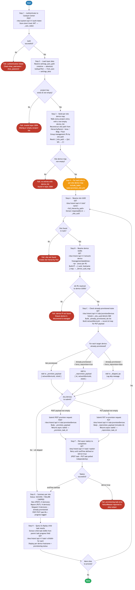

# 8.0 — Cisco Catalyst Center: Device Provisioning

> **Playbook:** `provision_devices.yml`  
> **Included tasks:** `tasks/provision_site.yml`  
> **Modules:** `ansible.builtin.uri` (all REST calls: auth, site lookup, device lookup, provision, task polling)  
> **API Endpoints:**  
> &nbsp;&nbsp;`POST /dna/system/api/v1/auth/token` — obtain short-lived JWT  
> &nbsp;&nbsp;`GET  /dna/intent/api/v1/site?name={hierarchy_path}` — resolve site UUID from full hierarchy path  
> &nbsp;&nbsp;`GET  /dna/intent/api/v1/network-device?managementIpAddress={ip}` — resolve device UUID and hostname  
> &nbsp;&nbsp;`GET  /dna/intent/api/v1/sda/provisionDevices?siteId={uuid}&limit=500` — check already-provisioned devices (idempotency)  
> &nbsp;&nbsp;`POST /dna/intent/api/v1/sda/provisionDevices` — provision batch of devices to site  
> &nbsp;&nbsp;`GET  /dna/intent/api/v1/task/{taskId}` — poll async provision task until `endTime` set or `isError=true`  
> **Minimum Catalyst Center version:** 2.3.7.6  
> **Minimum Ansible version:** 2.15  
> **Authors:** Igor Manassypov — Systems Engineer (imanassy@cisco.com)  
> **Copyright © 2024–2026 Cisco Systems, Inc. All rights reserved.**

---

## Table of Contents

1. [Overview](#overview)
   - [What it does](#what-it-does)
   - [Why this step matters](#why-this-step-matters)
   - [Idempotency](#idempotency)
   - [Logical Flow](#logical-flow)
2. [Prerequisites](#prerequisites)
3. [Directory Structure](#directory-structure)
4. [Installation](#installation)
5. [Configuration](#configuration)
   - [Inventory](#inventory)
   - [Vault (Credentials)](#vault-credentials)
6. [Input Data Structure — `settings.json`](#input-data-structure--settingsjson)
7. [How It Works](#how-it-works)
   - [Main Playbook Walkthrough](#main-playbook-walkthrough)
     - [Step 1: Load and Validate Input Data](#step-1-load-and-validate-input-data)
     - [Step 2: Build Per-Site Device Map](#step-2-build-per-site-device-map)
     - [Step 3: Authenticate to Catalyst Center](#step-3-authenticate-to-catalyst-center)
     - [Step 4: Process Each Site](#step-4-process-each-site)
   - [Per-Site Task Walkthrough — `tasks/provision_site.yml`](#per-site-task-walkthrough--tasksprovision_siteyml)
     - [Step A: Resolve Site UUID](#step-a-resolve-site-uuid)
     - [Step B: Resolve Device UUIDs](#step-b-resolve-device-uuids)
     - [Step C: Check Already-Provisioned State](#step-c-check-already-provisioned-state)
     - [Step D: Build Provision Payload](#step-d-build-provision-payload)
     - [Step E: Submit Provision Request](#step-e-submit-provision-request)
     - [Step F: Poll Async Task](#step-f-poll-async-task)
     - [Step G: Summary and Error Propagation](#step-g-summary-and-error-propagation)
8. [API Payload Reference](#api-payload-reference)
9. [Why Direct REST API Calls?](#why-direct-rest-api-calls)
10. [Running the Playbook](#running-the-playbook)
11. [Debug Mode](#debug-mode)
12. [Expected Output](#expected-output)
13. [Playbook Ordering Dependency](#playbook-ordering-dependency)
14. [Troubleshooting](#troubleshooting)

---

## Overview

This playbook **provisions managed network devices to their assigned sites** in Cisco Catalyst Center using the SDA `provisionDevices` REST API. Provisioning is the required step that pushes site-level network settings (AAA, syslog, NTP, SNMP, netflow) and licensing configuration to devices — without it, Day-N templates cannot be applied.

The playbook is data-driven: it reads the central `settings.json` file used across the entire automation suite, extracts every project entry that has a non-empty `device_list`, reconstructs the target site hierarchy path from the split `HierarchyParent/Area/Bldg/Floor` fields, and submits a batched provisioning request per site.

### What it does

| Action | Mechanism |
|--------|-----------|
| Loads and validates input JSON | `lookup('file', path) \| from_json` + `assert` |
| Groups devices by their target site path | `set_fact` with Jinja2 dict-building loop |
| Authenticates once for all REST calls | `ansible.builtin.uri` — `POST /v1/auth/token` |
| Resolves site UUID from hierarchy path | `GET /v1/site?name=<encoded_path>` |
| Resolves device UUID from management IP | `GET /v1/network-device?managementIpAddress=<ip>` |
| Checks already-provisioned state per site | `GET /v1/sda/provisionDevices?siteId=<uuid>&limit=500` |
| Skips already-provisioned devices (idempotent) | Jinja2 set-difference in `_provision_payload` build |
| Submits batch provision request per site | `ansible.builtin.uri` — `POST /v1/sda/provisionDevices` |
| Polls async task to completion | `ansible.builtin.uri` with `until` + `retries` |
| Reports per-site provisioning result | `debug` with structured summary block |

### Why this step matters

Device provisioning in Catalyst Center is more than just "putting a device on a site". When you provision a device, CatC:

1. **Pushes site-level network settings** — DNS, NTP, SNMP, syslog, netflow, AAA servers — configured in Step 2 (Settings) are applied to the device at this point.
2. **Establishes the SDA provisioning record** — creates a CatC-internal record that links the `networkDeviceId` to a `siteId`. This record is required by the Day-N composite template deployment pipeline (Step 9.0) to validate device ownership.
3. **Enables template association** — the Network Profile (Step 7.0) attached Day-N templates to the site; provisioning is what causes CatC to associate those templates with the physical devices.

> [!IMPORTANT]
> **Provisioning via the SDA API does NOT apply CLI templates to devices.**
> This step pushes site-level network settings (NTP, DNS, SNMP, AAA, etc.) and creates the internal CatC provisioning record — but it does **not** render or push any Jinja2/CLI templates. CLI template configuration is applied in the next step: **9.0 — Composite Template Deployment**. If you skip Step 9.0, devices will have site settings but will be missing their full Day-N configuration (VRFs, loopbacks, overlay, NVE, multicast, etc.).

> **Ordering is critical.** This playbook must run **after** Step 7.0 (Network Profile) and **before** Step 9.0 (Composite Template Deployment). See [Playbook Ordering Dependency](#playbook-ordering-dependency).

### Idempotency

The playbook is safe to run more than once. Before submitting a provision request, it queries CatC for all devices already provisioned at each target site. Devices found in that list are silently skipped and reported in the summary. Set `force_reprovision: true` in `inventory.yml` (or pass `-e force_reprovision=true` at runtime) to re-trigger provisioning for devices that are already provisioned.

---

## API Endpoints and Modules Summary

### Modules Summary

| Collection | Module | Purpose in this playbook | Module Docs |
|---|---|---|---|
| ansible.builtin | uri | Handles all CatC REST interactions: auth, lookups, provisioning, and async task polling | ansible-core: [uri](https://docs.ansible.com/ansible/latest/collections/ansible/builtin/uri_module.html) |

### Endpoint Summary by Phase

| Phase | HTTP | Endpoint | Why it is used | API Docs |
|---|---|---|---|---|
| Auth | POST | /dna/system/api/v1/auth/token | Obtain JWT used by all subsequent REST calls | CatC 2.3.7.9: [Authentication](https://developer.cisco.com/docs/catalyst-center/2-3-7-9/authentication) |
| Site UUID lookup | GET | /dna/intent/api/v1/site?name={hierarchy_path} | Resolve site UUID for provisioning target | CatC 2.3.7.9: [API Reference](https://developer.cisco.com/docs/catalyst-center/2-3-7-9/cisco-catalyst-center-2-3-7-9-api-overview) |
| Device UUID lookup | GET | /dna/intent/api/v1/network-device?managementIpAddress={ip} | Resolve each target device ID and hostname | CatC 2.3.7.9: [API Reference](https://developer.cisco.com/docs/catalyst-center/2-3-7-9/cisco-catalyst-center-2-3-7-9-api-overview) |
| Existing provisioned state | GET | /dna/intent/api/v1/sda/provisionDevices?siteId={uuid}&limit=500 | Enforce idempotency by skipping already provisioned devices | CatC 2.3.7.9: [API Reference](https://developer.cisco.com/docs/catalyst-center/2-3-7-9/cisco-catalyst-center-2-3-7-9-api-overview) |
| Provision submit | POST | /dna/intent/api/v1/sda/provisionDevices | Submit batch provision request for unresolved devices | CatC 2.3.7.9: [API Reference](https://developer.cisco.com/docs/catalyst-center/2-3-7-9/cisco-catalyst-center-2-3-7-9-api-overview) |
| Task polling | GET | /dna/intent/api/v1/task/{taskId} | Wait for async job completion and capture final status | CatC 2.3.7.9: [API Reference](https://developer.cisco.com/docs/catalyst-center/2-3-7-9/cisco-catalyst-center-2-3-7-9-api-overview) |

### Notes

- This workflow intentionally uses direct REST for full control of payload and idempotency checks.
- Async task polling is mandatory because provision API responses are not final operation status.

### Logical Flow

The diagram below shows every decision point and state transition from startup to completion:



> Source: [`DIAGRAMS/logical-flow.mmd`](DIAGRAMS/logical-flow.mmd) — re-render with `mmdc -i DIAGRAMS/logical-flow.mmd -o DIAGRAMS/logical-flow.png --scale 3`

---

## Prerequisites

| Requirement | Version / Detail |
|-------------|-----------------|
| Ansible | ≥ 2.15 |
| Python | ≥ 3.9 |
| `cisco.dnac` collection | 6.46.0 (see `requirements.yml`) |
| Catalyst Center | ≥ 2.3.7.6 |
| Site Hierarchy | Must exist (Step 1.0) |
| Devices | Must be discovered and managed (Step 4.0) |
| Credentials | Must be assigned to the site (Step 3.0) |
| Network settings | Must be configured for the site (Step 2.0) |
| Network Profile | Must be created and assigned (Step 7.0) |
| `settings.json` | Must have non-empty `device_list` per project entry |
| Vault password file | `.vault_pass` in this directory |

---

## Directory Structure

```
8.0-Cisco-Catalyst-Center-Provision-Devices/
├── provision_devices.yml   # Main playbook — loads data, authenticates, loops per site
├── tasks/
│   └── provision_site.yml  # Per-site task — resolves UUIDs, checks state, provisions
├── inventory.yml           # Connection params, input paths, behavioural flags
├── vault.yml               # Encrypted CatC credentials (gitignored)
├── vault.yml.example       # Template for vault.yml
├── ansible.cfg             # Ansible defaults (inventory, result format)
├── requirements.yml        # cisco.dnac collection pin
├── DIAGRAMS/
│   ├── logical-flow.mmd    # Mermaid source — re-render with mmdc
│   └── logical-flow.png    # Rendered flowchart (referenced by README)
└── README.md               # This document
```

---

## Installation

```bash
# 1. Clone the repository (if not already done)
git clone <repo-url>
cd "Support/Resources/Ansible/8.0-Cisco-Catalyst-Center-Provision-Devices"

# 2. Install the required Ansible collection
ansible-galaxy collection install -r requirements.yml

# 3. Create and encrypt the vault
cp vault.yml.example vault.yml
# Edit vault.yml with actual CatC credentials
ansible-vault encrypt vault.yml --vault-password-file .vault_pass
```

---

## Configuration

### Inventory

All runtime parameters are controlled from `inventory.yml`.  No other files need to be edited for standard operation.

| Variable | Default | Description |
|----------|---------|-------------|
| `dnac_host` | `198.18.129.100` | Catalyst Center management IP or hostname |
| `dnac_port` | `443` | HTTPS port |
| `dnac_version` | `2.3.7.9` | CatC API version reported by the SDK |
| `dnac_verify` | `false` | Set `true` to enforce TLS certificate validation |
| `dnac_debug` | `false` | Enable SDK debug logging |
| `dnac_log` | `true` | Enable collection-level logging |
| `dnac_log_level` | `INFO` | Log verbosity (`DEBUG`, `INFO`, `WARNING`, `ERROR`) |
| `settings_json_path` | `../Settings/settings.json` | Path to the input JSON file. Relative paths are resolved from the playbook directory |
| `force_reprovision` | `false` | Re-provision devices already provisioned at the target site |
| `task_poll_retries` | `36` | Maximum poll attempts before giving up on an async task |
| `task_poll_delay` | `5` | Seconds between poll attempts (36 × 5 s = 3 minutes maximum) |

### Vault (Credentials)

```yaml
# vault.yml (encrypted)
dnac_username: "admin"
dnac_password: "your_catc_password_here"
```

Create the vault password file before running:

```bash
echo "your_vault_password" > .vault_pass
chmod 600 .vault_pass
```

---

## Input Data Structure — `settings.json`

The playbook reads from the shared `settings.json` file.  Each entry in the `project` array that has a non-empty `device_list` contributes to the provisioning run.

```json
{
  "project": [
    {
      "HierarchyParent": "Global/PODS",
      "HierarchyArea":   "POD 0",
      "HierarchyBldg":   "Building P0",
      "HierarchyFloor":  "Floor 1",
      "device_list": "198.19.1.1,198.19.1.2,198.19.1.3,198.19.1.4,198.19.1.5,198.19.1.6"
    }
  ]
}
```

### Relevant Fields

| Field | Required | Description |
|-------|----------|-------------|
| `HierarchyParent` | Yes | Root of the site path (e.g. `Global/PODS`) |
| `HierarchyArea` | Conditional | Area name; omit for flat hierarchies |
| `HierarchyBldg` | Conditional | Building name |
| `HierarchyFloor` | Conditional | Floor name (deepest level used if present) |
| `device_list` | Yes | Comma-separated list of management IP addresses to provision |

The playbook reconstructs the full site path from these four fields:

```
Global/PODS + POD 0 + Building P0 + Floor 1
→ "Global/PODS/POD 0/Building P0/Floor 1"
```

> **Tip:** Entries without a `device_list` key (or with an empty string) are silently skipped.

---

## How It Works

### Main Playbook Walkthrough

#### Step 1: Load and Validate Input Data

```yaml
- name: Resolve settings_json_path to absolute
- name: Load settings input JSON
- name: Validate that project key exists in input data
```

The playbook resolves the path to `settings.json` to an absolute path (supporting both absolute and repo-relative paths passed via `-e`). It then loads and validates the JSON, asserting that the `project` array is non-empty.

#### Step 2: Build Per-Site Device Map

```yaml
- name: Build per-site device map
```

Iterates all project entries and groups device IPs by their reconstructed site path into `_site_device_map`:

```python
{
  "Global/PODS/POD 0/Building P0/Floor 1": [
    "198.19.1.1", "198.19.1.2", "198.19.1.3",
    "198.19.1.4", "198.19.1.5", "198.19.1.6"
  ]
}
```

Multiple project entries that share the same site path are merged into a single site key.

#### Step 3: Authenticate to Catalyst Center

```yaml
- name: Authenticate to Catalyst Center
- name: Store auth token
```

A `POST /dna/system/api/v1/auth/token` call with HTTP Basic credentials returns a short-lived JWT.  The token is cached in `_catc_token` with `no_log: true` and reused for every subsequent REST call in the run.

#### Step 4: Process Each Site

```yaml
- name: Process device provisioning for each site
  include_tasks: tasks/provision_site.yml
  loop: "{{ _site_device_map | dict2items }}"
```

For each site in `_site_device_map`, `tasks/provision_site.yml` is called with `site_entry.key` (the site path) and `site_entry.value` (the device IP list).

---

### Per-Site Task Walkthrough — `tasks/provision_site.yml`

#### Step A: Resolve Site UUID

```
GET /dna/intent/api/v1/site?name=<url-encoded-site-path>
```

The `name` query parameter accepts the full slash-delimited hierarchy path (URL-encoded by the `| urlencode` Jinja2 filter). CatC returns an array of matching site objects; the first element's `id` field is the site UUID stored in `_site_uuid`.

**Example response excerpt:**
```json
{
  "response": [
    {
      "id": "9e7a5a8e-1c4b-4e7f-a3b2-1d2e3f4a5b6c",
      "name": "Floor 1",
      "siteHierarchy": "Global/PODS/POD 0/Building P0/Floor 1"
    }
  ]
}
```

#### Step B: Resolve Device UUIDs

```
GET /dna/intent/api/v1/network-device?managementIpAddress=<ip>
```

One API call per IP address in `site_entry.value`.  The results are assembled into `_device_uuid_map`:

```python
{
  "198.19.1.1": { "uuid": "abc123...", "hostname": "POD0-SPINE-1" },
  "198.19.1.2": { "uuid": "def456...", "hostname": "POD0-SPINE-2" },
  ...
}
```

An `assert` task validates that every IP resolved to a device UUID — a missing UUID means the device is not yet discovered, and the play fails with a descriptive error.

#### Step C: Check Already-Provisioned State

```
GET /dna/intent/api/v1/sda/provisionDevices?siteId=<uuid>&limit=500
```

Fetches all currently provisioned devices at this site in a single call (up to 500).  The response's `networkDeviceId` values are collected into `_already_provisioned_ids`. This drives the idempotency filter in Step D.

**Example response excerpt:**
```json
{
  "response": [
    { "networkDeviceId": "abc123...", "siteId": "9e7a5a8e-..." },
    { "networkDeviceId": "def456...", "siteId": "9e7a5a8e-..." }
  ]
}
```

#### Step D: Build Provision Payload

```yaml
- name: Build provision request payload
```

Two lists are built simultaneously:

- **`_provision_payload`** — devices that need provisioning (UUID not found in `_already_provisioned_ids`, or `force_reprovision=true`).
- **`_skipped_ips`** — devices that are already provisioned and will be skipped.

```python
# _provision_payload (send to API)
[
  { "networkDeviceId": "abc123...", "siteId": "9e7a5a8e-..." },
  { "networkDeviceId": "def456...", "siteId": "9e7a5a8e-..." }
]
```

If `_provision_payload` is empty (all devices already provisioned), Steps E–F are skipped and the summary reports `SKIPPED`.

#### Step E: Submit Provision Request

```
POST /dna/intent/api/v1/sda/provisionDevices
```

**Request body** — array of `{ networkDeviceId, siteId }` pairs for every device that needs provisioning:

```json
[
  { "networkDeviceId": "abc123-...", "siteId": "9e7a5a8e-..." },
  { "networkDeviceId": "def456-...", "siteId": "9e7a5a8e-..." },
  { "networkDeviceId": "ghi789-...", "siteId": "9e7a5a8e-..." }
]
```

**Response (HTTP 202 Accepted):**

```json
{
  "version": "1.0",
  "response": {
    "taskId": "0134bb41-7e01-4e26-b2f3-b5d8c9a7e101",
    "url": "/api/v1/task/0134bb41-7e01-4e26-b2f3-b5d8c9a7e101"
  }
}
```

The `taskId` drives the polling loop in Step F.

#### Step F: Poll Async Task

```
GET /dna/intent/api/v1/task/<taskId>
```

Uses Ansible's `until/retries/delay` loop to poll the task endpoint.  The loop exits when:

- `response.endTime` is defined (task completed — success or eventual failure), **or**
- `response.isError = true` (task errored immediately)

The maximum wait time is `task_poll_retries × task_poll_delay` seconds (default: 36 × 5 s = **3 minutes**).

#### Step G: Summary and Error Propagation

A structured summary block is printed for every site:

```
┌─────────────────────────────────────────────────────────────────┐
│ Site       : Global/PODS/POD 0/Building P0/Floor 1
│ Status     : SUCCESS
│ Submitted  : 4 device(s)
│ Skipped    : 2 device(s) — already provisioned
│ Task ID    : 0134bb41-7e01-4e26-b2f3-b5d8c9a7e101
│ Progress   : Completed provision of 4 devices
│ Error      : none
└─────────────────────────────────────────────────────────────────┘
```

If `isError=true` is returned by the task poll, the `fail` module is called with the `failureReason` and `progress` fields from the task response, halting the play.

---

## API Payload Reference

### POST /dna/intent/api/v1/sda/provisionDevices

**Request Headers:**

| Header | Value |
|--------|-------|
| `X-Auth-Token` | JWT from `/dna/system/api/v1/auth/token` |
| `Content-Type` | `application/json` |

**Request Body:**

```json
[
  {
    "networkDeviceId": "<device-uuid>",
    "siteId": "<site-uuid>"
  }
]
```

| Field | Type | Description |
|-------|------|-------------|
| `networkDeviceId` | string (UUID) | UUID of the network device from `/network-device` API |
| `siteId` | string (UUID) | UUID of the target site from `/site` API |

**Response (202 Accepted):**

```json
{
  "version": "1.0",
  "response": {
    "taskId": "<task-uuid>",
    "url": "/api/v1/task/<task-uuid>"
  }
}
```

**Task completion response (200 OK):**

```json
{
  "response": {
    "taskId": "<task-uuid>",
    "startTime": 1711612800000,
    "endTime": 1711612860000,
    "isError": false,
    "progress": "Completed provision of 4 devices",
    "failureReason": ""
  }
}
```

---

## Why Direct REST API Calls?

This playbook uses `ansible.builtin.uri` for all Catalyst Center interactions rather than `cisco.dnac` Ansible modules. The reasons:

1. **The `cisco.dnac.sda_provision_devices` module** maps to a different (older) SDA provisioning endpoint than `/dna/intent/api/v1/sda/provisionDevices`. Using the wrong endpoint can silently succeed while producing incorrect provisioning state.

2. **Idempotency check** — the custom `GET /sda/provisionDevices?siteId=…` call before the POST is not possible through the module interface without additional workarounds.

3. **Full payload control** — direct REST calls expose every field in the request and response, making the playbook easier to debug and extend.

4. **Consistency** — the same pattern is used in Step 9.0 (Composite Template Deployment) and throughout the lab series for all operations where the Ansible module does not fully expose the API.

---

## Running the Playbook

### Basic run (uses inventory defaults)

```bash
ansible-playbook provision_devices.yml --vault-password-file .vault_pass
```

### Override input file path

```bash
ansible-playbook provision_devices.yml \
  --vault-password-file .vault_pass \
  -e settings_json_path=/path/to/your/settings.json
```

### Force re-provision already-provisioned devices

```bash
ansible-playbook provision_devices.yml \
  --vault-password-file .vault_pass \
  -e force_reprovision=true
```

### Enable debug output

```bash
DEBUG=true ansible-playbook provision_devices.yml \
  --vault-password-file .vault_pass
```

### Syntax check (no vault needed)

```bash
ansible-playbook provision_devices.yml --syntax-check
```

### Dry-run with verbose output

```bash
ansible-playbook provision_devices.yml \
  --vault-password-file .vault_pass \
  -e '{"force_reprovision": false}' \
  -v
```

---

## Debug Mode

Set the environment variable `DEBUG=true` before the `ansible-playbook` command to enable verbose task output at every step.

```bash
DEBUG=true ansible-playbook provision_devices.yml --vault-password-file .vault_pass
```

| Debug variable | Contents |
|----------------|----------|
| `_site_device_map` | Dict of site_path → [device_ips] built from settings.json |
| `_site_uuid` | Resolved UUID for the current site |
| `_device_uuid_map` | Dict of ip → { uuid, hostname } for all devices in site |
| `_already_provisioned_ids` | List of device UUIDs already provisioned at this site |
| `_provision_payload` | Final list of `{ networkDeviceId, siteId }` objects sent to the API |
| `_provision_result` | Raw HTTP response from the `POST /sda/provisionDevices` call |
| `_provision_task_id` | Extracted async task UUID |
| `_task_poll_result` | Final task status response (progress, isError, endTime, failureReason) |

---

## Expected Output

A successful run against a single site with 6 devices (2 already provisioned) looks like this:

```
TASK [Input data loaded — 1 entries found.] ************************************
ok: [catalyst_center]

TASK [Validate site device map is non-empty] ***********************************
ok: [catalyst_center] => 1 site(s) / 6 device(s) to provision.

TASK [[Global/PODS/POD 0/Building P0/Floor 1] Report skipped (already provisioned) devices]
ok: [catalyst_center] =>
  msg: Skipping 2 already-provisioned device(s) (set force_reprovision=true to override): 198.19.1.5, 198.19.1.6

TASK [[Global/PODS/POD 0/Building P0/Floor 1] Poll async provision task]
FAILED - RETRYING: ... (34 retries left)
FAILED - RETRYING: ... (33 retries left)
ok: [catalyst_center]

TASK [[Global/PODS/POD 0/Building P0/Floor 1] Provisioning result summary]
ok: [catalyst_center] =>
  msg:
    - ┌─────────────────────────────────────────────────────────────────┐
    - │ Site       : Global/PODS/POD 0/Building P0/Floor 1
    - │ Status     : SUCCESS
    - │ Submitted  : 4 device(s)
    - │ Skipped    : 2 device(s) — already provisioned
    - │ Task ID    : 0134bb41-7e01-4e26-b2f3-b5d8c9a7e101
    - │ Progress   : Completed provision of 4 devices
    - │ Error      : none
    - └─────────────────────────────────────────────────────────────────┘

PLAY RECAP *********************************************************************
catalyst_center : ok=18   changed=0   unreachable=0   failed=0
```

---

## Playbook Ordering Dependency

This playbook sits at position **8.0** in the automation chain.  It must run **after** Step 7.0 (network profile creation and site assignment) and **before** Step 9.0 (composite Day-N template deployment).

```
  1.0 Site Hierarchy
       │
  2.0 Settings
       │
  3.0 Credentials
       │
  4.0 Device Discovery
       │
  5.0 Assign to Site
       │
  6.0 Templates (GitHub sync)
       │
  7.0 Network Profile
       │
  8.0 Provision Devices  ◄── YOU ARE HERE
       │
  9.0 Composite Deployment
       │
 10.0 Backup Configs
```

> **Why after Network Profile?**  
> The Network Profile (Step 7.0) associates Day-N templates with a site.  When CatC provisions a device in Step 8.0, it reads the network profile attached to the site and registers the device's template associations.  Running 8.0 before 7.0 means devices are provisioned without template bindings — you would need to re-provision them after creating the profile.

---

## Troubleshooting

| Symptom | Likely Cause | Resolution |
|---------|-------------|------------|
| `Site 'Global/…' was not found in Catalyst Center` | Site hierarchy path doesn't match exactly what's in CatC | Run Step 1.0 first; verify path with `GET /dna/intent/api/v1/site` |
| `Device with management IP '…' was not found` | Device is not yet discovered or managed | Run Step 4.0 (Device Discovery) first; verify in CatC inventory |
| `No taskId returned from provisionDevices POST` | API returned HTTP 4xx — bad payload or device state | Enable `DEBUG=true` and inspect `_provision_result` for the full response body |
| Task polls time out (`retries exceeded`) | CatC provisioning is taking longer than 3 minutes | Increase `task_poll_retries` in `inventory.yml` (e.g. `72` for 6 minutes) |
| `isError: true` with `failureReason: Device is in error state` | Device lost connectivity during provisioning | Verify device reachability; check CatC device health; re-run with `force_reprovision=true` |
| `isError: true` with `failureReason: Site not enabled for SDA` | Target site is not configured as a fabric site | Ensure the site was added to SDA fabric before running; Step 1.0 creates the hierarchy but SDA fabric enablement may be separate |
| All devices show as SKIPPED even after config changes | `force_reprovision=false` and devices are already in provisioned state | Pass `-e force_reprovision=true` to re-trigger provisioning |
| `ansible-vault: Decryption failed` | Wrong vault password | Verify `.vault_pass` contains the correct password |
| `HTTP 401 Unauthorized` from CatC auth token call | Wrong credentials in `vault.yml` | Re-encrypt `vault.yml` with correct `dnac_username` / `dnac_password` |
| `HTTP 403 Forbidden` on provisioning API | CatC user lacks Network-Admin or Super-Admin role | Grant correct CatC role to the API user |
