# Campus BGP EVPN Splunk Assurance

**Operational assurance for Cisco Catalyst BGP EVPN VXLAN campus fabrics.**

## Abstract

BGP EVPN VXLAN fabrics are distributed systems: overlay segments, tenant VRFs, route
reflection, and underlay multicast must stay converged for end-to-end reachability. When a VTEP
tunnel drops or a BGP session leaves *Established*, the user-visible symptom is far from the
root cause.

This project delivers `campus_evpn_assurance` — a Splunk application that turns **Model-Driven
Telemetry (MDT)** from Catalyst switches into role-aware health dashboards. It answers one
question continuously: **is the overlay fabric healthy right now, and if not, what changed,
where, and when?**

The pipeline is: IOS-XE YANG operational models → MDT gRPC dial-out → OpenTelemetry Collector
(`yang_grpc` receiver) → Splunk HEC → metrics index `evpn_assurance` → Dashboard Studio views.

---

## Table of Contents

1. [Introduction](#1-introduction)
2. [Lifecycle Context](#2-lifecycle-context)
3. [System Architecture](#3-system-architecture)
4. [Telemetry and Data Model](#4-telemetry-and-data-model)
5. [Splunk Application](#5-splunk-application)
6. [Operator's Guide](#6-operators-guide)
7. [Deployment](#7-deployment)
8. [Repository Layout](#8-repository-layout)
9. [References](#9-references)

---

## 1. Introduction

### Audience

Written for a **CCIE-level network engineer** who understands BGP EVPN VXLAN — VTEPs, L2/L3
VNIs, route reflectors, Type-2/3/5 routes, and `show bgp` / `show nve` / `show l2vpn evpn`
troubleshooting — but who may be new to **streaming telemetry, OpenTelemetry, and Cisco MDT**.

| You already know… | This document teaches… |
|---|---|
| EVPN control-plane and overlay semantics | How operational objects appear as **YANG-modeled telemetry** in Splunk |
| SNMP polling and periodic `show` commands | **Push-based MDT** — state changes stream in seconds |
| Splunk as a log/search platform | **Metrics indexes**, `mstats`, and dashboard time-series queries |
| gRPC as a vague “modern API” term | **MDT gRPC dial-out** (used here) vs **gNMI** (not used here) |

### Reading paths

| Role | Start here | Then |
|---|---|---|
| **Operator on shift** | [§3](#3-system-architecture) → [§6](#6-operators-guide) | Skim [§4](#4-telemetry-and-data-model) on first pass |
| **Installer** | [`SETUP_GUIDE.md`](SETUP_GUIDE.md) → [§7](#7-deployment) | [§3](#3-system-architecture) |
| **Telemetry engineer** | [§4](#4-telemetry-and-data-model) | [`otel-collector/README.md`](otel-collector/README.md) |
| **Splunk maintainer** | [`campus_evpn_assurance/README.md`](campus_evpn_assurance/README.md) | Macros, `mstats` patterns, inventory lookup |

---

## 2. Lifecycle Context

This repository is the **assurance** half of a two-part fabric lifecycle. The **build** half is
[**CatalystCenter-BGP-EVPN-VXLAN**](https://github.com/imanassypov/CatalystCenter-BGP-EVPN-VXLAN)
— Catalyst Center Jinja2 templates that provision spine-leaf BGP EVPN VXLAN fabrics at scale.


| Phase | Project | Question |
|---|---|---|
| **Build** | [CatalystCenter-BGP-EVPN-VXLAN](https://github.com/imanassypov/CatalystCenter-BGP-EVPN-VXLAN) | How do I provision a correct fabric from intent? |
| **Assure** | **This project** | Is the live fabric healthy — and if not, what broke? |

Both projects share the same fabric model (roles, tenants, VNIs, loopbacks). The dashboard
inventory lookup maps directly onto what the build templates provisioned.

---

## 3. System Architecture

Three tiers: **fabric** streams telemetry, a **collector** translates it, **Splunk** stores and
visualizes it.


### Lab infrastructure

A single cloud instance hosts Splunk (Search Head, Heavy Forwarder, indexer) and the telemetry
collector co-located.

| Component | Endpoint | Notes |
|---|---|---|
| Splunk | `18.224.25.161` | HEC `:8088`, metrics index `evpn_assurance` |
| OTel Collector (`yang_grpc`) | `18.224.25.161:57444` | MDT gRPC dial-out target |

### Fabric telemetry targets

Each device's `cisco.node_id` (hostname) joins metrics to
[`campus_evpn_assurance/lookups/evpn_device_inventory.csv`](campus_evpn_assurance/lookups/evpn_device_inventory.csv).

| Device | Role | Receiver |
|---|---|---|
| spine1, spine2 | Spine (RR) | `18.224.25.161:57444` |
| leaf1, leaf2 | Leaf (VTEP) | `18.224.25.161:57444` |
| border1, border2 | Border (L3 handoff) | `18.224.25.161:57444` |

Device stanza: `receiver ip address 18.224.25.161 57444 protocol grpc-tcp` — see
[`model-config-snippets/telemetry-subscriptions.ios-xe.cfg`](model-config-snippets/telemetry-subscriptions.ios-xe.cfg).

---

## 4. Telemetry and Data Model

### 4.1 CLI to streaming YANG

IOS-XE **pushes** structured updates on change (or on a timer) instead of waiting for SSH and
human parsing. Subscription IDs **40101–40121** in
[`telemetry-subscriptions.ios-xe.cfg`](model-config-snippets/telemetry-subscriptions.ios-xe.cfg)
are authoritative for this lab.

| CLI | YANG model | Dashboard surface |
|---|---|---|
| `show nve peers` | `Cisco-IOS-XE-nve-oper` → `nve-peer-oper` | Details → NVE peer adjacency |
| `show nve vni` | `nve-vni-oper`, `nve-vni-oper-counters` | Scorecards, VXLAN throughput (Sub 40115) |
| `show bgp … neighbors` | `Cisco-IOS-XE-bgp-oper` → `neighbors/neighbor` | BGP scorecards, Device × Peer matrix |
| `show l2vpn evpn …` | `Cisco-IOS-XE-evpn-oper`, `evpn-stats` | EVPN route updates, RIB churn (Sub 40113) |
| `show interfaces …` (Tunnel/NVE) | `Cisco-IOS-XE-interfaces-oper` (40120/40121) | Tunnel interface scorecards |

> **Mental model:** MDT is "`show` commands that run themselves and ship structured data to a
> collector." Dashboards are the always-on summary.

### 4.2 Pipeline semantics


| Term | Role here |
|---|---|
| **gRPC** | Transport on `:57444` (device → collector) |
| **Cisco MDT** | Push telemetry encoded as **KV-GPB** (`grpc-tcp` dial-out) |
| **gNMI** | Different protocol — **not used** in this fabric |
| **OpenTelemetry** | Collector framework; **OTLP never crosses the wire** |

```
receiver (Cisco KV-GPB)  →  pdata (in memory)  →  exporter (Splunk HEC JSON)
```

The collector is a format translator: Cisco-in, Splunk-out. See
[`otel-collector/README.md`](otel-collector/README.md) for build, patch, and troubleshooting.

### 4.3 Worked example — one NVE peer metric

Follow **NVE peer state** on `leaf1` for peer `2.2.2.2`, VNI `30000` (`1` = UP, `0` = down).


**On device (CLI + YANG):**

```text
leaf1# show nve peers
nve1  30000  L3CP  2.2.2.2  ...  UP  ...

/nve-oper-data/nve-oper/nve-peer-oper[peer-addr=2.2.2.2]/peer-state = UP
```

List keys like `[peer-addr=2.2.2.2]` become Splunk **dimensions**; leaf values become **metrics**.

**On wire (KV-GPB, decoded):** `node_id_str: "leaf1"`, `peer-state: "UP"`, keys `peer-addr`,
`vni`.

**In Splunk (HEC JSON):** `"metric_name:evpn.nve.peer.state": 1`, dimensions `peer_addr`, `vni`.

**Query down peers:**

```spl
| mstats latest(_value) AS peer_state
  WHERE index=evpn_assurance AND metric_name="evpn.nve.peer.state"
  BY host, peer_addr, vni span=1m
| where peer_state=0
```

### 4.4 Metrics index and query patterns

EVPN telemetry lands in metrics index `evpn_assurance` (not event search). Dashboards use
`mstats` with two app macros:

| Macro | Expands to | Purpose |
|---|---|---|
| `` `evpn_index` `` | `index=evpn_assurance` | Route searches to the metrics index |
| `` `evpn_lookup` `` | `rename "cisco.node_id" AS hostname \| lookup evpn_device_inventory …` | Join site / role / loopback |

**String enums are not metrics.** Splunk discards string-only values. Dashboards work around
this by: (1) keying BGP up/down off numeric negotiated `hold-time`; (2) emitting numeric
companion metrics from the patched `yang_grpc` receiver with enum strings in dimensions.

Example panel query:

```spl
| mstats latest("cisco.negotiated-keepalive-timers.hold-time") AS hold_time
    WHERE `evpn_index`
      "cisco.encoding_path"="Cisco-IOS-XE-bgp-oper:bgp-state-data/neighbors/neighbor"
    BY "cisco.node_id", "vrf-name", "neighbor-id"
| `evpn_lookup`
| where site="$site$"
```

---

## 5. Splunk Application

| Item | Value |
|---|---|
| App | `campus_evpn_assurance` v1.5.0 (build 97) |
| Splunk | 10.4.0 |
| Dashboards | Dashboard Studio v2, native `splunk.sankey` |
| Inventory | [`lookups/evpn_device_inventory.csv`](campus_evpn_assurance/lookups/evpn_device_inventory.csv) |
| Metrics index | `evpn_assurance` |

Three navigable views:

| Tab | View file | Scope | Use when |
|---|---|---|---|
| **Summary** | `executive_overview.xml` | All roles | Shift start — fabric-wide posture |
| **Details** | `node_details.xml` | Role filter (leaf / spine / border) | Drill into one tier |
| **Alerts** | `alerts.xml` | All roles | Confirm what fired and severity |

> **v1.5.0:** former separate Leafs / Spines / Borders tabs consolidated into **Details** with
> a **Fabric Node Role** dropdown.

---

## 6. Operator's Guide

### 6.1 Triage model

```
Summary  →  (red / non-zero)  →  Details (pick role)  →  Alerts (confirm)
```

**Global controls** (Summary, Details, Alerts):

| Control | Default | Behaviour |
|---|---|---|
| **Site** | First site in inventory | Scopes all panels |
| **Time Range** | Last 4 hours | **Trends** honour picker; **scorecards/tables** use latest snapshot |
| **Fabric Node Role** | `Leafs` (Details only) | Filters to leaf, spine, or border |

**Scorecard row** (Summary = fabric-wide; Details = role-scoped). Read left to right; all
`▼ 0` and **Silent 0** = converged:

| Tile | Healthy | Investigate when |
|---|---|---|
| **NVE VNIs ▲/▼** | `▼ 0` | Non-zero ▼ — VNI oper-down |
| **BGP Sessions ▲/▼** | `▼ 0` | Non-zero ▼ — peer not Established |
| **Tunnel Interfaces ▲/▼** | `▼ 0` | Non-zero ▼ — tunnel oper-down |
| **VTEP Tunnel Peers** | Stable vs design | Drop — remote VTEP lost |
| **Active L2 VNIs** | Matches provisioned | Low — segment missing |
| **Active VRFs / L3 VNIs** | Matches tenants | Low — tenant dropped |
| **Silent Devices (>5m)** | `0` | Non-zero — streaming failure |

**Role-specific expectations** (Details):

| Role | NVE / L2 VNI | BGP | Focus |
|---|---|---|---|
| **Leafs** | Active L2 + L3 VNIs | Sessions to both spines | Overlay faults, VNI reachability |
| **Spines** | L2/L3 VNIs normally **0** | Session to every leaf/border | RR peering, prefix reflection |
| **Borders** | L2 often **0**; L3 = tenants | Spine + external eBGP | L3 VNI egress, northbound handoff |

**Snippet regeneration:** `python3 images/split_dashboard_snippets.py` (see
[`images/README.md`](images/README.md)).

### 6.2 Summary dashboard

Nine panel rows. Captures: site `Building P0`, last 4 hours.

#### Row 1 — Scorecards

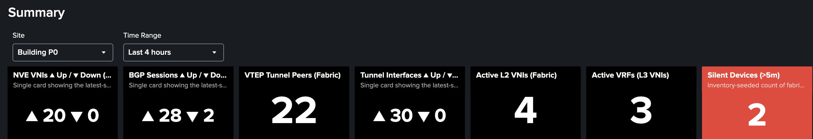

Fabric go/no-go. Red **Silent Devices** → check collector before assuming device fault.

```text
show nve vni summary
show bgp l2vpn evpn summary
show bgp ipv4 unicast summary
show nve peers
show ip interface brief | include Tunnel
show vrf brief
```

#### Row 2 — BGP trends and tenant VRFs

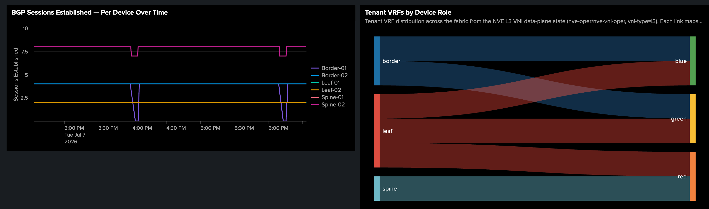

Flat Established lines = stable; dips = flap. Sankey: which roles host which tenant VRFs.

```text
show bgp l2vpn evpn summary
show vrf
show nve vni
```

#### Row 3 — Segment inventory

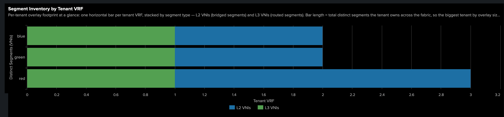

Per-tenant overlay census vs build intent.

```text
show nve vni
show l2vpn evpn evi detail
```

#### Row 4 — Busiest VXLAN segments

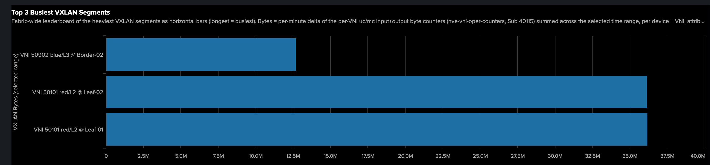

Hot-spot leaderboard (Sub 40115).

```text
show nve vni
show interfaces nve 1 counters
```

#### Row 5 — BGP health matrix

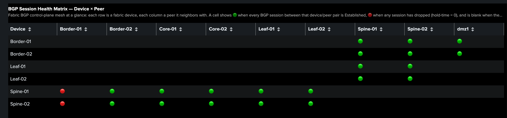

Green = all sessions Established; red = any down; blank = no peering.

```text
show bgp l2vpn evpn summary
show bgp l2vpn evpn neighbors <peer-ip>
```

#### Row 6 — NVE overlay counts

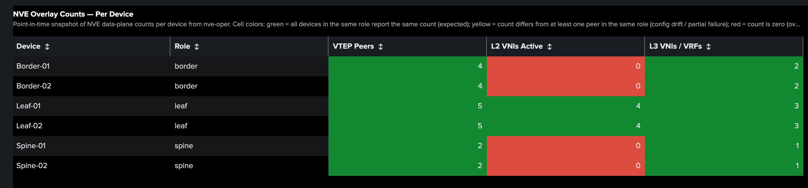

Per-device overlay inventory; colour = match to role design.

```text
show nve peers
show nve vni summary
show vrf brief
```

#### Row 7 — EVPN route updates

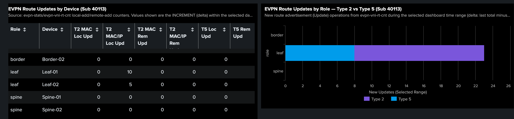

Control-plane work rate (Sub 40113) — not RIB size.

```text
show bgp l2vpn evpn statistics
show l2vpn evpn evi detail
```

#### Row 8 — EVPN RIB churn

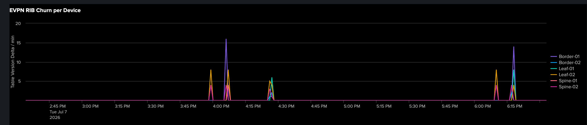

Correlates with MAC moves and reconvergence.

```text
show bgp l2vpn evpn summary
show l2vpn evpn mac
```

#### Row 9 — BGP session drops

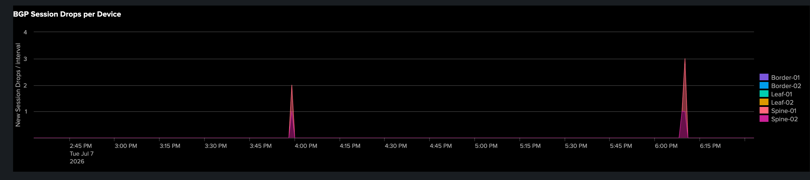

Spikes align with Row 2 dips and Row 5 red cells.

```text
show bgp l2vpn evpn summary
show logging | include BGP
```

### 6.3 Details dashboard

Eleven panel rows on the same layout for every **Fabric Node Role**. Default to **Leafs** for
overlay faults. Panel semantics and CLI are defined once below; screenshots show how each role
presents the same panel type.

| # | Panel row | Demonstrates |
|---|---|---|
| 1 | Scorecards | Role-scoped go/no-go ([§6.1](#61-triage-model)) |
| 2 | Tunnel interface status | `Tunnel*` oper-state (Subs 40120/40121) |
| 3 | BGP EVPN / IPv4 session state | Per-neighbor adjacency grid |
| 4 | BGP Established + L3 VNI trends | Session and tenant VRF stability over time |
| 5 | BGP drops + EVPN RIB churn | Per-node control-plane instability |
| 6 | NVE peers + tunnels over time | VTEP peer and tunnel up-count trends |
| 7 | NVE peer adjacency (Sankey) | Device → VNI → remote VTEP |
| 8 | EVPN VNI binding — control plane | EVI → L3 VNI → L2 VLAN chain |
| 9 | EVPN VNI binding — data plane (NVE) | VRF → L3 VNI → NVE L2 VNI oper-state |
| 10 | VXLAN throughput + BUM ratio | Overlay load and flooding ratio (Sub 40115) |
| 11 | NVE packet rate + top segments | Per-VNI throughput leaderboard |

#### Row 1 — Scorecards

| Leafs | Spines | Borders |
|:---:|:---:|:---:|
| 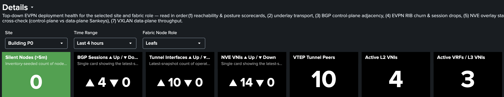 |  | 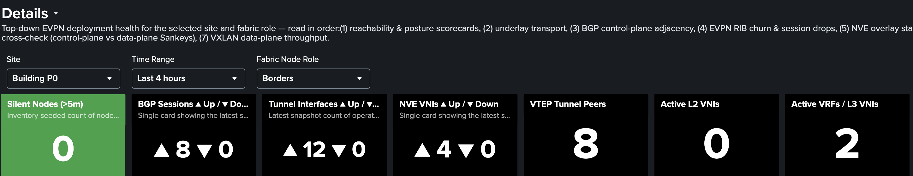 |

```text
show nve vni summary
show bgp l2vpn evpn summary
show nve peers
show vrf brief
show ip interface brief | include Tunnel
```

#### Row 2 — Tunnel interface status

| Leafs | Spines | Borders |
|:---:|:---:|:---:|
| 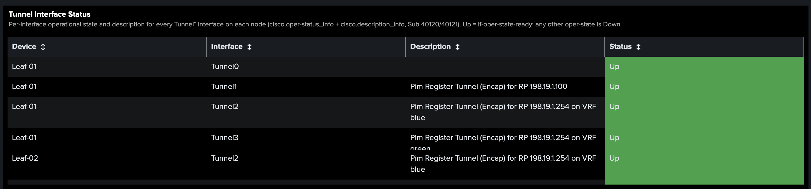 | 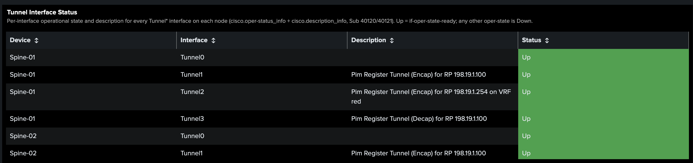 | 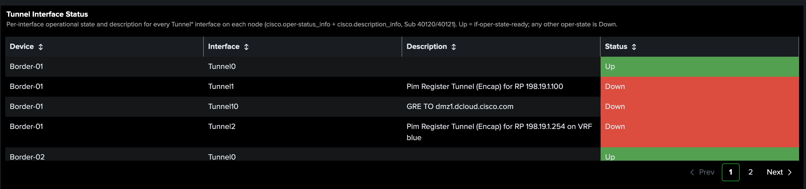 |

All rows **Up**. PIM register / underlay tunnels.

```text
show ip interface brief | include Tunnel
show interfaces Tunnel0 - 99 status
```

#### Row 3 — BGP session state

| Leafs | Spines | Borders |
|:---:|:---:|:---:|
| 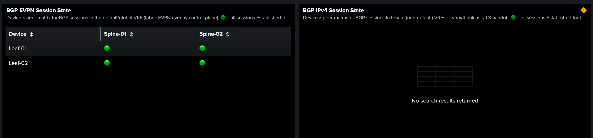 | 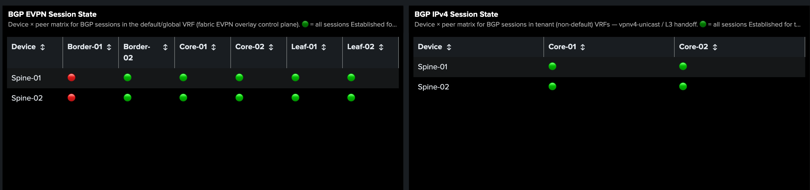 | 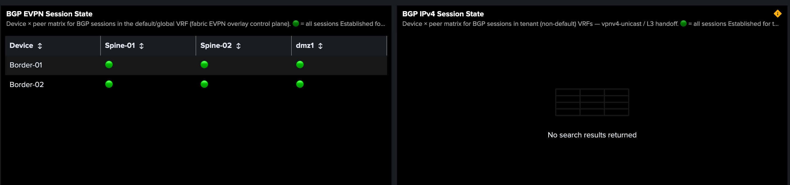 |

EVPN to spines; IPv4 when tenant handoff is configured. Spines: RR completeness to all VTEPs.

```text
show bgp l2vpn evpn summary
show bgp l2vpn evpn neighbors
show bgp ipv4 unicast summary
show bgp ipv4 unicast vrf all summary
```

#### Row 4 — BGP Established and L3 VNI trends

| Leafs | Spines | Borders |
|:---:|:---:|:---:|
| 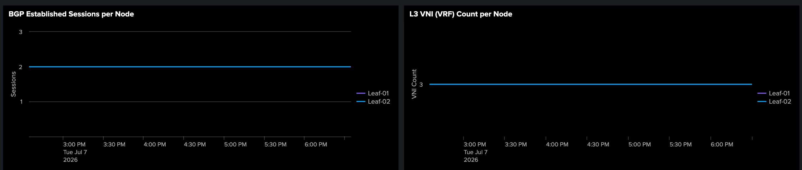 | 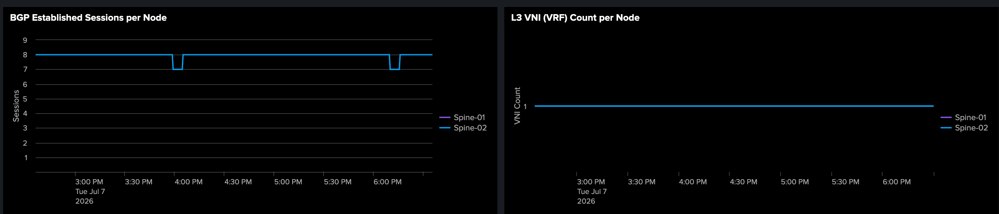 | 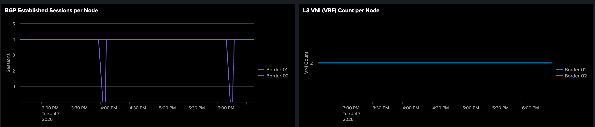 |

Steady lines = healthy. Spines: session count ≈ leaf + border VTEPs; L3 VNI count minimal.

```text
show bgp l2vpn evpn summary
show vrf brief
show nve vni
```

#### Row 5 — BGP drops and RIB churn

| Leafs | Spines | Borders |
|:---:|:---:|:---:|
| 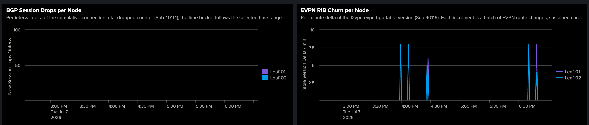 | 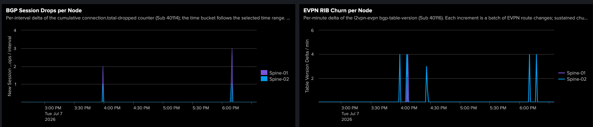 | 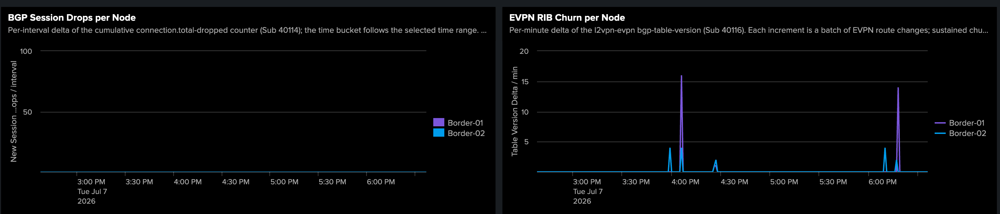 |

Single node spiking → local fault. Zeros expected in steady state.

```text
show bgp l2vpn evpn summary
show bgp l2vpn evpn statistics
show logging | include BGP
```

#### Row 6 — NVE peers and tunnels over time

| Leafs | Spines | Borders |
|:---:|:---:|:---:|
| 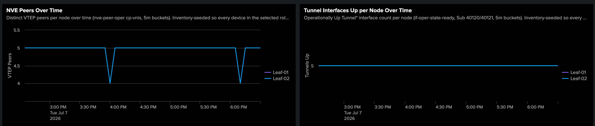 | 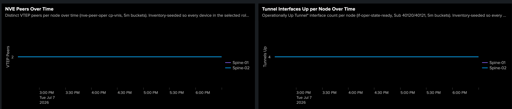 | 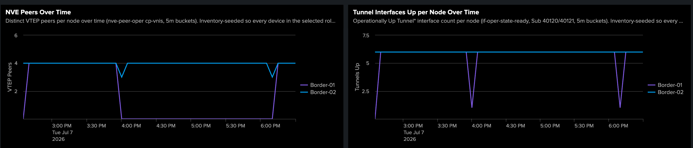 |

Step-down → remote VTEP or tunnel lost.

```text
show nve peers
show ip interface brief | include Tunnel
```

#### Row 7 — NVE peer adjacency

| Leafs | Spines | Borders |
|:---:|:---:|:---:|
| 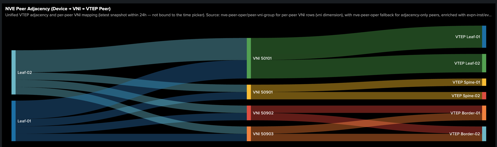 | 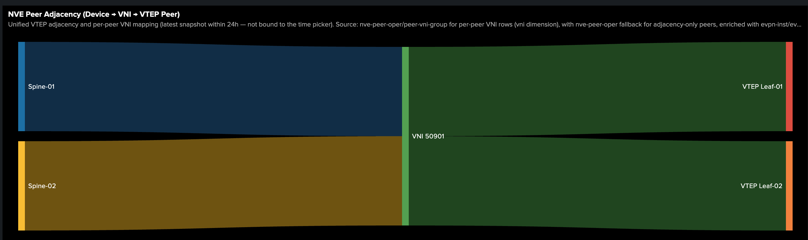 | 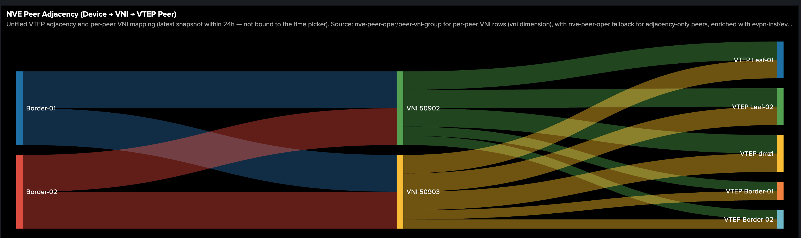 |

Missing Sankey flows → broken VNI adjacency for that segment.

```text
show nve peers
show nve vni
show nve vni interface nve 1 detail
```

#### Row 8 — EVPN binding (control plane)

| Leafs | Spines | Borders |
|:---:|:---:|:---:|
| 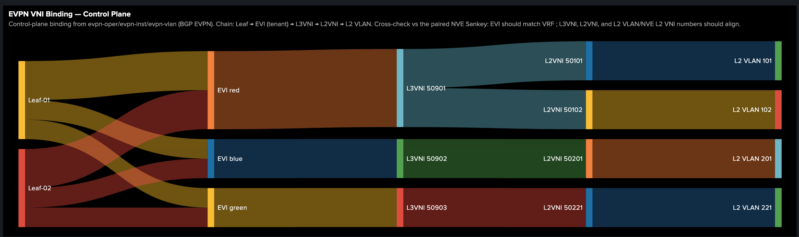 | 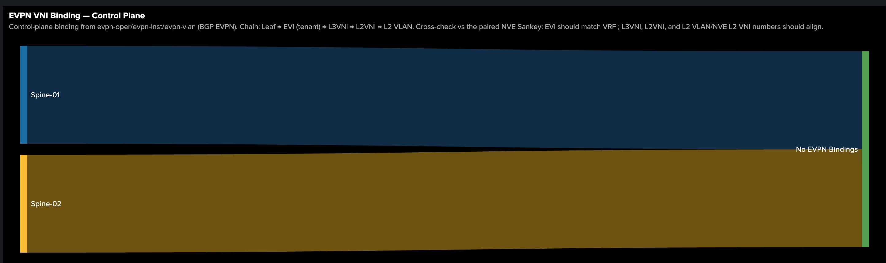 | 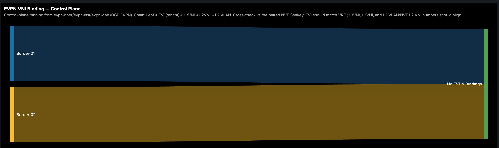 |

EVI → L3 VNI → L2 VLAN. Spines often show minimal bindings (expected for pure RR).

```text
show l2vpn evpn evi detail
show bgp l2vpn evpn vni
show vlan brief
```

#### Row 9 — EVPN binding (data plane)

| Leafs | Spines | Borders |
|:---:|:---:|:---:|
| 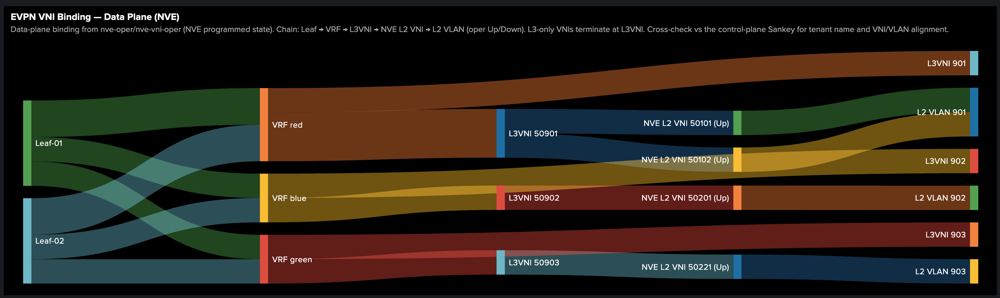 | 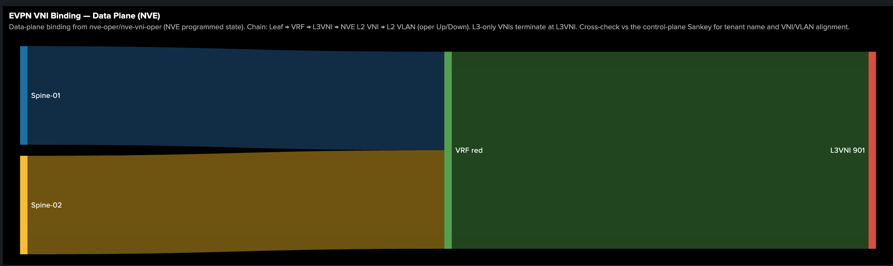 | 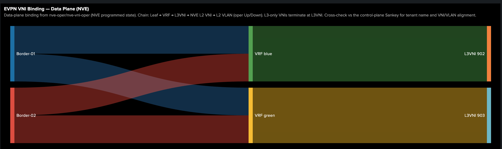 |

Cross-check Row 8 — CP/DP mismatch flags programming or SVI fault.

```text
show nve vni
show nve vni interface nve 1 detail
show vrf detail
```

#### Row 10 — VXLAN throughput and BUM

| Leafs | Spines | Borders |
|:---:|:---:|:---:|
| 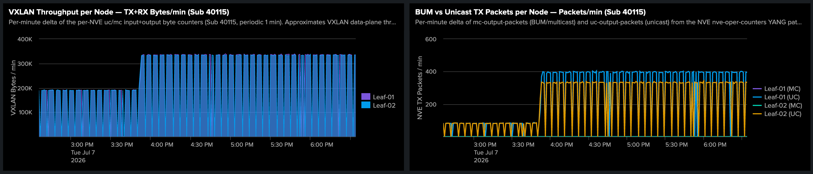 | 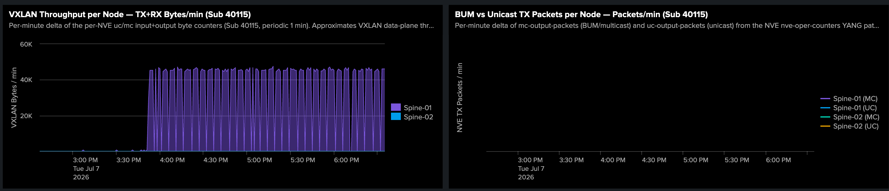 | 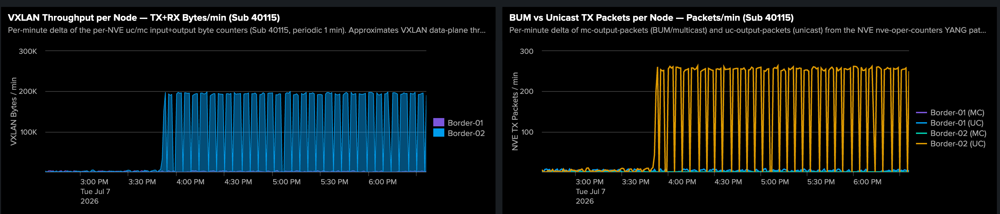 |

High BUM % → flooding or missing MAC learning. Borders: northbound egress spikes.

```text
show interfaces nve 1 counters
show nve vni
```

#### Row 11 — Packet rate and top segments

| Leafs | Spines | Borders |
|:---:|:---:|:---:|
| 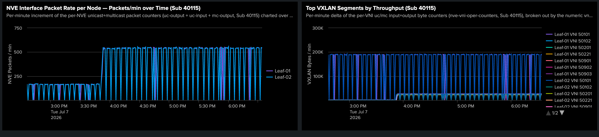 | 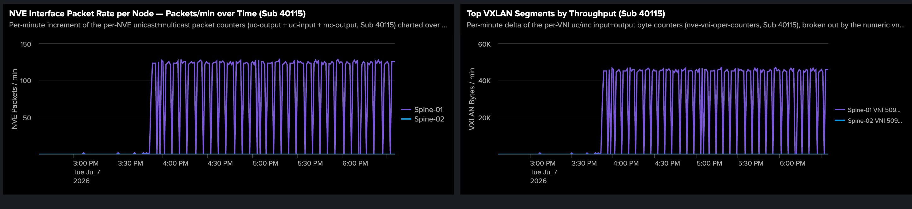 | 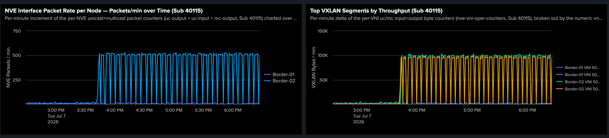 |

Narrows hot nodes to specific VNIs.

```text
show interfaces nve 1 counters
show nve vni interface nve 1 detail
```

### 6.4 Alerts dashboard

| Panel | Healthy | Investigate when |
|---|---|---|
| **BGP Sessions Not Established** | `0` | Non-zero — first alarm |
| **Telemetry Stale Devices** | `0` | Non-zero — check collector |
| **NVE VNIs Down Over Time** | `0` | Rise — pinpoints VNI failure time |
| **Active Alerts — All Roles** | Empty | Worklist: device, role, object |
| **BGP Not Established — Detail** | Empty | Per-session device/neighbor/VRF |
| **BGP Session Trend** | Stable | Confirms flap vs sustained outage |

### 6.5 Recommended triage workflow

1. **Summary** — scorecard row. All `▼ 0` / Silent `0` → done.
2. Note failing tile (BGP, VNI, tunnel, silent); use matching Summary trend for *when*.
3. **Details** — set role (leaf / spine / border).
4. Per-node trends → **EVPN VNI Binding** Sankeys (overlay) or **BGP session state** (control plane).
5. **Alerts** — confirm severity and exact object.

---

## 7. Deployment

```bash
cd "Campus BGP EVPN Splunk Assurance"
./packaging/build-app.sh              # .spl package only
./packaging/build-handoff-bundle.sh   # .spl + SETUP_GUIDE + otel-collector
```

Output: `packaging/dist/`. Full install: [`SETUP_GUIDE.md`](SETUP_GUIDE.md).

Validate dashboards against a live instance:

```bash
python3 tools/validate_studio.py "$SPLUNK_ADMIN_USER" "$SPLUNK_ADMIN_PASS"
```

Deploy to lab Splunk: use skill `splunk-app-deploy` or
[`packaging/deploy-splunk-app.sh`](packaging/deploy-splunk-app.sh).

---

## 8. Repository Layout

```text
campus_evpn_assurance/     # Splunk app (views, lookups, macros)
packaging/                 # build-app.sh, deploy-splunk-app.sh, dist/
SETUP_GUIDE.md             # Customer install guide
otel-collector/            # OTel config, yang_grpc patch, builder.yaml
model-config-snippets/     # IOS-XE telemetry subscriptions 40101–40121
images/                    # Diagrams, dashboard screenshots, snippets/
tools/                     # validate_studio.py
telegraf/                  # Alternative collector reference (lab)
```

---

## 9. References

| Document | Contents |
|---|---|
| [`SETUP_GUIDE.md`](SETUP_GUIDE.md) | Splunk + `otelcol-yangfix` + HEC + device subscriptions |
| [`campus_evpn_assurance/README.md`](campus_evpn_assurance/README.md) | Macros, `mstats`, inventory, app troubleshooting |
| [`otel-collector/README.md`](otel-collector/README.md) | Collector config, YANG key patch, build/rollback |
| [`images/README.md`](images/README.md) | Diagram assets, snippet regeneration |
| [`model-config-snippets/telemetry-subscriptions.ios-xe.cfg`](model-config-snippets/telemetry-subscriptions.ios-xe.cfg) | Subscription IDs and MDT receiver |
| [CatalystCenter-BGP-EVPN-VXLAN](https://github.com/imanassypov/CatalystCenter-BGP-EVPN-VXLAN) | Fabric build templates (companion project) |
