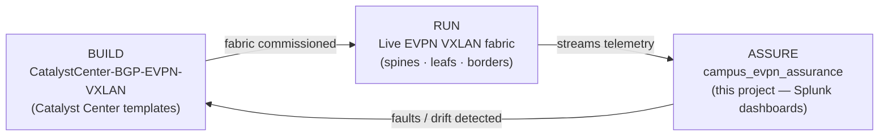
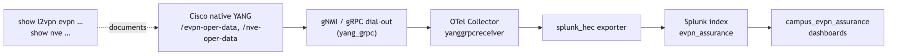
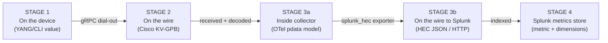

# Campus BGP EVPN Splunk Assurance

**Operational assurance dashboards for Cisco Catalyst BGP EVPN VXLAN campus fabrics.**

This project delivers a fully packaged Splunk application — `campus_evpn_assurance` — that
turns streaming telemetry from a BGP EVPN VXLAN fabric into a role‑aware, at‑a‑glance health
picture for the network engineer on shift. It answers one question continuously: **is the
overlay fabric healthy right now, and if not, exactly what changed, where, and when?**

---

## Table of Contents

1. [What This Project Is For](#what-this-project-is-for)
2. [How It Fits: Build vs. Assure](#how-it-fits-build-vs-assure)
3. [Architecture at a Glance](#architecture-at-a-glance)
4. [Telemetry Introduction — How the Data Gets to Splunk](#telemetry-introduction--how-the-data-gets-to-splunk)
5. [Worked Example: One EVPN Metric, End to End](#worked-example-one-evpn-metric-end-to-end)
6. [Why a Metrics Index (and How You Query It)](#why-a-metrics-index-and-how-you-query-it)
7. [The Splunk App and Its Dashboards](#the-splunk-app-and-its-dashboards)
8. [Operator's Guide: Reading the Dashboards](#operators-guide-reading-the-dashboards)
9. [Deployment](#deployment)
10. [Repository Layout](#repository-layout)
11. [Reference Documents](#reference-documents)

---

## What This Project Is For

A BGP EVPN VXLAN campus fabric is a distributed system: dozens of switches, hundreds of
overlay segments (VNIs), per‑tenant VRFs, BGP route‑reflection, and a multicast underlay all
have to stay in lock‑step for a single host to talk to another. When something breaks — a VTEP
tunnel drops, a BGP session leaves *Established*, an L3VNI core SVI goes down — the symptom a
user reports ("I can't reach the app") is far removed from the cause.

Traditional SNMP polling and CLI spot‑checks are too slow and too manual to operate a fabric at
scale. **This project replaces that with continuous streaming telemetry and a purpose‑built
Splunk assurance suite** that:

- **Detects service‑impacting state changes in seconds**, not at the next poll interval.
- **Presents fabric posture top‑down** — one executive view for the whole fabric, then
  role‑scoped deep‑dive views for Leafs, Spines, and Borders, plus a consolidated Alerts view.
- **Pinpoints the failing object** — the exact device, BGP neighbor, VNI, or tenant VRF — so
  triage starts at the cause, not the symptom.

The result is a repeatable, beginner‑friendly operational baseline that a network team can
stand up per site.

---

## How It Fits: Build vs. Assure

This repository is the **assurance** half of a two‑part lifecycle. It is the companion to the
fabric **build** automation:

> **Companion build framework:**
> [**CatalystCenter‑BGP‑EVPN‑VXLAN**](https://github.com/imanassypov/CatalystCenter-BGP-EVPN-VXLAN)
> — a collection of Cisco Catalyst Center Jinja2 CLI templates that provision a complete
> spine‑leaf BGP EVPN VXLAN campus fabric (multi‑tenant VRFs, L2/L3 overlays, multicast, optional
> border/L3OUT handoff) onto Catalyst 9000 switches, GitOps‑style, at scale.

The two projects bracket the fabric's operational lifecycle:



| Phase | Project | Question it answers |
|---|---|---|
| **Build** | [CatalystCenter‑BGP‑EVPN‑VXLAN](https://github.com/imanassypov/CatalystCenter-BGP-EVPN-VXLAN) | "How do I provision a correct, consistent fabric from declarative intent?" |
| **Assure** | **This project** | "Now that the fabric is live, is it healthy — and if not, what broke?" |

You commission a site with the build framework. **Once that fabric is up and forwarding, this
assurance suite takes over** — validating that what was intended is what is actually running, and
watching it continuously thereafter. The two share the same fabric model (roles, tenants, VNIs,
loopbacks), so the dashboards' device inventory and expected‑state logic map directly onto what
the templates provisioned.

---

## Architecture at a Glance

The pipeline has three tiers: the **fabric** streams telemetry, a **collector** translates it,
and **Splunk** stores and visualizes it.



> Diagram source: [`images/pipeline-flow.mmd`](images/pipeline-flow.mmd)

### Lab Infrastructure

A single consolidated cloud instance hosts all Splunk roles plus the telemetry collector — the
Search Head, Heavy Forwarder, indexer, and OpenTelemetry receiver are co‑located.

| Component | Host / Endpoint | Notes |
|---|---|---|
| Splunk (SH + HF + Indexer) | `18.224.25.161` | Cloud EC2; HEC on `:8088`, metrics index `evpn_assurance` |
| OpenTelemetry Collector (`yang_grpc`) | `18.224.25.161:57444` | Co‑located; gRPC/MDT dial‑out target |

### Fabric Telemetry Targets

The fabric switches configured to stream telemetry. Each device's `cisco.node_id` (its
hostname) is the key that joins every metric back to the role/site inventory in
[`campus_evpn_assurance/lookups/evpn_device_inventory.csv`](campus_evpn_assurance/lookups/evpn_device_inventory.csv).

| Device | Role | Streams to |
|---|---|---|
| spine1, spine2 | Spine (route reflector) | `18.224.25.161:57444` |
| leaf1, leaf2 | Leaf (access VTEP) | `18.224.25.161:57444` |
| border1, border2 | Border (L3 handoff VTEP) | `18.224.25.161:57444` |

Each switch is configured with `receiver ip address 18.224.25.161 57444 protocol grpc-tcp`
(see [`model-config-snippets/telemetry-subscriptions.ios-xe.cfg`](model-config-snippets/telemetry-subscriptions.ios-xe.cfg)).

---

## Telemetry Introduction — How the Data Gets to Splunk

> **New to streaming telemetry or OpenTelemetry?** This section explains, in plain language, how
> data flows from the switches to Splunk and why some confusing terminology (gRPC, MDT, gNMI,
> OTLP) shows up along the way. If you already know the pipeline, skip to
> [the worked example](#worked-example-one-evpn-metric-end-to-end).

### A telemetry pipeline has two halves

Every telemetry pipeline is two independent halves joined by a **collector** in the middle:


- **Left (device → collector):** the switches *stream* their operational data.
- **Middle (the collector):** software that *catches* the stream and *forwards* it.
- **Right (collector → Splunk):** the data is delivered to Splunk as HTTP events (HEC).

The **OpenTelemetry Collector** is the only moving part you deploy and tune. The switches and
Splunk sit on either side of it and are configured independently — like a courier between a
factory (switches) and a warehouse (Splunk): it picks up at one dock (gRPC) and delivers to
another (HTTP HEC).

### Why the collector "receives gRPC"

Because **the switches decide the protocol, not the collector.** The IOS‑XE devices are
configured for **Model‑Driven Telemetry (MDT)** over **gRPC dial‑out**, and that config lives on
the switch:

```
receiver ip address 18.224.25.161 57444 protocol grpc-tcp
```

Any collector they point at *must* speak gRPC to receive that stream. OTel's `yang_grpc`
receiver is simply OpenTelemetry's way of accepting that gRPC feed.

### Terminology that trips people up

These four terms are *not* the same thing:

| Term | What it is | Where it appears here |
|---|---|---|
| **gRPC** | The transport — the "pipe" (Google's RPC framework). | Device → collector on `:57444` |
| **Cisco MDT** | Model‑Driven Telemetry: the switch *pushes* operational data, encoded as **KV‑GPB** (key‑value Protocol Buffers). | What the fabric actually streams (`grpc-tcp` dial‑out) |
| **gNMI** | A *different*, standardized telemetry/config protocol (also over gRPC), usually *dial‑in*. | **Not** used here — our devices use MDT dial‑out |
| **OTLP** | OpenTelemetry Protocol: the open‑standard *wire format*. | The collector's **internal data model** only |

> A common slip is to call the device feed "gNMI." What this fabric uses is **MDT gRPC dial‑out**
> (KV‑GPB). The receiver is named `yang_grpc` because it parses the YANG‑modeled data arriving
> over gRPC.

### Why "OpenTelemetry"? (and what OTLP is)

**OpenTelemetry (OTel)** is the name of an open‑source observability project hosted by the CNCF
(the foundation behind Kubernetes). The word "telemetry" here means the broad industry concept of
*observability data* — **not** Cisco's telemetry feature. So two unrelated things share the word:

- **Model‑Driven Telemetry (MDT)** = Cisco's feature where switches stream stats (the *data source*).
- **OpenTelemetry (OTel)** = the open‑source *collector framework* in the middle.

OpenTelemetry is also an open data‑format standard, **OTLP**. But **our pipeline never puts OTLP
on the wire** — the collector uses OTel's internal model only as an in‑memory translation layer:

```
receiver  →  internal data model (pdata)  →  exporter
(Cisco KV-GPB)   (OTel standard, in memory)    (Splunk HEC JSON)
```

The collector is a **format translator**: Cisco‑in, Splunk‑out, OTel‑standard‑in‑the‑middle. We
get the benefit of a normalized model (swap sources/destinations freely) without OTLP ever
crossing the network.

> **One‑line takeaway:** the switches push **Cisco MDT over gRPC**; the collector ships **HTTP
> HEC events** to Splunk; "OpenTelemetry" names the collector framework doing the translation.

---

## Worked Example: One EVPN Metric, End to End

To make the transformation concrete, follow **a single real EVPN metric** from switch to
dashboard: the **operational state of an NVE (VXLAN) peer** on the VTEP `leaf1` — its peer
`2.2.2.2` for VNI `30000`. The peer‑state is an enum we encode numerically as **`1` = UP**
(`0` = down), which is exactly how you'd alert on a VTEP losing a tunnel peer.



The **same value (`1` = UP)** travels through every stage — only its *packaging* changes.

### Stage 1 — On the device (the source value)

The switch holds the peer's state as a YANG‑modeled operational leaf:

```text
leaf1# show nve peers
Interface  VNI    Type   Peer-IP    RMAC/Num_RTs   eVNI    state  flags    UP time
nve1       30000  L3CP   2.2.2.2    cc70.ed5a.9367 30000   UP     A/-/4    00:05:36
```

```text
/nve-oper-data/nve-oper/nve-peer-oper[peer-addr=2.2.2.2]/peer-state  = UP   (enum)
```

> **Reading `[peer-addr=2.2.2.2]` — a YANG list key predicate.** `nve-peer-oper` is a **list** (a
> table with one row per peer). The bracket selects one specific row — "the peer whose
> `peer-addr` equals `2.2.2.2`" — the YANG equivalent of a SQL `WHERE` clause. This is the origin
> of the **dimension vs. metric** split: the key (`peer-addr=2.2.2.2`) identifies *which* peer the
> measurement is about → it becomes a Splunk **dimension**; the leaf (`peer-state=UP` → `1`) is the
> *measurement* → it becomes the Splunk **metric value**.

### Stage 2 — On the wire to the collector (Cisco KV‑GPB over gRPC)

The device serializes the update as **KV‑GPB** and streams it over gRPC dial‑out (binary; shown
decoded):

```text
telemetry_data {
  node_id_str:    "leaf1"
  encoding_path:  "Cisco-IOS-XE-nve-oper:nve-oper-data/nve-oper/nve-peer-oper"
  data_gpbkv {
    fields { key: "peer-addr"   string_value: "2.2.2.2" }   # key  → dimension
    fields { key: "vni"         uint32_value: 30000 }       # key  → dimension
    fields { key: "peer-state"  string_value: "UP" }        # measured value
  }
}
```

### Stage 3a — Inside the collector (OTel internal model / pdata)

The `yang_grpc` receiver decodes the GPB, maps the `UP` enum to `1`, and normalizes it into
OpenTelemetry's in‑memory model. Nothing is on the wire here:

```text
Metric  name: evpn.nve.peer.state   type: Gauge   unit: "1"   (1 = UP, 0 = down)
  DataPoint value: 1
    attributes: host="leaf1", peer_addr="2.2.2.2", vni="30000", ...
```

### Stage 3b — On the wire to Splunk (Splunk HEC JSON over HTTP)

The `splunk_hec` exporter converts the point into a Splunk HEC metric event and POSTs it to
`https://localhost:8088/services/collector`. Splunk's convention: any field named
`metric_name:<name>` is the (numeric) measurement; everything else is a dimension.

```json
{
  "time": 1750000000.000, "host": "leaf1", "index": "evpn_assurance", "event": "metric",
  "fields": {
    "metric_name:evpn.nve.peer.state": 1,
    "peer_addr": "2.2.2.2", "vni": "30000"
  }
}
```

### Stage 4 — In the Splunk metrics store

Splunk stores one point in the `evpn_assurance` metrics index: a timestamp, a measurement, and a
set of dimensions.

| Field | Value | Role |
|---|---|---|
| `_time` | `2025-06-15 12:26:40` | timestamp |
| `metric_name` | `evpn.nve.peer.state` | metric identity |
| `_value` | `1` | the measurement (1 = UP) |
| `host` / `peer_addr` / `vni` | `leaf1` / `2.2.2.2` / `30000` | dimensions |

You'd query it with Splunk's metrics search to list any **down** peer:

```spl
| mstats latest(_value) AS peer_state
  WHERE index=evpn_assurance AND metric_name="evpn.nve.peer.state"
  BY host, peer_addr, vni span=1m
| where peer_state=0
```

### The whole journey at a glance

| Stage | Where | Format | How the value `1` (UP) appears |
|---|---|---|---|
| 1 | On `leaf1` | YANG leaf / CLI | `.../nve-peer-oper[peer-addr=2.2.2.2]/peer-state = UP` |
| 2 | Device → collector | Cisco KV‑GPB / gRPC | `fields{ key:"peer-state" string_value:"UP" }` |
| 3a | Inside collector | OTel pdata (memory) | `DataPoint value:1, attrs{...}` |
| 3b | Collector → Splunk | Splunk HEC JSON / HTTP | `"metric_name:evpn.nve.peer.state": 1` |
| 4 | Splunk metrics store | Metrics index point | `metric_name=evpn.nve.peer.state, _value=1` |

> **Key idea:** the *measurement never changes* — the peer is UP (`1`) at every stage. What
> changes is the envelope around it. The collector's entire job is to re‑wrap that peer state so
> each system understands it.

---

## Why a Metrics Index (and How You Query It)

Splunk has two kinds of index: **event** indexes (raw text like syslog) and **metrics** indexes
(numeric measurements with dimensions). EVPN telemetry uses a **metrics** index (`evpn_assurance`)
because the data is fundamentally numeric time series — peer states, session counts, byte
counters — and metrics indexes store and aggregate those far more efficiently than event search.

The dashboards query it almost exclusively with **`mstats`**, the metrics workhorse:

```spl
| mstats latest("cisco.negotiated-keepalive-timers.hold-time") AS hold_time
    WHERE `evpn_index`
      "cisco.encoding_path"="Cisco-IOS-XE-bgp-oper:bgp-state-data/neighbors/neighbor"
    BY "cisco.node_id", "vrf-name", "neighbor-id"
| `evpn_lookup`
| where site="$site$"
```

Two app macros keep this consistent across every panel:

| Macro | Expands to | Purpose |
|---|---|---|
| `` `evpn_index` `` | `index=evpn_assurance` | Routes every search at the metrics index |
| `` `evpn_lookup` `` | `rename "cisco.node_id" AS hostname \| lookup evpn_device_inventory ...` | Joins each metric's device key to its **site / role / loopback** from the inventory CSV |

> **A critical detail — string enums never become metrics.** Splunk's metrics index silently
> discards string‑only values. So a YANG `enumeration` leaf (like BGP `session-state` or NVE
> `vni-oper-state`) cannot be queried as a metric on its own. The dashboards work around this in
> two ways: (1) they key BGP up/down off the **numeric** negotiated `hold-time` (non‑zero only
> while *Established*); and (2) the patched `yang_grpc` receiver emits a numeric companion metric
> and carries the enum string in a `value` *dimension* you can filter on. This is why, for
> example, the BGP scorecards use `count(hold_time>0)` for **Up** and `count(hold_time==0)` for
> **Down**.

---

## The Splunk App and Its Dashboards

A fully packaged Splunk app provides the operational health dashboards.

| Item | Value |
|---|---|
| App name | `campus_evpn_assurance` |
| App version | `1.5.0` (build 56) |
| Installed path | `/opt/splunk/etc/apps/campus_evpn_assurance/` |
| Splunk version | 10.4.0 |
| Dashboards | **Dashboard Studio** (`<dashboard version="2">`, native `splunk.sankey`) |
| Source of truth | [`campus_evpn_assurance/lookups/evpn_device_inventory.csv`](campus_evpn_assurance/lookups/evpn_device_inventory.csv) |
| Metrics index | `evpn_assurance` |

> **Dashboard Studio, not Simple XML.** The dashboards were migrated from Classic Simple XML to
> Dashboard Studio (version 2) ahead of Simple XML deprecation. All Sankey flow diagrams use the
> **native** `splunk.sankey` visualization — no custom‑visualization app or D3 bundle is required.

The app ships **five views**, navigable as tabs:

| View | Role filter | Focus |
|---|---|---|
| **Executive Overview** | All roles | Fabric‑wide posture: is anything red or churning? |
| **Leafs** | leaf | Access VTEPs — where hosts attach and most overlay faults surface |
| **Spines** | spine | Route reflectors / underlay core |
| **Borders** | border | External / L3 handoff VTEPs |
| **Alerts** | All roles | Triage landing pad — what fired, when, where |

---

## Operator's Guide: Reading the Dashboards

This section is written for the network engineer on shift. It explains, view by view, **what each
dashboard presents** and **how to interpret every metric** — what a healthy fabric looks like, and
what a number or color is telling you when something is wrong.

### How the dashboards are organized

The app is a **role‑segmented assurance suite** designed for **top‑down** triage:

```
Executive Overview  →  (something is red/non-zero)  →  open the matching role view
   (fabric posture)            drill down              (Leafs / Spines / Borders)
                                                              ↓
                                                       Alerts view
                                                  (what fired, when, where)
```

Every view shares two global header controls:

| Control | Default | Behaviour |
|---|---|---|
| **Site** dropdown | `Ottawa` | Scopes every panel to one site. Populated from the inventory CSV. |
| **Time Range** picker | Last 4 hours | **Trend/chart** panels honour this window. **Scorecard cards** and **state tables** deliberately read the *latest snapshot* so they always show current reality regardless of the picker. |

> **Why two time behaviours?** A scorecard answers "is the fabric healthy *right now*?" — it must
> ignore the picker. A trend answers "what changed *over the window I selected*?" — it must honour
> it. Widening the picker to 24 h redraws the line charts but does not change the cards.

### How to read the health scorecard row

Every view opens with the **same six‑tile scorecard row**, scoped to that view's role (the
Executive view aggregates all roles). Read it left to right as a go/no‑go strip:

| Tile | What it counts | Healthy reading | Investigate when |
|---|---|---|---|
| **NVE VNIs ▲ Up / ▼ Down** | Latest oper‑state of every VXLAN segment (VNI) on the role | `▼ 0` | `▼` non‑zero → a VNI's core SVI or access VLAN is operationally down |
| **BGP Sessions ▲ Up / ▼ Down** | Neighbors with a negotiated hold‑time (Established) vs. not | `▼ 0` | `▼` non‑zero → one or more EVPN/underlay peers are not Established |
| **VTEP Tunnel Peers** | Distinct remote VTEP IPs each device tunnels to, summed | Stable, matches design | Drops below expected mesh → a VTEP went away |
| **Active L2 VNIs** | Distinct L2 (bridge‑domain) segments | Matches provisioned count | Lower than expected → a segment is missing |
| **Active VRFs / L3 VNIs** | Distinct L3 (tenant) segments | Matches tenant count | Lower than expected → a tenant VRF dropped |
| **Silent \<role\> (>5m)** | Devices of this role with no telemetry in 5 min | `0` | Non‑zero → a switch stopped streaming (down, or telemetry broke) |

> **Reading the ▲/▼ cards.** The consolidated cards show both halves of a binary state in one
> tile, e.g. `▲ 14   ▼ 0`. The **▲ (up)** count is your capacity/scale indicator; the **▼ (down)**
> count is your alarm. A glance across the row — all `▼ 0` and `Silent 0` — means the fabric
> control plane and overlay are fully converged.

### View 1 — Executive Overview (fabric posture, all roles)

**Purpose:** a single screen that answers "is the whole fabric healthy, and is anything churning?"
without naming individual devices. **Start every shift here.**

| Panel | What it shows | How to read it |
|---|---|---|
| **Scorecard row** (6 tiles) | Fabric‑wide aggregate state | All `▼ 0` / `Silent 0` = converged. Any red → drill into the matching role view. |
| **BGP Sessions Established — Per Device Over Time** | One line per device, Established neighbor count | Flat = stable. A dip then recover = a flap; a drop staying low = a peer down. |
| **Device Role → Active Tenant VRF** (Sankey) | Which roles host which tenant VRFs (L3 VNI presence) | Leaves/borders should carry tenant VRFs; spines should not. A missing tenant = a provisioning gap. |
| **VNIs per Tenant (VRF)** | Stacked bar: per tenant, distinct L2 and L3 VNIs fabric‑wide (one bar per tenant, stacked by segment type) | Your segment census — the longest bar is the biggest tenant by overlay footprint; confirm each tenant has its expected L2 count and an L3 VNI. |
| **Top 3 Busiest VXLAN Segments** | Horizontal bar leaderboard ranked by VXLAN bytes; each bar labelled `VNI <id> <vrf>/<type> @ <device>` | Hot‑spot view — the longest bar is the heaviest segment. An unexpected VNI near the top warrants a look; idle segments correctly show `0`. |
| **BGP Session Health Matrix — Device × Peer** | Heatmap grid: rows = fabric device, columns = peer; 🟢 = all sessions Up, 🔴 = any session Down, blank = no peering | Scan for any red cell — that device/peer pair has a dropped session. Rows and columns are driven entirely by the inventory lookup, so the grid grows or shrinks automatically as devices are added or decommissioned. External eBGP peers not in the inventory appear by their neighbor IP so no session is hidden. |
| **VXLAN Overlay Health — Per Device** | Table: per‑device VTEP peers, active L2/L3 VNIs | Confirms each device's overlay footprint matches its role. A leaf with 0 VTEP peers is isolated. |
| **EVPN Route Advertisement Activity / by Role** | New Type‑2/3/5 route updates per node and per role | Control‑plane work rate. Leaves dominate Type‑2 (host MACs); a skew is a clue. |
| **BGP Route Instability — Table Version Churn** | Route changes/min per device | Flat ≈ 0 = converged. Sustained spikes = reconvergence churn. |
| **BGP Session Flaps — New Drops per Device** | `delta(total_dropped)` per device/min | Any non‑zero spike = a session actually dropped that minute. Correlate with the trend dip. |
| **Spine RR Path Redundancy** | Paths ÷ prefixes per spine per AF | `>1` = multipath redundancy; `=1` = single path. Dual‑spine design expects ~2×. |
| **BGP Update Rate — Messages Received per Device** | `delta(received/updates)` per device/min | Spots a runaway/chatty peer. Near‑flat in steady state. |

### View 2 — Leafs (access / host‑facing VTEPs)

**Purpose:** deep dive on the leaves — where hosts attach, MACs are learned, and L2/L3 VNIs are
locally instantiated. **This is where most overlay faults surface.**

| Panel | What it shows | How to read it |
|---|---|---|
| **Scorecard row** (scoped to leaves) | Leaf VNI/BGP/VTEP/scale/silent posture | Same reading as the executive row, leaves only. |
| **BGP Established Sessions per Leaf** | Line per leaf, Established count | Each leaf should hold steady sessions to both spines (RRs). A drop = lost RR session. |
| **L3 VNI (VRF) Count per Leaf** | Tenant VRF count per leaf | Confirms each leaf carries its expected tenants. |
| **BGP EVPN Peering Detail** | Table: per‑neighbor session detail | The per‑leaf truth table — check state and peer AS. |
| **BGP Session Flaps / Update Rate / Table Version Churn per Leaf** | Per‑leaf delta charts | A single leaf spiking = local instability (endpoint move/flap, chatty host). |
| **MAC & MAC/IP Route Churn per Leaf** | New Type‑2 MAC vs. MAC/IP advertisements | High MAC churn = host mobility or a flapping access port. |
| **NVE Peers Over Time — Per Leaf** | VTEP tunnel peer count over time | Should match the mesh size; a step down = a remote VTEP went away. |
| **VXLAN Throughput / Packet Rate / BUM Ratio per Leaf** | Overlay byte/packet rate, % BUM | Per‑leaf load; high BUM % can indicate flooding (unknown‑unicast, missing MAC learning). |
| **Per‑VNI VXLAN Throughput — Top Talkers** | Busiest VNIs *on this leaf* | Narrows a hot leaf to the specific segment driving the load. |
| **Per‑VNI Peer Reachability Matrix per Leaf** | Grid: VNI × remote VTEP, `1` = router‑MAC learned, `0` = gap | **Key fault‑finder.** A `0` where a peer *should* advertise the segment = a missing/asymmetric EVPN binding. |
| **NVE Peer Adjacency Flow** (Sankey) | Hostname → Peer VTEP → VNI | Which peers each leaf exchanges which VNIs with. |
| **EVPN VNI Binding Cross‑Check** (Sankey) | Hostname → EVI (VRF) → L3 VNI → L2 VNI → Access VLAN | End‑to‑end binding integrity: a break in the chain shows a mis‑stitched segment. |

### View 3 — Spines (route reflectors / underlay core)

**Purpose:** the spines are **BGP EVPN route reflectors** and the underlay core. They normally
host **no** NVE VNIs, so the VNI tiles read `0` by design.

| Panel | What it shows | How to read it |
|---|---|---|
| **Scorecard row** (scoped to spines) | Spine posture | **NVE VNIs and L2/L3 VNIs read `0` — this is correct.** **BGP Sessions** is the tile that matters: a spine holds a session to every leaf and border. |
| **BGP Established Sessions per Spine** | Established count per spine | Each spine should peer with every VTEP. A drop can isolate a whole leaf/border from route reflection. |
| **L3 VNI Count per Spine** | VNI counts (expected `0`) | Confirms the spine is a pure RR, not terminating tenants. |
| **BGP Session State / EVPN Peering Detail** | Per‑neighbor session tables | The RR's session inventory — every VTEP should appear Established. |
| **NVE Interface / Peer Adjacency / Peers Over Time** | Any VTEP adjacencies | Normally minimal or none on a pure RR spine. |
| **BGP VRF Prefix Distribution** (Sankey) | Hostname → VRF → Address Family (total prefixes) | The reflected prefix volume per AF passing through the RR. |
| **NVE VNI Table / Per‑VNI Reachability Matrix** | Per‑VNI detail | Normally empty/sparse on spines. |

### View 4 — Borders (external / L3 handoff VTEPs)

**Purpose:** the borders terminate L3 VNIs and hand tenant traffic off to the outside
(WAN/core/DC). They carry tenant VRFs and L3 VNIs but typically **no L2 (access) VNIs**.

| Panel | What it shows | How to read it |
|---|---|---|
| **Scorecard row** (scoped to borders) | Border posture | **Active L2 VNIs is normally low/0** (borders don't host access segments); **Active VRFs / L3 VNIs** reflects the tenants handed off. |
| **BGP Established Sessions per Border** | Established count per border | Borders peer with the spines (RRs) and often an external router. |
| **L3 VNI Count per Border** | Tenant L3 VNIs terminated | Confirms which tenants this border handles. |
| **BGP Session State / EVPN Peering Detail** | Per‑neighbor session tables | Watch both fabric‑side (spine) and external‑side sessions. |
| **NVE Interface / Peer Adjacency / Peers Over Time** | Border overlay state and tunnel peers | The border's overlay reachability into the fabric. |
| **L3 VNI Termination: L3 VNI → Border** (Sankey) | Which L3 VNIs terminate on which border | Confirms tenant egress placement (2‑column — borders carry L3, not L2). |
| **NVE Peer Adjacency Flow** (Sankey) | Hostname → VNI → Peer IP | Which peers the border exchanges each VNI with. |
| **BGP VRF Prefix Distribution** (Sankey) | Hostname → VRF → AF (total prefixes) | Tenant prefix volume the border advertises/receives per AF. |
| **Per‑VNI VXLAN Throughput — Top Talkers** | Busiest VNIs on this border | The heaviest tenant L3 VNIs egressing here; idle borders show `0`. |
| **NVE VNI Table / Per‑VNI Reachability Matrix** | Per‑VNI detail and reachability | A `0` where a leaf should reach the border's L3 VNI = a tenant that can't egress. |

### View 5 — Alerts (what fired, when, where)

**Purpose:** the triage landing pad — three alarm counts, an active‑alert table, and a BGP trend
for context.

| Panel | What it shows | How to read it |
|---|---|---|
| **BGP Sessions Not Established** | Count of down BGP sessions, fabric‑wide | `0` = clean. Non‑zero is your first alarm. |
| **Telemetry Stale Devices (>5 min silent)** | Devices that stopped streaming | Non‑zero → a switch is down or its telemetry pipeline broke (check the collector before assuming a device fault). |
| **NVE VNI Oper‑State — Down VNIs per Node** | Count/trend of operationally down VNIs | `0` = all segments up. A rise pinpoints when a VNI went down. |
| **Active Alerts — All Roles** | Consolidated table: BGP down + telemetry stale + VNI oper‑state down, with severity | Your worklist. Each row names the device, role, and specific object (e.g. `VNI 50901 (L3VNI Core, VRF: red)`). |
| **BGP Sessions Not Established — Detail** | Per‑session breakdown of every down neighbor | Names the exact device/neighbor/VRF behind the count tile. |
| **BGP Session Trend** | BGP session count over time | Confirms whether an alarm is a momentary flap or a sustained outage. |

### Recommended triage workflow

1. **Executive Overview** — scan the scorecard row. All `▼ 0` / `Silent 0` = healthy; stop here.
2. If a card is red, note **which** (BGP? VNI? VTEP? Silent?) and check the matching executive
   trend/table for *when* and *how much*.
3. **Open the role view** (Leafs / Spines / Borders) implicated by the fault.
4. Use the role view's **per‑device** trends to find the offending switch, then the **Per‑VNI Peer
   Reachability Matrix** (overlay/binding faults) or **BGP EVPN Peering Detail** (control‑plane
   faults) to find the exact VNI or neighbor.
5. **Alerts view** — confirm what fired, the severity, and the precise object in the Active Alerts
   table.

---

## Deployment

The app is packaged as source under [`campus_evpn_assurance/`](campus_evpn_assurance/) and
deployed to `/opt/splunk/etc/apps/` on the Splunk host.

```bash
# 1. Package (exclude macOS cruft)
COPYFILE_DISABLE=1 tar --exclude='.DS_Store' --exclude='._*' \
  -czf /tmp/campus_evpn_assurance.tar.gz campus_evpn_assurance

# 2. Copy to the Splunk host, then extract and set ownership
sudo tar -xzf /tmp/campus_evpn_assurance.tar.gz -C /opt/splunk/etc/apps/
sudo chown -R splunk:splunk /opt/splunk/etc/apps/campus_evpn_assurance

# 3. Register live without a restart (Dashboard Studio needs no new config to register)
curl -sk -u "$SPLUNK_USER:$SPLUNK_PASS" -X POST \
  'https://localhost:8089/services/apps/local/_reload'
```

> Credentials are sourced from the gitignored `.envrc` (`SPLUNK_USER` / `SPLUNK_PASS`), never
> hardcoded. `app.conf` must live in `campus_evpn_assurance/default/` — Splunk ignores it at the
> app root.

A repeatable validator, [`tools/validate_studio.py`](tools/validate_studio.py), runs three tiers
of checks against the live instance — server‑side fetch, internal structure, and **execution of
every panel's SPL** — and reports per‑panel results.

---

## Repository Layout

```text
campus_evpn_assurance/            # The Splunk app (deployable source)
  default/
    app.conf                      # App metadata (version, label, visibility)
    macros.conf                   # evpn_index, evpn_lookup, evpn_lb macros
    transforms.conf               # evpn_device_inventory lookup definition
    data/ui/
      nav/default.xml             # Tab navigation (5 views)
      views/                      # Dashboard Studio version-2 views:
        executive_overview.xml    #   Fabric-wide posture
        leafs.xml · spines.xml · borders.xml   # Role-scoped deep dives
        alerts.xml                #   Triage landing pad
  lookups/evpn_device_inventory.csv   # Source of truth: hostname → site/role/loopback
  metadata/default.meta

otel-collector/                   # OpenTelemetry Collector config + notes
model-config-snippets/            # IOS-XE telemetry subscription CLI
Model Maps/                       # YANG model reference (NVE, EVPN, route stats)
telegraf/                         # Alternative collector reference
tools/                            # validate_studio.py (+ migration helper)
```

---

## Reference Documents

- **Companion build framework:**
  [CatalystCenter‑BGP‑EVPN‑VXLAN](https://github.com/imanassypov/CatalystCenter-BGP-EVPN-VXLAN)
  — Catalyst Center templates that provision the fabric this suite assures.
- **YANG model maps:** [`Model Maps/`](Model%20Maps/) — NVE, EVPN Manager, and EVPN Route
  Statistics component maps that define the telemetry subscription baseline.
- **Collector configuration:** [`otel-collector/`](otel-collector/) — the running
  `yang_grpc` receiver config and the numeric‑key receiver patch notes.
- **Telemetry subscription CLI:**
  [`model-config-snippets/telemetry-subscriptions.ios-xe.cfg`](model-config-snippets/telemetry-subscriptions.ios-xe.cfg).
