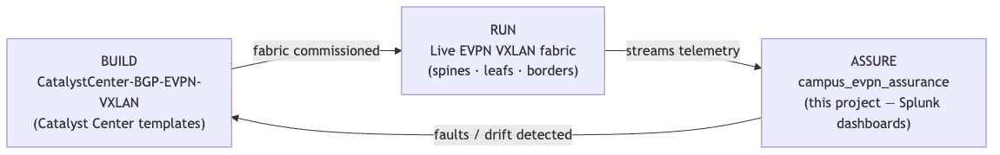
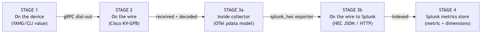
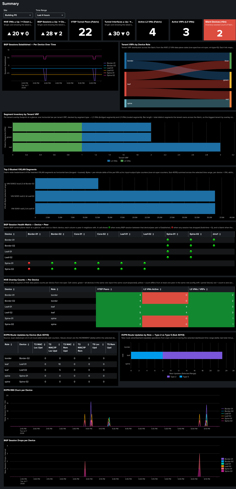

# Campus BGP EVPN Splunk Assurance

**Operational assurance dashboards for Cisco Catalyst BGP EVPN VXLAN campus fabrics.**

This project delivers a fully packaged Splunk application — `campus_evpn_assurance` — that
turns streaming telemetry from a BGP EVPN VXLAN fabric into a role‑aware, at‑a‑glance health
picture for the network engineer on shift. It answers one question continuously: **is the
overlay fabric healthy right now, and if not, exactly what changed, where, and when?**

### Audience and how to read this document

This guide is written for a **CCIE‑level network engineer** who already understands BGP EVPN
VXLAN fabrics — VTEPs, L2/L3 VNIs, route reflectors, Type‑2/3/5 routes, and the usual
`show bgp …` / `show nve …` / `show l2vpn evpn …` troubleshooting workflow — but who may be
**new to streaming telemetry, OpenTelemetry (OTel), and Cisco Model‑Driven Telemetry (MDT)**.

| You already know… | This document teaches… |
|---|---|
| EVPN control‑plane and overlay semantics | How those same operational objects appear as **YANG‑modeled telemetry** and land in Splunk |
| SNMP polling and periodic `show` commands | **Push‑based MDT** — the switch streams state changes in seconds, not at the next poll |
| Splunk as a log/search platform | Splunk **metrics indexes**, `mstats`, and how dashboards query numeric time series |
| gRPC only as a vague “modern API” term | **MDT gRPC dial‑out** (what this fabric uses) vs **gNMI** (a different protocol — not used here) |

**Suggested reading order**

1. **Operators on shift** — [What This Project Is For](#what-this-project-is-for) → [Architecture at a Glance](#architecture-at-a-glance) → [Operator's Guide](#operators-guide-reading-the-dashboards). Skim telemetry sections on first pass; return when wiring collectors.
2. **Installing the stack** — [`SETUP_GUIDE.md`](SETUP_GUIDE.md) end to end, then [Deployment](#deployment).
3. **Telemetry / collector engineers** — [From CLI to streaming YANG](#from-cli-to-streaming-yang) → [Telemetry Foundations](#telemetry-foundations--how-the-data-gets-to-splunk) → [Worked Example](#worked-example-one-evpn-metric-end-to-end) → [`otel-collector/README.md`](otel-collector/README.md).
4. **Splunk app maintainers** — [`campus_evpn_assurance/README.md`](campus_evpn_assurance/README.md) (macros, `mstats` patterns, inventory lookup).

---

## Table of Contents

1. [What This Project Is For](#what-this-project-is-for)
2. [How It Fits: Build vs. Assure](#how-it-fits-build-vs-assure)
3. [Architecture at a Glance](#architecture-at-a-glance)
4. [From CLI to Streaming YANG](#from-cli-to-streaming-yang)
5. [Telemetry Foundations — How the Data Gets to Splunk](#telemetry-foundations--how-the-data-gets-to-splunk)
6. [Worked Example: One EVPN Metric, End to End](#worked-example-one-evpn-metric-end-to-end)
7. [Why a Metrics Index (and How You Query It)](#why-a-metrics-index-and-how-you-query-it)
8. [The Splunk App and Its Dashboards](#the-splunk-app-and-its-dashboards)
9. [Operator's Guide: Reading the Dashboards](#operators-guide-reading-the-dashboards)
10. [Deployment](#deployment)
11. [Repository Layout](#repository-layout)
12. [Reference Documents](#reference-documents)

---

## What This Project Is For

A BGP EVPN VXLAN campus fabric is a distributed system: dozens of switches, hundreds of
overlay segments (VNIs), per‑tenant VRFs, BGP route‑reflection, and a multicast underlay all
have to stay in lock‑step for a single host to talk to another. When something breaks — a VTEP
tunnel drops, a BGP session leaves *Established*, an L3VNI core SVI goes down — the symptom a
user reports ("I can't reach the app") is far removed from the cause.

Traditional SNMP polling and CLI spot‑checks are too slow and too manual to operate a fabric at
scale. **This project replaces that with continuous streaming telemetry and a purpose‑built
Splunk assurance suite** that:

- **Detects service‑impacting state changes in seconds**, not at the next poll interval.
- **Presents fabric posture top‑down** — a fabric‑wide **Summary** view, a **Details** view
  scoped by role (leaf / spine / border), and a consolidated **Alerts** triage view.
- **Pinpoints the failing object** — the exact device, BGP neighbor, VNI, or tenant VRF — so
  triage starts at the cause, not the symptom.

The result is a repeatable, beginner‑friendly operational baseline that a network team can
stand up per site.

---

## How It Fits: Build vs. Assure

This repository is the **assurance** half of a two‑part lifecycle. It is the companion to the
fabric **build** automation:

> **Companion build framework:**
> [**CatalystCenter‑BGP‑EVPN‑VXLAN**](https://github.com/imanassypov/CatalystCenter-BGP-EVPN-VXLAN)
> — a collection of Cisco Catalyst Center Jinja2 CLI templates that provision a complete
> spine‑leaf BGP EVPN VXLAN campus fabric (multi‑tenant VRFs, L2/L3 overlays, multicast, optional
> border/L3OUT handoff) onto Catalyst 9000 switches, GitOps‑style, at scale.

The two projects bracket the fabric's operational lifecycle:



| Phase | Project | Question it answers |
|---|---|---|
| **Build** | [CatalystCenter‑BGP‑EVPN‑VXLAN](https://github.com/imanassypov/CatalystCenter-BGP-EVPN-VXLAN) | "How do I provision a correct, consistent fabric from declarative intent?" |
| **Assure** | **This project** | "Now that the fabric is live, is it healthy — and if not, what broke?" |

You commission a site with the build framework. **Once that fabric is up and forwarding, this
assurance suite takes over** — validating that what was intended is what is actually running, and
watching it continuously thereafter. The two share the same fabric model (roles, tenants, VNIs,
loopbacks), so the dashboards' device inventory and expected‑state logic map directly onto what
the templates provisioned.

---

## Architecture at a Glance

The pipeline has three tiers: the **fabric** streams telemetry, a **collector** translates it,
and **Splunk** stores and visualizes it.


### Lab Infrastructure

A single consolidated cloud instance hosts all Splunk roles plus the telemetry collector — the
Search Head, Heavy Forwarder, indexer, and OpenTelemetry receiver are co‑located.

| Component | Host / Endpoint | Notes |
|---|---|---|
| Splunk (SH + HF + Indexer) | `18.224.25.161` | Cloud EC2; HEC on `:8088`, metrics index `evpn_assurance` |
| OpenTelemetry Collector (`yang_grpc`) | `18.224.25.161:57444` | Co‑located; gRPC/MDT dial‑out target |

### Fabric Telemetry Targets

The fabric switches configured to stream telemetry. Each device's `cisco.node_id` (its
hostname) is the key that joins every metric back to the role/site inventory in
[`campus_evpn_assurance/lookups/evpn_device_inventory.csv`](campus_evpn_assurance/lookups/evpn_device_inventory.csv).

| Device | Role | Streams to |
|---|---|---|
| spine1, spine2 | Spine (route reflector) | `18.224.25.161:57444` |
| leaf1, leaf2 | Leaf (access VTEP) | `18.224.25.161:57444` |
| border1, border2 | Border (L3 handoff VTEP) | `18.224.25.161:57444` |

Each switch is configured with `receiver ip address 18.224.25.161 57444 protocol grpc-tcp`
(see [`model-config-snippets/telemetry-subscriptions.ios-xe.cfg`](model-config-snippets/telemetry-subscriptions.ios-xe.cfg)).

---

## From CLI to Streaming YANG

If you troubleshoot EVPN fabrics with CLI today, you already inspect the same operational
objects this project streams. The difference is *delivery*: instead of SSH and human parsing,
IOS‑XE **pushes** structured updates when state changes (or on a periodic timer).

| Familiar CLI (what you trust today) | YANG operational model streamed | Splunk dashboard (where it surfaces) |
|---|---|---|
| `show nve peers` | `Cisco-IOS-XE-nve-oper` → `nve-peer-oper` | **Details** → NVE peer adjacency, reachability |
| `show nve vni` | `nve-vni-oper`, `nve-vni-oper-counters` | Scorecards, per‑VNI throughput (Sub 40115) |
| `show bgp … neighbors` | `Cisco-IOS-XE-bgp-oper` → `neighbors/neighbor` | BGP scorecards, Device × Peer matrix |
| `show l2vpn evpn …` | `Cisco-IOS-XE-evpn-oper`, `evpn-stats` | EVPN route updates, RIB churn (Sub 40113) |
| `show interfaces …` (Tunnel/NVE) | `Cisco-IOS-XE-interfaces-oper` (Subs 40120/40121) | Tunnel interface Up/Down scorecards |

**Subscriptions** tie it together on the device. Each `telemetry ietf subscription <id>` selects a
YANG subtree (e.g. `/nve-oper-data/nve-oper/nve-peer-oper`) and a **sensor group** that defines
*when* to send (on‑change vs periodic). The CLI snippet file
[`model-config-snippets/telemetry-subscriptions.ios-xe.cfg`](model-config-snippets/telemetry-subscriptions.ios-xe.cfg)
is the authoritative list of subscription IDs **40101–40121** used by this lab fabric.

> **Mental model:** think of MDT as “`show` commands that run themselves and ship JSON‑like
> structure to a collector.” Splunk stores the numeric measurements; dashboards are the new
> always‑on `show` summary.

---

## Telemetry Foundations — How the Data Gets to Splunk

> **New to streaming telemetry or OpenTelemetry?** This section explains how data flows from the
> switches to Splunk and why terminology (gRPC, MDT, gNMI, OTLP) is easy to conflate. If you
> already run the pipeline, skip to [the worked example](#worked-example-one-evpn-metric-end-to-end).

### A telemetry pipeline has two halves

Every telemetry pipeline is two independent halves joined by a **collector** in the middle:


- **Left (device → collector):** the switches *stream* their operational data.
- **Middle (the collector):** software that *catches* the stream and *forwards* it.
- **Right (collector → Splunk):** the data is delivered to Splunk as HTTP events (HEC).

The **OpenTelemetry Collector** is the only moving part you deploy and tune. The switches and
Splunk sit on either side of it and are configured independently — like a courier between a
factory (switches) and a warehouse (Splunk): it picks up at one dock (gRPC) and delivers to
another (HTTP HEC).

### Why the collector "receives gRPC"

Because **the switches decide the protocol, not the collector.** The IOS‑XE devices are
configured for **Model‑Driven Telemetry (MDT)** over **gRPC dial‑out**, and that config lives on
the switch:

```
receiver ip address 18.224.25.161 57444 protocol grpc-tcp
```

Any collector they point at *must* speak gRPC to receive that stream. OTel's `yang_grpc`
receiver is simply OpenTelemetry's way of accepting that gRPC feed.

### Terminology that trips people up

These four terms are *not* the same thing:

| Term | What it is | Where it appears here |
|---|---|---|
| **gRPC** | The transport — the "pipe" (Google's RPC framework). | Device → collector on `:57444` |
| **Cisco MDT** | Model‑Driven Telemetry: the switch *pushes* operational data, encoded as **KV‑GPB** (key‑value Protocol Buffers). | What the fabric actually streams (`grpc-tcp` dial‑out) |
| **gNMI** | A *different*, standardized telemetry/config protocol (also over gRPC), usually *dial‑in*. | **Not** used here — our devices use MDT dial‑out |
| **OTLP** | OpenTelemetry Protocol: the open‑standard *wire format*. | The collector's **internal data model** only |

> A common slip is to call the device feed "gNMI." What this fabric uses is **MDT gRPC dial‑out**
> (KV‑GPB). The receiver is named `yang_grpc` because it parses the YANG‑modeled data arriving
> over gRPC.

### Why "OpenTelemetry"? (and what OTLP is)

**OpenTelemetry (OTel)** is the name of an open‑source observability project hosted by the CNCF
(the foundation behind Kubernetes). The word "telemetry" here means the broad industry concept of
*observability data* — **not** Cisco's telemetry feature. So two unrelated things share the word:

- **Model‑Driven Telemetry (MDT)** = Cisco's feature where switches stream stats (the *data source*).
- **OpenTelemetry (OTel)** = the open‑source *collector framework* in the middle.

OpenTelemetry is also an open data‑format standard, **OTLP**. But **our pipeline never puts OTLP
on the wire** — the collector uses OTel's internal model only as an in‑memory translation layer:

```
receiver  →  internal data model (pdata)  →  exporter
(Cisco KV-GPB)   (OTel standard, in memory)    (Splunk HEC JSON)
```

The collector is a **format translator**: Cisco‑in, Splunk‑out, OTel‑standard‑in‑the‑middle. We
get the benefit of a normalized model (swap sources/destinations freely) without OTLP ever
crossing the network.

> **One‑line takeaway:** the switches push **Cisco MDT over gRPC**; the collector ships **HTTP
> HEC events** to Splunk; "OpenTelemetry" names the collector framework doing the translation.

---

## Worked Example: One EVPN Metric, End to End

To make the transformation concrete, follow **a single real EVPN metric** from switch to
dashboard: the **operational state of an NVE (VXLAN) peer** on the VTEP `leaf1` — its peer
`2.2.2.2` for VNI `30000`. The peer‑state is an enum we encode numerically as **`1` = UP**
(`0` = down), which is exactly how you'd alert on a VTEP losing a tunnel peer.



The **same value (`1` = UP)** travels through every stage — only its *packaging* changes.

### Stage 1 — On the device (the source value)

The switch holds the peer's state as a YANG‑modeled operational leaf:

```text
leaf1# show nve peers
Interface  VNI    Type   Peer-IP    RMAC/Num_RTs   eVNI    state  flags    UP time
nve1       30000  L3CP   2.2.2.2    cc70.ed5a.9367 30000   UP     A/-/4    00:05:36
```

```text
/nve-oper-data/nve-oper/nve-peer-oper[peer-addr=2.2.2.2]/peer-state  = UP   (enum)
```

> **Reading `[peer-addr=2.2.2.2]` — a YANG list key predicate.** `nve-peer-oper` is a **list** (a
> table with one row per peer). The bracket selects one specific row — "the peer whose
> `peer-addr` equals `2.2.2.2`" — the YANG equivalent of a SQL `WHERE` clause. This is the origin
> of the **dimension vs. metric** split: the key (`peer-addr=2.2.2.2`) identifies *which* peer the
> measurement is about → it becomes a Splunk **dimension**; the leaf (`peer-state=UP` → `1`) is the
> *measurement* → it becomes the Splunk **metric value**.

### Stage 2 — On the wire to the collector (Cisco KV‑GPB over gRPC)

The device serializes the update as **KV‑GPB** and streams it over gRPC dial‑out (binary; shown
decoded):

```text
telemetry_data {
  node_id_str:    "leaf1"
  encoding_path:  "Cisco-IOS-XE-nve-oper:nve-oper-data/nve-oper/nve-peer-oper"
  data_gpbkv {
    fields { key: "peer-addr"   string_value: "2.2.2.2" }   # key  → dimension
    fields { key: "vni"         uint32_value: 30000 }       # key  → dimension
    fields { key: "peer-state"  string_value: "UP" }        # measured value
  }
}
```

### Stage 3a — Inside the collector (OTel internal model / pdata)

The `yang_grpc` receiver decodes the GPB, maps the `UP` enum to `1`, and normalizes it into
OpenTelemetry's in‑memory model. Nothing is on the wire here:

```text
Metric  name: evpn.nve.peer.state   type: Gauge   unit: "1"   (1 = UP, 0 = down)
  DataPoint value: 1
    attributes: host="leaf1", peer_addr="2.2.2.2", vni="30000", ...
```

### Stage 3b — On the wire to Splunk (Splunk HEC JSON over HTTP)

The `splunk_hec` exporter converts the point into a Splunk HEC metric event and POSTs it to
`https://localhost:8088/services/collector`. Splunk's convention: any field named
`metric_name:<name>` is the (numeric) measurement; everything else is a dimension.

```json
{
  "time": 1750000000.000, "host": "leaf1", "index": "evpn_assurance", "event": "metric",
  "fields": {
    "metric_name:evpn.nve.peer.state": 1,
    "peer_addr": "2.2.2.2", "vni": "30000"
  }
}
```

### Stage 4 — In the Splunk metrics store

Splunk stores one point in the `evpn_assurance` metrics index: a timestamp, a measurement, and a
set of dimensions.

| Field | Value | Role |
|---|---|---|
| `_time` | `2025-06-15 12:26:40` | timestamp |
| `metric_name` | `evpn.nve.peer.state` | metric identity |
| `_value` | `1` | the measurement (1 = UP) |
| `host` / `peer_addr` / `vni` | `leaf1` / `2.2.2.2` / `30000` | dimensions |

You'd query it with Splunk's metrics search to list any **down** peer:

```spl
| mstats latest(_value) AS peer_state
  WHERE index=evpn_assurance AND metric_name="evpn.nve.peer.state"
  BY host, peer_addr, vni span=1m
| where peer_state=0
```

### The whole journey at a glance

| Stage | Where | Format | How the value `1` (UP) appears |
|---|---|---|---|
| 1 | On `leaf1` | YANG leaf / CLI | `.../nve-peer-oper[peer-addr=2.2.2.2]/peer-state = UP` |
| 2 | Device → collector | Cisco KV‑GPB / gRPC | `fields{ key:"peer-state" string_value:"UP" }` |
| 3a | Inside collector | OTel pdata (memory) | `DataPoint value:1, attrs{...}` |
| 3b | Collector → Splunk | Splunk HEC JSON / HTTP | `"metric_name:evpn.nve.peer.state": 1` |
| 4 | Splunk metrics store | Metrics index point | `metric_name=evpn.nve.peer.state, _value=1` |

> **Key idea:** the *measurement never changes* — the peer is UP (`1`) at every stage. What
> changes is the envelope around it. The collector's entire job is to re‑wrap that peer state so
> each system understands it.

---

## Why a Metrics Index (and How You Query It)

Splunk has two kinds of index: **event** indexes (raw text like syslog) and **metrics** indexes
(numeric measurements with dimensions). EVPN telemetry uses a **metrics** index (`evpn_assurance`)
because the data is fundamentally numeric time series — peer states, session counts, byte
counters — and metrics indexes store and aggregate those far more efficiently than event search.

The dashboards query it almost exclusively with **`mstats`**, the metrics workhorse:

```spl
| mstats latest("cisco.negotiated-keepalive-timers.hold-time") AS hold_time
    WHERE `evpn_index`
      "cisco.encoding_path"="Cisco-IOS-XE-bgp-oper:bgp-state-data/neighbors/neighbor"
    BY "cisco.node_id", "vrf-name", "neighbor-id"
| `evpn_lookup`
| where site="$site$"
```

Two app macros keep this consistent across every panel:

| Macro | Expands to | Purpose |
|---|---|---|
| `` `evpn_index` `` | `index=evpn_assurance` | Routes every search at the metrics index |
| `` `evpn_lookup` `` | `rename "cisco.node_id" AS hostname \| lookup evpn_device_inventory ...` | Joins each metric's device key to its **site / role / loopback** from the inventory CSV |

> **A critical detail — string enums never become metrics.** Splunk's metrics index silently
> discards string‑only values. So a YANG `enumeration` leaf (like BGP `session-state` or NVE
> `vni-oper-state`) cannot be queried as a metric on its own. The dashboards work around this in
> two ways: (1) they key BGP up/down off the **numeric** negotiated `hold-time` (non‑zero only
> while *Established*); and (2) the patched `yang_grpc` receiver emits a numeric companion metric
> and carries the enum string in a `value` *dimension* you can filter on. This is why, for
> example, the BGP scorecards use `count(hold_time>0)` for **Up** and `count(hold_time==0)` for
> **Down**.

---

## The Splunk App and Its Dashboards

A fully packaged Splunk app provides the operational health dashboards.

| Item | Value |
|---|---|
| App name | `campus_evpn_assurance` |
| App version | `1.5.0` (build 85) |
| Installed path | `/opt/splunk/etc/apps/campus_evpn_assurance/` |
| Splunk version | 10.4.0 |
| Dashboards | **Dashboard Studio** (`<dashboard version="2">`, native `splunk.sankey`) |
| Source of truth | [`campus_evpn_assurance/lookups/evpn_device_inventory.csv`](campus_evpn_assurance/lookups/evpn_device_inventory.csv) |
| Metrics index | `evpn_assurance` |

> **Dashboard Studio, not Simple XML.** The dashboards were migrated from Classic Simple XML to
> Dashboard Studio (version 2) ahead of Simple XML deprecation. All Sankey flow diagrams use the
> **native** `splunk.sankey` visualization — no custom‑visualization app or D3 bundle is required.

The app ships **three views**, navigable as tabs:

| Tab (nav label) | View file | Scope | Focus |
|---|---|---|---|
| **Summary** | `executive_overview.xml` | Entire fabric (all roles) | Fabric‑wide posture: is anything red or churning? |
| **Details** | `node_details.xml` | **Role filter** (leaf / spine / border) | Deep dive on one fabric tier — same panels, scoped by the **Fabric Node Role** dropdown |
| **Alerts** | `alerts.xml` | All roles | Triage landing pad — what fired, when, where |

> **Design change (v1.5.0):** the former separate Leafs, Spines, and Borders tabs were consolidated
> into a single **Details** view with a role selector. Operators pick `Leafs`, `Spines`, or
> `Borders` from the dropdown instead of switching tabs.

---

## Operator's Guide: Reading the Dashboards

This section is written for the network engineer on shift. It explains, view by view, **what each
dashboard presents** and **how to interpret every metric** — what a healthy fabric looks like, and
what a number or color is telling you when something is wrong.

### How the dashboards are organized

The app is a **role‑segmented assurance suite** designed for **top‑down** triage:

```
Summary (fabric posture)  →  (something is red/non-zero)  →  Details (pick role: Leaf / Spine / Border)
                                                                      ↓
                                                               Alerts (what fired, when, where)
```

Every view shares global header controls:

| Control | Where | Default | Behaviour |
|---|---|---|---|
| **Site** dropdown | Summary, Details, Alerts | First site alphabetically | Scopes every panel to one site. Populated from the inventory CSV. |
| **Time Range** picker | Summary, Details, Alerts | Last 4 hours | **Trend/chart** panels honour this window. **Scorecard cards** and **state tables** read the *latest snapshot* regardless of the picker. |
| **Fabric Node Role** dropdown | **Details only** | `Leafs` | Filters all panels to `leaf`, `spine`, or `border` devices via the inventory lookup. |

> **Why two time behaviours?** A scorecard answers "is the fabric healthy *right now*?" — it must
> ignore the picker. A trend answers "what changed *over the window I selected*?" — it must honour
> it. Widening the picker to 24 h redraws the line charts but does not change the cards.

### How to read the health scorecard row

**Summary** and **Details** open with the same scorecard pattern. On **Summary**, tiles aggregate
the whole fabric; on **Details**, the same tiles are scoped to the selected **Fabric Node Role**.
Read left to right as a go/no‑go strip:

| Tile | What it counts | Healthy reading | Investigate when |
|---|---|---|---|
| **NVE VNIs ▲ Up / ▼ Down** | Latest oper‑state of every VXLAN segment (VNI) | `▼ 0` | `▼` non‑zero → a VNI's core SVI or access VLAN is operationally down |
| **BGP Sessions ▲ Up / ▼ Down** | Neighbors with negotiated hold‑time (Established) vs. not | `▼ 0` | `▼` non‑zero → one or more EVPN/underlay peers are not Established |
| **Tunnel Interfaces ▲ Up / ▼ Down** | Tunnel* interface oper‑state (Subs 40120/40121) | `▼ 0` | `▼` non‑zero → underlay/overlay tunnel interface down |
| **VTEP Tunnel Peers** | Distinct remote VTEP IPs each device tunnels to, summed | Stable, matches design | Drops below expected mesh → a VTEP went away |
| **Active L2 VNIs** | Distinct L2 (bridge‑domain) segments | Matches provisioned count | Lower than expected → a segment is missing |
| **Active VRFs / L3 VNIs** | Distinct L3 (tenant) segments | Matches tenant count | Lower than expected → a tenant VRF dropped |
| **Silent Devices / Nodes (>5m)** | Devices with no telemetry in 5 min | `0` | Non‑zero → switch stopped streaming (down, or telemetry broke) |

> **Reading the ▲/▼ cards.** Each tile shows both halves of a binary state, e.g. `▲ 14   ▼ 0`.
> The **▲ (up)** count is capacity/scale; the **▼ (down)** count is the alarm. All `▼ 0` and
> `Silent 0` across the row means control plane and overlay are converged.

### Role-specific expectations (Details view)

When you change **Fabric Node Role**, the same panels apply — but healthy baselines differ:

| Role | NVE / L2 VNI tiles | BGP tile | What to focus on |
|---|---|---|---|
| **Leafs** | Should show active L2 and L3 VNIs | Sessions to both spines (RRs) | Per‑VNI reachability, MAC/route churn, access overlay faults |
| **Spines** | **NVE VNIs and L2/L3 VNIs normally `0`** — pure route reflector | Session to every leaf and border | RR peering completeness, prefix distribution, EVPN reflection |
| **Borders** | **L2 VNIs often low/0**; L3 VNIs match tenant egress | Spine + external eBGP sessions | L3 VNI termination, tenant egress throughput |

### View 1 — Summary (fabric posture, all roles)

**Purpose:** one screen answering "is the whole fabric healthy, and is anything churning?"
**Start every shift here.**



| Panel | What it shows | How to read it |
|---|---|---|
| **Scorecard row** (7 tiles) | Fabric‑wide aggregate state incl. tunnel interfaces | All `▼ 0` / `Silent 0` = converged. Any red → open **Details** with the implicated role. |
| **BGP Sessions Established — Per Device Over Time** | One line per device, Established neighbor count | Flat = stable. Dip then recover = flap; sustained drop = peer down. |
| **Tenant VRFs by Device Role** (Sankey) | Which roles host which tenant VRFs (L3 VNI presence) | Leaves/borders carry tenant VRFs; spines should not. Missing tenant = provisioning gap. |
| **Segment Inventory by Tenant VRF** | Stacked bar per tenant: L2 vs L3 VNI counts | Segment census — confirm each tenant has expected L2 count and an L3 VNI. |
| **Top 3 Busiest VXLAN Segments** | Leaderboard by VXLAN bytes (Sub 40115) | Hot‑spot view; unexpected VNI at top warrants investigation. |
| **BGP Session Health Matrix — Device × Peer** | Heatmap: 🟢 all sessions Up, 🔴 any Down, blank = no peering | Scan for red cells. Rows/columns driven by inventory lookup. |
| **NVE Overlay Counts — Per Device** | Per‑device VTEP peers, active L2/L3 VNIs | Green = role peers agree; yellow = drift; red = zero overlay. |
| **EVPN Route Updates by Device / by Role** (Sub 40113) | New route advertisement deltas in the time window | Control‑plane work rate — not current RIB size. |
| **EVPN RIB Churn / BGP Session Drops per Device** | Route table version churn and session drop deltas | Sustained spikes = reconvergence or flapping. |

### View 2 — Details (role-scoped deep dive)

**Purpose:** the former Leafs / Spines / Borders views in one place. Select **Fabric Node Role**
and every panel filters to that tier. **Most overlay faults surface on Leafs** — that is the
default dropdown value.

| Panel | What it shows | How to read it |
|---|---|---|
| **Scorecard row** | Role‑scoped posture (same tiles as Summary) | Compare against role expectations above. |
| **BGP Established Sessions per Node** | Established count per device over time | Leafs: steady sessions to both spines. Spines: session to every VTEP. |
| **L3 VNI (VRF) Count per Node** | Tenant VRF count per device | Confirms which nodes terminate which tenants. |
| **BGP EVPN / IPv4 Session State** | Per‑neighbor session tables | Per‑device truth — check state and peer. |
| **Tunnel Interface Status** | Tunnel* oper‑state detail | Underlay/overlay tunnel health on selected role. |
| **BGP Session Drops / EVPN RIB Churn per Node** | Per‑node delta charts | Single node spiking = local instability. |
| **NVE Peers Over Time** | VTEP tunnel peer count | Step down = remote VTEP went away. |
| **VXLAN Throughput / BUM / Packet Rate per Node** (Sub 40115) | Overlay load and flooding ratio | High BUM % can indicate flooding or missing MAC learning. |
| **Top VXLAN Segments by Throughput** | Busiest VNIs on this role | Narrows hot nodes to specific segments. |
| **NVE Peer Adjacency** (Sankey) | Device → VNI → VTEP peer | Which peers exchange which VNIs. |
| **EVPN VNI Binding — Control Plane / Data Plane (NVE)** (Sankey) | EVI → L3 VNI → L2 VNI → VLAN chain | End‑to‑end binding integrity; a break = mis‑stitched segment. |

### View 3 — Alerts (what fired, when, where)

**Purpose:** triage landing pad — alarm counts, active‑alert table, BGP trend for context.

| Panel | What it shows | How to read it |
|---|---|---|
| **BGP Sessions Not Established** | Count of down BGP sessions, fabric‑wide | `0` = clean. Non‑zero = first alarm. |
| **Telemetry Stale Devices (>5 min silent)** | Devices that stopped streaming | Non‑zero → check collector before assuming device fault. |
| **NVE VNIs Down Over Time** | Trend of operationally down VNIs | `0` = all segments up. Rise pinpoints when a VNI failed. |
| **Active Alerts — All Roles** | Consolidated worklist with severity | Each row names device, role, and object (e.g. `VNI 50901`). |
| **BGP Sessions Not Established — Detail** | Per‑session breakdown of down neighbors | Exact device/neighbor/VRF behind the count tile. |
| **BGP Session Trend** | BGP session count over time | Confirms flap vs sustained outage. |

### Recommended triage workflow

1. **Summary** — scan the scorecard row. All `▼ 0` / `Silent 0` = healthy; stop here.
2. If a card is red, note **which** (BGP? VNI? Tunnel? Silent?) and check the matching Summary
   trend/table for *when* and *how much*.
3. **Details** — set **Fabric Node Role** to the tier implicated (leaf for overlay faults, spine
   for RR peering, border for egress).
4. Use **per‑node** trends to find the offending switch, then **EVPN VNI Binding** Sankeys
   (overlay/binding faults) or **BGP EVPN Session State** (control‑plane faults) for the exact
   VNI or neighbor.
5. **Alerts** — confirm what fired, severity, and the precise object in the Active Alerts table.

---

## Deployment

Use the packaging scripts in [`packaging/`](packaging/) to produce either:

- a clean Splunk app package (`campus_evpn_assurance-<version>.spl`), or
- a customer handoff bundle that includes the app package, the OTel collector files,
  and the patched receiver source tarball `receiver_yang_26_05_27.tar.gz`.

```bash
cd "Campus BGP EVPN Splunk Assurance"

# Build only the Splunk app package.
./packaging/build-app.sh

# Build the full handoff bundle (.spl + SETUP_GUIDE + otel-collector/).
./packaging/build-handoff-bundle.sh
```

The generated files land in `packaging/dist/`. For end-to-end customer installation,
follow [`SETUP_GUIDE.md`](SETUP_GUIDE.md).

A repeatable validator, [`tools/validate_studio.py`](tools/validate_studio.py), runs three tiers
of checks against the live instance — server‑side fetch, internal structure, and **execution of
every panel's SPL** — and reports per‑panel results.

---

## Repository Layout

```text
campus_evpn_assurance/            # The Splunk app (deployable source)
  app.manifest                    # Modern Splunk packaging manifest (AppInspect)
  README.md                       # In-app documentation shown to installers
  default/
    app.conf                      # App metadata (version 1.5.0, build 85)
    macros.conf                   # evpn_index, evpn_lookup, evpn_lb macros
    transforms.conf               # evpn_device_inventory lookup definition
    ui-prefs.conf                 # enable_javascript = true
    data/ui/
      nav/default.xml             # Tab navigation (Summary · Details · Alerts)
      views/                      # Dashboard Studio version-2 views:
        executive_overview.xml    #   Summary — fabric-wide posture
        node_details.xml          #   Details — role-scoped deep dive (leaf/spine/border)
        alerts.xml                #   Triage landing pad
  lookups/evpn_device_inventory.csv   # Source of truth: hostname → site/role/loopback
  metadata/default.meta
  appserver/static/dashboard.css  # Shared Dashboard Studio stylesheet

packaging/                        # Build scripts for the .spl and handoff bundle
  build-app.sh                    # Builds campus_evpn_assurance-<version>.spl
  build-handoff-bundle.sh         # Builds the full customer handoff bundle
  make_icons.py                   # Regenerates the launcher icons
  evpn_device_inventory.template.csv  # Blank inventory template for customers
  dist/                           # Build output (gitignored)

SETUP_GUIDE.md                    # Customer install guide for Splunk + OTel collector

otel-collector/                   # OpenTelemetry Collector config + notes
  builder.yaml                    # OCB manifest for the patched otelcol-yangfix build
  receiver_yang_26_05_27.tar.gz   # Patched yang_grpc receiver source bundle
  systemd/override.conf.example   # Reversible ExecStart override for the custom binary

model-config-snippets/            # IOS-XE telemetry subscription CLI (Subs 40101–40121)
telegraf/                         # Alternative Telegraf collector reference (lab)
tools/                            # validate_studio.py (+ migration helper)
images/                           # Diagram PNGs (+ .mmd sources); see images/README.md
  regenerate-diagrams.sh          # Rebuild all diagram PNGs from Mermaid sources
```

---

## Reference Documents

| Document | Contents |
|---|---|
| [`SETUP_GUIDE.md`](SETUP_GUIDE.md) | Install Splunk app + patched `otelcol-yangfix`, HEC, device subscriptions |
| [`campus_evpn_assurance/README.md`](campus_evpn_assurance/README.md) | App macros, `mstats` query patterns, inventory lookup, troubleshooting |
| [`otel-collector/README.md`](otel-collector/README.md) | Live collector config, numeric YANG key patch, build/rollback, troubleshooting |
| [`telegraf/README.md`](telegraf/README.md) | Alternative Telegraf-based collector reference (separate lab deployment) |
| [`Model Maps/README.md`](Model Maps/README.md) | CLI ⇄ Cisco YANG xpath mappings (internal reference; gitignored in some clones) |
| [`images/README.md`](images/README.md) | Diagram asset list and PNG regeneration |
| [`model-config-snippets/telemetry-subscriptions.ios-xe.cfg`](model-config-snippets/telemetry-subscriptions.ios-xe.cfg) | IOS-XE subscription IDs 40101–40121 and MDT receiver stanza |
| **Companion build framework:** [CatalystCenter‑BGP‑EVPN‑VXLAN](https://github.com/imanassypov/CatalystCenter-BGP-EVPN-VXLAN) | Catalyst Center templates that provision the fabric this suite assures |
