# Campus BGP EVPN Splunk Assurance

**Operational assurance for Cisco Catalyst BGP EVPN VXLAN campus fabrics.**

## Abstract

BGP EVPN VXLAN fabrics are distributed systems: overlay segments, tenant VRFs, route
reflection, and underlay multicast must stay converged for end-to-end reachability. When a VTEP
tunnel drops or a BGP session leaves *Established*, the user-visible symptom is far from the
root cause.

This project delivers `campus_evpn_assurance` — a Splunk application that turns **Model-Driven
Telemetry (MDT)** from Catalyst switches into role-aware health dashboards. It answers one
question continuously: **is the overlay fabric healthy right now, and if not, what changed,
where, and when?**

The pipeline is: IOS-XE YANG operational models → MDT gRPC dial-out → OpenTelemetry Collector
(`yang_grpc` receiver) → Splunk HEC → metrics index `evpn_assurance` → Dashboard Studio views.

---

## Table of Contents

1. [Introduction](#1-introduction)
2. [Lifecycle Context](#2-lifecycle-context)
3. [System Architecture](#3-system-architecture)
4. [Telemetry and Data Model](#4-telemetry-and-data-model)
5. [Splunk Application](#5-splunk-application)
6. [Operator's Guide](#6-operators-guide)
7. [Deployment](#7-deployment)
8. [Repository Layout](#8-repository-layout)
9. [References](#9-references)

---

## 1. Introduction

### Audience

Written for a **CCIE-level network engineer** who understands BGP EVPN VXLAN — VTEPs, L2/L3
VNIs, route reflectors, Type-2/3/5 routes, and `show bgp` / `show nve` / `show l2vpn evpn`
troubleshooting — but who may be new to **streaming telemetry, OpenTelemetry, and Cisco MDT**.

| You already know… | This document teaches… |
|---|---|
| EVPN control-plane and overlay semantics | How operational objects appear as **YANG-modeled telemetry** in Splunk |
| SNMP polling and periodic `show` commands | **Push-based MDT** — state changes stream in seconds |
| Splunk as a log/search platform | **Metrics indexes**, `mstats`, and dashboard time-series queries |
| gRPC as a vague “modern API” term | **MDT gRPC dial-out** (used here) vs **gNMI** (not used here) |

### Reading paths

| Role | Start here | Then |
|---|---|---|
| **Operator on shift** | [§3](#3-system-architecture) → [§6](#6-operators-guide) | Skim [§4](#4-telemetry-and-data-model) on first pass |
| **Installer** | [§7 Deployment](#7-deployment) | [§3](#3-system-architecture) |
| **Telemetry engineer** | [§4](#4-telemetry-and-data-model) | [`otel-collector/README.md`](otel-collector/README.md) |
| **Splunk maintainer** | [`campus_evpn_assurance/README.md`](campus_evpn_assurance/README.md) | Macros, `mstats` patterns, inventory lookup |

### At a glance

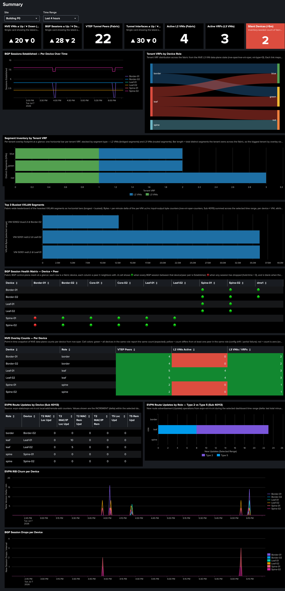

The **Summary** tab is the shift-start view in `campus_evpn_assurance`: fabric-wide scorecards
(NVE VNIs, BGP sessions, tunnel interfaces, silent devices), tenant VRF placement, segment
inventory, VXLAN load, BGP health matrix, EVPN route churn, and session-drop trends — all from
streaming MDT into metrics index `evpn_assurance`.

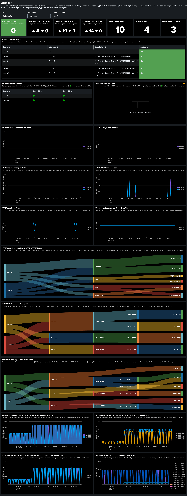

The **Details** tab filters the same telemetry by **Fabric Node Role**. Above: **Leafs** —
per-node BGP and tunnel state, NVE peer adjacency Sankeys, EVPN control-plane vs data-plane VNI
binding, and VXLAN throughput (Subs 40113/40115). Spines and Borders use the same layout with
role-appropriate expectations ([§6.3](#63-details-dashboard)).

One telemetry pipeline replaces shift-long `show bgp` sweeps. The
[Operator's Guide](#6-operators-guide) walks each Summary and Details panel row with cropped
snippets from `images/snippets/`.

---

## 2. Lifecycle Context

This repository is the **assurance** half of a two-part fabric lifecycle. The **build** half is
[**CatalystCenter-BGP-EVPN-VXLAN**](https://github.com/imanassypov/CatalystCenter-BGP-EVPN-VXLAN)
— Catalyst Center Jinja2 templates that provision spine-leaf BGP EVPN VXLAN fabrics at scale.

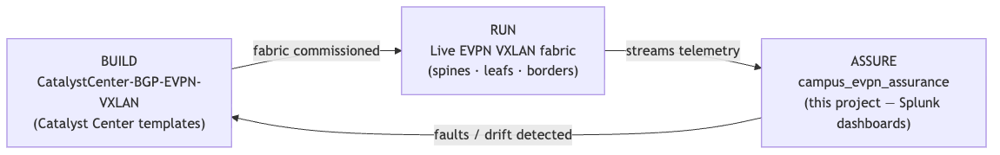

| Phase | Project | Question |
|---|---|---|
| **Build** | [CatalystCenter-BGP-EVPN-VXLAN](https://github.com/imanassypov/CatalystCenter-BGP-EVPN-VXLAN) | How do I provision a correct fabric from intent? |
| **Assure** | **This project** | Is the live fabric healthy — and if not, what broke? |

Both projects share the same fabric model (roles, tenants, VNIs, loopbacks). The dashboard
inventory lookup maps directly onto what the build templates provisioned.

---

## 3. System Architecture

Three tiers: **fabric** streams telemetry, a **collector** translates it, **Splunk** stores and
visualizes it.


### Lab infrastructure

A single cloud instance hosts Splunk (Search Head, Heavy Forwarder, indexer) and the telemetry
collector co-located.

| Component | Endpoint | Notes |
|---|---|---|
| Splunk | `18.224.25.161` | HEC `:8088`, metrics index `evpn_assurance` |
| OTel Collector (`yang_grpc`) | `18.224.25.161:57444` | MDT gRPC dial-out target |

### Fabric telemetry targets

Each device's `cisco.node_id` (hostname) joins metrics to
[`campus_evpn_assurance/lookups/evpn_device_inventory.csv`](campus_evpn_assurance/lookups/evpn_device_inventory.csv).

| Device | Role | Receiver |
|---|---|---|
| spine1, spine2 | Spine (RR) | `18.224.25.161:57444` |
| leaf1, leaf2 | Leaf (VTEP) | `18.224.25.161:57444` |
| border1, border2 | Border (L3 handoff) | `18.224.25.161:57444` |

Device stanza: `receiver ip address 18.224.25.161 57444 protocol grpc-tcp` — see
[`model-config-snippets/telemetry-subscriptions.ios-xe.cfg`](model-config-snippets/telemetry-subscriptions.ios-xe.cfg).

---

## 4. Telemetry and Data Model

### 4.1 CLI to streaming YANG

IOS-XE **pushes** structured updates on change (or on a timer) instead of waiting for SSH and
human parsing. Subscription IDs **40101–40121** in
[`telemetry-subscriptions.ios-xe.cfg`](model-config-snippets/telemetry-subscriptions.ios-xe.cfg)
are authoritative for this lab.

| CLI | YANG model | Dashboard surface |
|---|---|---|
| `show nve peers` | `Cisco-IOS-XE-nve-oper` → `nve-peer-oper` | Details → NVE peer adjacency |
| `show nve vni` | `nve-vni-oper`, `nve-vni-oper-counters` | Scorecards, VXLAN throughput (Sub 40115) |
| `show bgp … neighbors` | `Cisco-IOS-XE-bgp-oper` → `neighbors/neighbor` | BGP scorecards, Device × Peer matrix |
| `show l2vpn evpn …` | `Cisco-IOS-XE-evpn-oper`, `evpn-stats` | EVPN route updates, RIB churn (Sub 40113) |
| `show interfaces …` (Tunnel/NVE) | `Cisco-IOS-XE-interfaces-oper` (40120/40121) | Tunnel interface scorecards |

> **Mental model:** MDT is "`show` commands that run themselves and ship structured data to a
> collector." Dashboards are the always-on summary.

### 4.2 Pipeline semantics


| Term | Role here |
|---|---|
| **gRPC** | Transport on `:57444` (device → collector) |
| **Cisco MDT** | Push telemetry encoded as **KV-GPB** (`grpc-tcp` dial-out) |
| **gNMI** | Different protocol — **not used** in this fabric |
| **OpenTelemetry** | Collector framework; **OTLP never crosses the wire** |

```
receiver (Cisco KV-GPB)  →  pdata (in memory)  →  exporter (Splunk HEC JSON)
```

The collector is a format translator: Cisco-in, Splunk-out. See
[`otel-collector/README.md`](otel-collector/README.md) for build, patch, and troubleshooting.

### 4.3 Worked example — one NVE peer metric

Follow **NVE peer state** on `leaf1` for peer `2.2.2.2`, VNI `30000` (`1` = UP, `0` = down).

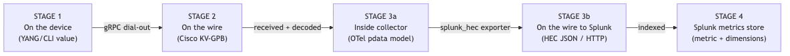

**On device (CLI + YANG):**

```text
leaf1# show nve peers
nve1  30000  L3CP  2.2.2.2  ...  UP  ...

/nve-oper-data/nve-oper/nve-peer-oper[peer-addr=2.2.2.2]/peer-state = UP
```

List keys like `[peer-addr=2.2.2.2]` become Splunk **dimensions**; leaf values become **metrics**.

**On wire (KV-GPB, decoded):** `node_id_str: "leaf1"`, `peer-state: "UP"`, keys `peer-addr`,
`vni`.

**In Splunk (HEC JSON):** `"metric_name:evpn.nve.peer.state": 1`, dimensions `peer_addr`, `vni`.

**Query down peers:**

```spl
| mstats latest(_value) AS peer_state
  WHERE index=evpn_assurance AND metric_name="evpn.nve.peer.state"
  BY host, peer_addr, vni span=1m
| where peer_state=0
```

### 4.4 Metrics index and query patterns

EVPN telemetry lands in metrics index `evpn_assurance` (not event search). Dashboards use
`mstats` with two app macros:

| Macro | Expands to | Purpose |
|---|---|---|
| `` `evpn_index` `` | `index=evpn_assurance` | Route searches to the metrics index |
| `` `evpn_lookup` `` | `rename "cisco.node_id" AS hostname \| lookup evpn_device_inventory …` | Join site / role / loopback |

**String enums are not metrics.** Splunk discards string-only values. Dashboards work around
this by: (1) keying BGP up/down off numeric negotiated `hold-time`; (2) emitting numeric
companion metrics from the `yang_grpc` receiver with enum strings in dimensions.

Example panel query:

```spl
| mstats latest("cisco.negotiated-keepalive-timers.hold-time") AS hold_time
    WHERE `evpn_index`
      "cisco.encoding_path"="Cisco-IOS-XE-bgp-oper:bgp-state-data/neighbors/neighbor"
    BY "cisco.node_id", "vrf-name", "neighbor-id"
| `evpn_lookup`
| where site="$site$"
```

---

## 5. Splunk Application

| Item | Value |
|---|---|
| App | `campus_evpn_assurance` v1.5.0 (build 97) |
| Splunk | 10.4.0 |
| Dashboards | Dashboard Studio v2, native `splunk.sankey` |
| Inventory | [`lookups/evpn_device_inventory.csv`](campus_evpn_assurance/lookups/evpn_device_inventory.csv) |
| Metrics index | `evpn_assurance` |

Three navigable views:

| Tab | View file | Scope | Use when |
|---|---|---|---|
| **Summary** | `executive_overview.xml` | All roles | Shift start — fabric-wide posture |
| **Details** | `node_details.xml` | Role filter (leaf / spine / border) | Drill into one tier |
| **Alerts** | `alerts.xml` | All roles | Confirm what fired and severity |

> **v1.5.0:** former separate Leafs / Spines / Borders tabs consolidated into **Details** with
> a **Fabric Node Role** dropdown.

---

## 6. Operator's Guide

### 6.1 Triage model

```
Summary  →  (red / non-zero)  →  Details (pick role)  →  Alerts (confirm)
```

**Global controls** (Summary, Details, Alerts):

| Control | Default | Behaviour |
|---|---|---|
| **Site** | First site in inventory | Scopes all panels |
| **Time Range** | Last 4 hours | **Trends** honour picker; **scorecards/tables** use latest snapshot |
| **Fabric Node Role** | `Leafs` (Details only) | Filters to leaf, spine, or border |

**Scorecard row** (Summary = fabric-wide; Details = role-scoped). Read left to right; all
`▼ 0` and **Silent 0** = converged:

| Tile | Healthy | Investigate when |
|---|---|---|
| **NVE VNIs ▲/▼** | `▼ 0` | Non-zero ▼ — VNI oper-down |
| **BGP Sessions ▲/▼** | `▼ 0` | Non-zero ▼ — peer not Established |
| **Tunnel Interfaces ▲/▼** | `▼ 0` | Non-zero ▼ — tunnel oper-down |
| **VTEP Tunnel Peers** | Stable vs design | Drop — remote VTEP lost |
| **Active L2 VNIs** | Matches provisioned | Low — segment missing |
| **Active VRFs / L3 VNIs** | Matches tenants | Low — tenant dropped |
| **Silent Devices (>5m)** | `0` | Non-zero — streaming failure |

**Role-specific expectations** (Details):

| Role | NVE / L2 VNI | BGP | Focus |
|---|---|---|---|
| **Leafs** | Active L2 + L3 VNIs | Sessions to both spines | Overlay faults, VNI reachability |
| **Spines** | L2/L3 VNIs normally **0** | Session to every leaf/border | RR peering, prefix reflection |
| **Borders** | L2 often **0**; L3 = tenants | Spine + external eBGP | L3 VNI egress, northbound handoff |

**Snippet regeneration:** `python3 images/split_dashboard_snippets.py` — Summary = 10 rows,
Details = 11 rows per role (see [`images/README.md`](images/README.md)).

### 6.2 Summary dashboard

Ten panel rows on the **Summary** tab. Captures: site `Building P0`, last 4 hours.

#### Row 1 — Scorecards

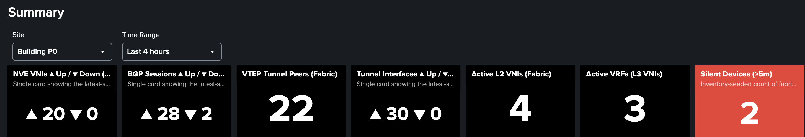

Seven fabric-wide tiles: **NVE VNIs ▲/▼**, **BGP Sessions ▲/▼**, **VTEP Tunnel Peers**,
**Tunnel Interfaces ▲/▼**, **Active L2 VNIs**, **Active VRFs (L3 VNIs)**, and **Silent Devices
(>5m)**. Scorecards use the latest snapshot in the picker window (not the full trend). Red
**Silent Devices** → verify collector and MDT subscriptions before blaming the switch.

```text
show nve vni summary
show bgp l2vpn evpn summary
show bgp ipv4 unicast summary
show nve peers
show ip interface brief | include Tunnel
show vrf brief
```

#### Row 2 — BGP trends and tenant VRFs

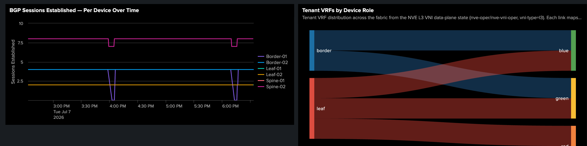

Left: **BGP Sessions Established — Per Device Over Time** — flat lines = stable; dips (e.g.
border nodes) = session flap. Right: **Tenant VRFs by Device Role** Sankey from NVE L3 VNI
data-plane state (`nve-vni-oper`, `vni-type=l3`) — which roles host `red` / `blue` / `green`.

```text
show bgp l2vpn evpn summary
show vrf
show nve vni
```

#### Row 3 — Segment inventory by tenant

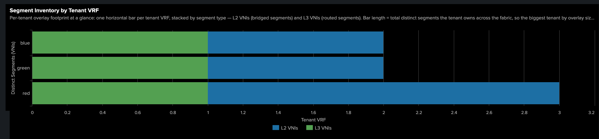

**Segment Inventory by Tenant VRF** — one horizontal bar per tenant; green = L3 VNIs (routed),
blue = L2 VNIs (bridged). Bar length = total distinct segments that tenant owns fabric-wide.
Compare to [`DEFN-OVERLAY.j2`](https://github.com/imanassypov/CatalystCenter-BGP-EVPN-VXLAN/blob/main/Catalyst%20Center%20Templates/Site%20BGP%20EVPN%20Templates/DEFN-OVERLAY.j2) intent.

```text
show nve vni
show l2vpn evpn evi detail
show vrf
```

#### Row 4 — L2 segment placement

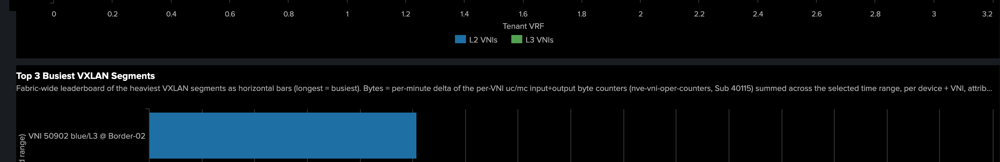

**L2 Segment Placement by Device** — table from `evpn_segment_inventory`: which L2 segments
are **access** (client port on that leaf) vs **overlay-only** (VNI/SVI role, no access port).
Cross-check **NVE State** against live `nve-vni-oper` (e.g. corp segment access on Leaf-02
only). Flags intent drift before users notice.

```text
show nve vni
show l2vpn evpn evi detail
show vlan brief
```

#### Row 5 — Busiest VXLAN segments

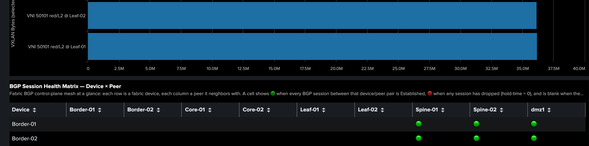

**VXLAN Bandwidth per VNI — Mbps (Sub 40115)** rendered as **Top 3 Busiest VXLAN Segments**:
horizontal bars ranked by per-minute byte delta from `nve-vni-oper-counters`, summed per
device + VNI across the picker range. Blue = L2 VNI; green = L3 VNI in the legend.

```text
show nve vni
show interfaces nve 1 counters
```

#### Row 6 — BGP health matrix

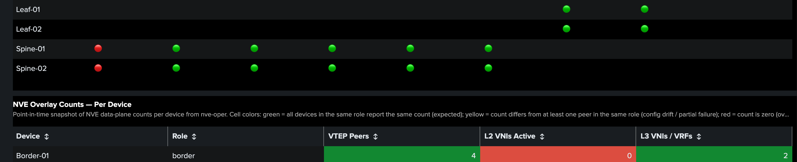

**BGP Session Health Matrix — Device × Peer** — each cell is green when every BGP session
between that device/peer pair is Established, red when any hold-time = 0, blank when no
peering exists. Fastest fabric-wide control-plane triage.

```text
show bgp l2vpn evpn summary
show bgp l2vpn evpn neighbors <peer-ip>
```

#### Row 7 — NVE overlay counts

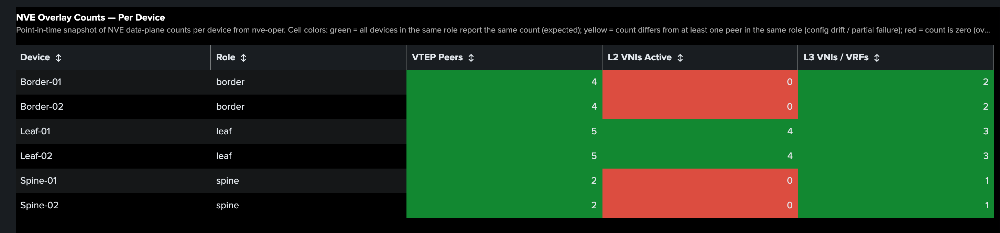

**NVE Overlay Counts — Per Device** — point-in-time VTEP peer, active L2 VNI, and L3 VNI/VRF
counts from `nve-oper`. Cell colour: green = all peers in the same role report the same count;
yellow = drift vs a role peer; red = zero (expected for spine L2 in many designs).

```text
show nve peers
show nve vni summary
show vrf brief
```

#### Row 8 — EVPN route updates

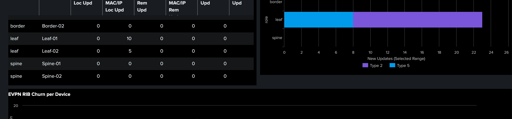

Left: per-device **local-add / remote-add** counters from `evpn-stats` (Sub 40113) — T2 MAC,
T2 MAC/IP, T5 prefix update deltas. Right: same data stacked **by role** (Type 2 vs Type 5).
Control-plane *work rate*, not RIB size.

```text
show bgp l2vpn evpn statistics
show l2vpn evpn evi detail
```

#### Row 9 — EVPN RIB churn

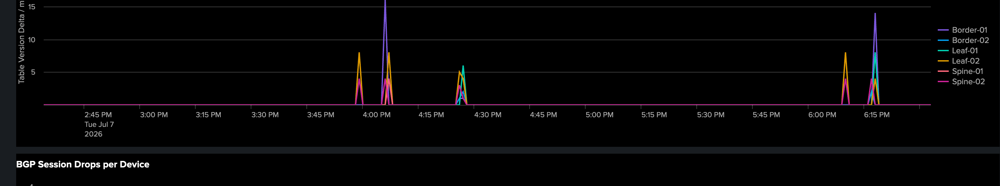

**EVPN RIB Churn — Per Role** (line chart: table version delta / min per device). Spikes
correlate with MAC moves, reconvergence, and BGP events — pair with Row 2 Established dips and
Row 6 matrix reds.

```text
show bgp l2vpn evpn summary
show l2vpn evpn mac
```

#### Row 10 — BGP session drops

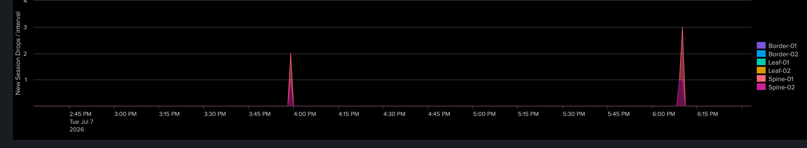

**BGP Session Drops — Per Role** — **New Session Drops / Interval** per device when sessions
fail to establish or reset. Spikes align with Rows 2 and 9 during control-plane instability.

```text
show bgp l2vpn evpn summary
show logging | include BGP
```

### 6.3 Details dashboard

Eleven panel rows on the same layout for every **Fabric Node Role**. Default to **Leafs** for
overlay faults. Panel semantics and CLI are defined once below; screenshots show how each role
presents the same panel type.

| # | Panel row | Demonstrates |
|---|---|---|
| 1 | Scorecards | Role-scoped go/no-go ([§6.1](#61-triage-model)) |
| 2 | Tunnel interface status | **Tunnel Interface Status** table (Subs 40120/40121) |
| 3 | BGP EVPN / IPv4 session state | Per-neighbor **BGP EVPN** and **BGP IPv4** grids |
| 4 | BGP Established + L3 VNI trends | **BGP Established Sessions per Node** + **L3 VNI count** |
| 5 | BGP drops + EVPN RIB churn | **BGP Session Drops** + **EVPN RIB Churn** per node |
| 6 | NVE peers + tunnels over time | **NVE Peers** + **Tunnel Interfaces Up** trends |
| 7 | NVE peer adjacency (Sankey) | Device → VNI → remote VTEP (24 h snapshot) |
| 8 | EVPN VNI binding — control plane | EVI → L3 VNI → L2 VLAN (`evpn-oper`) |
| 9 | EVPN VNI binding — data plane (NVE) | VRF → L3 VNI → NVE L2 VNI oper-state |
| 10 | VXLAN throughput + BUM ratio | TX+RX bytes/min + BUM vs unicast (Sub 40115) |
| 11 | NVE packet rate + top segments | Packet rate trend + top-VNI leaderboard |

#### Row 1 — Scorecards

| Leafs | Spines | Borders |
|:---:|:---:|:---:|
| 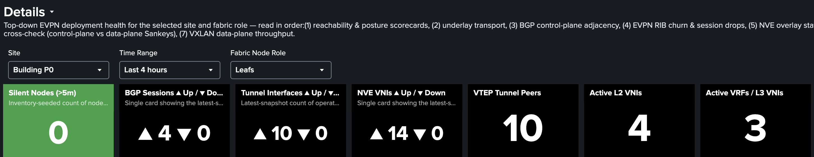 |  | 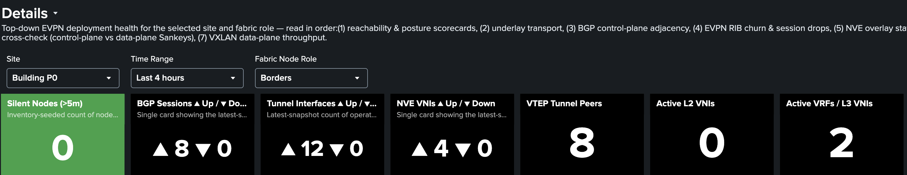 |

```text
show nve vni summary
show bgp l2vpn evpn summary
show nve peers
show vrf brief
show ip interface brief | include Tunnel
```

#### Row 2 — Tunnel interface status

| Leafs | Spines | Borders |
|:---:|:---:|:---:|
| 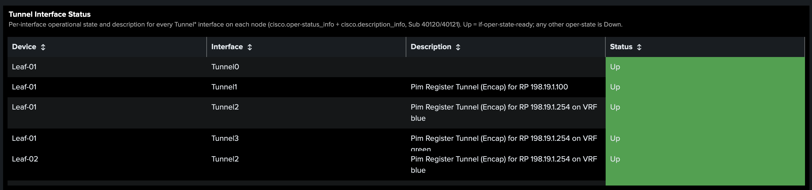 | 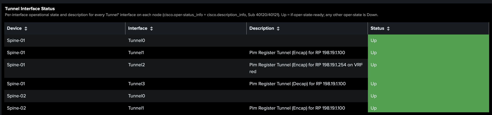 | 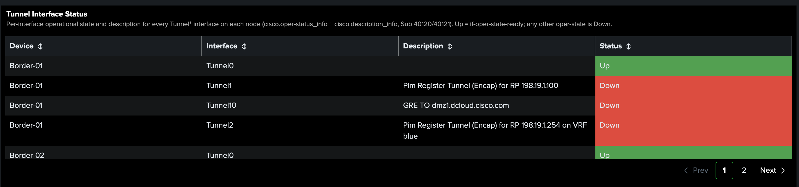 |

**Tunnel Interface Status** — oper-state grid for `Tunnel*` interfaces (PIM register / underlay
tunnels, Subs 40120/40121). All rows **Up** in a healthy lab.

```text
show ip interface brief | include Tunnel
show interfaces Tunnel0 - 99 status
```

#### Row 3 — BGP session state

| Leafs | Spines | Borders |
|:---:|:---:|:---:|
| 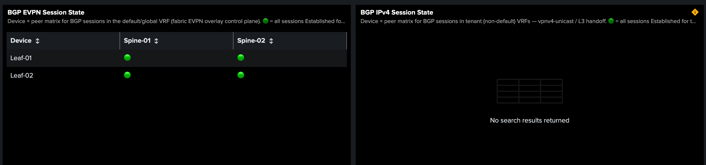 | 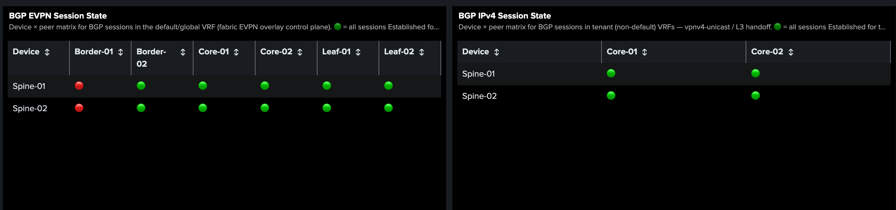 | 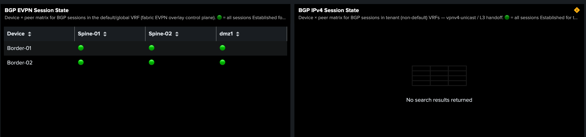 |

Left: **BGP EVPN Session State** — EVPN neighbours to spines/peers. Right: **BGP IPv4 Session
State** — tenant or northbound IPv4 when configured. Spines: RR completeness to all VTEPs.

```text
show bgp l2vpn evpn summary
show bgp l2vpn evpn neighbors
show bgp ipv4 unicast summary
show bgp ipv4 unicast vrf all summary
```

#### Row 4 — BGP Established and L3 VNI trends

| Leafs | Spines | Borders |
|:---:|:---:|:---:|
| 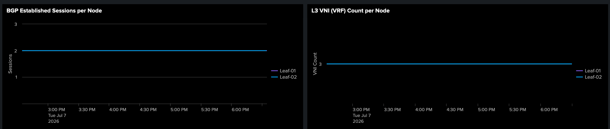 | 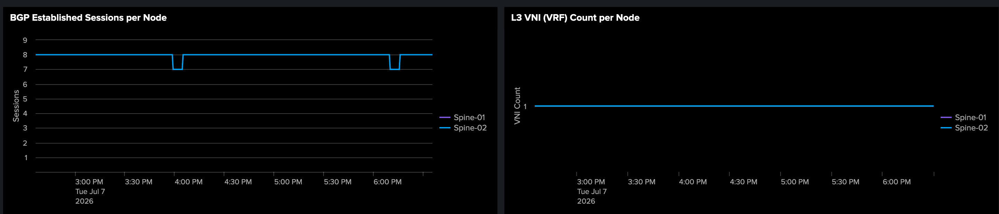 | 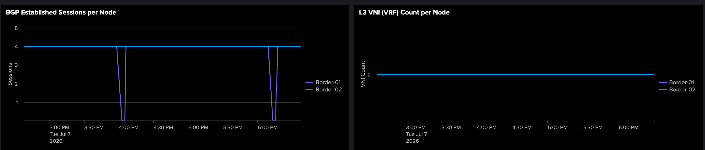 |

Left: **BGP Established Sessions per Node** — session count stability for the filtered role.
Right: **L3 VNI (VRF) Count per Node** — tenant VRF presence on each node. Spines: session
count ≈ all VTEP peers; L3 VNI count often minimal on pure RRs.

```text
show bgp l2vpn evpn summary
show vrf brief
show nve vni
```

#### Row 5 — BGP drops and RIB churn

| Leafs | Spines | Borders |
|:---:|:---:|:---:|
| 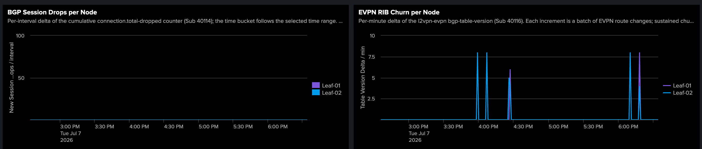 | 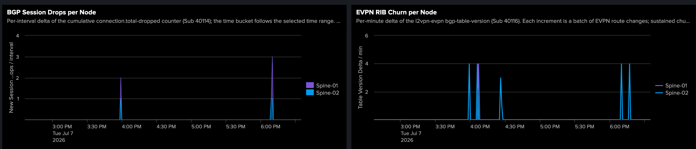 | 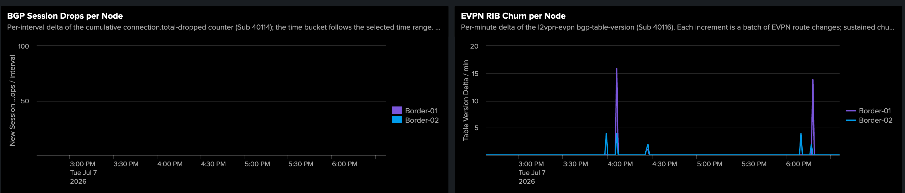 |

Left: **BGP Session Drops per Node**. Right: **EVPN RIB Churn per Node** (table version
delta / min). Single node spiking → local fault; zeros expected in steady state.

```text
show bgp l2vpn evpn summary
show bgp l2vpn evpn statistics
show logging | include BGP
```

#### Row 6 — NVE peers and tunnels over time

| Leafs | Spines | Borders |
|:---:|:---:|:---:|
| 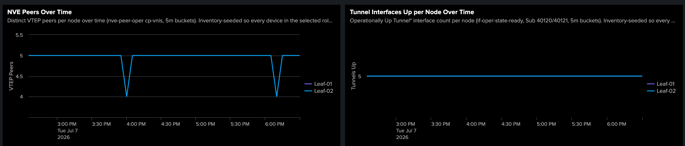 | 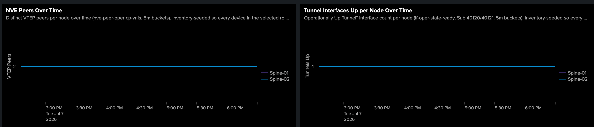 | 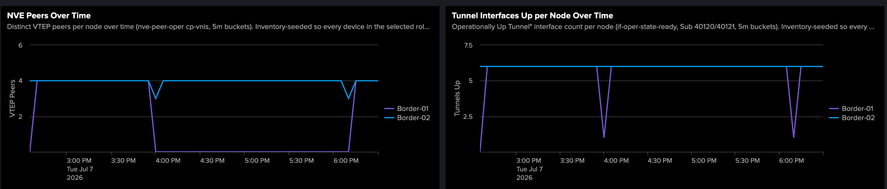 |

Left: **NVE Peers Over Time** — VTEP adjacency up-count. Right: **Tunnel Interfaces Up per
Node Over Time** — underlay/PIM tunnel oper-state. Step-down → remote VTEP or tunnel lost.

```text
show nve peers
show ip interface brief | include Tunnel
```

#### Row 7 — NVE peer adjacency

| Leafs | Spines | Borders |
|:---:|:---:|:---:|
| 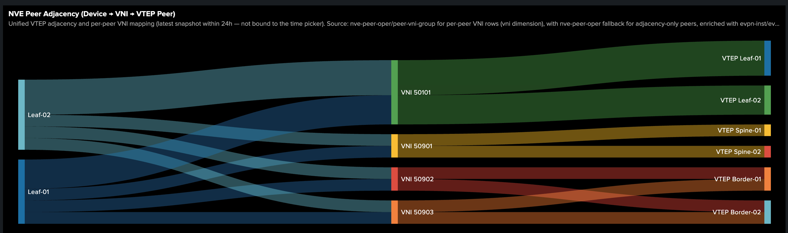 | 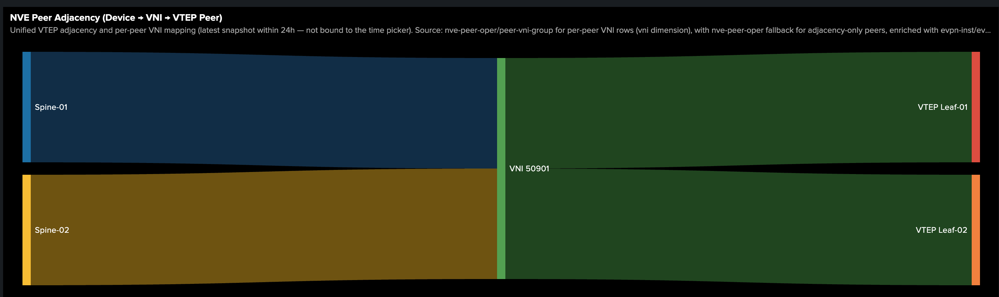 | 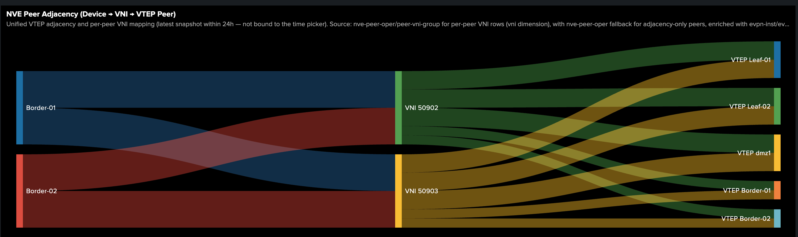 |

**NVE Peer Adjacency (Device → VNI → VTEP Peer)** — Sankey from `nve-peer-oper` (latest
snapshot within 24 h, not bound to the time picker). Missing flows → broken VNI adjacency for
that segment.

```text
show nve peers
show nve vni
show nve vni interface nve 1 detail
```

#### Row 8 — EVPN binding (control plane)

| Leafs | Spines | Borders |
|:---:|:---:|:---:|
| 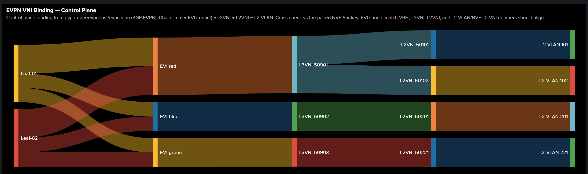 | 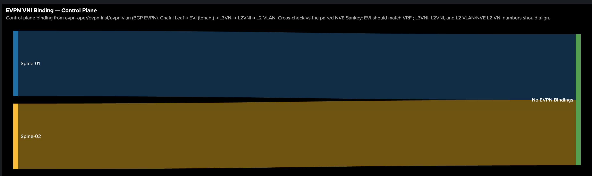 | 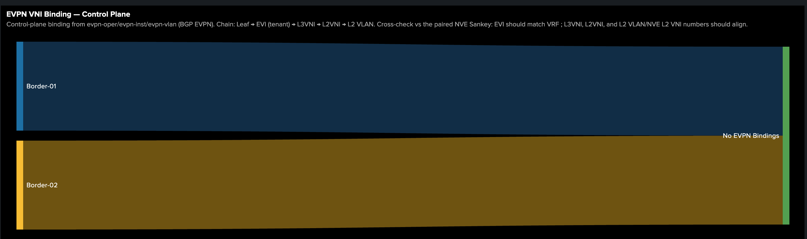 |

**EVPN VNI Binding — Control Plane** — Sankey chain from `evpn-oper/evpn-inst/evpn-vlan`:
Leaf → EVI (tenant) → L3VNI → L2VNI → L2 VLAN. Cross-check Row 9 NVE Sankey: EVI ↔ VRF,
L3/L2 VNI numbers must align.

```text
show l2vpn evpn evi detail
show bgp l2vpn evpn vni
show vlan brief
```

#### Row 9 — EVPN binding (data plane)

| Leafs | Spines | Borders |
|:---:|:---:|:---:|
| 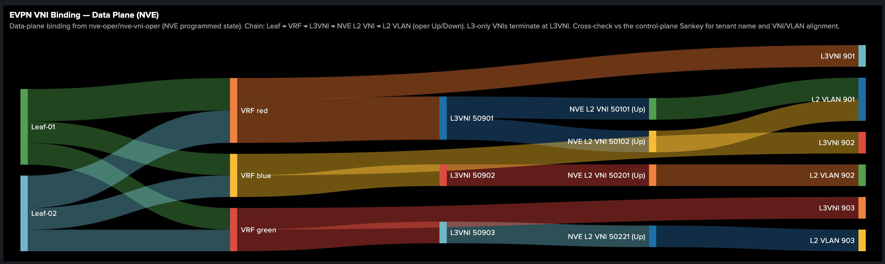 | 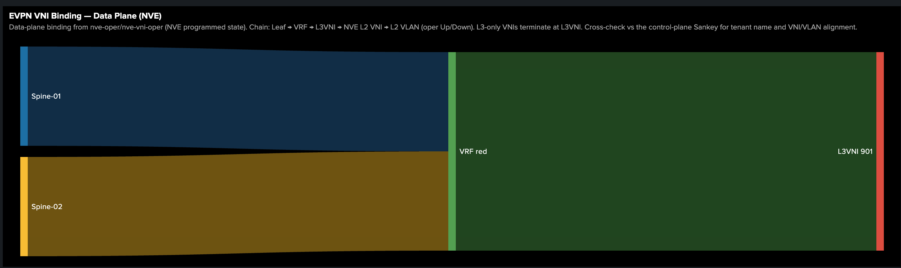 | 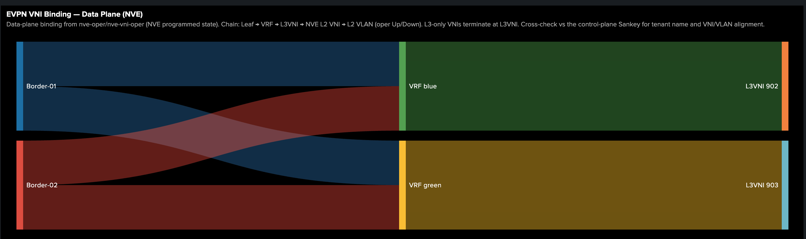 |

**EVPN VNI Binding — Data Plane (NVE)** — VRF → L3 VNI → NVE L2 VNI oper-state from
`nve-vni-oper`. Mismatch vs Row 8 → programming or SVI fault.

```text
show nve vni
show nve vni interface nve 1 detail
show vrf detail
```

#### Row 10 — VXLAN throughput and BUM

| Leafs | Spines | Borders |
|:---:|:---:|:---:|
| 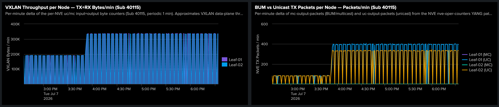 | 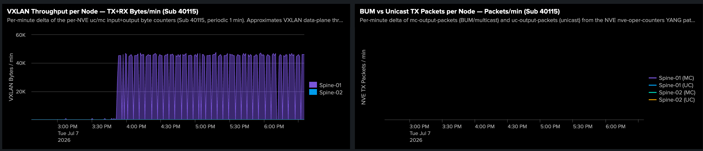 | 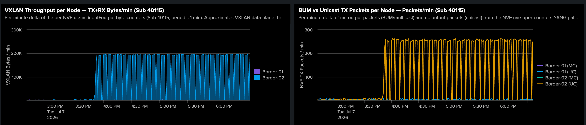 |

Left: **VXLAN Throughput per Node — TX+RX Bytes/min (Sub 40115)**. Right: **BUM vs Unicast
TX Packets per Node** — high BUM % → flooding or missing MAC learning. Borders: northbound
egress spikes.

```text
show interfaces nve 1 counters
show nve vni
```

#### Row 11 — Packet rate and top segments

| Leafs | Spines | Borders |
|:---:|:---:|:---:|
| 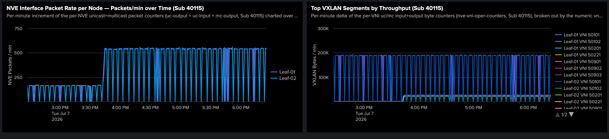 | 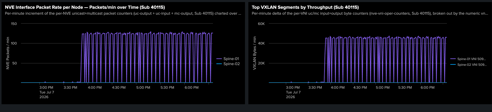 | 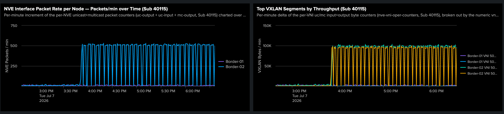 |

Left: **NVE Interface Packet Rate per Node**. Right: **Top VXLAN Segments by Throughput**
(Sub 40115) — narrows hot nodes to specific VNIs.

```text
show interfaces nve 1 counters
show nve vni interface nve 1 detail
```

### 6.4 Alerts dashboard

| Panel | Healthy | Investigate when |
|---|---|---|
| **BGP Sessions Not Established** | `0` | Non-zero — first alarm |
| **Telemetry Stale Devices** | `0` | Non-zero — check collector |
| **NVE VNIs Down Over Time** | `0` | Rise — pinpoints VNI failure time |
| **Active Alerts — All Roles** | Empty | Worklist: device, role, object |
| **BGP Not Established — Detail** | Empty | Per-session device/neighbor/VRF |
| **BGP Session Trend** | Stable | Confirms flap vs sustained outage |

### 6.5 Recommended triage workflow

1. **Summary** — scorecard row. All `▼ 0` / Silent `0` → done.
2. Note failing tile (BGP, VNI, tunnel, silent); use matching Summary trend for *when*.
3. **Details** — set role (leaf / spine / border).
4. Per-node trends → **EVPN VNI Binding** Sankeys (overlay) or **BGP session state** (control plane).
5. **Alerts** — confirm severity and exact object.

---

## 7. Deployment

This section installs the Splunk app and the separate OpenTelemetry
collector needed to populate its dashboards. Installing the app alone does not
collect telemetry.

### 7.1 Download the app or build from source

This repository provides one Splunk app, `campus_evpn_assurance`, not separate
`TA-*` packages.

**Manual upload, no build required:**
[Download campus_evpn_assurance-1.5.0.spl](https://raw.githubusercontent.com/imanassypov/CatalystCenter-BGP-EVPN-VXLAN/main/Campus%20BGP%20EVPN%20Splunk%20Assurance/packaging/dist/campus_evpn_assurance-1.5.0.spl).
The versioned package is tracked under `packaging/dist/`; other generated
archives remain excluded from Git. Keep the `.spl` on the computer whose
browser you use for Splunk Web, then complete §7.2–§7.7. Uploading the app
alone does not create the index, HEC token, or your fabric inventory.

**Optional source build:** follow the steps below to rebuild the app or prepare
the collector handoff bundle. **Code > Download ZIP** now includes the tracked
`.spl` as well as the source; extract the ZIP before accessing the package.

1. Open [the GitHub repository](https://github.com/imanassypov/CatalystCenter-BGP-EVPN-VXLAN).
2. Select **Code > Download ZIP**, extract the ZIP, and open a terminal in the
  extracted repository folder. Alternatively, clone with the commands below.
3. Build on Linux or macOS with Bash, `rsync`, `tar`, `awk`, and `shasum`
  installed. On Windows, use a Linux environment such as WSL with these tools.

```bash
git clone https://github.com/imanassypov/CatalystCenter-BGP-EVPN-VXLAN.git
cd CatalystCenter-BGP-EVPN-VXLAN
```

From the extracted or cloned repository root:

```bash
cd "Campus BGP EVPN Splunk Assurance"
./packaging/build-app.sh
```

The installable file is `packaging/dist/campus_evpn_assurance-1.5.0.spl`.
Keep it on the computer whose browser you use to access Splunk Web, or transfer
it there before uploading. Building the package does not require a local
Splunk installation.

For a handoff archive containing the app, this README, collector config/reference,
IOS-XE subscriptions, and device/segment inventory templates, run:

```bash
./packaging/build-handoff-bundle.sh
```

This also builds the `.spl` and creates
`packaging/dist/campus-bgp-evpn-splunk-assurance-bundle-1.5.0.tar.gz`.
Extract that archive on the collector host before following the collector
steps below. **Do not upload the source ZIP or handoff archive to Splunk.**

### 7.2 Prepare Splunk

**Required even for manual app upload:** the `.spl` supplies dashboards, macros,
lookup definitions, and example CSVs. It does **not** create the metrics index,
HEC token, user-role index permissions, or collector service, and its example
inventory does not describe your fabric. Complete §7.2–§7.7 in order.

These instructions assume a self-managed Splunk Enterprise instance with the
collector on the same Linux host. In a distributed deployment, create the
index and HEC input on the ingest/indexing tier and install the app and lookups
on the search head; point the collector at that HEC endpoint. Splunk Cloud
requires its supported app-install and HEC procedures, with the collector on
a separate Linux host rather than the managed Splunk instance.

#### Create the metrics index

1. Sign in to Splunk Web as an administrator and open
  **Settings > Indexes > New Index**.
2. Set **Index Name** to `evpn_assurance` and **Data Type** to **Metrics**.
  Configure storage/retention for your deployment and save.
3. Verify the index exists with the Metrics type. Do not reuse an Events index
  with this name; the dashboards use `mstats`, not event searches.

The app's `evpn_index` macro and collector config both use `evpn_assurance`.
Keep that name for this workflow. If you deliberately choose another name,
update the macro in the app context, the HEC token's allowed/default index,
the collector's `exporters.splunk_hec.index`, and role permissions together.

#### Enable HEC and create its token

1. Open **Settings > Data Inputs > HTTP Event Collector > Global Settings**.
2. Set **All Tokens** to **Enabled**, enable SSL, and use HTTP port `8088`.
3. Create a new token named `evpn-collector` (or another descriptive name).
4. Under its index settings, select `evpn_assurance` as an **allowed index**
  and its **default index**. A token defaulting to `main` will not populate
  the app's metrics searches.
5. Finish the wizard, keep the token private, and enter it in the collector
  config during §7.5. The `***REMOVED***` placeholder is not a usable token.

The exporter sends structured HEC metrics; no separate Technology Add-on or
event sourcetype parsing configuration is needed for this pipeline.

#### Allow dashboard users to search the index

In **Settings > Roles**, edit the role assigned to your dashboard users and
add `evpn_assurance` to its allowed searchable indexes. The queries explicitly
name the index, so it does not have to be a default search index. Users also
need read access to the app, dashboards, macros, and both lookup tables and
definitions. Verify these permissions with a non-admin dashboard account
after completing the installation.

The bundled collector config uses
`https://localhost:8088/services/collector`, assuming Splunk and the collector
share a host. Change the endpoint when Splunk runs on another host.

### 7.3 Install the app manually in Splunk Web

1. Sign in to Splunk Web as an administrator.
2. Open **Apps > Manage Apps > Install app from file**.
3. Choose `campus_evpn_assurance-1.5.0.spl` from the build output.
4. For an existing installation, select **Upgrade app** to replace it.
5. Select **Upload** and follow any restart prompt from Splunk.
6. Open **Campus EVPN Assurance** from the Apps menu. Confirm the **Summary**,
  **Details**, and **Alerts** tabs are present.

The package is marked `state = enabled`. Empty dashboards are expected until
both inventory lookups and the telemetry pipeline are configured. Continue
with §7.4; seeing the app in the Apps menu is not an end-to-end validation.

Alternatively, copy the `.spl` to a self-managed Splunk host and install by CLI:

```bash
sudo /opt/splunk/bin/splunk install app /path/to/campus_evpn_assurance-1.5.0.spl
```

### 7.4 Configure both inventory lookups

The app ships these lookup definitions in `default/transforms.conf`:

| Lookup definition | CSV file | Used for |
|---|---|---|
| `evpn_device_inventory` | `evpn_device_inventory.csv` | Device name, site, role, addressing, external peer labels |
| `evpn_segment_inventory` | `evpn_segment_inventory.csv` | Tenant/VNI segment inventory and access vs overlay-only leaf placement |

Prepare **both** CSV files with your actual fabric data, then upload them using
**Settings > Lookups > Lookup table files > Add new** with destination app
`campus_evpn_assurance` and the exact destination filenames above. If a file
already exists, use the overwrite/replace option. Under **Permissions**, share
each table with the app and grant read access to the dashboard user roles;
do not leave uploaded files private to your administrator account.

In **Settings > Lookups > Lookup definitions**, select the app context and
confirm each packaged definition points to its matching CSV. If a definition
is missing, create a **File-based** definition with the exact name above,
choose the matching file, and share it with the app with the same read access.
No automatic lookup is needed: dashboard macros invoke the definitions
explicitly. The packaged `evpn_lookup` and `evpn_segment_lookup` macros should
remain available in the `campus_evpn_assurance` app context.

#### Device inventory

Replace `campus_evpn_assurance/lookups/evpn_device_inventory.csv` with your
actual devices. Start with
[`packaging/evpn_device_inventory.template.csv`](packaging/evpn_device_inventory.template.csv).
The required columns are:

```csv
source,hostname,ip_address,loopback,site,role,description
```

Ensure `hostname` matches the actual telemetry `cisco.node_id` exactly, including
case. IOS-XE normally sends the configured short hostname, not the Catalyst
Center inventory FQDN; confirm it with the raw metrics query in §7.7. Use fabric
roles `leaf`, `spine`, or `border`, and set `site` consistently because the
dashboard Site selector filters on this field. Preserve the CSV header and
remove template comment lines and example rows that do not belong to your fabric.

**Map external core / DMZ eBGP peers too.** Device × Peer matrices resolve peer
IPs using the lookup's `loopback` column. Unmapped peers appear as raw IPs.
Add one row per external peer IP with a distinct role (`core` or `dmz`) so
these rows do not enter fabric role filters. Multiple peer links may share a
hostname:

```csv
dmz1.dcloud.cisco.com,dmz1,198.19.1.200,198.19.1.200,Building P0,dmz,DMZ Gateway (external eBGP EVPN peer)
Core-01,Core-01,198.19.2.49,198.19.2.49,Building P0,core,Enterprise Core 01 (Spine-01 uplink1)
Core-01,Core-01,198.19.2.57,198.19.2.57,Building P0,core,Enterprise Core 01 (Spine-02 uplink1)
Core-02,Core-02,198.19.2.53,198.19.2.53,Building P0,core,Enterprise Core 02 (Spine-01 uplink2)
Core-02,Core-02,198.19.2.61,198.19.2.61,Building P0,core,Enterprise Core 02 (Spine-02 uplink2)
```

#### Segment inventory

Start with
[`packaging/evpn_segment_inventory.template.csv`](packaging/evpn_segment_inventory.template.csv)
and create `evpn_segment_inventory.csv` with this header:

```csv
vlan,l2vni,l3vni,vrf,segment_name,overlay_leaves,access_leaves
```

Add one row per L2 segment, matching the deployed VLAN, L2VNI, tenant L3VNI,
VRF name, and segment name. `overlay_leaves` lists leaves where the SVI/NVE
segment is programmed; `access_leaves` lists leaves with client access ports.
Space-separate multiple hostnames, using exactly the same names as the device
inventory `hostname` column. Remove the template's `#` comment lines before
upload; they are documentation, not inventory records. For example:

```csv
vlan,l2vni,l3vni,vrf,segment_name,overlay_leaves,access_leaves
101,50101,50901,red,corp-101,"Leaf-01 Leaf-02",Leaf-02
```

Keep a copy of your customized CSVs outside the generated package and restore
or verify them after app upgrades; never assume the packaged lab examples
are correct for your deployment.

### 7.5 Install and configure the official OpenTelemetry collector

Run these steps **on the Linux Splunk instance**, using a Linux SSH account
with sudo access. This is separate from your Splunk Web administrator account.
Use the official **`otelcol-contrib` release package, version 0.161.0 or later**.
The core `otelcol` distribution does not include `yang_grpc`. No Go toolchain,
custom receiver build, Splunk-distro collector, or systemd override is needed.

The version floor matters: numeric YANG list keys such as `vni`, `evni`, and
`vlan-id` are emitted as dimensions in the reference project's upstream
0.161.0 deployment. Older receivers can collapse distinct per-VNI series. See
[`otel-collector/yanggrpcreceiver-numeric-key-issue.md`](otel-collector/yanggrpcreceiver-numeric-key-issue.md).

Download a package directly from the
[official releases](https://github.com/open-telemetry/opentelemetry-collector-releases/releases).
The examples pin the reference project's version. Use `amd64` for x86_64 hosts
or `arm64` for aarch64 hosts; check with `uname -m`.

On Debian / Ubuntu:

```bash
VER=0.161.0
ARCH=amd64
curl -fLO "https://github.com/open-telemetry/opentelemetry-collector-releases/releases/download/v${VER}/otelcol-contrib_${VER}_linux_${ARCH}.deb"
sudo apt-get install -y "./otelcol-contrib_${VER}_linux_${ARCH}.deb"
```

On RHEL / Amazon Linux / other RPM-based hosts:

```bash
VER=0.161.0
ARCH=amd64
curl -fLO "https://github.com/open-telemetry/opentelemetry-collector-releases/releases/download/v${VER}/otelcol-contrib_${VER}_linux_${ARCH}.rpm"
sudo rpm -Uvh "otelcol-contrib_${VER}_linux_${ARCH}.rpm"
```

Installing the local release file avoids a package repository refresh. The host
needs HTTPS access to GitHub; otherwise transfer the matching release package
from a trusted download host. Confirm the version and compiled-in receiver:

```bash
otelcol-contrib --version
otelcol-contrib components | grep yang_grpc
```

**Migrating from the former custom collector?** Back up its config and unit
before changing anything. Stop and disable `splunk-otel-collector` if installed,
so it cannot compete with the new service for ports `57444` and `8888`:

```bash
sudo systemctl disable --now splunk-otel-collector.service
```

Skip that command on fresh installations. Preserve the old config and drop-in
for rollback, but do not copy that drop-in onto the new service.

From the assurance source directory or extracted handoff directory on the
Splunk host, discover the packaged service account and install the template:

```bash
OTEL_USER=$(systemctl show -p User --value otelcol-contrib.service)
OTEL_GROUP=$(id -gn "${OTEL_USER:-otelcol-contrib}")
sudo install -o root -g "$OTEL_GROUP" -m 0640 \
  otel-collector/agent_config.running.yaml /etc/otelcol-contrib/config.yaml
sudoedit /etc/otelcol-contrib/config.yaml
```

Replace `exporters.splunk_hec.token` with the HEC token created in §7.2. Keep
`index: evpn_assurance` and, for this co-located deployment, the loopback endpoint
`https://localhost:8088/services/collector`. Never use the Splunk instance's
public address to reach HEC from the same host. The file contains a live
credential: keep mode `0640`, do not commit it, and restrict access to the
packaged service group. The example skips HEC certificate verification for
the lab; configure trusted certificates for production.

Validate the edited config as the service account, then start the service:

```bash
sudo -u "${OTEL_USER:-otelcol-contrib}" otelcol-contrib validate --config=/etc/otelcol-contrib/config.yaml
sudo systemctl enable otelcol-contrib.service
sudo systemctl restart otelcol-contrib.service
```

The package owns the binary, unit, service account, and EnvironmentFile; its
unit already reads `/etc/otelcol-contrib/config.yaml`. Do not add an `ExecStart`
override. Long-lived gRPC streams can delay restart until `TimeoutStopSec`
expires. Expect a telemetry gap (approximately 90 seconds with the old service);
do not repeatedly restart while devices reconnect.

### 7.6 Apply the IOS-XE telemetry subscriptions

Apply
[`model-config-snippets/telemetry-subscriptions.ios-xe.cfg`](model-config-snippets/telemetry-subscriptions.ios-xe.cfg)
to each fabric node, replacing the lab receiver address with your collector:

```text
receiver ip address <collector-ip> 57444 protocol grpc-tcp
```

Allow device-to-collector TCP `57444` and collector-to-Splunk HEC TCP `8088`.
The handoff bundle includes the subscription file at its top level.

### 7.7 Verify telemetry and dashboards

On the collector host:

```bash
systemctl is-active otelcol-contrib.service
otelcol-contrib --version
sudo journalctl -u otelcol-contrib --since '5 min ago' --no-pager | grep 'Everything is ready'
ss -lntp | grep ':57444'
ss -tn state established '( sport = :57444 )' | tail -n +2 | wc -l
curl -s localhost:8888/metrics | grep otelcol_exporter_send_failed_metric_points
```

Confirm the service is `active`, the version is at least `0.161.0`, the journal
shows `Everything is ready`, and MDT connections appear for your streaming
devices (the reference lab has six). Exporter send failures should stay at
`0` or be absent.

In the app's Splunk search context, confirm metrics are arriving:

```spl
| mstats latest("cisco.cp-vnis.") WHERE index=evpn_assurance BY "cisco.node_id"
| `evpn_lookup`
```

For the manual installation, also run these checks from **Search within the
Campus EVPN Assurance app**, first as an administrator and then as a dashboard
user. Select a recent time range containing telemetry.

Verify both uploaded CSVs can be read:

```spl
| inputlookup evpn_device_inventory
| table hostname site role ip_address loopback
```

```spl
| inputlookup evpn_segment_inventory
| table vlan l2vni l3vni vrf segment_name overlay_leaves access_leaves
```

Confirm actual telemetry names join to the device lookup:

```spl
| mstats latest("cisco.cp-vnis.") AS cp_vnis
  WHERE `evpn_index` BY "cisco.node_id"
| `evpn_lookup`
| table hostname site role cp_vnis
```

Expected: both CSV searches return your own inventory, and the metrics search
returns streaming devices with populated `site` and `role`. Blank metadata
means hostname matching or lookup content is wrong; an unknown lookup/macro
means app context, definitions, or permissions are wrong. If the administrator
sees results but a dashboard user does not, fix role/index and knowledge-object
permissions before changing the collector.

Open **Campus EVPN Assurance** and check:

1. **Site** lists your inventory sites.
2. **Summary** shows non-zero up counts when telemetry is flowing.
3. **Details > Fabric Node Role** filters correctly for Leafs, Spines, and Borders.
4. **Alerts** displays the alarm and BGP session detail views.

For empty panels, check the metrics index type, search permissions, inventory
hostname matching, HEC token/endpoint, collector service, and device
subscriptions. See
[`campus_evpn_assurance/README.md`](campus_evpn_assurance/README.md) for detailed
app troubleshooting and [§6](#6-operators-guide) for panel interpretation.

Optional: from the assurance source directory on the Splunk host, validate all
three Dashboard Studio views and their panel SPL:

```bash
python3 tools/validate_studio.py "$SPLUNK_ADMIN_USER" "$SPLUNK_ADMIN_PASS"
```

### 7.8 Roll back the collector

For a migration from the former deployment, stop the new collector before
re-enabling the preserved old service:

```bash
sudo systemctl disable --now otelcol-contrib.service
sudo systemctl enable splunk-otel-collector.service
sudo systemctl restart splunk-otel-collector.service
```

Use this only if the old service and config were preserved, including its
custom-binary override when applicable. Do not run both services together.
For a fresh package deployment, back up `/etc/otelcol-contrib/config.yaml`
before future changes; restore the last known-good config and restart
`otelcol-contrib`. Do not downgrade below `0.161.0`: that can remove numeric
key dimensions and break per-VNI panels.

### 7.9 Maintainer lab deployment

Deploy to lab Splunk: use skill `splunk-app-deploy` or
[`packaging/deploy-splunk-app.sh`](packaging/deploy-splunk-app.sh).

---

## 8. Repository Layout

```text
campus_evpn_assurance/     # Splunk app (views, lookups, macros)
packaging/                 # build-app.sh, deploy-splunk-app.sh, dist/
README.md                  # Architecture, manual installation, operator guide
otel-collector/            # Official contrib collector config and references
model-config-snippets/     # IOS-XE telemetry subscriptions 40101–40121
images/                    # Diagrams, dashboard screenshots, snippets/
tools/                     # validate_studio.py
telegraf/                  # Alternative collector reference (lab)
```

---

## 9. References

| Document | Contents |
|---|---|
| [Deployment](#7-deployment) | Manual app install + official `otelcol-contrib` + HEC + device subscriptions |
| [`campus_evpn_assurance/README.md`](campus_evpn_assurance/README.md) | Macros, `mstats`, inventory, app troubleshooting |
| [`otel-collector/README.md`](otel-collector/README.md) | Collector config, YANG key patch, build/rollback |
| [`images/README.md`](images/README.md) | Diagram assets, snippet regeneration |
| [`model-config-snippets/telemetry-subscriptions.ios-xe.cfg`](model-config-snippets/telemetry-subscriptions.ios-xe.cfg) | Subscription IDs and MDT receiver |
| [CatalystCenter-BGP-EVPN-VXLAN](https://github.com/imanassypov/CatalystCenter-BGP-EVPN-VXLAN) | Fabric build templates (companion project) |
