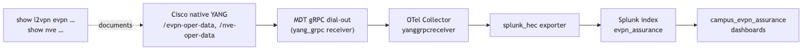

# OTel Collector — Campus BGP EVPN Telemetry Pipeline

This folder holds the deployment template for the official `otelcol-contrib`
package, version **0.161.0 or later**, on the Splunk instance. The collector ingests Cisco
IOS-XE Model-Driven Telemetry (MDT) over gRPC dial-out and ships it, together
with EC2 host metrics, to the co-located Splunk HEC.

> **Context for network engineers:** if you are new to OpenTelemetry or MDT, read the
> parent [`README.md`](../README.md) sections
> [Telemetry and Data Model](../README.md#4-telemetry-and-data-model)
> before tuning this collector.

## Contents

| File | Purpose |
|---|---|
| [`agent_config.running.yaml`](agent_config.running.yaml) | Credential-free deployment template; copy to `/etc/otelcol-contrib/config.yaml`, set the HEC token, and protect with mode `0640`. |
| [`yanggrpcreceiver-numeric-key-issue.md`](yanggrpcreceiver-numeric-key-issue.md) | Why the minimum version matters; original custom-patch analysis retained as history. |
| `README.md` | This document. |

The legacy builder manifest, patched receiver tarball, and `systemd/` override
are retained in the repository for historical reference only. They are excluded
from new handoff bundles and are not used by the supported installation.

## Overview



```
Cisco fabric switches (6)                 EC2 host 18.224.25.161 (ip-172-31-30-149)
  Spine-01/02, Leaf-01/02,         gRPC   ┌────────────────────────────────────────┐
  Border-01/02                  dial-out  │  otelcol-contrib.service                │
  (NATed via 64.100.12.5) ───────────────▶│   receiver: yang_grpc  :57444           │
                                          │   receiver: hostmetrics                 │
  device config:                          │   processor: batch                      │
  "receiver ip address                    │   exporter: splunk_hec ──┐              │
   18.224.25.161 57444                     └──────────────────────────┼─────────────┘
   protocol grpc-tcp"                                                 │ https://localhost:8088
                                                                      ▼
                                                        Splunk HEC → index=evpn_assurance (metric)
```

| Item | Value |
|---|---|
| Host | `18.224.25.161` (internal `ip-172-31-30-149.us-east-2.compute.internal`) |
| Collector | Official `otelcol-contrib` release package, **>= 0.161.0** |
| systemd unit | `otelcol-contrib.service` (package-owned; no override) |
| Config path | `/etc/otelcol-contrib/config.yaml` |
| Service account / EnvironmentFile | Owned and supplied by the package |
| YANG gRPC receiver | `yang_grpc` on `0.0.0.0:57444`, transport tcp |
| Exporter | `splunk_hec` → `https://localhost:8088/services/collector` (loopback — EC2 has no hairpin NAT to its own public IP) |
| Target index | `evpn_assurance` (metric) |

## Numeric YANG List Keys — Resolved Upstream

The reference deployment uses upstream **0.161.0** or later to preserve numeric
list keys as dimensions. No local patch or compiler is required. Earlier
receivers can silently collapse per-VNI series, so do not downgrade below this
floor. The receiver has alpha stability: verify dimensions and dashboards after
upgrades rather than assuming compatibility.

The following analysis describes the original bug and the former local
workaround, not the current service on the Splunk instance. Full historical
details: [`yanggrpcreceiver-numeric-key-issue.md`](yanggrpcreceiver-numeric-key-issue.md).

### The original problem

The `nve-oper-data/nve-oper/nve-peer-oper/peer-vni-group` list is keyed by
`vni` + `evni` (the VNI numbers from `show nve peers`). On Leaf-01 the CLI shows
**10** VNI×peer rows, but with the **stock v0.154.x** receiver these collapsed:
it did not emit `vni`/`evni`, leaving only `peer-addr` + the `rmac`/`_info`
string leaf. Loading the Cisco YANG models via the `yang:` block did **not** fix
it — the conversion path never consulted the parsed schema. Root cause was a
receiver code limitation (numeric leaves were only dimensioned when the protobuf
value was a `StringValue`; keys were also skipped from metric emission).

### How it was fixed

The patched receiver replaces the heuristic with a two-pass converter
(`extractKeysOnly` + `emitMetricsOnly`). `extractKeysOnly` stringifies **every**
leaf under the GPB `keys` branch via `formatValueToString` (handling
`Uint32`/`Uint64`/`Sint32`/`Sint64`), so numeric keys now survive as dimensions.

**Verified live (2026-06-23):** `peer-vni-group` now emits `vni` + `evni` +
`unit-number`; `nve-vni-oper` emits `vni-id`; `nve-vni-oper-counters` emits
`vni-id` (per-VNI throughput now possible). Real values confirmed — Leaf-02
`vni-id` 50101/50201/50221/50901/50902/50903; Leaf-01 `peer-vni-group` `vni`/`evni`
per peer.

### Dimension-model change you must know about

The fix also normalised the dimension model, which changed the attribute contract:

| Element | Stock v0.154.0 | Patched `26_05_27` |
|---|---|---|
| **Numeric list keys** | dropped | promoted to dims: `vni`, `vni-id`, `evni`, `unit-number`, `evpn-inst-id`, `vlan-id`, `evpn-stats-id` |
| **String list keys** (e.g. `peer-addr`) | dim | unchanged — still a dim |
| **String content leaves** (e.g. `vni-type`, `nve-vni-vrf`, `last-update`, `ni-name`) | dim named after the leaf | separate `cisco.<leaf>_info` metric; string carried in a generic **`value`** attribute |

Any query that grouped a numeric metric `BY "<string-content-leaf>"` now returns
**empty** and must be rewritten to group `BY "<numeric-key>"` (e.g. `"vni-id"`)
and pull string attributes from their `cisco.<leaf>_info` metric via the generic
`value` attribute. The Splunk app `campus_evpn_assurance` (v1.5.0 / build 85)
was fully migrated to this model.

### Per-VNI peer mapping — now telemetry-native

The NVE peer Sankey can now be discriminated by the **VNI number** directly:
`peer-vni-group` emits `vni` + `evni` as dimensions, so no `RMAC → VNI` lookup
enrichment is required anymore. (The `rmac` string is still emitted via
`cisco.rmac_info` if you want it.)

## Package Deployment and Migration

Follow [Deployment](../README.md#75-install-and-configure-the-official-opentelemetry-collector)
for Debian/RPM download commands, version/component checks, config ownership,
HEC credentials, startup, and migration from the old `splunk-otel-collector`
service. The official package supplies the unit and points it at
`/etc/otelcol-contrib/config.yaml`; do not override `ExecStart`.

Splunk and the collector share a host. Keep HEC on loopback and explicitly set
`index: evpn_assurance`. Protect the live config with `0640 root:<service-group>`.
The example's HEC token is a placeholder and must be replaced on the host.

Back up configs before replacing them. Stop the old collector before starting
the new one to avoid receiver/self-metrics port conflicts. Keep the former
service and its custom override intact if you need migration rollback; see
[Rollback](../README.md#78-roll-back-the-collector). No legacy override is
needed for a fresh install.

Long-lived MDT streams may delay shutdown until `TimeoutStopSec` expires.
Expect a telemetry gap; check readiness after restart rather than repeatedly
restarting the service.

### Verify after any restart

```bash
systemctl is-active otelcol-contrib.service
otelcol-contrib --version
sudo journalctl -u otelcol-contrib --since '2 min ago' --no-pager | grep 'Everything is ready'
ss -tn state established '( sport = :57444 )' | tail -n +2 | wc -l
curl -s localhost:8888/metrics | grep otelcol_exporter_send_failed_metric_points   # expect 0 / absent
```

Confirm numeric keys are present in Splunk (admin account required — the legacy
`cisco` user has no index ACL):

```bash
curl -sk -u '***REMOVED***:<password>' \
  'https://localhost:8089/servicesNS/nobody/campus_evpn_assurance/search/jobs/export' \
  --data-urlencode 'search=| mcatalog values(_dims) AS d WHERE index=evpn_assurance "cisco.encoding_path"="Cisco-IOS-XE-nve-oper:nve-oper-data/nve-oper/nve-peer-oper/peer-vni-group" earliest=-3m latest=now | nomv d' \
  --data-urlencode 'output_mode=csv'
```

Expected dims now **include** `vni` and `evni` (in addition to
`cisco.node_id node_id peer-addr value`), confirming the fix is live.

## Troubleshooting

| Symptom | Likely cause | Resolution |
|---|---|---|
| `is-active` stuck `deactivating (stop-sigterm)` after restart | gRPC dial-out streams not draining on SIGTERM | Wait ~90 s for systemd `TimeoutStopSec` to force-kill; the new process then starts. Don't keep restarting. |
| No data in `evpn_assurance` after restart | Devices not yet reconnected, or HEC (`:8088`) was down | Check `ss -tnp | grep 57444` for 6 ESTAB streams; check `ss -tlnp | grep 8088`; check `otelcol_exporter_send_failed_metric_points` at `http://localhost:8888/metrics`. |
| `| mstats count WHERE index=evpn_assurance` returns 0 | Bare `count` with no `metric_name` filter is a known quirk on this metric index | Use a real metric, e.g. `mstats latest("cisco.cp-vnis.") BY "cisco.node_id"`. |
| Panels grouped `BY "vni-type"`/`"nve-vni-vrf"`/`"last-update"`/`"ni-name"` return empty | Those string content leaves are no longer dimensions under the patched receiver — they are now `cisco.<leaf>_info` metrics with the string in the generic `value` attribute | Rewrite to group `BY "<numeric-key>"` (e.g. `"vni-id"`, `"vni"`) and join the `_info` metric on that key. The app v1.5.0/build 85 already does this. |
| `vni`/`evni` missing on `peer-vni-group` | Collector older than the supported version floor, or another collector still owns the receiver port | Check `otelcol-contrib --version` (>= 0.161.0), service state, and listening process; migrate using [Deployment](../README.md#75-install-and-configure-the-official-opentelemetry-collector). |

## Reference

| Document | Contents |
|---|---|
| [`../README.md`](../README.md) | Full pipeline architecture, CCIE-oriented telemetry primer, operator guide |
| [Deployment](../README.md#7-deployment) | Install official `otelcol-contrib`, HEC token, package-owned service |
| [`../campus_evpn_assurance/README.md`](../campus_evpn_assurance/README.md) | Splunk app queries, macros, troubleshooting |
| [`../Model Maps/README.md`](../Model%20Maps/README.md) | CLI ⇄ Cisco YANG xpath mappings for streamed models |
| [`yanggrpcreceiver-numeric-key-issue.md`](yanggrpcreceiver-numeric-key-issue.md) | Numeric list-key root cause and patch analysis |

External:

- Receiver source / config: `opentelemetry-collector-contrib/receiver/yanggrpcreceiver`
  ([config.go](https://github.com/open-telemetry/opentelemetry-collector-contrib/blob/main/receiver/yanggrpcreceiver/config.go),
  [README](https://github.com/open-telemetry/opentelemetry-collector-contrib/tree/main/receiver/yanggrpcreceiver))
- Cisco IOS-XE YANG models: [`YangModels/yang` → `vendor/cisco/xe/2611`](https://github.com/YangModels/yang/tree/main/vendor/cisco/xe/2611)
- NVE model: `Cisco-IOS-XE-nve-oper.yang` (revision 2025-07-01, module-version 1.1.0 — the revision that added the `peer-vni-group` container).
