# Cisco Catalyst Center BGP EVPN VXLAN Campus Fabric — Automation and Assurance

**Copyright © 2024-2026 Cisco Systems, Inc. All rights reserved.**

| Name | Role | Contact |
|------|------|---------|
| Igor Manassypov | Systems Engineer | imanassy@cisco.com |

---

## 1. Introduction

This repository implements a controller-managed BGP EVPN VXLAN campus fabric on Cisco IOS-XE Catalyst 9000 platforms via Cisco Catalyst Center CLI templates. The solution covers the full operational lifecycle: declarative intent definition, GitOps-driven template synchronization, role-aware device provisioning, and streaming telemetry assurance through Splunk.

### 1.1 Reference Topology

The lab validates a **three-tenant, multi-cluster spine-leaf fabric** with the following topology:

| Node | Platform | Role | ASN | Loopback0 | Additional Identities |
|------|----------|------|-----|-----------|----------------------|
| Spine-01 | C9000v | Route Reflector | 65001 | 198.19.1.1/32 | Lo2 = 198.19.1.100/32 (Anycast RP) |
| Spine-02 | C9000v | Route Reflector | 65001 | 198.19.1.2/32 | Lo2 = 198.19.1.100/32 (Anycast RP) |
| Leaf-01 | C9000v | BGP Client | 65001 | 198.19.1.3/32 | — |
| Leaf-02 | C9000v | BGP Client | 65001 | 198.19.1.4/32 | — |
| Border-01 | C9000v | Border Client | 65001 | 198.19.1.5/32 | Lo1 = 10.100.2.5 (GRE src), Lo2 = 10.101.1.2 (EVPN overlay) |
| Border-02 | C9000v | Border Client | 65001 | 198.19.1.6/32 | Lo1 = 10.100.2.6 (GRE src), Lo2 = 10.101.2.2 (EVPN overlay) |
| dmz1 | C9000v | DMZ Gateway | 65003 | 198.19.1.200/32 | Lo1 = 10.100.2.1 (GRE hub src) |
| dmz2 | C9000v | DMZ Gateway | 65004 | 198.19.2.200/32 | Lo1 = 10.100.4.1 (GRE hub src) |
| Core-01 | NX-OSv | Core Router | 65002 | — | Enterprise IP Core · Lo2 = 198.19.1.254/32 (Enterprise Anycast RP) |
| Core-02 | NX-OSv | Core Router | 65002 | — | Enterprise IP Core · Lo2 = 198.19.1.254/32 (Enterprise Anycast RP) |

**Three ASN domains** define the BGP control plane:

- **ASN 65001** — Campus fabric: Spines as iBGP route reflectors, Leaves/Borders as clients
- **ASN 65002** — Enterprise IP Core: eBGP peering from Spines via L3OUT sub-interfaces
- **ASN 65003** — DMZ fabric (Location A, `dmz1`): eBGP EVPN peering from Borders over GRE overlay (`ebgp-multihop 255`)
- **ASN 65004** — DMZ fabric (Location B, `dmz2`): second, geographically separate DMZ gateway peering the same Borders and extending the same `vrf blue` / `vrf green`

**Three tenants** provide traffic segmentation:

| VRF | ID | L3VNI | Transit VLAN | Segment VLANs | Deployment Scope |
|-----|----|-------|-------------|---------------|-----------------|
| red | 901 | 50901 | 901 | 101, 102 | Spine + Leaf |
| blue | 902 | 50902 | 902 | 201 | Leaf + Border + DMZ |
| green | 903 | 50903 | 903 | 221 | Leaf + Border + DMZ |

### 1.2 Topology Diagrams

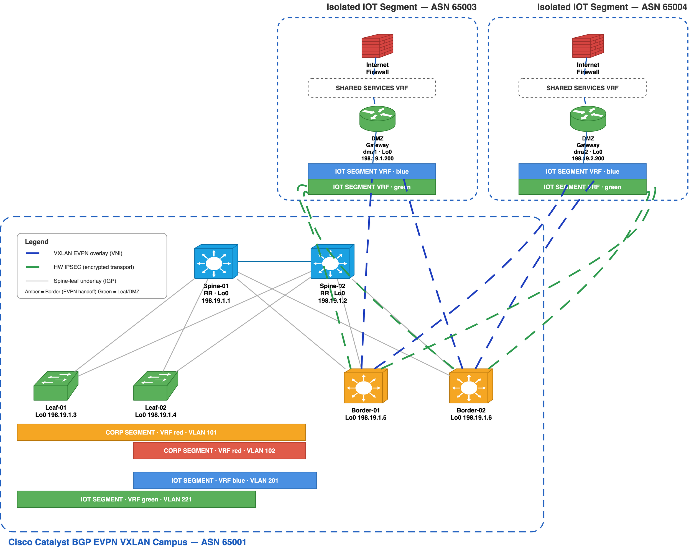

Logical spine-leaf architecture with border connections and three tenant VRFs.

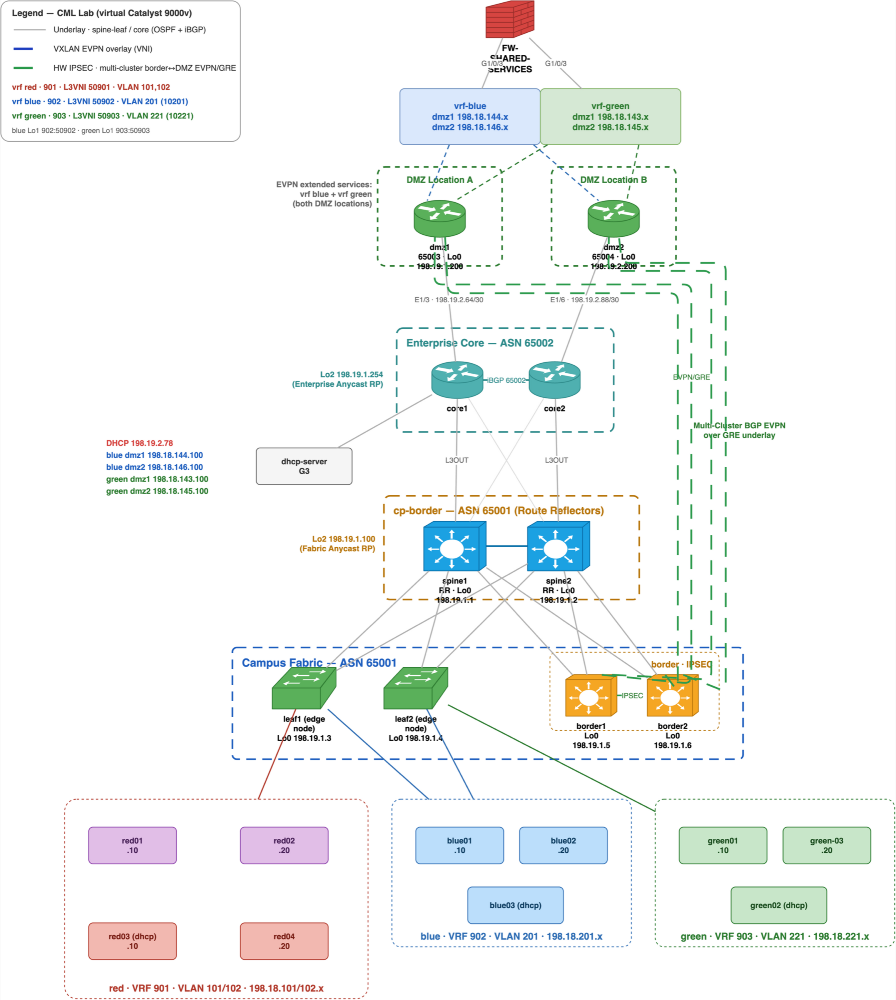

> Diagram source: [`DIAGRAMS/cisco_evpn_cml.drawio`](DIAGRAMS/cisco_evpn_cml.drawio)

Cisco Modeling Labs emulation using virtual Catalyst 9000 instances. Beyond the campus spine-leaf fabric, the lab models the surrounding services: a shared-services firewall fronting `vrf-blue` and `vrf-green`; dual DMZ gateways in two separate physical locations — `dmz1` (Location A, ASN 65003) and `dmz2` (Location B, ASN 65004) — each extending the same `vrf blue` + `vrf green` over EVPN but presenting **location-unique** shared-services subnets (`dmz1`: green `198.18.143.x` / blue `198.18.144.x`; `dmz2`: green `198.18.145.x` / blue `198.18.146.x`); the Enterprise Core (`core1`/`core2`, ASN 65002) with an Enterprise Anycast RP on `Lo2 198.19.1.254`; a `dhcp-server` serving per-DMZ scopes (`dmz1` green `198.18.143.100` / blue `198.18.144.100`; `dmz2` green `198.18.145.100` / blue `198.18.146.100`; plus underlay `198.19.2.78`); and the three tenant client groups — red (`198.18.101/102.x`), blue (`198.18.201.x`), and green (`198.18.221.x`).

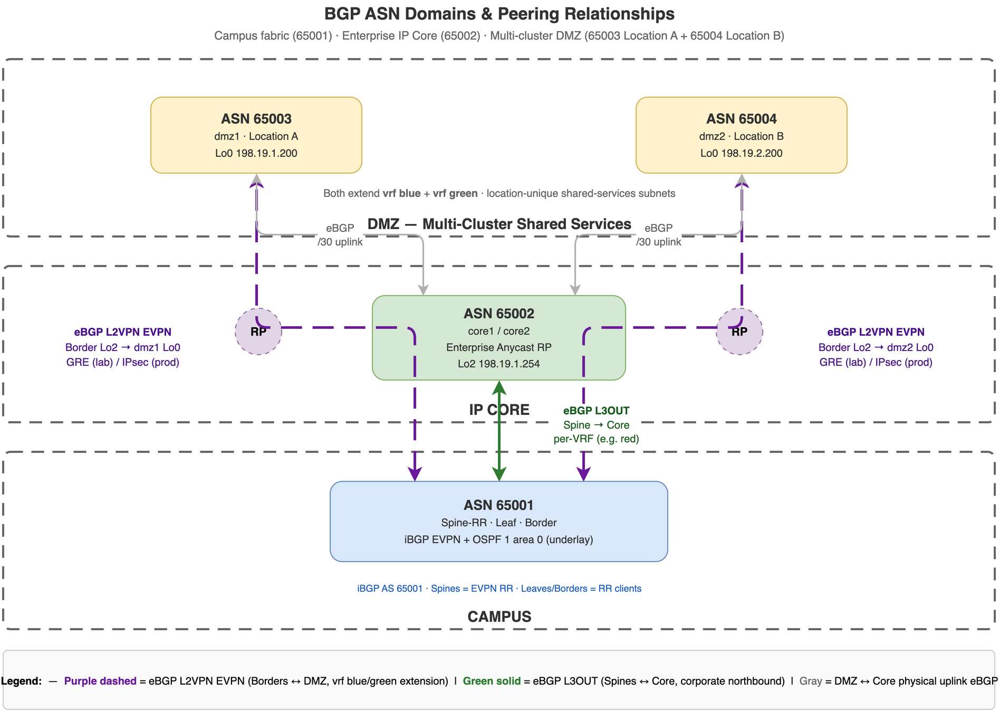

BGP control plane: four ASN domains (campus 65001, core 65002, DMZ Location A 65003, DMZ Location B 65004) and their peering relationships.

> Diagram source: [`DIAGRAMS/cisco_evpn_ASN.drawio`](DIAGRAMS/cisco_evpn_ASN.drawio)

### 1.3 Border-to-DMZ EVPN Peering (GRE Overlay)

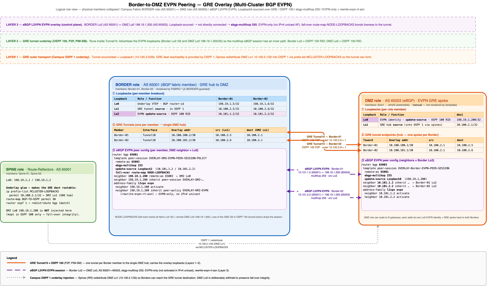

> Diagram source: [`DIAGRAMS/cisco_evpn_border_dmz_peering.drawio`](DIAGRAMS/cisco_evpn_border_dmz_peering.drawio)

Borders peer with the DMZ gateway over a **GRE underlay** to decouple EVPN session stability from physical path topology:

- **GRE source addressing**: Border GRE tunnel sources (`Loopback1`) are allocated from `10.100.2.0/29` (Border-01 `10.100.2.5`, Border-02 `10.100.2.6`), intentionally outside the `198.19.1.0/24` fabric loopback space to avoid conflicts with core router Loopback0 addresses. DMZ GRE hub sources sit in adjacent space — `dmz1` = `10.100.2.1`, `dmz2` = `10.100.4.1`. See `DEFN_LOOP_GRE_SRC` / `DEFN_LOOP_GRE_PEER` (per-border) and `DEFN_LOOP_MCLUSTER[*].gre_src` (per-DMZ) in `DEFN-LOOPBACKS.j2`.
- **Tunnel underlay (OSPF 100)**: `FABRIC-BORDER-DMZ-TUNNELS.j2` renders per-border GRE tunnels (`Tunnel10`→dmz1, `Tunnel20`→dmz2) and OSPF 100 adjacencies. Each DMZ's OSPF 100 router-id is its Lo0 (`dmz1` `198.19.1.200`, `dmz2` `198.19.2.200`), redistributed into OSPF 100 locally by the DMZ — never injected into OSPF 1 from the spine side.
- **Spine MCLUSTER-LOOPBACKS**: Only each DMZ's `Loopback1` (`dmz1` `10.100.2.1/32`, `dmz2` `10.100.4.1/32`) is redistributed into OSPF 1 via `ip prefix-list MCLUSTER-LOOPBACKS` on spines. This ensures borders have a specific route to each GRE hub. Injecting the DMZ Lo0 (`198.19.1.200` / `198.19.2.200`) into OSPF 1 would decouple `fall-over` detection from tunnel state.
- **EVPN session sourcing**: Borders source from `Loopback2` (DEFN_LOOP_NAME `DMZ_OVERLAY`) with `ebgp-multihop 255`. DMZ peers to border Lo2 addresses (`10.101.1.2` / `10.101.2.2`).
- **EVPN-only peer**: The DMZ neighbor is activated only under `address-family l2vpn evpn` with `rewrite-evpn-rt-asn`; it is not activated in IPv4 unicast.

> **Operator note**: The DMZ gateways are not provisioned by this template set. Configure them to mirror the live design:
> - `dmz1` (ASN 65003): Lo0 = `198.19.1.200/32` (OSPF 100 RID, EVPN update-source), Lo1 = `10.100.2.1/32` (GRE hub source), `Tunnel10/11` destinations = `10.100.2.5` / `10.100.2.6`, EVPN neighbors = `10.101.1.2` / `10.101.2.2`.
> - `dmz2` (ASN 65004): Lo0 = `198.19.2.200/32`, Lo1 = `10.100.4.1/32`, `Tunnel10/11` addresses `10.100.102.1` / `10.100.103.1`, destinations = `10.100.2.5` / `10.100.2.6`, EVPN neighbors = `10.101.1.2` / `10.101.2.2` (shared border Lo2s). Both DMZs also peer the cores directly over their `/30` uplinks (`remote-as 65002`).

### 1.4 Platform and Software Requirements

| Component | Version |
|-----------|---------|
| IOS-XE | 17.15.3 recommended; 17.12.x minimum (Multi-Cluster BGP requires 17.15+) |
| Catalyst Center | 2.3.7.9 or later |
| Cisco Modeling Labs | 2.9+ (lab emulation) |
| Ansible | 2.15+ with `cisco.dnac` collection |

**Supported hardware**: Catalyst 9500, 9400, 9300, and 9000v (virtual).

> Validation baseline: `Node Configs/Config-Backup-20260508-131703` (May 8, 2026).

---

## 2. Repository Structure

```
Catalyst Center Templates/
└── Site BGP EVPN Templates/       # Jinja2 template source (DEFN/FABRIC/FUNC)
    ├── BGP-EVPN-BUILD.yml         # Composite member list and execution order
    ├── DEFN-*.j2                  # Data dictionaries ( only, no CLI)
    ├── FABRIC-*.j2                # CLI generators (include DEFN + FUNC)
    └── FUNC-*.j2                  # Reusable Jinja macros

Node Configs/                      # Reference device configs (lab output)
├── Config-Backup-20260508-131703/ # Current validation baseline
├── fabric-site1/                  # Per-template rendered configs
├── fabric-dmz/                    # DMZ rendered configs
└── cores/                         # Core router configs

CICD Pipeline/                     # Ordered Catalyst Center provisioning stages
├── ansible/                       # Unified playbooks + roles (stages 1–11)
├── Settings/                      # settings.json SSOT
└── utils/mcp-ssh-server/          # MCP stdio server for device CLI triage

Campus BGP EVPN Splunk Assurance/  # Streaming telemetry assurance
├── campus_evpn_assurance/         # Packaged Splunk app
├── otel-collector/                # OpenTelemetry collector config
├── packaging/                     # Build scripts (.spl + handoff bundle)
├── Model Maps/                    # YANG → Splunk metric mappings
└── SETUP_GUIDE.md                 # Install procedure

DIAGRAMS/                          # Architecture diagrams (.mmd/.drawio source + .png)
Release Notes/                     # Dated feature and behavior change notes
test-cases/                        # Fabric validation scenarios
```

---

## 3. Template Architecture

### 3.1 Three Template Categories

| Category | Purpose | Output |
|----------|---------|--------|
| `DEFN-*.j2` | Data dictionaries — roles, loopbacks, VRFs, VLANs, L3OUT, NAC, telemetry | No CLI (only `` blocks) |
| `FABRIC-*.j2` | CLI generators — include DEFN/FUNC, emit IOS-XE configuration | Role-aware IOS-XE CLI |
| `FUNC-*.j2` | Reusable Jinja macros for shared lookup/rendering logic | Macro definitions |

Every `.j2` file must begin with the device targeting header:
```jinja
{## CATC: productFamily=Switches and Hubs, softwareType=IOS-XE, productSeries=Cisco Catalyst 9000 Series Virtual Switches ##}
```

### 3.2 Composite Build Order (BGP-EVPN-BUILD.yml)

Only FABRIC templates appear in the composite; DEFN/FUNC files are resolved internally via ``:

| Step | Template | Function | Depends On |
|------|----------|----------|-----------|
| 1 | `FABRIC-VRF.j2` | VRF definitions with RD/RT | — |
| 2 | `FABRIC-LOOPBACKS.j2` | Underlay + overlay loopbacks | VRF |
| 3 | `FABRIC-BORDER-DMZ-TUNNELS.j2` | GRE tunnels + OSPF 100 (borders only) | Loopbacks |
| 4 | `FABRIC-L3OUT.j2` | Spine-to-Core sub-interfaces | Loopbacks |
| 5 | `FABRIC-NVE.j2` | NVE + L3VNI/L2VNI membership | VRF, Loopbacks |
| 6 | `FABRIC-MCAST.j2` | PIM RP, MSDP, VRF MDT | NVE |
| 7 | `FABRIC-EVPN.j2` | BGP EVPN control plane + L3OUT BGP | All above |
| 8 | `FABRIC-OVERLAY.j2` | L2VNI overlay VLANs/EVPN instances | NVE, EVPN |
| 9 | `FABRIC-CLIENT-PORTS.j2` | Client-facing port provisioning | Overlay |
| 10 | `FABRIC-NAC.j2` | 802.1X/MAB access control | Client Ports |
| 11 | `FABRIC-TELEMETRY-SPLUNK.j2` | MDT telemetry subscriptions | NVE |

### 3.3 Per-Role Render Behavior

The same composite renders differently per device role based on `DEFN_NODE_ROLES` membership:

| Template | Spine/RR | Leaf | Border |
|----------|----------|------|--------|
| FABRIC-VRF | ✓ | ✓ | ✓ |
| FABRIC-LOOPBACKS | ✓ | ✓ | ✓ |
| FABRIC-BORDER-DMZ-TUNNELS | — | — | ✓ |
| FABRIC-L3OUT | ✓ (if in `DEFN_L3OUT_NODES`) | — | — |
| FABRIC-NVE | ✓ (L3VNI only, for route leaking) | ✓ | ✓ |
| FABRIC-MCAST | ✓ | ✓ | ✓ |
| FABRIC-EVPN | ✓ (RR config) | ✓ (client) | ✓ (client + DMZ eBGP) |
| FABRIC-OVERLAY | — | ✓ | ✓ |
| FABRIC-CLIENT-PORTS | — | ✓ | ✓ |
| FABRIC-NAC | — | ✓ | — |
| FABRIC-TELEMETRY-SPLUNK | ✓ | ✓ | ✓ |

> **Spine NVE/L3VNI is intentional**: Spines terminate L3VNI for VRF route leaking to the upstream IP Core via L3OUT sub-interfaces. Do not treat Spine NVE config as a bug.

### 3.4 Optional Components

| Feature | Enabled By | Disabled By |
|---------|------------|-------------|
| Border Leaf / Multi-Cluster | Add FQDNs to `DEFN_NODE_ROLES['BORDER']` | Leave `BORDER = []` |
| L3OUT to IP Core | Add nodes to `DEFN_L3OUT_NODES` | Set `DEFN_L3OUT_NODES = []` |
| GRE/DMZ Tunnels | Define entries in `DEFN_TUNNELS` | Omit `DEFN_TUNNELS` |
| Telemetry | Populate `DEFN_TELEMETRY_SPLUNK_ROLES` | Leave role list empty |

---

## 4. Architecture Diagrams

### 4.1 Conceptual Data Model

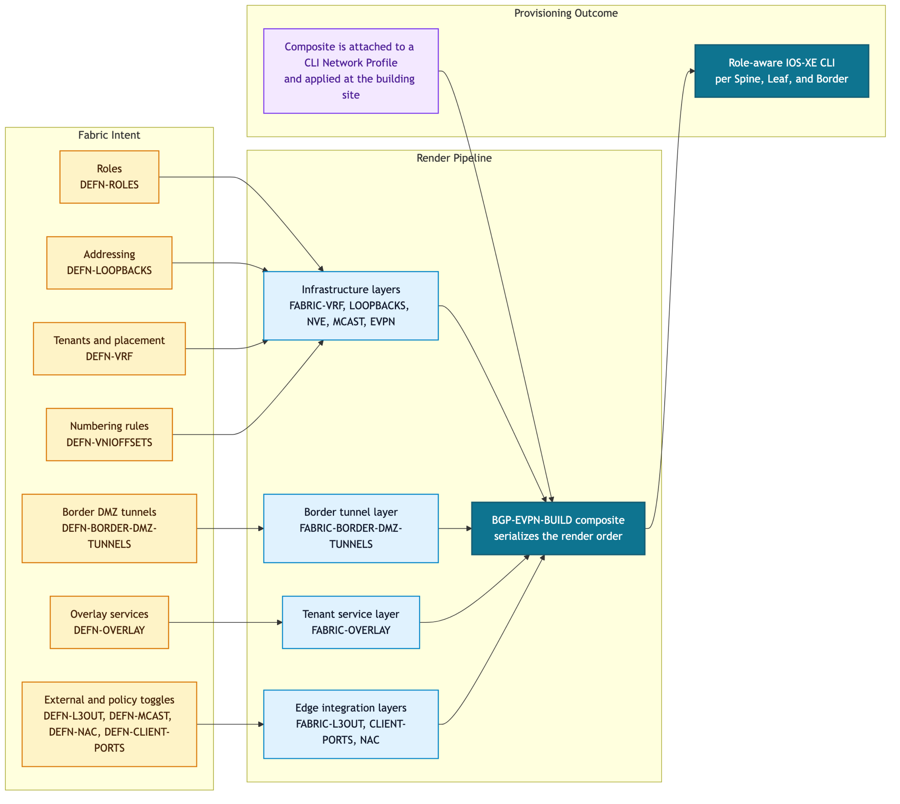

> Source: `DIAGRAMS/bgp-evpn-data-model-presentation.mmd`

- DEFN templates are the **intent layer** (roles, addressing, tenants, policy, numbering)
- FUNC templates are the **transformation layer** (intent → device-local objects)
- FABRIC templates are the **rendering layer** (emit IOS-XE CLI in dependency order)
- The composite binds the render pipeline to Catalyst Center provisioning at the site level

### 4.2 Detailed Data Model

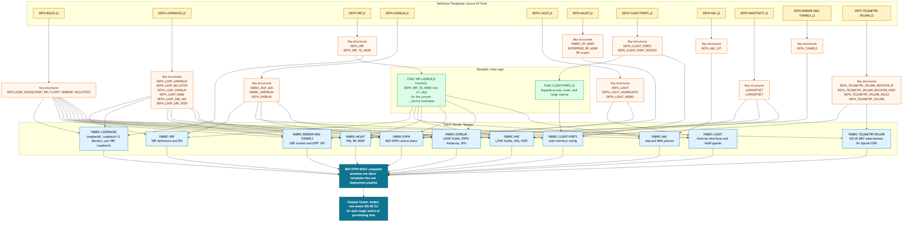

> Source: `DIAGRAMS/bgp-evpn-data-model.mmd`

Key relationships:
- `DEFN-VRF.j2` + `FUNC-VRF-LOOKUP.j2` form the core binding between intent and per-device rendering
- `DEFN-OVERLAY.j2`, `DEFN-VNIOFFSETS.j2`, and `DEFN-LOOPBACKS.j2` provide numeric/addressing context consumed by multiple FABRIC templates
- Optional behaviors (L3OUT, multicast RP, client ports, NAC, telemetry) are each activated by dedicated DEFN structures

### 4.3 Template Dependency Flow

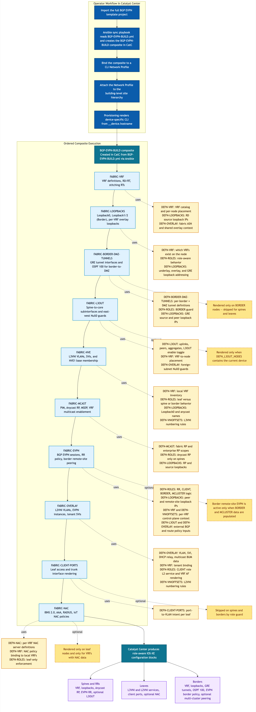

> Source: `DIAGRAMS/bgp-evpn-template-relationships.mmd`

### 4.4 Per-Role Render Behavior

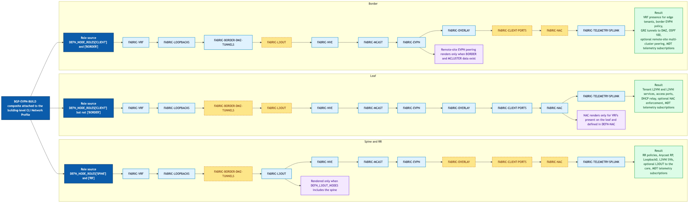

> Source: `DIAGRAMS/bgp-evpn-role-behavior.mmd`

### 4.5 Catalyst Center Operational Lifecycle

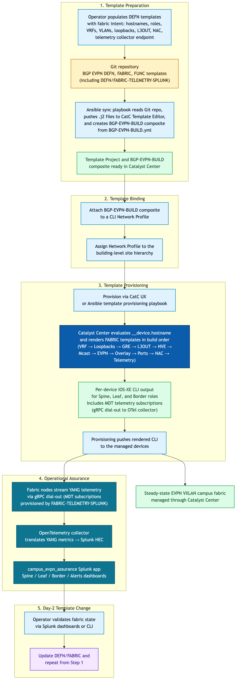

> Source: `DIAGRAMS/bgp-evpn-catalyst-center-lifecycle.mmd`

Lifecycle phases:
1. **Template Preparation**: Populate DEFN intent → Git → Ansible sync to CatC Template Editor
2. **Template Binding**: Attach composite to CLI Network Profile → assign to building site
3. **Provisioning**: CatC renders per-device CLI using `__device.hostname` → pushes to fabric nodes
4. **Assurance**: Fabric nodes stream YANG telemetry (gRPC/MDT) → OTel collector → Splunk dashboards
5. **Day-2 Change**: Update DEFN data → resync → re-provision

---

## 5. Data Model Reference

### 5.1 Key Data Structures

| Variable | Source | Structure |
|----------|--------|-----------|
| `DEFN_NODE_ROLES` | DEFN-ROLES.j2 | `{'SPINE':[], 'RR':[], 'CLIENT':[], 'BORDER':[], 'MCLUSTER':[]}` |
| `DEFN_VRF` | DEFN-VRF.j2 | List of `{'id':'901','name':'red','mdt_default':'...','mdt_data':'...'}` |
| `DEFN_VRF_TO_NODE` | DEFN-VRF.j2 | `{'hostname.fqdn': ['901','902']}` |
| `DEFN_LOOP_UNDERLAY` | DEFN-LOOPBACKS.j2 | `{'hostname.fqdn': '198.19.1.x'}` |
| `DEFN_LOOP_GRE_SRC` | DEFN-LOOPBACKS.j2 | `{'hostname.fqdn': '10.100.2.x'}` |
| `DEFN_LOOP_GRE_PEER` | DEFN-LOOPBACKS.j2 | `{'hostname.fqdn': '10.101.x.2'}` |
| `DEFN_LOOP_MCLUSTER` | DEFN-LOOPBACKS.j2 | `{'hostname.fqdn': {'ip':'...','asn':'...','gre_src':'...'}}` |
| `DEFN_OVERLAY` | DEFN-OVERLAY.j2 | VLANs per VRF with SVI params |
| `FABRIC_BGP_ASN` | DEFN-OVERLAY.j2 | Fabric ASN string (e.g., `'65001'`) |

### 5.2 VNI Numbering Convention

| Component | Formula | Example (VRF red, VLAN 101) |
|-----------|---------|----------------------------|
| L3VNI | `L3VNIOFFSET ~ VRF_ID` (string concatenation) | `"50" ~ "901"` = **50901** |
| L2VNI | `L2VNIOFFSET + VLAN_ID` (integer addition) | `50000 + 101` = **50101** |
| RD | `{loopback_ip}:{vrf_id}` | `198.19.1.3:901` |
| RT | `{fabric_asn}:{vrf_id}` | `65001:901` |

> **Note on the two formulas**: L3VNI is a *string concatenation* of the offset and VRF ID (`(L3VNIOFFSET|string) + vrf.id` in `FABRIC-NVE.j2`), so offset `50` and VRF `901` yield `50901` — not `951`. L2VNI is an *integer addition* (`(L2VNIOFFSET|int) + (vlan|int)` in `FABRIC-OVERLAY.j2`), so `50000 + 101` yields `50101`.

Offsets defined in `DEFN-VNIOFFSETS.j2`:
```jinja


```

### 5.3 VLAN-to-VNI Mapping

| VLAN | Name | L2VNI | VRF | BUM Multicast |
|------|------|-------|-----|---------------|
| 101 | corp-101 | 50101 | red | 239.190.100.101 |
| 102 | corp-102 | 50102 | red | 239.190.100.102 |
| 201 | iot-blue-201 | 50201 | blue | 239.190.100.201 |
| 221 | iot-green-221 | 50221 | green | 239.190.100.221 |
| 901 | L3-VRF-CORE-901 | 50901 | red | — (transit) |
| 902 | L3-VRF-CORE-902 | 50902 | blue | — (transit) |
| 903 | L3-VRF-CORE-903 | 50903 | green | — (transit) |

### 5.4 VRF Overlay Loopback Addressing

| VRF | Loopback | Leaf-01 | Leaf-02 | Border-01 | Border-02 |
|-----|----------|---------|---------|-----------|-----------|
| red | Lo901 | 10.1.100.3/32 | 10.1.100.4/32 | — | — |
| blue | Lo902 | 10.1.200.3/32 | 10.1.200.4/32 | 10.1.200.5/32 | 10.1.200.6/32 |
| green | Lo903 | 10.1.220.3/32 | 10.1.220.4/32 | 10.1.220.5/32 | 10.1.220.6/32 |

Spines do **not** receive overlay loopbacks — they function as control-plane RRs and L3OUT termination points, not edge forwarding nodes.

---

## 6. BGP EVPN Control Plane

### 6.1 Address Families

| Address Family | Purpose | Spine Behavior | Leaf/Border Behavior |
|----------------|---------|----------------|---------------------|
| `l2vpn evpn` | MAC/IP distribution (RT-2, RT-3) | `additional-paths send receive` | `additional-paths receive` |
| `ipv4 mvpn` | Multicast VPN signaling (TRM) | Reflect to clients | Signal RP reachability |
| `ipv4 vrf <name>` | Per-tenant L3 unicast | L3OUT eBGP to Core (if enabled) | `redistribute connected` |

### 6.2 Convergence Optimization

| Knob | Scope | Effect |
|------|-------|--------|
| `bgp additional-paths send receive` | Spine RRs | Advertise multiple paths for fabric-wide diversity |
| `bgp additional-paths receive` | Leaf/Border | Store alternate paths for sub-second failover |
| `bgp nexthop trigger delay 0` | All nodes | Immediate next-hop reachability processing |
| `fall-over route-map NODE-LOOPBACKS` | EVPN peers | Tear down session when peer loopback unreachable |

### 6.3 L3OUT BGP (Spine-to-Core)

Spine nodes configured in `DEFN_L3OUT_NODES` render per-VRF eBGP sessions to the IP Core over dot1Q sub-interfaces:

```
address-family ipv4 vrf red
 advertise l2vpn evpn
 neighbor <CORE-IP> remote-as 65002
```

East-west protection via Null0 routes prevents cross-tenant leakage through the L3OUT path.

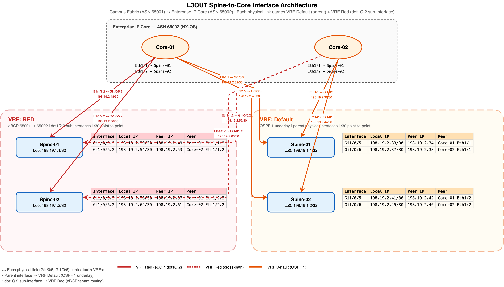

---

## 7. Underlay Services

### 7.1 OSPF IGP (Unicast Reachability)

OSPF area 0 provides loopback reachability across all fabric nodes. Loopback0 serves as BGP router-ID, NVE source, and OSPF router-ID:

```
interface Loopback0
 ip address 198.19.1.X 255.255.255.255
 ip pim sparse-mode
 ip ospf 1 area 0
!
router ospf 1
 router-id 198.19.1.X
```

### 7.2 PIM + MSDP (Multicast for BUM Replication)

| Component | Value | Function |
|-----------|-------|----------|
| Fabric Anycast RP | 198.19.1.100 | Shared on Lo2 of both Spines |
| MSDP peering | Spine-01 ↔ Spine-02 via Lo0 | RP redundancy and source sync |
| PIM mode | Sparse | All fabric interfaces |

```
ip pim spt-threshold 0
ip pim rp-address 198.19.1.100
ip msdp peer 198.19.1.X connect-source Loopback0 remote-as 65001
```

---

## 8. Deployment Operations

### 8.1 GitOps Workflow (Ansible)

All pipeline stages run from [`CICD Pipeline/ansible/`](CICD%20Pipeline/ansible/). Stages consume the shared declarative source-of-truth in [`CICD Pipeline/Settings/`](CICD%20Pipeline/Settings/) (`settings.json`).

**Quick start:**

```bash
cd "CICD Pipeline/ansible"
ansible-galaxy collection install -r collections/requirements.yml
ansible-playbook playbooks/01_site_hierarchy.yml   # example — run stages in order
```

See [`CICD Pipeline/ansible/README.md`](CICD%20Pipeline/ansible/README.md) for vault setup and the full playbook index.

| Stage | Playbook | Purpose |
|-------|----------|---------|
| 1 Site Hierarchy | `playbooks/01_site_hierarchy.yml` | Create/update the CatC site hierarchy (areas, buildings, floors) |
| 2 Settings | `playbooks/02_network_settings.yml` | Apply per-site network settings (DNS, DHCP, NTP, SNMP, Syslog, AAA, banner) |
| 3 Credentials | `playbooks/03_credentials.yml` | Create/assign device credentials (CLI, SNMPv2c, NETCONF) and bind to sites |
| 4 Device Discovery | `playbooks/04_device_discovery.yml` | Discover reachable devices and add them to CatC inventory |
| 5 Assign To Site | `playbooks/05_assign_to_site.yml` | Move discovered devices from Global into their designated site |
| 6 SWIM | `06_swim_preflight.yml` → `06_swim_import_and_tag.yml` → `06_swim_distribute.yml` → `06_swim_activate.yml` → `06_swim_postcheck.yml` (rollback: `06_swim_rollback.yml`) | Phased software image lifecycle |
| 7 Templates (GitOps) | `playbooks/07_template_sync.yml` | Sync Jinja2 templates from GitHub into a CatC Template Project (incl. composites) |
| 8 Network Profile | `playbooks/08_network_profile.yml` | Create switching network profiles and bind Day-N templates to sites |
| 9 Provision Devices | `playbooks/09_provision_devices.yml` | Provision devices to their sites (push site settings + licensing) |
| 10 Provision Composite | `playbooks/10_deploy_composite.yml` | Deploy the composite (multi-member) Day-N template to target devices |
| 11 Backup My Configs | `playbooks/11_backup_lab_configs.yml` | Back up `show running-config` from IOS-XE/NX-OS devices to timestamped archives |

Supporting directories:
- [`Settings/`](CICD%20Pipeline/Settings/) — `settings.json`, the single declarative source-of-truth
- [`ansible/playbooks/deploy_http_image_server.yml`](CICD%20Pipeline/ansible/playbooks/deploy_http_image_server.yml) — HTTP image server for SWIM import (run before `06_swim_import_and_tag.yml`)
- [`utils/mcp-ssh-server/`](CICD%20Pipeline/utils/mcp-ssh-server/) — MCP stdio server for live device CLI verification during triage

#### Template GitOps (Stage 7.0) in detail

Template sync is implemented by [`playbooks/07_template_sync.yml`](CICD%20Pipeline/ansible/playbooks/07_template_sync.yml) and the `template_sync` role. It publishes BGP EVPN templates from Git to Catalyst Center:

1. Fetch `.j2` templates from the Git repository
2. Enrich each template with Git commit metadata (version description + diff header)
3. Read `BGP-EVPN-BUILD.yml` to determine composite ordering
4. Sync to the Catalyst Center Template Project via `cisco.dnac.template_workflow_manager`
5. Create/update the `BGP-EVPN-BUILD` composite and bind it to a CLI Network Profile

It supports **multiple subfolders** (`git_repo_subfolders` in `inventory/group_vars/catalyst_center/connection.yml`), each synced to its own CatC project. See [`ansible/README.md`](CICD%20Pipeline/ansible/README.md) for configuration details.

### 8.2 Provisioning Workflow

| Step | Action | Where |
|------|--------|-------|
| 1 | Verify site hierarchy exists | CatC: Design > Network Hierarchy |
| 2 | Verify devices discovered + assigned to site | CatC: Provision > Inventory |
| 3 | Verify underlay OSPF operational | Device CLI: `show ip ospf neighbor` |
| 4 | Import/sync templates | Ansible `playbooks/07_template_sync.yml` |
| 5 | Attach composite to CLI Network Profile | CatC: Design > Network Profiles |
| 6 | Assign profile to building site | CatC: Design > Network Profiles |
| 7 | Provision devices | CatC: Provision > Inventory (or Ansible playbook) |

### 8.3 Deployment Phases

**Phase 1 — Foundation** (Steps 1-2): VRF isolation + loopback addressing
**Phase 2 — Transport** (Steps 3-5): GRE tunnels, L3OUT, NVE, Multicast
**Phase 3 — Control Plane** (Steps 6-7): BGP EVPN peering, L2VNI overlay
**Phase 4 — Services** (Steps 8-11): Client ports, NAC, telemetry

### 8.4 Operations Examples

Step-by-step guides for common day-2 changes. Each example lists **which `DEFN-*.j2` files to edit** (the data dictionaries that drive rendering) and what Catalyst Center / lab follow-up is required. `FABRIC-*.j2` generators iterate `DEFN_OVERLAY` and related structures — **do not hand-edit FABRIC templates** when adding a VLAN in an existing VRF.

#### Example 1 — Add a new red corporate VLAN and L2VNI (`corp-103`, VLAN 103)

This walkthrough mirrors the **2026-07-10** addition of **corp-103**: a third corporate user segment in the existing **red** VRF (901). VLAN **103** maps to subnet **`198.18.103.0/24`**, L2VNI **50103** (`50000 + 103`), and follows the red-tenant naming conventions in §5.2–§5.3. No new VRF, loopback prefix, or `FABRIC-*.j2` edits are required.

**Goal**

| Field | Value |
|-------|-------|
| VLAN | 103 |
| Segment name | `corp-103` |
| VRF | red (901) |
| Subnet / anycast GW | `198.18.103.0/24` / `198.18.103.1` |
| L2VNI | 50103 |
| Anycast MAC | `0000.0901.0103` |
| BUM multicast | `239.190.100.103` |
| Lab access port (optional) | Leaf-02 `GigabitEthernet1/0/8` → VLAN 103 (`client-red-05`) |

**Step 1 — `DEFN-OVERLAY.j2` (required)**

Add the VLAN to the red tenant block in `DEFN_OVERLAY`:

1. Append `'103'` to the red `vlan_ids` list.
2. Add a `vlans['103']` entry with SVI, anycast MAC, DHCP helper, BUM group, and `network` prefix.

```jinja
'vlan_ids': ['101', '102', '103'],
'vlans': {
  ...
  '103': {'name':'corp-103', 'ipaddr':'198.18.103.1 255.255.255.0', 'mac':'0000.0901.0103',
          'dhcp_helper':'198.19.2.78', 'bum_addr':'239.190.100.103', 'network':'198.18.103.0 255.255.255.0'}
}
```

**What this drives (no FABRIC edits):** `FABRIC-OVERLAY.j2` renders on **leaves** (not spines/borders): `l2vpn evpn instance`, VLAN + `vlan configuration`, `interface nve1` L2VNI member, and `interface Vlan103` SVI with DHCP relay. Overlay is template-wide on all red-capable leaves; a lab may provision only the leaf that carries an access port.

**Step 2 — `DEFN-L3OUT.j2` (required for internet / core egress)**

Append the segment `/24` to `DEFN_L3OUT_AGGREGATES` so spines advertise a summary toward the enterprise core (ASN 65002):

```jinja

```

**What this drives:** `FABRIC-EVPN.j2` adds `aggregate-address 198.18.103.0 255.255.255.0 summary-only` under `address-family ipv4 vrf red` on **Spine-01** and **Spine-02** only. This is L3OUT control-plane config — not an L2 overlay on spines.

**Step 3 — `DEFN-CLIENT-PORTS.j2` (optional — lab access only)**

When a physical client port is needed, add a port mapping under the target leaf hostname in `DEFN_CLIENT_PORTS`:

```jinja
'Leaf-02.dcloud.cisco.com': [
  ...
  {'port': 'GigabitEthernet1/0/8', 'vlan': '103', 'description': 'client-red-05', 'portfast': true, 'mode': 'access'}
]
```

**What this drives:** `FABRIC-CLIENT-PORTS.j2` renders switchport access on that leaf only. Other leaves still receive overlay SVI/NVE/EVPN from Step 1 if provisioned, but no access port unless explicitly listed here.

**DEFN files you do *not* modify for this pattern**

| File | Why unchanged |
|------|----------------|
| `DEFN-VRF.j2` | Segment stays in existing `red` VRF (901) |
| `DEFN-VNIOFFSETS.j2` | L2VNI still `50000 + vlan_id` |
| `DEFN-ROLES.j2`, `DEFN-LOOPBACKS.j2` | No new nodes or loopbacks |
| `DEFN-NAC.j2`, `DEFN-TELEMETRY.j2`, etc. | Unrelated to a new red VLAN |

**Lab / non-template follow-up (outside `DEFN-*.j2`)**

These are not Catalyst Center template data but are required for a working lab end-to-end:

| Location | Change |
|----------|--------|
| `Node Configs/fabric-dmz/dhcp.cfg` | `red-103` DHCP pool + `ip dhcp excluded-address vrf red 198.18.103.1 198.18.103.200` |
| `Node Configs/cores/core01.cfg`, `core02.cfg` | `ip prefix-list TENANT_SEGMENTS seq 30 permit 198.18.103.0/24` (red egress via Spine L3OUT → Core) |
| `Node Configs/CML/BGP_EVPN_Campus_v*.yaml` | Lab client on Leaf-02 `Gi1/0/8` (if using CML topology) |

**Deploy**

1. Validate Jinja: `CICD Pipeline/ansible/scripts/validate_j2_syntax.py`
2. Sync templates: Ansible stage `07_template_sync.yml`
3. Re-provision campus fabric devices from Catalyst Center (`BGP-EVPN-BUILD` composite). In the lab, **Leaf-02** (access + overlay) and **both spines** (L3OUT aggregate) are the minimum fabric targets; provision additional leaves only when overlay SVI/NVE is required on those nodes.
4. Apply `dhcp.cfg` to the dhcp-server and core prefix-list updates if external reachability is in scope.

**Verify**

| Check | Command / location |
|-------|-------------------|
| VLAN / SVI (leaf) | `show vlan id 103`, `show ip int vrf red Vlan103` |
| EVPN | `show l2vpn evpn mac vni 50103` |
| L3OUT (spine) | `show ip bgp vpnv4 vrf red` — aggregate `198.18.103.0/24` |
| Core egress | `show ip prefix-list TENANT_SEGMENTS` on Core-01/02 |
| DHCP (lab) | Client on Leaf-02 `Gi1/0/8` receives `.201+` from `red-103` pool |

**Rollback scope (campus fabric only)**

To remove corp-103 from live devices without touching cores, DMZ, or dhcp-server:

| Device | Remove |
|--------|--------|
| **Leaf-02** | `Gi1/0/8` access config, `Vlan103`, NVE member `50103`, `l2vpn evpn instance 103`, VLAN 103 |
| **Spine-01 / Spine-02** | `no aggregate-address 198.18.103.0 255.255.255.0 summary-only` in `address-family ipv4 vrf red` |

Only remove overlay on other leaves if those nodes were provisioned with the segment. See [Release Notes/2026-07-10-corp-103-red-segment.md](Release%20Notes/2026-07-10-corp-103-red-segment.md) for the full change record.

---

## 9. Splunk Assurance Integration

### 9.1 Telemetry Pipeline

`FABRIC-TELEMETRY-SPLUNK.j2` provisions IOS-XE Model-Driven Telemetry (MDT) subscriptions on each fabric node:

```
Fabric nodes (MDT/YANG, gRPC dial-out) → OpenTelemetry collector → splunk_hec → index=evpn_assurance → campus_evpn_assurance dashboards
```

### 9.2 Components

| Component | Purpose |
|-----------|---------|
| `campus_evpn_assurance/` | Packaged Splunk app (Summary, Details with role filter, Alerts dashboards) |
| `otel-collector/` | OpenTelemetry config: YANG gRPC → `splunk_hec` |
| `packaging/` | Build scripts for `.spl` package and customer handoff bundle |
| `SETUP_GUIDE.md` | Install workflow for Splunk app + patched `otelcol-yangfix` |
| `Model Maps/` | YANG → Splunk metric model mappings — see [`Model Maps/README.md`](Campus%20BGP%20EVPN%20Splunk%20Assurance/Model%20Maps/README.md) |

The assurance suite shares the same fabric model (roles, tenants, VNIs, loopbacks) as the provisioning templates, so dashboard logic maps directly onto what was provisioned.

See [`Campus BGP EVPN Splunk Assurance/README.md`](Campus%20BGP%20EVPN%20Splunk%20Assurance/README.md) and [`SETUP_GUIDE.md`](Campus%20BGP%20EVPN%20Splunk%20Assurance/SETUP_GUIDE.md) for details.

---

## 10. IOS-XE Configuration Architecture

### 10.1 CLI Dependency Hierarchy

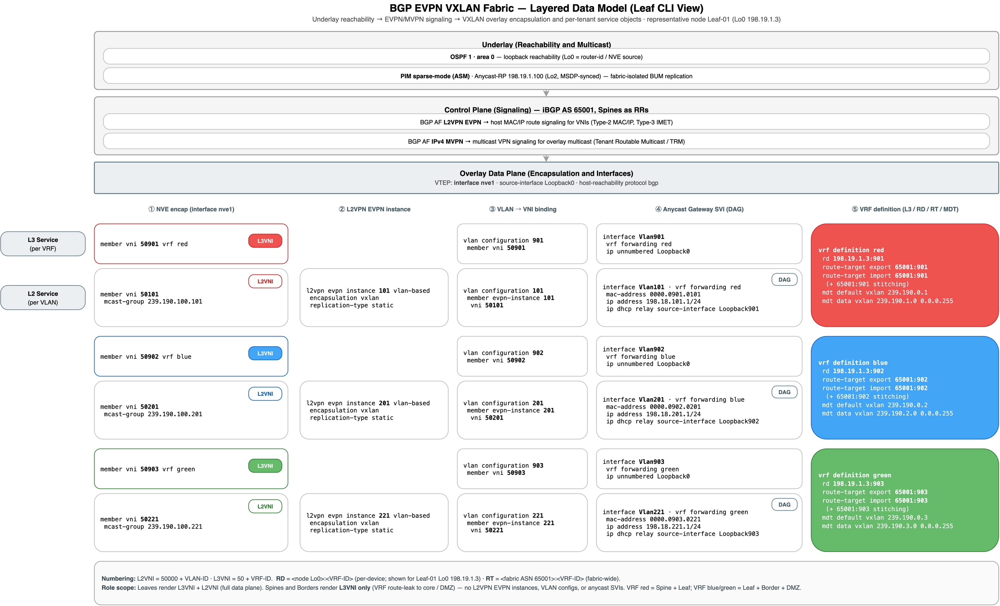

> Diagram source: [`DIAGRAMS/cisco_evpn_data_model.drawio`](DIAGRAMS/cisco_evpn_data_model.drawio)

Configuration must be applied in strict dependency order:

```
VRF DEFINITION
 └─ LOOPBACK INTERFACES (Lo0 underlay, Lo901+ overlay)
     └─ VLAN + L3VNI SVI (transit VLANs 901-903)
         └─ NVE INTERFACE (source Lo0, member VNIs)
             └─ BGP EVPN CONTROL PLANE (iBGP to RRs, EVPN/MVPN AFs)
                 └─ L2VPN EVPN INSTANCES (per-VLAN EVPN binding)
                     └─ GLOBAL L2VPN EVPN (replication-type, default-gateway advertise)
```

### 10.2 Template-to-Component Mapping

| Template | CLI Deliverables |
|----------|-----------------|
| `FABRIC-VRF.j2` | `vrf definition`, RD/RT |
| `FABRIC-LOOPBACKS.j2` | `interface Loopback0/901-903`, PIM, OSPF |
| `FABRIC-BORDER-DMZ-TUNNELS.j2` | `interface Tunnel10`/`Tunnel20` (one per DMZ peer), `router ospf 100` |
| `FABRIC-L3OUT.j2` | Dot1Q sub-interfaces, Null0 routes |
| `FABRIC-NVE.j2` | `interface nve1`, L3VNI VLANs/SVIs, `vlan configuration` |
| `FABRIC-MCAST.j2` | `ip pim`, `ip msdp`, VRF MDT |
| `FABRIC-EVPN.j2` | `router bgp`, peer templates, all AFs |
| `FABRIC-OVERLAY.j2` | L2VNI VLANs, `l2vpn evpn instance`, anycast GW SVIs |
| `FABRIC-CLIENT-PORTS.j2` | Access port config, trunk/access modes |
| `FABRIC-NAC.j2` | 802.1X/MAB policies |
| `FABRIC-TELEMETRY-SPLUNK.j2` | `telemetry ietf subscription`, `receiver` |

### 10.3 Global L2VPN EVPN (Leaf Only)

```
l2vpn evpn
 replication-type static
 router-id Loopback0
 default-gateway advertise
```

Spines do not configure this block — they do not participate in L2 forwarding.

---

## 11. FABRIC Template Detail

### FABRIC-VRF.j2
Creates VRF containers with per-device RD (`loopback_ip:vrf_id`) and fabric-wide RT (`asn:vrf_id`). Applied to all nodes listed in `DEFN_VRF_TO_NODE`.

### FABRIC-LOOPBACKS.j2
- **Loopback0**: Underlay identity (BGP RID, NVE source, OSPF RID)
- **Loopback901-903**: Per-VRF overlay loopbacks (leaves/borders only)
- **Loopback1/2** (borders): GRE source and EVPN overlay identity
- Overlay formula: `DEFN_LOOP_OVERLAY[vrf] + last_octet(Lo0)`

### FABRIC-BORDER-DMZ-TUNNELS.j2
GRE tunnels sourced from Lo1 with OSPF 100 underlay. Rendered only on `DEFN_NODE_ROLES['BORDER']` nodes when `DEFN_TUNNELS` is defined.

### FABRIC-L3OUT.j2
Dot1Q sub-interfaces on Spines for per-VRF routing to the IP Core. East-west Null0 routes prevent cross-tenant leakage. Auto-skipped when `DEFN_L3OUT_NODES = []`.

### FABRIC-NVE.j2
L3VNI VLANs (transit), L2VNI VLANs (segment), NVE member VNI assignments with multicast groups. Spines receive L3VNI config for route leaking.

### FABRIC-MCAST.j2
Global PIM sparse-mode, Anycast RP on Lo2, MSDP inter-spine peering, per-VRF MDT configuration.

### FABRIC-EVPN.j2
BGP router config with role-based peer templates. RRs: `send receive` + `route-reflector-client`. Clients: `receive` only. Includes L3OUT eBGP (conditional) and DMZ eBGP (conditional on `BORDER` + `MCLUSTER` roles).

### FABRIC-OVERLAY.j2
L2VPN EVPN instances per segment VLAN, anycast gateway SVIs with DHCP relay. Leaves/Borders only.

### FABRIC-NAC.j2
802.1X/MAB policy-maps for device classification and dynamic VLAN assignment. Leaves only.

### FABRIC-TELEMETRY-SPLUNK.j2
IOS-XE MDT subscriptions (gRPC dial-out) for EVPN, NVE, and interface YANG models. Rendered on nodes in `DEFN_TELEMETRY_SPLUNK_ROLES`.

---

## 12. Verification and Troubleshooting

### 12.1 Post-Deployment Checks

```
show ip ospf neighbor                    ! OSPF adjacencies (FULL)
show bgp l2vpn evpn summary             ! EVPN peers (Established)
show nve interface                       ! NVE tunnel status + VNI list
show l2vpn evpn summary                  ! L2VPN instance state
show vrf                                 ! VRF presence and RD
show ip route vrf red                    ! Per-VRF routing table
show mac address-table dynamic           ! MAC learning across fabric
```

### 12.2 Common Failure Modes

| Symptom | Root Cause | Resolution |
|---------|-----------|-----------|
| BGP EVPN peer stuck in Active | FQDN mismatch between DEFN and CatC inventory | Verify hostnames: `show inventory \| include NAME` |
| NVE tunnel down | Loopback0 unreachable across underlay | Verify OSPF: `ping <peer-Lo0>`, `show ip ospf neighbor` |
| L2VPN instances not activating | L3VNI VLAN/SVI missing | Verify FABRIC-NVE output includes `interface Vlan901` |
| BUM replication failure | RP unreachable or MSDP down | `ping 198.19.1.100`, `show ip msdp peer` |
| Border-DMZ EVPN down | GRE tunnel INIT / OSPF 100 not FULL | Check tunnel state, verify no Lo1 IP conflict with core |
| Template renders empty | Device not in `DEFN_VRF_TO_NODE` | Add FQDN to node mapping in `DEFN-VRF.j2` |

---

## 13. Appendix: Catalyst Center Jinja2 Engine Caveats

### 13.1 Unsupported Constructs

| Unsupported | Workaround |
|-------------|------------|
| `not in` operator | `` |
| `.keys()` method | Iterate companion list |
| `` | Iterate companion list, then `dict[k]` |
| `.split('.')` | `.split('\\.')` (CatC treats `.` as regex wildcard) |
| Complex nested expressions | Break into simpler steps |

### 13.2 Dict Iteration in Included Scope (Critical)

Any dict defined in an included `DEFN-*.j2` file must have a **companion flat list** for iteration. Dict-key iteration is non-deterministic in CatC's included-scope engine — the loop variable may resolve to the value object instead of the key string. This project reuses the `DEFN_NODE_ROLES` role sub-lists (`SPINE`, `CLIENT`, `BORDER`, `MCLUSTER`) as the companion lists that key into the addressing dicts.

**Pattern**:
```jinja
{# DEFN file: define both the role list and the addressing dict #}



{# FABRIC file: iterate the role list, look up the dict by key #}

ip prefix-list LOOPBACKS seq {{loop.index}} permit {{DEFN_LOOP_UNDERLAY[node]}}/32

```

> Use **literal** dict keys (`DEFN_NODE_ROLES['SPINE']`). A variable key (`DEFN_NODE_ROLES[role]` where `role` is a loop variable) silently resolves to empty in CatC's included-scope engine.

**Existing companion lists**:

| List | Dict | Usage |
|------|------|-------|
| `DEFN_NODE_ROLES['SPINE'/'CLIENT'/'BORDER']` | `DEFN_LOOP_UNDERLAY` | Fabric node Loopback0 IPs |
| `DEFN_NODE_ROLES['BORDER']` | `DEFN_LOOP_GRE_SRC` / `DEFN_LOOP_GRE_PEER` | Per-border GRE source / peer IPs |
| `DEFN_NODE_ROLES['MCLUSTER']` | `DEFN_LOOP_MCLUSTER` | Remote DMZ (multi-cluster) peers |

### 13.3 `.split()` Escaping

```jinja

```

---

## 14. Adding New Fabric Elements

### New Device
1. `DEFN-ROLES.j2` — Add FQDN to the appropriate `DEFN_NODE_ROLES` role lists (SPINE/RR/CLIENT/BORDER/MCLUSTER)
2. `DEFN-LOOPBACKS.j2` — Add to `DEFN_LOOP_UNDERLAY` (+ `DEFN_LOOP_GRE_SRC`/`DEFN_LOOP_GRE_PEER` if border, `DEFN_LOOP_MCLUSTER` if DMZ)
3. `DEFN-VRF.j2` — Add VRF ID list to `DEFN_VRF_TO_NODE`

### New VRF
1. `DEFN-VRF.j2` — Add VRF object to `DEFN_VRF` list + add node mappings to `DEFN_VRF_TO_NODE`
2. `DEFN-OVERLAY.j2` — Add VLAN definitions under the new VRF

### New VLAN

See **§8.4 Example 1** for a full red corporate VLAN walkthrough (`corp-103`). Minimal data change:

Add entry to `DEFN_OVERLAY` under the correct VRF:
```jinja
'102': {'name':'corp-102', 'ipaddr':'10.1.12.1 255.255.255.0', 'mac':'0000.0901.0102',
        'dhcp_helper':'198.18.5.253', 'bum_addr':'239.190.100.102', 'network':'10.1.12.0 255.255.255.0'}
```

---
