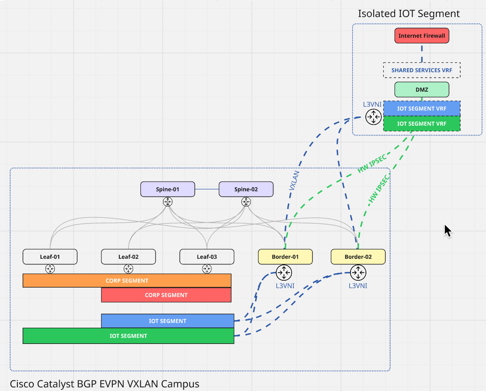
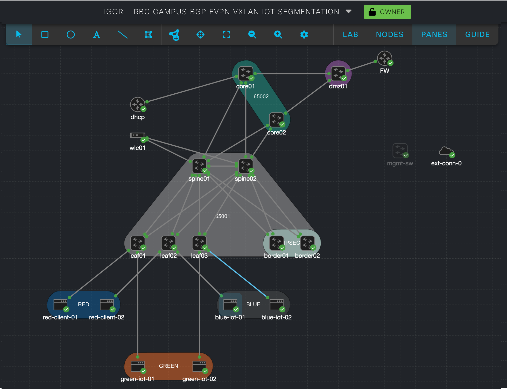
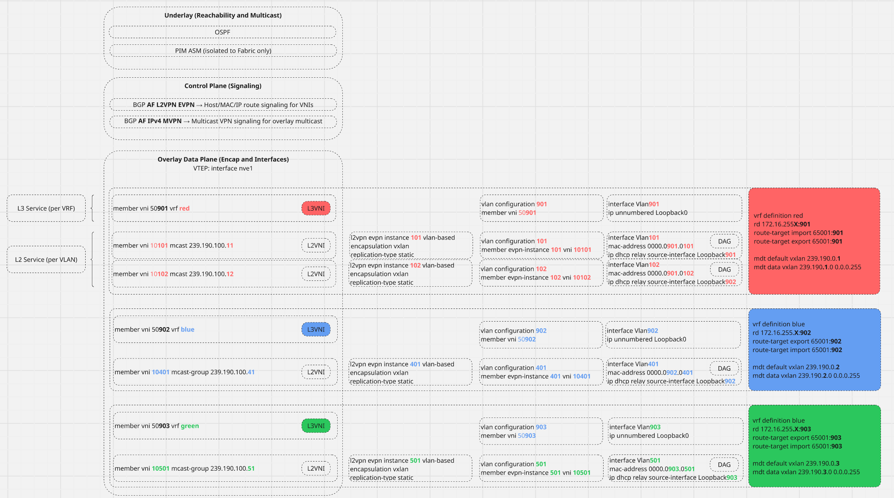

# Cisco Catalyst Center BGP EVPN VXLAN Campus Fabric Templates

## Project Overview

This repository contains a comprehensive collection of Cisco Catalyst Center CLI templates designed to provision and manage Campus BGP EVPN VXLAN fabric infrastructure using Cisco Catalyst 9000 series switches running IOS-XE. The templates are organized into a structured deployment sequence that enables automated configuration of modern campus network fabrics with advanced overlay capabilities.

Modern organizations are faced with a set of new challenges in large-scale Campus Deployments:
- Agility and compressed time-to-value realization
- Shrinking Capital and Operational expenses
- Segmentation of traffic segments
- End-to-end linerate encryption of segmented flows across the enterprise
- Infrastructure-as-Code-first approach

Modern Cisco Campus Architecture allows to address all of the above requirements leveraging open-standards BGP EVPN VXLAN implementation on Cisco modern IOS-XE operating system. 

Requirements:
- Controller-driven segment programming at scale
- Support for large number of 'Tenants' and 'Segments' within each 'Tenant'
- Support for 'IOT' class of Tenants, which require specialized routing and encryption parameters. Unlike 'corporate' traffic patterns, 'IOT' must be segmented at the edge and securely routed to an isolated 'DMZ' segment, where each is handed off to northbound firewall
- 'Corporate' tenant segments must be isolated from 'IOT' segments, and routed through IP Core handoff towards the rest of the organization
- 'Corporate' tenant segments to support Multicast (Cisco EVPN Tenant Routable Multicast)
- Each Tenant to support DHCP, DNS, and NAC services

## Scope and Intent

The template collection provides a complete solution for:
- **Campus BGP EVPN VXLAN Fabric Deployment**: Automated provisioning of spine-leaf architectures with EVPN control plane
- **Multi-Tenancy Support**: VRF-aware configurations with isolated tenant networks
- **Overlay Network Services**: L2 and L3 overlay services with VXLAN encapsulation
- **Multicast Optimization**: PIM-based multicast distribution with anycast RP
- **Border Gateway Integration**: External connectivity through border leaf switches

## Architecture Support

**Supported Platforms:**
- Cisco Catalyst 9500 Series Switches
- Cisco Catalyst 9400 Series Switches  
- Cisco Catalyst 9300 Series Switches
- Cisco Catalyst 9000 Series Virtual Switches
- IPSEC functionality requires Cisco Catalyst 9300X for hardware-accelerated IPSEC crypto function

**Software Requirements:**
- IOS-XE 17.15.3. Note that 17.12.x is also supported with the exception of Multi-Cluster BGP EVPN (ie Border Switches can run 17.15.3 while the rest of the fabric can operate on 17.12.x)
- Cisco Catalyst Center 2.3.7.9
- Cisco Modeling Labs 2.9

**Intended Outcome Topology**
This collection of Catalyst Center Templates is inteded to provision a simulated Campus Environment comprised of:
- pair of 'Spines' Catalyst 9K
- three individual 'Leaf' Catalyst 9K switches, emulating wiring LAN closet switches
- pair of 'Border Leafs' Catalyst 9K switches, which function as VXLAN-IPSEC-VXLAN Gateways. Border Gateways take VXLAN encapsulated 'IOT' segments and transport those over hardware-accelerated IPSEC tunnels to the designated 'DMZ' place-in-the-network ensuring segmentation of the segments as well as line-rate native 100G IPSEC encryption in transit

The templates are fully extensible, but for the purposes of this lab excercise we will be provisioning three individual Tenants in our emulated topology

- 'RED' Tenant (ie vrf 'red'), which will be emulating User Subnets. 'RED' Tenant will provide native support for Tenant Routable Multicast in the Overlay. TRM will be assuming existence of Anycast-RP routable through the IP Core Block. For the purposes of the demonstration, we will assume Anycast RP Address: 172.17.254.100, which we will scope to the following Enterprise Multicast Range: 238.190.0.0 0.0.255.255. 'RED' Tenant is offering centralized DHCP/DNS services which are accessible to the enterprise via L3 in IP Core Segment

- 'BLUE' Tenant (ie vrf 'blue'), and similarly, 'GREEN' Tenant (ie vrf 'green'). These Tenants will encapsulate any traffic coming through the Wiring Lan Closet host-facing-ports labelled with IOT Vlans, and securely transport that traffic to the DMZ, which is is an isolated segment of the network for security purposes. 'IOT' Tenants are assumed to have separate, segretated DHCP/DNS etc services available only in DMZ section of the network (ie 'Shared Services')



The above logical topology is emulated leveraging Cisco Modeling Labs (CML). Refer to corresponding CML topolgoy diagram below


### High Level IGP / BGP / IPSEC Topology Diagram
At a high level, we have three discrete BGP routing blocks in this topology:
- BGP control plane for the Campus Fabric
- BGP control plane for routing services in the Enterprise Core
- BGP control plane for DMZ Fabric 
We are effectively extending segmentation domains from each individual Campus VXLAN Fabric to the centralized DMZ VXLAN Fabric over secure IPSEC transport, which is terminated on individual Border Leaf Nodes in each Campus Fabric, and the DMZ VXLAN Node.


### Lab Reference Tables

#### Node Loopback (Underlay) Mapping

| Hostname                    | Device Role        | Loopback0 IP     | Description                          |
|-----------------------------|--------------------|--------------------|--------------------------------------|
| spine01                     | Route Reflector    | 172.16.255.1/32  | Primary spine and RR                 |
| spine02                     | Route Reflector    | 172.16.255.2/32  | Secondary spine and RR               |
| leaf01                      | EVPN Client        | 172.16.255.3/32  | Access leaf switch                   |
| leaf02                      | EVPN Client        | 172.16.255.4/32  | Access leaf switch                   |
| leaf03                      | EVPN Client        | 172.16.255.5/32  | Access leaf switch                   |
| border01                    | Border Leaf        | 172.16.255.6/32  | Campus-to-WAN/DMZ gateway            |
| border02                    | Border Leaf        | 172.16.255.7/32  | Campus-to-WAN/DMZ gateway            |
| dmz01                       | DMZ Gateway        | —                | DMZ services node                    |
| core01                      | Core Router        | —                | Enterprise core router               |
| core02                      | Core Router        | —                | Enterprise core router               |

**Note:** Spines also configure anycast RP loopback (Loopback250) with IP 172.16.255.254/32 for multicast services.

---

#### VRF Definitions

| VRF   | Description         | RD                   | L3VNI  | Overlay SVI | Multicast Default | Multicast Data Range       |
|-------|---------------------|----------------------|--------|-------------|-------------------|----------------------------|
| red   | VRF red definition  | 172.16.255.3:901     | 50901  | Vlan901     | 239.190.0.1       | 239.190.1.0/24             |
| blue  | VRF blue definition | 172.16.255.3:902     | 50902  | Vlan902     | 239.190.0.2       | 239.190.2.0/24             |
| green | VRF green definition| 172.16.255.3:903     | 50903  | Vlan903     | 239.190.0.3       | 239.190.3.0/24             |
---

#### VRF Multicast RP Mapping

| VRF   | PIM RP Address   | Scope Name           |
|-------|------------------|----------------------|
| red   | 172.17.254.100   | ENTERPRISE-RP-SCOPE  |
| blue  | 172.17.254.100   | ENTERPRISE-RP-SCOPE  |
| green | 172.17.254.100   | ENTERPRISE-RP-SCOPE  |
---

#### VLAN, VNI, EVPN Instance, VRF, Multicast Group Mappings

| VLAN | Name                  | VNI     | EVPN Instance | VRF   | Multicast Group         |
|------|-----------------------|---------|---------------|-------|-------------------------|
| 101  | DAG-corp-11           | 10101   | 101           | red   | 239.190.100.11          |
| 102  | DAG-corp-12           | 10102   | 102           | red   | 239.190.100.12          |
| 201  | DAG-corp-201          | 10201   | 201           | red   | 239.190.100.201         |
| 401  | DAG-iot-blue-401      | 10401   | 401           | blue  | 239.190.100.41          |
| 501  | DAG-iot-green-501     | 10501   | 501           | green | 239.190.100.51          |
| 901  | L3-VRF-CORE-901       | 50901   | —             | red   | —                       |
| 902  | L3-VRF-CORE-902       | 50902   | —             | blue  | —                       |
| 903  | L3-VRF-CORE-903       | 50903   | —             | green | —                       |
---

#### Multicast Group Ranges

| Scope           | RP Address       | Group Range           |
|-----------------|------------------|-----------------------|
| Fabric Scope    | 172.16.255.254   | 239.190.0.0/16        |
| Enterprise Scope| 172.17.254.100   | 238.190.0.0/16        |
**Note:** Fabric Scope Group Range is limited to each Campus Fabric only, and thus can be reused at multiple locations for the same purpose. Tenant Routable Multicast is configured to leverage centralized Anycast-RP services that are common for all the Fabric Locations.
---

#### VRF Services Loopback (Overlay) Mapping

| VRF   | Hostname | Overlay Loopback | IP Address         |
|-------|----------|------------------|--------------------|
| red   | leaf01   | Loopback901      | 10.1.91.3/32       |
| red   | leaf02   | Loopback901      | 10.1.91.4/32       |
| red   | leaf03   | Loopback901      | 10.1.91.5/32       |
| blue  | leaf01   | Loopback902      | 10.1.92.3/32       |
| blue  | leaf02   | Loopback902      | 10.1.92.4/32       |
| blue  | leaf03   | Loopback902      | 10.1.92.5/32       |
| green | leaf01   | Loopback903      | 10.1.93.3/32       |
| green | leaf02   | Loopback903      | 10.1.93.4/32       |
| green | leaf03   | Loopback903      | 10.1.93.5/32       |
**Note:** Border switches (border01, border02) and spines (spine01, spine02) do not configure VRF overlay loopbacks. Border switches use unnumbered L3VNI SVIs referencing Loopback0, while spines operate as BGP EVPN Route Reflectors without VRF participation.
---

### Cisco IOS-XE BGP EVPN CLI dependency map
Attached is a visual representation describing components that go into a functioning BGP EVPN VXLAN Fabric


##Building Blocks of the solution:
###Underlay Routing - Unicast
The purpose of the underlay routing (in this case OSPF as an IGP) is to provide Loopback reachability between Leafs, Spines, and Border Leafs within the Fabric. Note the 'X' placeholder, which represents the index of the node on which this configuration block is present (subject to your numbering convention). 'Loopback0' interface is pivotal to the operations of all of the fabric services, as it provides for IGP/BGP router ID, NVE reachability etc.
Fabric interfaces are also enabled with the same IGP for achieving end to end reachability.
```
interface Loopback0
 description UNDERLAY-NVE-INTERFACE
 ip address 172.16.255.3 255.255.255.255
 ip pim sparse-mode
 ip ospf 1 area 0
```
```
router ospf 1
 router-id 172.16.255.X
```
### Underlay Routing - Multicast
BGP EVPN VXLAN Fabrics require underlay multicast services for BUM replication purposes (unless you decide to implement headend replication, which is sub-optimal). 
In our configuraiton we are breaking up our underlay multicast services into Fabric-only (ie FABRIC-RP-SCOPE) for BUM replication, as well as generic Enterprise Multicast (ie ENTERPRISE-RP-SCOPE) - used in case you decide to leave some of your client traffic in the underlay. 
```
ip pim rp-address 172.16.255.254 FABRIC-RP-SCOPE
ip pim rp-address 172.17.254.100 ENTERPRISE-RP-SCOPE
ip pim spt-threshold 0
```
For purposes of this Lab, it is assumed that Fabric-only and Enterprise Multicast Groups are non-overlapping. Fabric Multicast Groups are scoped to 239.190.0.0/16:
```
ip access-list standard FABRIC-RP-SCOPE
 10 permit 239.190.0.0 0.0.255.255
```
and Enterprise Multicast Groups are scoped to 238.190.0.0/16:
```
ip access-list standard ENTERPRISE-RP-SCOPE
 10 permit 238.190.0.0 0.0.255.255
```
Campus VXLAN Fabrics rely on in-Fabrics Anycast RP configured on Spine Nodes, where peer IP address is the Loopback0 on adjacent Spine node:
```
ip msdp peer 172.16.255.X connect-source Loopback0 remote-as 65001
ip msdp originator-id Loopback0
```

### Overlay Routing - Control Plane
Control plane is built out leveraging Spine nodes as BGP Route Reflectors, and Leafs (including Border Leafs) as Route Reflector Clients. Each BGP instance utilizies the following MP-BGP Address Families:
- AF l2vpn evpn. This address family is one of the critical components that enables the overlay control plane functionality. The L2VPN EVPN address family allows BGP to carry MAC address and IP address reachability information across the VXLAN fabric, essentially advertising both Layer 2 and Layer 3 information between fabric nodes. When configured on spine switches (acting as BGP route reflectors) and leaf switches (acting as route reflector clients), this address family enables the distribution of:

-- MAC address tables across the fabric
-- ARP/ND information for optimized forwarding
-- Ethernet segment information for multi-homing scenarios
-- Route type 2 (MAC/IP) and route type 3 (Inclusive Multicast Ethernet Tag) advertisements

- AF mpvn. The MPVN address family enables BGP to carry multicast routing information across the VXLAN fabric, allowing for efficient distribution of multicast traffic in overlay networks. This address family is particularly important in VXLAN environments because it provides the control plane mechanisms needed to handle multicast replication and forwarding decisions across the fabric. In the context of this campus fabric design, the MPVN address family works in conjunction with the underlay multicast infrastructure (which uses PIM and MSDP as described earlier in the document) to provide end-to-end multicast services. While the underlay handles the basic multicast replication for BUM (Broadcast, Unknown unicast, and Multicast) traffic within the fabric infrastructure, the MPVN address family enables more sophisticated multicast VPN services that can span across different VRFs and provide tenant-aware multicast forwarding.
This address family is configured alongside the L2VPN EVPN and IPv4 per-VRF address families as part of the comprehensive BGP control plane that enables both Layer 2 and Layer 3 services, including multicast services, across the VXLAN campus fabric. Together, these address families create a robust overlay control plane that can handle unicast, multicast, and Layer 2 forwarding requirements in a scalable campus network design.

- AF ipv4 per vrf. The IPv4 per VRF address family enables BGP to carry Layer 3 routing information on a per-tenant or per-VRF basis across the VXLAN fabric. This address family is essential for providing Layer 3 VPN services in the overlay network, allowing different virtual networks or tenants to maintain separate routing tables while sharing the same physical infrastructure. Each VRF represents an isolated routing domain with its own forwarding table, enabling network segmentation and multi-tenancy. In the context of this campus fabric, the IPv4 per VRF address family works alongside the L2VPN EVPN and MPVN address families to provide comprehensive overlay services. While L2VPN EVPN handles Layer 2 connectivity and MAC/IP advertisement, and MPVN manages multicast services, the IPv4 per VRF address family specifically manages the distribution of IPv4 unicast routes between different VRFs across the fabric nodes. This configuration allows the campus fabric to support multiple isolated networks or tenants, each with their own IPv4 routing domain, while leveraging the shared VXLAN underlay infrastructure. The spine switches acting as BGP route reflectors can efficiently distribute VRF-specific routing information to the appropriate leaf switches, enabling scalable Layer 3 services across the campus network.

## Template Structure
The project contains two main categories of templates located in the `BGP EVPN/` folder:
1. 'Provisioning' Templates, which are named with a preceeding index indicating the order in which the template should be applied to the device. These templates contain the logic to differentiate between the fabric node roles, and source 'intent' (ie input variables) from the corresponding 'Input' variables located in the same folder
2. 'Input' Templates, which contain the intended outcome, expressed in human-readable json-like structure compatible with Catalyst Center jinja2 template engine.

## Initial Preparation
Ensure that your IOS-XE Catalyst switches have the correct license level applied:
```
license boot level network-advantage addon dna-advantage
```

Confirm that Network Advantage license is applied:
```
leaf01#sh license summary 
Account Information:
  Smart Account: <none>
  Virtual Account: <none>

License Usage:
  License                 Entitlement Tag               Count Status
  -----------------------------------------------------------------------------
  network-advantage       (CAT9K_VIRTUAL Network ...)       1 IN USE
  dna-advantage           (CAT9K_VIRTUAL DNA Adva...)       1 IN USE

```

## Cisco IOS-XE VXLAN EVPN FABRICS BUILDING BLOCKS
Initial glance at the complete CLI configuration may prove daunting. 
To help better vizualize the constructs, lets review each of the Fabric Node's configuration vizually.


Before attempting to deploy the collection, the following DEFN Input Variables must be adjusted to suite your environment:
1. DEFN_LOOPBACKS: device hostnames must match those configured on the target devices, ie 'spine01.dcloud.cisco.com' must match
```
spine01#sh run | i hostname | domain
hostname spine01
ip domain lookup source-interface Loopback0
ip domain name dcloud.cisco.com
```
2. DEFN_ROLES: device hostanmes to match, same as (1) above
3. DEFN_L3OUT: Interface names, vlan id, and neighbor parameters must match your core-facing interface configuration, as well as core BGP ASN.

Ensure that basic underlay routing is configured and operational (ie OSPF neighbours are established, spines have BGP established towards the cores)

```
spine01#sh ip ospf neighbor 

Neighbor ID     Pri   State           Dead Time   Address         Interface
172.16.255.7      0   FULL/  -        00:00:39    172.16.16.6     GigabitEthernet1/0/5
172.16.255.6      0   FULL/  -        00:00:36    172.16.15.5     GigabitEthernet1/0/4
172.16.255.5      0   FULL/  -        00:00:33    172.16.14.5     GigabitEthernet1/0/3
172.16.255.4      0   FULL/  -        00:00:31    172.16.13.4     GigabitEthernet1/0/2
172.16.255.3      0   FULL/  -        00:00:32    172.16.12.3     GigabitEthernet1/0/1
```

```
spine02#sh ip ospf neighbor 

Neighbor ID     Pri   State           Dead Time   Address         Interface
172.16.255.7      0   FULL/  -        00:00:38    172.16.26.6     GigabitEthernet1/0/5
172.16.255.6      0   FULL/  -        00:00:31    172.16.25.5     GigabitEthernet1/0/4
172.16.255.5      0   FULL/  -        00:00:38    172.16.24.5     GigabitEthernet1/0/3
172.16.255.4      0   FULL/  -        00:00:36    172.16.23.4     GigabitEthernet1/0/2
172.16.255.3      0   FULL/  -        00:00:39    172.16.22.3     GigabitEthernet1/0/1
```

```
spine01#sh ip bgp summary 
BGP router identifier 172.16.255.1, local AS number 65001
BGP table version is 24, main routing table version 24
23 network entries using 5704 bytes of memory
24 path entries using 3264 bytes of memory
4/4 BGP path/bestpath attribute entries using 1184 bytes of memory
1 BGP AS-PATH entries using 40 bytes of memory
2 BGP extended community entries using 100 bytes of memory
0 BGP route-map cache entries using 0 bytes of memory
0 BGP filter-list cache entries using 0 bytes of memory
BGP using 10292 total bytes of memory
BGP activity 29/0 prefixes, 30/0 paths, scan interval 60 secs
23 networks peaked at 16:57:51 Aug 12 2025 UTC (00:01:52.693 ago)

Neighbor        V           AS MsgRcvd MsgSent   TblVer  InQ OutQ Up/Down  State/PfxRcd
172.17.1.2      4        65002       7      10       24    0    0 00:03:00        1
172.17.2.2      4        65002       7      11       24    0    0 00:02:59        1
```

```
spine02#sh ip bgp summary 
BGP router identifier 172.16.255.2, local AS number 65001
BGP table version is 24, main routing table version 24
23 network entries using 5704 bytes of memory
24 path entries using 3264 bytes of memory
4/4 BGP path/bestpath attribute entries using 1184 bytes of memory
1 BGP AS-PATH entries using 40 bytes of memory
2 BGP extended community entries using 100 bytes of memory
0 BGP route-map cache entries using 0 bytes of memory
0 BGP filter-list cache entries using 0 bytes of memory
BGP using 10292 total bytes of memory
BGP activity 29/0 prefixes, 30/0 paths, scan interval 60 secs
23 networks peaked at 16:57:26 Aug 12 2025 UTC (00:02:37.869 ago)

Neighbor        V           AS MsgRcvd MsgSent   TblVer  InQ OutQ Up/Down  State/PfxRcd
172.17.3.2      4        65002       7      10       24    0    0 00:02:38        1
172.17.4.2      4        65002       7      10       24    0    0 00:02:36        1
```

## Deployment Sequence

The templates should be deployed in numerical order (1-7) to ensure proper dependency resolution:

1. **Definition Templates**: Deploy all DEFN-* templates first to establish fabric parameters
2. **Foundation**: Deploy template 1 (FABRIC-VRF) for VRF establishment
3. **Infrastructure**: Deploy templates 2-4 (LOOPBACKS, NVE, MCAST) for basic fabric services
4. **Control Plane**: Deploy template 5 (FABRIC-EVPN) for BGP EVPN peering and L3OUT
5. **Data Plane**: Deploy template 6 (FABRIC-OVERLAY) for overlay services
6. **Security**: Deploy template 7 (FABRIC-NAC-IOT) for access control policies

## Template-to-Config Mapping

The following table shows how templates render into the final node configurations:

| Template | Spine | Leaf | Border | DMZ | Function |
|----------|-------|------|--------|-----|----------|
| 1. FABRIC-VRF | ✓ | ✓ | ✓ | ✓ | VRF definitions with RD/RT |
| 2. FABRIC-LOOPBACKS | ✓ | ✓ | ✓ | ✓ | Underlay + overlay loopbacks |
| 3. FABRIC-NVE | ✗ | ✓ | ✓ | ✓ | L3VNI VLANs (spines excluded) |
| 4. FABRIC-MCAST | ✓ | ✓ | ✓ | ✓ | Multicast + anycast RP |
| 5. FABRIC-EVPN | ✓ | ✓ | ✓ | ✓ | BGP EVPN + L3OUT interfaces |
| 6. FABRIC-OVERLAY | ✗ | ✓ | ✓ | ✓ | L2VPN instances + SVIs |
| 7. FABRIC-NAC-IOT | ✗ | ✓ | ✗ | ✗ | Access control policies |

## Template Walkthrough: Building BGP EVPN Campus Fabric

This section provides a detailed walkthrough of how each template contributes to building a Cisco IOS-XE Catalyst 9000 BGP EVPN VXLAN campus fabric:

### **Template 1: FABRIC-VRF.j2 - Foundation Layer**
**Campus Fabric Building Logic:**
- **VRF Creation**: Establishes isolated routing domains for tenant separation (red, blue, green VRFs)
- **Route Distinguisher Assignment**: Uses device's underlay loopback IP + VRF ID for unique RD per device per VRF
- **Route Target Configuration**: Sets up BGP EVPN import/export policies using AS:VRF_ID format
- **Multi-Tenancy Foundation**: Creates the fundamental isolation mechanism for campus network segmentation

**Jinja2 Logic Flow:**
1. Iterates through `vrf_list` parameter to process only selected VRFs
2. Resolves VRF objects from `DEFN_VRF` definitions 
3. Assigns unique RD using `DEFN_LOOP_UNDERLAY[__device.hostname]:vrf.id`
4. Configures RT import/export with `FABRIC_BGP_ASN:vrf.id` for tenant isolation
5. Applies to ALL fabric nodes regardless of role

### **Template 2: FABRIC-LOOPBACKS.j2 - Addressing Layer**
**Campus Fabric Building Logic:**
- **Underlay Infrastructure**: Configures Loopback0 as BGP router-ID and VXLAN source interface
- **Overlay Termination**: Creates VRF-specific loopbacks on leaf/border nodes for L3 service termination
- **PIM Integration**: Enables sparse-mode for multicast traffic distribution
- **Role-Based Logic**: Spines get only underlay loopbacks; leaves/borders get both underlay + overlay

**Jinja2 Logic Flow:**
1. Configures `DEFN_LOOP_NAME['UNDERLAY']` (Loopback0) on all devices with PIM sparse-mode
2. Uses `DEFN_LOOP_UNDERLAY[__device.hostname]` for device-specific addressing
3. Role check: IF NOT spine/border, THEN create overlay loopbacks per VRF
4. Overlay loopback addressing: `DEFN_LOOP_OVERLAY[vrf.name] + last_octet_of_underlay_IP`
5. VRF forwarding assignment for overlay loopbacks

### **Template 3: FABRIC-NVE.j2 - VXLAN Infrastructure**
**Campus Fabric Building Logic:**
- **L3VNI VLAN Creation**: Creates transit VLANs for inter-subnet routing within each VRF
- **VNI Mapping**: Maps L3VNI VLANs to corresponding VXLAN VNIs for routing traffic
- **SVI Configuration**: Creates unnumbered SVIs for L3VNI traffic processing
- **NVE Interface**: Establishes the VXLAN tunnel endpoint for overlay transport

**Jinja2 Logic Flow:**
1. Creates VLAN with `vrf.id` for each VRF (e.g., VLAN 901 for red VRF)
2. Maps VLAN to L3VNI using `L3VNIOFFSET + vrf.id` calculation
3. Creates unnumbered SVI interface referencing underlay loopback
4. Configures NVE1 interface with underlay loopback as source
5. Adds VNI-to-VRF membership on NVE interface

### **Template 4: FABRIC-MCAST.j2 - Multicast Foundation**
**Campus Fabric Building Logic:**
- **Global Multicast**: Enables IP multicast routing for BUM traffic handling
- **Anycast RP**: Configures redundant rendezvous points on spine switches
- **MSDP Peering**: Establishes spine-to-spine MSDP sessions for RP redundancy
- **VRF Multicast**: Configures per-VRF multicast with MDT auto-discovery for VXLAN

**Jinja2 Logic Flow:**
1. Enables global `ip multicast-routing` and per-VRF multicast
2. Role check: IF spine, THEN configure anycast RP interface and MSDP peers
3. Creates ACLs for fabric and enterprise RP scope definitions
4. Configures PIM RP addresses for fabric and enterprise scopes
5. Enables VRF-specific MDT settings for VXLAN multicast transport
6. Applies PIM sparse-mode to L3OUT interfaces for external multicast

### **Template 5: FABRIC-EVPN.j2 - Control Plane**
**Campus Fabric Building Logic:**
- **BGP EVPN Peering**: Establishes MP-BGP sessions with L2VPN EVPN and IPv4 MVPN address families
- **Route Reflection**: Configures spines as route reflectors, leaves/borders as clients
- **Peer Templates**: Standardizes BGP session and policy configurations
- **L3OUT Interfaces**: Configures external connectivity interfaces on border nodes

**Jinja2 Logic Flow:**
1. Role-based peer template creation:
   - IF RR (spine): Creates leaf peer session/policy templates with RR-client config
   - IF CLIENT (leaf/border): Creates spine peer session/policy templates
2. Configures BGP router-ID, graceful restart, and disables IPv4 unicast default
3. Establishes BGP neighbors using loopback IP addresses from `DEFN_LOOP_UNDERLAY`
4. Activates neighbors in L2VPN EVPN and IPv4 MVPN address families
5. Configures L3OUT interfaces with dot1Q encapsulation and VRF forwarding
6. Creates prefix-lists and route-maps for border leaf loop prevention

### **Template 6: FABRIC-OVERLAY.j2 - Data Plane Services**
**Campus Fabric Building Logic:**
- **L2VPN EVPN Instances**: Creates VLAN-based EVPN instances for L2 connectivity
- **VLAN-to-VNI Mapping**: Maps tenant VLANs to L2VNIs for L2 extension
- **SVI Creation**: Builds tenant gateways with DHCP relay and routing
- **BGP VRF Address-Family**: Enables EVPN route advertisement per VRF

**Jinja2 Logic Flow:**
1. Configures BGP VRF address-families with EVPN advertisement
2. Role check: IF NOT spine/border for L2 config, THEN create L2VPN instances
3. Iterates through overlay definitions to create:
   - L2VPN EVPN instances with static replication
   - VLANs with descriptive naming
   - VLAN-to-VNI configuration using `L2VNIOFFSET + vlan_id`
   - NVE VNI membership with multicast groups
4. Creates SVIs with VRF forwarding, MAC addresses, and DHCP relay
5. Enables BGP route redistribution and maximum-paths for load balancing

### **Template 7: FABRIC-NAC-IOT.j2 - Security Layer**
**Campus Fabric Building Logic:**
- **Device Classification**: Creates class-maps for device type identification
- **Authentication Policies**: Configures 802.1X and MAB authentication flows
- **Authorization Policies**: Maps authenticated devices to appropriate network segments
- **Micro-Segmentation**: Enables fine-grained access control per device type

**Jinja2 Logic Flow:**
1. Creates class-maps for various authentication scenarios:
   - AAA server timeout conditions
   - 802.1X success/failure states
   - MAB authentication results
   - Device authorization status
2. Configures policy-maps linking device classes to network actions
3. Enables per-VRF policy application for tenant-specific security
4. Provides framework for dynamic VLAN assignment and micro-segmentation

## Fabric Build Sequence Logic

The templates work together in a layered approach to build the campus EVPN fabric:

1. **Foundation (Templates 1-2)**: Establishes VRFs and addressing infrastructure
2. **Transport (Template 3)**: Creates VXLAN tunnel infrastructure and L3VNI services  
3. **Multicast (Template 4)**: Enables BUM traffic handling and anycast RP redundancy
4. **Control Plane (Template 5)**: Establishes BGP EVPN peering and external connectivity
5. **Data Plane (Template 6)**: Delivers L2/L3 overlay services to endpoints
6. **Security (Template 7)**: Applies access control and device policies

Each template includes role-based conditional logic ensuring spines focus on control plane functions while leaves/borders provide edge services. The result is a fully automated, scalable campus EVPN fabric with multi-tenant capabilities.

## Template Parameters

### Common Parameters:
- **`__device`**: System-provided device context for hostname-based logic
- **`FABRIC_BGP_ASN`**: BGP Autonomous System Number for the fabric (default: 65001)
- **`vrf_list`**: Multi-select list of VRF names to configure
- **`FABRIC_RP_SCOPE`**: IP scope for PIM rendezvous point assignment

### VRF Selection Options:
- **red** (VNI 901)
- **green** (VNI 902) 
- **blue** (VNI 903)

## Key Features

- **Role-Based Configuration**: Templates automatically adapt based on device role assignments
- **Jinja2 Logic**: Conditional configuration blocks for different device types
- **Parameter Validation**: Built-in error checking and dependency validation
- **Incremental Deployment**: Support for phased rollout and selective VRF deployment
- **Multicast Optimization**: Integrated PIM sparse mode with anycast RP
- **DHCP Relay**: Automated DHCP relay configuration for overlay SVIs

## Best Practices

1. **Pre-Deployment**: Validate all DEFN-* templates contain accurate fabric parameters
2. **Staging**: Test templates in lab environment before production deployment
3. **Rollback**: Maintain configuration backups before template application
4. **Monitoring**: Verify BGP EVPN sessions and VXLAN tunnel status post-deployment
5. **Documentation**: Update network documentation to reflect deployed overlay services

## Support and Troubleshooting

This template collection supports modern campus network requirements including:
- Zero-touch provisioning through Catalyst Center
- Consistent configuration across heterogeneous hardware platforms  
- Simplified operations through declarative infrastructure management
- Scalable growth through standardized overlay deployment patterns

For optimal results, ensure all fabric devices are running compatible IOS-XE versions with full BGP EVPN and VXLAN feature support.
